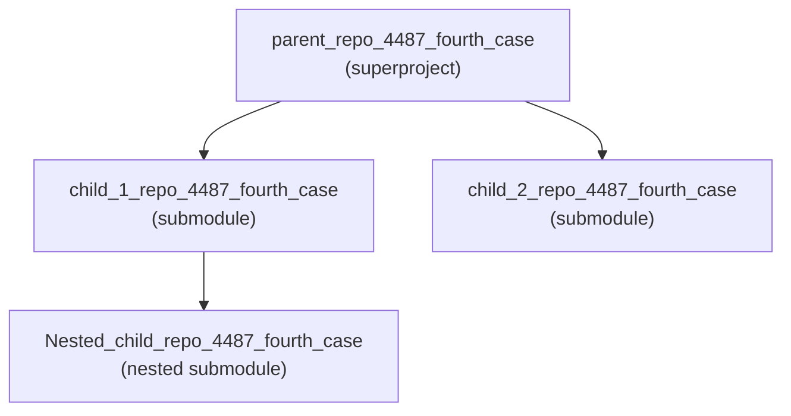

# parent_repo_4487_fourth_case

> A Git submodule **superproject** that aggregates two child repositories — `child_1_repo_4487_fourth_case` and `child_2_repo_4487_fourth_case` — into a single, version-pinned workspace (Source: .gitmodules:L1-L6).

This repository is a **composition of Git submodules**, not a standalone runnable application. As captured, it holds repository/tooling configuration and performance-testing documentation. Please read the [Overview](#📖-overview) first — it contains an important, up-front note about the originally-requested Node.js server (`server.js`), which **is not present** in the repository as captured.

---

## 📑 Table of Contents

- [📖 Overview](#📖-overview)
  - [🧩 Submodule Composition](#🧩-submodule-composition)
- [✅ Prerequisites](#✅-prerequisites)
- [⚙️ Setup and Installation](#⚙️-setup-and-installation)
  - [🔑 Environment Variables](#🔑-environment-variables)
- [▶️ Usage and Running the Server](#▶️-usage-and-running-the-server)
- [🌐 API Documentation](#🌐-api-documentation)
- [🧭 Code Walkthrough](#🧭-code-walkthrough)
- [🚢 Deployment Guide](#🚢-deployment-guide)
- [📂 Project Structure](#📂-project-structure)
- [🛠 Troubleshooting](#🛠-troubleshooting)
- [📄 License and Contributing](#📄-license-and-contributing)

---

## 📖 Overview

`parent_repo_4487_fourth_case` is a **Git submodule superproject**. Its purpose is to compose and version-pin two child repositories as submodules so they can be cloned and tracked together (Source: .gitmodules:L1-L6):

- **`child_1_repo_4487_fourth_case`** → `https://github.com/lakshya-blitzy/child_1_repo_4487_fourth_case.git` — contains performance-testing documentation (a one-click Locust load-test guide and a Python/Pytest "API Performance Test Framework") plus tooling configuration and a further nested submodule (Source: child_1_repo_4487_fourth_case/README.md, child_1_repo_4487_fourth_case/README (2).md, child_1_repo_4487_fourth_case/.gitmodules:L1-L3).
- **`child_2_repo_4487_fourth_case`** → `https://github.com/lakshya-blitzy/child_2_repo_4487_fourth_case.git` — contains Babel transpiler configuration modules and a Watchman config (Source: child_2_repo_4487_fourth_case/babel.config.js:L3, child_2_repo_4487_fourth_case/babel.config-react-compiler.js:L15).

At the root, the superproject itself only carries repository/tooling configuration files (`.gitmodules`, `.editorconfig`, `.eslintrc.js`, `.eslintignore`, `.blitzyignore`) and this `README.md`. There is **no build system, no CI pipeline, no test runner configured at the root, and no runnable server** in the repository as captured.

> ### ⚠️ Important note on the requested `server.js`
>
> This README was requested alongside JSDoc documentation, API documentation, a deployment guide, and a code walkthrough for a Node.js `server.js`. **No `server.js` (and no `package.json` or any other Node.js/language manifest) exists anywhere in this repository** — this was confirmed by an exhaustive search of the working tree (no `server.js`, no `app.js`, no `index.js`, no `main.js`, no `*.mjs`/`*.cjs`, and no `package.json`/lockfile).
>
> To avoid fabricating content, the server-dependent sections below — **API Documentation**, **Environment Variables**, **Code Walkthrough**, and **Deployment Guide** — are intentionally written as **ready-to-populate templates**. Each states plainly that the corresponding artifact does not yet exist, and describes exactly what it will contain once a `server.js` (and its Node.js manifest) is added. Nothing in those sections is invented.

### 🧩 Submodule Composition

The superproject nests submodules two levels deep. The root declares two direct submodules (Source: .gitmodules:L1-L6), and `child_1_repo_4487_fourth_case` in turn declares one nested submodule (Source: child_1_repo_4487_fourth_case/.gitmodules:L1-L3):



---

## ✅ Prerequisites

Because there is **no `package.json` or any other dependency manifest** in the repository as captured, **no specific language runtime version is pinned** by the project. The prerequisites below cover working with the repository itself and with the tooling its child submodules document.

| Prerequisite | Why it is needed | Source |
|--------------|------------------|--------|
| **Git** (with submodule support) | Required to clone the superproject and initialize/update its submodules | Source: .gitmodules:L1-L6, child_1_repo_4487_fourth_case/.gitmodules:L1-L3 |
| **Python** | Required only to run the performance-testing tooling described by the `child_1` submodule (e.g., `python run_tests.py`; the Windows Locust batch script bootstraps Python itself) | Source: child_1_repo_4487_fourth_case/README (2).md, child_1_repo_4487_fourth_case/README.md |
| **Node.js** _(contingent)_ | Not required by the repository as captured. It would only become a prerequisite once a `server.js` and a Node.js manifest are added. The existing `.eslintrc.js`/`babel.config.js` files are Node-based *tooling* configs, but no manifest pins a Node version | Source: .eslintrc.js:L14, child_2_repo_4487_fourth_case/babel.config.js:L3 |

> **No Node.js version is asserted here** because the repository contains no manifest (`package.json`, `.nvmrc`, `engines`, etc.) from which to derive one.

---

## ⚙️ Setup and Installation

This section covers the **real, verifiable** setup for this repository — a submodule superproject (Source: .gitmodules:L1-L6). Application install/build steps are not applicable yet (see the note in the [Overview](#📖-overview)).

**Option A — fresh clone (recommended):** clone the superproject and all submodules in a single step.

```bash
# Clone the superproject together with every submodule (including nested ones)
git clone --recurse-submodules <repository-url> parent_repo_4487_fourth_case
cd parent_repo_4487_fourth_case
```

**Option B — existing clone:** initialize and update submodules for a repository that was cloned without `--recurse-submodules`.

```bash
# From the repository root, pull in all declared submodules, recursively
git submodule update --init --recursive
```

The `--recursive` flag ensures the nested submodule declared by `child_1_repo_4487_fourth_case` is also fetched (Source: child_1_repo_4487_fourth_case/.gitmodules:L1-L3).

There is currently **no dependency-installation step** (e.g., `npm install`, `pip install -r requirements.txt`) at the root, because the root defines no manifest. Dependency installation for the child performance-testing tooling is handled by that tooling's own documented workflows (Source: child_1_repo_4487_fourth_case/README (2).md).

### 🔑 Environment Variables

**No application environment variables are defined in the repository as captured.** There is no `.env` file and no configuration module at the root, because there is no application server (`server.js`) to read them. The table below is a **placeholder** to be populated once a server reads any variables.

| Name | Purpose | Default |
|------|---------|---------|
| — | — none defined — | — |

> Once a `server.js` and its Node.js manifest are added, this table will list one row per environment variable the server reads (name, purpose, and default). No variable names are invented here.

---

## ▶️ Usage and Running the Server

**There is currently no runnable server or start command in this repository** — there is no `server.js` and no `package.json` scripts to invoke (confirmed by exhaustive search; see the [Overview](#📖-overview)).

**Contingent (not yet applicable):** once a Node.js server is added, the run command will look like one of the following. These are shown only to illustrate the intended shape and **must not** be treated as working commands today:

```bash
# NOT YET APPLICABLE — no server.js / package.json exists in the repository as captured
node server.js
# or, once package.json defines a "start" script:
npm start
```

**What can be exercised today** lives inside the child submodules, via *their own* documented workflows (cross-referenced here without duplicating their content):

- **Locust one-click load test (Windows):** described in `child_1_repo_4487_fourth_case/README.md` (Source: child_1_repo_4487_fourth_case/README.md).
- **API Performance Test Framework (`python run_tests.py`):** described in `child_1_repo_4487_fourth_case/README (2).md` (Source: child_1_repo_4487_fourth_case/README (2).md).

Refer to each submodule's README for its exact prerequisites and run steps.

---

## 🌐 API Documentation

**No HTTP endpoints exist to document**, because there is no `server.js` and no route definitions in the repository as captured (confirmed by exhaustive search). This section defines the **structure** of the endpoint catalog so it is ready to populate the moment a server is added.

| Method | Path | Description | Request | Response | Status Codes |
|--------|------|-------------|---------|----------|--------------|
| — | — | — none defined — | — | — | — |

> Once `server.js` is supplied, this table will enumerate **one row per route** — HTTP method, path, a short description, the request shape (path/query params and/or body), the response body, and the applicable status codes — followed by a request/response example per endpoint and a description of error responses. No endpoints, methods, or paths are invented here.

---

## 🧭 Code Walkthrough

The user's request included an annotated walkthrough of `server.js` cross-linked to its JSDoc blocks. **That file does not exist in the repository as captured**, so no such walkthrough can be authored yet without fabrication. It will be added once the server source is supplied.

For completeness, here is a factual, high-level tour of the code that **does** exist today — all of which is **tooling/configuration, not application logic**:

- **`.eslintrc.js` (root)** — a large, React-derived ESLint policy that exports a configuration object (via `module.exports`); it imports helper paths via `require('./scripts/shared/pathsByLanguageVersion')` (a script that is itself absent from the tree) and contains **no application functions** (Source: .eslintrc.js:L6, .eslintrc.js:L14).
- **`child_2_repo_4487_fourth_case/babel.config.js`** — exports a Babel plugin list (transpiler configuration), not an application (Source: child_2_repo_4487_fourth_case/babel.config.js:L3).
- **`child_2_repo_4487_fourth_case/babel.config-react-compiler.js`** — re-exports the plugin list from a sibling `./babel.config-ts` module (which is absent from the tree) (Source: child_2_repo_4487_fourth_case/babel.config-react-compiler.js:L15).
- **`child_1_repo_4487_fourth_case/Nested_child_repo_4487_fourth_case/600Kloc.py`** — a three-line, top-level script (no functions or classes) that writes a CSV fixture by looping and appending rows (Source: child_1_repo_4487_fourth_case/Nested_child_repo_4487_fourth_case/600Kloc.py:L1-L3).

> When `server.js` is added, this section will be replaced with an annotated tour of its structure — module banner, middleware, route handlers, and lifecycle/bootstrap code — each paragraph cross-linked to the corresponding JSDoc block in the source.

---

## 🚢 Deployment Guide

**No deployment is defined in the repository as captured.** There is no build artifact, no start script, no declared port, no container definition (e.g., `Dockerfile`), and no process-manager configuration, because there is no deployable server. The skeleton below is a **clearly-labeled placeholder** to be completed once a deployable server exists — no Docker, PM2, or cloud specifics are asserted as real.

1. **Build** _(to be defined)_ — the build/compile step (if any) once a manifest and build tooling exist.
2. **Environment configuration** _(to be defined)_ — the environment variables and config files the server requires (see [Environment Variables](#🔑-environment-variables)).
3. **Process management** _(to be defined)_ — how the process is supervised (e.g., a process manager or an init system).
4. **Containerization** _(to be defined)_ — the container image and runtime settings, if containerized.
5. **Cloud / host target** _(to be defined)_ — the target platform(s) and the deploy command(s).

> Each step above will be filled in with real, verifiable commands and settings once a `server.js`, its Node.js manifest, and any deployment configuration are added to the repository.

---

## 📂 Project Structure

The tree below reflects the repository **as captured**. CSV data files are intentionally omitted because `.blitzyignore` excludes all `*.csv` files from inspection and tooling (Source: .blitzyignore:L1). The submodule folders are declared in `.gitmodules` (Source: .gitmodules:L1-L6) and `child_1_repo_4487_fourth_case/.gitmodules` (Source: child_1_repo_4487_fourth_case/.gitmodules:L1-L3).

```
parent_repo_4487_fourth_case/
├── .blitzyignore                     # Excludes *.csv from inspection/tooling
├── .editorconfig                     # Formatting rules (UTF-8, LF, 2-space, final newline)
├── .eslintignore                     # ESLint ignore list (React-derived)
├── .eslintrc.js                      # Root ESLint policy (tooling; no app functions)
├── .gitmodules                       # Declares the two child submodules
├── README.md                         # This file
├── child_1_repo_4487_fourth_case/    # Submodule: performance-testing docs & tooling
│   ├── .eslintrc.js
│   ├── .git-blame-ignore-revs
│   ├── .gitattributes
│   ├── .gitmodules                   # Declares the nested submodule
│   ├── README.md                     # Locust one-click load test (Windows)
│   ├── README (2).md                 # API Performance Test Framework (Python/Pytest)
│   └── Nested_child_repo_4487_fourth_case/   # Nested submodule
│       ├── 600Kloc.py                # 3-line CSV generator script
│       └── README.md
└── child_2_repo_4487_fourth_case/    # Submodule: Babel transpiler configs
    ├── .watchmanconfig               # Watchman config ({})
    ├── README.md
    ├── babel.config.js               # Babel plugin list
    └── babel.config-react-compiler.js  # Re-exports ./babel.config-ts
```

> `server.js`, `package.json`, and a `docs/` site are intentionally **absent** from this tree — they do not exist in the repository as captured and are out of scope for this documentation task.

---

## 🛠 Troubleshooting

| Symptom | Likely cause | Resolution |
|---------|--------------|------------|
| Submodule folders (`child_1_repo_4487_fourth_case/`, `child_2_repo_4487_fourth_case/`) are empty after cloning | The repository was cloned without `--recurse-submodules` | Run `git submodule update --init --recursive` from the repository root (Source: .gitmodules:L1-L6, child_1_repo_4487_fourth_case/.gitmodules:L1-L3) |
| The nested submodule under `child_1_repo_4487_fourth_case/` is missing | Submodules were initialized non-recursively | Re-run with the `--recursive` flag: `git submodule update --init --recursive` (Source: child_1_repo_4487_fourth_case/.gitmodules:L1-L3) |
| Looking for server start / API / deploy commands and finding none | There is no `server.js` or `package.json` in the repository as captured | These instructions are **pending** the addition of a `server.js` (and its Node.js manifest); see the [Overview](#📖-overview) |
| A `*.csv` file appears to be ignored by tooling | `.blitzyignore` excludes all CSV files from inspection/tooling | This is expected behavior (Source: .blitzyignore:L1) |

---

## 📄 License and Contributing

**License:** No `LICENSE` file is present in the repository as captured; no license terms are asserted here.

**Contributing:** Because this is a submodule superproject (Source: .gitmodules:L1-L6), contributions typically involve two steps: making changes within the relevant submodule repository, and then updating the submodule pointer recorded in this superproject. When editing files, follow the repository's formatting conventions defined in `.editorconfig` — UTF-8 charset, LF line endings, 2-space indentation, and an enforced final newline, with the 80-column line-length cap relaxed to unlimited for Markdown files (Source: .editorconfig:L4-L13, .editorconfig:L12-L13).
