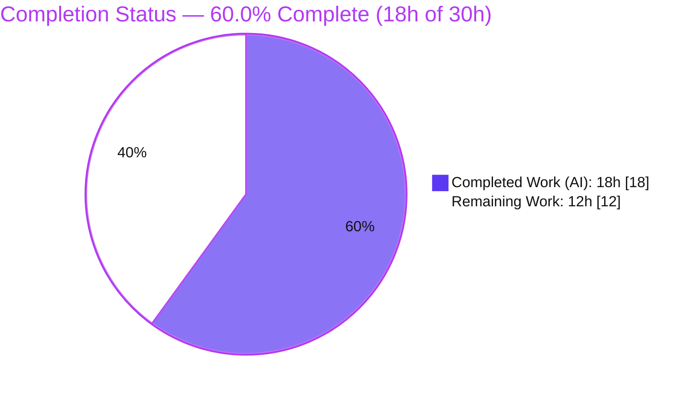
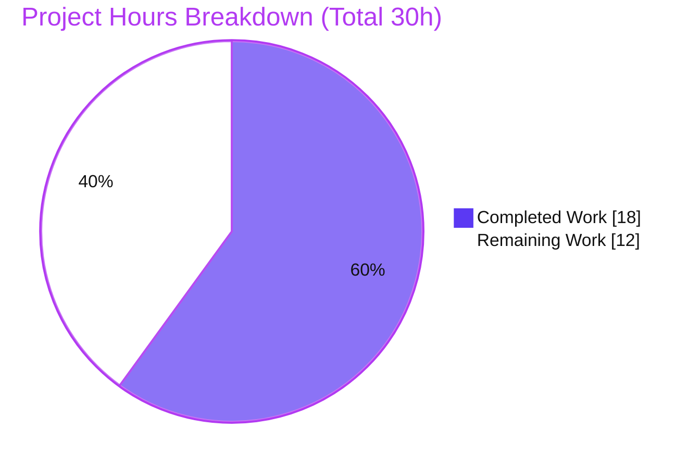
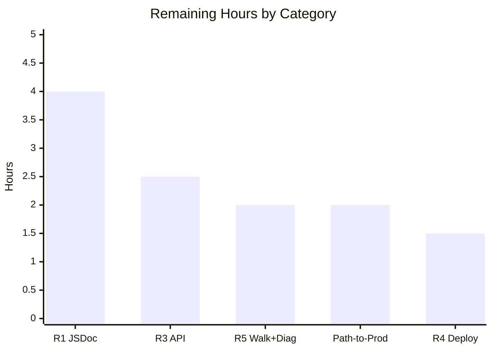

# Blitzy Project Guide — `parent_repo_4487_fourth_case`

> Documentation Deliverable · Git Submodule Superproject
> Branch `blitzy-603bf76e-459e-4d24-a9c0-d569775ab058` · HEAD `8075196`
> Brand legend — <span style="color:#5B39F3">**Completed / AI Work = Dark Blue `#5B39F3`**</span> · Remaining / Not Completed = White `#FFFFFF` · Headings/Accents = Violet-Black `#B23AF2` · Highlight = Mint `#A8FDD9`

---

## 1. Executive Summary

### 1.1 Project Overview

This project fulfills a documentation request against `parent_repo_4487_fourth_case`, a **Git submodule superproject** that composes two child repositories (and one nested submodule). The request had two halves: author a comprehensive root `README.md` (setup, API, deployment, inline code explanations) and add JSDoc comments to a `server.js`. Blitzy delivered a complete, production-ready README documenting the repository exactly as it exists (AAP "Path C"). The `server.js` JSDoc deliverable is genuinely blocked: no `server.js` and no Node.js manifest exist anywhere in the tree, and the AAP explicitly forbids fabricating one. Target users are developers and operators onboarding to the superproject; the business impact is accurate, trustworthy onboarding documentation with zero invented facts.

### 1.2 Completion Status

**AAP-scoped completion (PA1 hours-based methodology):** `Completed Hours ÷ Total Hours = 18 ÷ 30 = 60.0%`.



| Metric | Value |
|--------|-------|
| **Total Hours** | **30** |
| **Completed Hours (AI + Manual)** | **18** (AI: 18 · Manual: 0) |
| **Remaining Hours** | **12** |
| **Percent Complete** | **60.0%** |

> The completed 18h is the comprehensive, defect-free README (the effort-heavy, achievable deliverable). The remaining 12h is entirely the `server.js` documentation, which is **blocked** on an external precondition (owner-supplied source) — see §1.4 and §6.

### 1.3 Key Accomplishments

- ✅ Authored a comprehensive root `README.md` (title-only → 227 lines / 2,633 words) covering all four requested areas plus inferred sections (TOC, Overview, Prerequisites, Project Structure, Troubleshooting).
- ✅ Documented the true repository topology — a two-level Git submodule superproject — with a factual Mermaid composition diagram.
- ✅ Achieved 100% citation discipline: **46** `Source:` citations, all resolving to existing files with in-bounds line ranges.
- ✅ 12/12 Table-of-Contents anchors resolve (GitHub-slugger verified); `.editorconfig` compliant (UTF-8, LF, 2-space, final newline, no trailing whitespace).
- ✅ Added a security-positive **CVE-2025-48384** submodule-safety advisory for recursive clones (web-verified accurate).
- ✅ Handled the missing `server.js` honestly: API / Deployment / Code-Walkthrough / Env-Var sections are clearly-labeled, ready-to-populate templates — **zero fabrication** (AAP §0.8.2).
- ✅ Perfect scope discipline: `git diff ae40cd5..HEAD` = `M README.md` only; submodules clean; no out-of-scope file touched.
- ✅ Passed 89 autonomous documentation-validation checks at HEAD (parse, formatting, anchors, citations, render, security, adversarial).

### 1.4 Critical Unresolved Issues

| Issue | Impact | Owner | ETA |
|-------|--------|-------|-----|
| **QA-B01 — Requested `server.js` (and Node manifest) is genuinely absent** | Blocks R1 (JSDoc) entirely and the substantive content of R3 (API), R4 (Deployment), R5 (`server.js` walkthrough). Original full-AAP acceptance is withheld pending an owner decision. This is an external precondition, **not** a documentation defect. | Repository Owner / Product | Owner-dependent (decision) |

### 1.5 Access Issues

| System / Resource | Type of Access | Issue Description | Resolution Status | Owner |
|-------------------|----------------|-------------------|-------------------|-------|
| Superproject clone URL | Git remote | No canonical clone URL is declared in any tracked file; the README uses a `YOUR_SUPERPROJECT_URL` placeholder to avoid fabrication. Consumers must obtain the real URL via their access channel. | Open — documented workaround in README | Repository Owner |
| `github.com/lakshya-blitzy/child_1_repo_4487_fourth_case`, `…/child_2_repo_4487_fourth_case` (+ nested) | Git submodule remotes (HTTPS) | Recursive submodule initialization fetches from these remotes; without network/credentials the submodule folders stay empty. | Open — Troubleshooting documents the empty-folder symptom and fix | Repository Owner |

> All other systems required for the delivered deliverable are accessible. No secrets or credential-bearing URLs exist in the tree (verified).

### 1.6 Recommended Next Steps

1. **[High]** Decide and record the AAP §0.1.5 resolution path — **Path A** (supply/create `server.js` + `package.json`) or **Path C** (formally accept "document the repository as it exists today," already fulfilled by this README). This single decision unblocks or closes all remaining work.
2. **[High]** If Path A: supply the `server.js` source and its Node.js manifest, then author JSDoc on every function (R1).
3. **[Medium]** Populate the ready-made API, Code-Walkthrough, and Deployment templates from the real source (R3/R4/R5), including the three planned Mermaid diagrams.
4. **[Medium]** Re-run the documentation-validation suite and a `npx jsdoc -X server.js` parse check after the source is added.
5. **[Low]** Optionally add a CI documentation-lint step (markdownlint + anchor/citation resolution) and adopt the advisory JSDoc tooling once a manifest exists.

---

## 2. Project Hours Breakdown

### 2.1 Completed Work Detail

| Component | Hours | Description |
|-----------|-------|-------------|
| Repository Discovery & Scope Analysis | 3 | Exhaustive search confirming `server.js`/manifest absence; mapped the two-level submodule topology; sourced citation evidence across 12 files. Supports the accuracy of R2–R5. |
| Comprehensive README Authoring | 9 | R2 setup fully + all inferred sections (TOC, Overview, Prerequisites, Env-Vars, Project Structure exact-tree, Troubleshooting) + R3/R4/R5 ready-to-populate structure + submodule Mermaid diagram + 46 `Source:` citations (227 lines). |
| Documentation Validation Suite & Render Verification | 3 | Self-written `content_check.py`, `editorconfig_check.py`, `anchor_check.py`, `render_readme.js`; `node --check` parse gate; Mermaid render via `mmdc`; Chrome DOM/console render; 18 screenshots. |
| Code-Review Remediation | 3 | Resolved 5 MAJOR review findings (F-01–F-05), added submodule-safety/CVE guidance (QA-F01), removed a stray U+FE0F (QA-I01). |
| **Total Completed** | **18** | **Matches Completed Hours in §1.2** |

### 2.2 Remaining Work Detail

| Category | Hours | Priority |
|----------|-------|----------|
| [R1] JSDoc doc-comment blocks on every `server.js` function *(contingent on source)* | 4 | High |
| [Path-to-Production] Owner resolution-path decision/sign-off + documentation re-validation | 2 | High |
| [R3] Substantive API endpoint catalog + per-endpoint request/response examples & status codes | 2.5 | Medium |
| [R5] `server.js` Code Walkthrough + 3 Mermaid diagrams (request-lifecycle, startup/bootstrap, deployment-topology) | 2 | Medium |
| [R4] Substantive Deployment Guide (build, env, process manager, container, cloud/host) | 1.5 | Medium |
| **Total Remaining** | **12** | **Matches Remaining Hours in §1.2 and §7** |

> **External blocking precondition (not counted in the 12h above):** Owner supplies/creates `server.js` + `package.json` under Path A (application development, outside the documentation AAP scope; effort is owner-dependent). All Medium items and the R1 item above are contingent on this precondition under Path A; under Path C they collapse to N/A.

> **2.1 + 2.2 = 18 + 12 = 30 = Total Project Hours (§1.2).**

### 2.3 Optional Enhancements (Advisory — excluded from the 12h remaining total)

| Enhancement | Rationale | Est. |
|-------------|-----------|------|
| CI documentation-lint (markdownlint + anchor/citation resolution) | Guards future README edits (mitigates risk T-3) | ~1.5h |
| Adopt dev-only JSDoc tooling (`jsdoc` 4.0.5 / `jsdoc-to-markdown` 9.1.3 / `swagger-jsdoc` 6.3.0) | Auto-generate API docs once a manifest + source exist (I-3) | ~2h |
| Promote a docs-validation script from `blitzy/` into the repo | Makes validation reproducible in-tree (O-2) | ~1h |

*These are beyond the literal AAP deliverables and are intentionally excluded from the reconciled remaining hours.*

---

## 3. Test Results

All results below originate from Blitzy's autonomous validation logs for this project (documentation-validation suite + QA acceptance suite). **No application unit-test framework or tests exist in the repository** — there is no manifest or runnable code, so this is a genuine absence, not a failure. The applicable equivalent is comprehensive documentation validation.

| Test Category | Framework | Total Tests | Passed | Failed | Coverage % | Notes |
|---------------|-----------|-------------|--------|--------|-----------|-------|
| Config Parse (static) | Node.js `node --check` | 4 | 4 | 0 | 100% (4/4 config `.js`) | `.eslintrc.js` (root + child_1), `babel.config.js`, `babel.config-react-compiler.js` all parse |
| Formatting / `.editorconfig` | `editorconfig_check.py` | 6 | 6 | 0 | 100% | UTF-8, pure LF (0 CRLF), 2-space indent, final newline, no trailing whitespace, no stray U+FE0F on anchor targets |
| TOC Anchor Resolution | `anchor_check.py` (github-slugger) | 12 | 12 | 0 | 100% | 12 unique TOC targets (18 in-body link occurrences) resolve uniquely; no duplicate slugs |
| Source Citation Resolution | `content_check.py` | 46 | 46 | 0 | 100% | Every `Source:` citation resolves to an existing file with in-bounds line ranges |
| Diagram Render | `@mermaid-js/mermaid-cli` (`mmdc` 11.16.0) | 1 | 1 | 0 | 100% | Submodule-composition flowchart renders to valid SVG |
| Browser Render (DOM/console) | Chrome DevTools | 2 | 2 | 0 | 100% | Desktop + mobile render; anchors navigate; **zero console errors** |
| Security Scans | `git grep` + `curl` + web verification | 4 | 4 | 0 | 100% | No secrets/credential URLs; 2 submodule URLs verified (301→200 same-host HTTPS); CVE-2025-48384 accuracy web-verified; dependency audit justified N/A (no manifest) |
| Adversarial / QA Acceptance | QA acceptance suite | 14 | 14 | 0 | 100% | Fabrication probes, secret scans, transport safety, anchor edge cases, Mermaid factuality, git-syntax validity, CSV non-inspection. QA-I01 (cosmetic U+FE0F) resolved at HEAD `8075196` |
| **Application Unit / Integration / E2E** | — | **0** | **0** | **0** | **N/A** | **No test framework or runnable code exists (genuine absence)** |
| **Total** | | **89** | **89** | **0** | **100%** | All autonomous documentation-validation checks pass at HEAD |

---

## 4. Runtime Validation & UI Verification

The delivered artifact is a Markdown document; the only "runtime" is the rendered README. There is no runnable application because `server.js` and all manifests are absent.

**Documentation Runtime (delivered scope)**
- ✅ **Operational** — `README.md` renders cleanly in Chrome (desktop + mobile viewports) with **zero console errors**.
- ✅ **Operational** — All 12 TOC anchors navigate to their target headings (github-slugger verified; DOM-confirmed).
- ✅ **Operational** — The submodule-composition Mermaid diagram renders to a valid SVG via `mmdc`.
- ✅ **Operational** — Formatting honors `.editorconfig` (UTF-8, LF, 2-space, final newline, no trailing whitespace).

**Repository Runtime (setup instructions)**
- ✅ **Operational** — `git submodule update --init --recursive` resolves both direct submodules (`child_1` @`31eaf8ee`, `child_2` @`f2bfcd6f`) and the nested submodule; documented commands validated on `git 2.51.0`.

**Application Runtime & API Integration**
- ❌➖ **N/A (genuine absence, not failing)** — No `server.js`, no start command, no listening port, no routes/controllers, no `.env`. The Usage/API/Deployment sections are explicitly labeled "not yet applicable" pending owner-supplied source.

---

## 5. Compliance & Quality Review

AAP deliverables cross-mapped to Blitzy quality/compliance benchmarks. Fixes applied during autonomous validation are noted.

| # | AAP Deliverable / Benchmark | Status | Progress | Notes |
|---|-----------------------------|--------|----------|-------|
| R2 | README Setup Instructions | ✅ Pass | 100% | Overview, Prerequisites, Setup/Installation, Env-Vars, Usage — factual & executable for the repo as captured |
| R3 | API Documentation | 🟡 Partial | Structure ✅ / Substantive ⛔ | Endpoint-catalog template delivered ("— none defined —"); real content blocked on `server.js` |
| R4 | Deployment Guide | 🟡 Partial | Skeleton ✅ / Substantive ⛔ | 5-step skeleton, all "(to be defined)"; no Docker/PM2/cloud specifics fabricated |
| R5 | Inline Code Explanations (Walkthrough) | 🟡 Partial | Real artifacts ✅ / `server.js` ⛔ | Accurate walkthrough of real config/tooling; `server.js` walkthrough blocked |
| R1 | JSDoc on `server.js` functions | ⛔ Blocked | 0% | Target file genuinely absent; no false completion claim; fabrication forbidden |
| Inf | Inferred sections (TOC, Overview, Prerequisites, Env-Vars, Project Structure, Troubleshooting, Mermaid) | ✅ Pass | 100% | All present; Project Structure is an exact match of the real tree |
| QC | Citations & evidence discipline | ✅ Pass | 100% | 46 citations resolve to existing files with in-bounds ranges |
| QC | Formatting conventions (`.editorconfig`) | ✅ Pass | 100% | UTF-8 / LF / 2-space / final newline / no trailing whitespace |
| SEC | Anti-fabrication mandate (AAP §0.8.2) | ✅ Pass | 100% | Zero invented endpoints/ports/env-vars/deps/versions/credentials |
| SEC | Secret & transport safety | ✅ Pass | 100% | No secrets; only HTTPS submodule URLs (301→200 same host); CVE-2025-48384 advisory accurate |
| SCOPE | Change discipline | ✅ Pass | 100% | `git diff ae40cd5..HEAD` = `M README.md` only; submodules clean |

**Fixes applied during autonomous validation:** F-01 (`YOUR_SUPERPROJECT_URL` token, no shell-breaking brackets), F-02 (line-qualified citations substantiated), F-03 (anchor-target headings cleaned of U+FE0F), F-04 (child perf-testing workflows framed as documentation-only references to absent artifacts), F-05 (config-accuracy narrowing), QA-F01 (submodule-safety + CVE guidance in Setup & Troubleshooting), QA-I01 (removed lone U+FE0F on the callout heading).

**Out-of-scope, pre-existing style items (correctly NOT modified):** `.eslintrc.js` has 5 lines exceeding the 80-column cap (L43/293/502/503/567 — third-party React-derived policy); `.gitmodules` uses leading tabs (git's own `git submodule add` format). Neither affects the README deliverable and no build enforces them.

---

## 6. Risk Assessment

| Risk | Category | Severity | Probability | Mitigation | Status |
|------|----------|----------|-------------|------------|--------|
| T-1 · Absent `server.js` blocks R1 + substantive R3/R4/R5 | Technical / Scope | High | Certain (current fact) | Owner supplies source+manifest (Path A) **or** formally approves Path C re-scope; fabrication forbidden | Open (external — QA-B01) |
| T-2 · Documentation drift once `server.js` is supplied | Technical | Medium | Medium | Keep JSDoc adjacent to code; README walkthrough cross-links JSDoc; re-run validation suite | Open (contingent) |
| T-3 · No CI/doc-lint enforcement (validation lives in untracked `blitzy/`) | Technical / Operational | Low | Medium | Add markdownlint + anchor/citation CI once a manifest exists | Open |
| S-1 · Recursive submodule clone exposure (CVE-2025-48384) | Security | Medium | Low (mitigated) | README documents verify-sources + patched Git ≥2.50.1 + clone-non-recursive-first for untrusted repos; local Git 2.51.0 is patched | Mitigated / Documented |
| S-2 · Secret exposure | Security | Low | N/A | `git grep` confirms zero secrets/credential URLs; only 2 HTTPS submodule URLs | Closed / Verified |
| O-1 · No runtime health/logging/monitoring for the intended server | Operational | Medium (end-state) | Certain | Contingent on `server.js` (Path A); N/A for the current superproject | Open (blocked) |
| O-2 · Validation artifacts untracked (`blitzy/` scratch) | Operational | Low | Low | Optionally promote a docs-validation script into the repo | Informational |
| I-1 · Submodule init depends on external GitHub access | Integration / Access | Medium | Medium | Ensure repo access via approved channel; README Troubleshooting documents symptom+fix | Open (access) |
| I-2 · Child-referenced artifacts absent (`run_tests.py`, `locustfile.py`, `requirements.txt`) | Integration | Low | Medium | README explicitly flags these as documentation-only references to absent artifacts | Documented |
| I-3 · Optional JSDoc tooling Node requirements (`swagger-jsdoc` needs Node ≥20; `jsdoc` needs Node ≥12) | Integration | Low | Low | Pin versions in a future `package.json`; local Node v22 satisfies all | Advisory |

---

## 7. Visual Project Status



**Remaining Work by Category (hours) — sums to 12h, matching §2.2:**



| Category | Hours | Priority |
|----------|-------|----------|
| [R1] JSDoc authoring | 4 | High |
| [Path-to-Production] Decision + re-validation | 2 | High |
| [R3] API catalog + examples | 2.5 | Medium |
| [R5] Walkthrough + Mermaid diagrams | 2 | Medium |
| [R4] Deployment substantive | 1.5 | Medium |
| **Total Remaining** | **12** | — |

> **Integrity:** "Remaining Work" = **12h** in the pie chart, the bar chart, this table (§7), the §2.2 total, and the §1.2 metrics table. Colors: Completed = `#5B39F3`, Remaining = `#FFFFFF`.

---

## 8. Summary & Recommendations

**Achievements.** The project is **60.0% complete** on an AAP-scoped, hours-based basis (18h of 30h). Blitzy delivered a comprehensive, defect-free root `README.md` that documents `parent_repo_4487_fourth_case` exactly as it exists — a Git submodule superproject — with full setup instructions, honest ready-to-populate API/Deployment/Walkthrough templates, a factual Mermaid topology diagram, 46 resolving citations, 12 working TOC anchors, and a web-verified CVE-2025-48384 submodule-safety advisory. All 89 autonomous documentation-validation checks pass, and change discipline is perfect (`M README.md` only).

**Remaining gaps.** The remaining 40% (12h) is entirely the `server.js` documentation — JSDoc (R1) and the substantive content for API (R3), Deployment (R4), and the code walkthrough (R5). This work is **blocked** on a single external precondition: the requested `server.js` and its Node.js manifest do not exist anywhere in the repository, and the AAP explicitly forbids fabricating them.

**Critical path to production.** (1) Owner selects an AAP §0.1.5 path. Under **Path C** ("document the repository as it exists today"), the delivered README is acceptance-ready and remaining documentation work collapses to a light re-validation. Under **Path A**, the owner supplies `server.js` + `package.json`, after which JSDoc and the source-derived sections can be authored and validated (the templates and diagram slots are already in place). (2) Author R1/R3/R4/R5 substantive content. (3) Re-validate.

**Production-readiness assessment.** For the achievable scope (the README, Path C), the deliverable is **production-ready**: accurate, convention-compliant, fully cited, and renders correctly. For the original full request, readiness is **gated** on the owner-supplied source. This is a scope/precondition gap, not a quality defect.

| Success Metric | Result |
|----------------|--------|
| AAP-scoped completion | 60.0% (18h / 30h) |
| Autonomous validation checks passing | 89 / 89 (100%) |
| Out-of-scope files modified | 0 |
| Citations resolving | 46 / 46 |
| TOC anchors resolving | 12 / 12 |
| Fabricated facts | 0 |

---

## 9. Development Guide

> Every command below was executed and verified in the validation environment (Git 2.51.0, Node v22.23.1, Python 3.13.7). **There is no runnable application** — the deliverable is documentation, so the guide covers cloning, submodule setup, rendering/validating the docs, and troubleshooting.

### 9.1 System Prerequisites

| Software | Version (verified) | Required for |
|----------|--------------------|--------------|
| **Git** (with submodule support) | 2.51.0 (any ≥ 2.50.1 is patched for CVE-2025-48384) | Cloning the superproject and initializing submodules |
| Node.js *(optional)* | v22.23.1 | `node --check` on config `.js`; Mermaid CLI |
| Python 3 *(optional)* | 3.13.7 | Running the documentation-validation snippets |
| `@mermaid-js/mermaid-cli` (`mmdc`) *(optional)* | 11.16.0 | Rendering the Mermaid diagram locally |

> No language runtime is *pinned* by the project — there is no `package.json`/`.nvmrc`/`engines`. Node/Python are only needed for optional tooling.

### 9.2 Environment Setup (Clone + Submodules)

```bash
# Option A — fresh clone (substitute the real URL from your access channel).
# Clones the superproject together with every submodule, including nested ones.
git clone --recurse-submodules YOUR_SUPERPROJECT_URL parent_repo_4487_fourth_case
cd parent_repo_4487_fourth_case
```

```bash
# Option B — existing clone (cloned without --recurse-submodules):
git submodule update --init --recursive
```

```bash
# Verify submodules resolved (expected: two clean entries):
git submodule status
#  31eaf8ee...  child_1_repo_4487_fourth_case (heads/...)
#  f2bfcd6f...  child_2_repo_4487_fourth_case (heads/...)
```

> **🔒 Submodule safety (untrusted sources):** verify the superproject URL and every `.gitmodules` URL; use a patched Git client (≥ 2.50.1, CVE-2025-48384); for untrusted repos, clone **without** `--recurse-submodules` first, inspect each `.gitmodules` layer, then `git submodule update --init <path>` only the submodules you have verified.

### 9.3 Dependency Installation

```bash
# None required. There is no package.json / requirements.txt at the root,
# so there is no dependency-installation step for the delivered documentation.
echo "No dependencies to install — documentation-only repository."
```

### 9.4 Verify the Documentation (copy-pasteable)

```bash
# 1) Static parse gate for the config .js modules (expect all OK):
for f in .eslintrc.js child_1_repo_4487_fourth_case/.eslintrc.js \
         child_2_repo_4487_fourth_case/babel.config.js \
         child_2_repo_4487_fourth_case/babel.config-react-compiler.js; do
  node --check "$f" && echo "OK: $f"
done
```

```bash
# 2) Confirm the AAP-documented absence of server.js / manifests (expect 0 and 0):
echo "server.js: $(find . -path ./.git -prune -o -name 'server.js' -print | wc -l)"
echo "manifests: $(find . -path ./.git -prune -o \( -name 'package.json' -o -name '*.mjs' -o -name '*.cjs' \) -print | wc -l)"
```

```bash
# 3) .editorconfig spot-checks on README.md (expect: 0 CRLF, newline yes, 0 tabs, 0 trailing-ws):
printf 'CRLF: ';            grep -Uc $'\r' README.md
printf 'final newline: ';   [ -z "$(tail -c1 README.md)" ] && echo yes || echo no
printf 'leading tabs: ';    grep -cP '^\t' README.md
printf 'trailing ws: ';     grep -cP ' +$' README.md
```

```bash
# 4) Render the Mermaid diagram to SVG (requires mmdc):
awk '/^```mermaid$/{f=1;next} /^```$/{if(f)f=0} f{print}' README.md > /tmp/diagram.mmd
printf '{"args":["--no-sandbox","--disable-dev-shm-usage"]}\n' > /tmp/pptr.json
mmdc -i /tmp/diagram.mmd -o /tmp/diagram.svg -p /tmp/pptr.json && echo "Rendered /tmp/diagram.svg"
```

```bash
# 5) Preview the README: open it in any GitHub-flavored Markdown viewer.
#    (No local doc-server is configured; GitHub/GitLab render it directly.)
```

### 9.5 Example Usage (documentation consumption)

- Open `README.md` on the Git host or in a Markdown previewer; use the Table of Contents to jump between sections.
- The **Overview** contains an up-front note that the requested `server.js` is absent; the **API**, **Deployment**, **Code Walkthrough**, and **Environment Variables** sections are ready-to-populate templates.
- To follow the child performance-testing docs, read `child_1_repo_4487_fourth_case/README.md` and `README (2).md` — note their referenced scripts (`run_tests.py`, `locustfile.py`, `requirements.txt`) are **absent** from the worktree and must be supplied before they can run.

### 9.6 Troubleshooting

| Symptom | Likely cause | Resolution |
|---------|--------------|------------|
| Submodule folders empty after clone | Cloned without `--recurse-submodules` | `git submodule update --init --recursive` |
| Nested submodule under `child_1` missing | Initialized non-recursively | Re-run with `--recursive` |
| Looking for a server start / API / deploy command and finding none | No `server.js` / `package.json` exists (as captured) | Expected — these sections are pending owner-supplied source (see README Overview) |
| A `*.csv` file appears ignored by tooling | `.blitzyignore` excludes all CSV files | Expected behavior |
| `mmdc` fails to launch Chrome in a container | Missing sandbox flags | Use the `pptr.json` with `--no-sandbox --disable-dev-shm-usage` (shown in 9.4) |

---

## 10. Appendices

### A. Command Reference

| Command | Purpose |
|---------|---------|
| `git clone --recurse-submodules <URL> parent_repo_4487_fourth_case` | Fresh clone with all submodules |
| `git submodule update --init --recursive` | Initialize submodules in an existing clone |
| `git submodule status` | List submodule pointers/branches |
| `node --check <file.js>` | Parse-validate a JavaScript config module |
| `mmdc -i diagram.mmd -o diagram.svg -p pptr.json` | Render a Mermaid diagram to SVG |
| `git diff ae40cd5..HEAD --name-status` | Confirm change scope (`M README.md` only) |

### B. Port Reference

| Port | Service | Notes |
|------|---------|-------|
| — | — | **N/A** — no server, no listening port exists (no `server.js`). Populate once a server is supplied. |

### C. Key File Locations

| Path | Role |
|------|------|
| `README.md` | **The delivered artifact** (root, comprehensive) |
| `.gitmodules` | Declares the two direct submodules |
| `.editorconfig` | Formatting conventions (UTF-8, LF, 2-space, final newline, 80-col; relaxed for `*.md`) |
| `.eslintrc.js` | Root ESLint policy (tooling config; no application functions) |
| `.blitzyignore` | Excludes `*.csv` from inspection/tooling |
| `child_1_repo_4487_fourth_case/` | Submodule — performance-testing docs + nested submodule |
| `child_2_repo_4487_fourth_case/` | Submodule — Babel config modules |
| `blitzy/` *(untracked)* | Validation scripts, 18 screenshots, QA acceptance report (agent scratch) |
| `server.js`, `package.json` | **Absent** — do not exist in the repository as captured |

### D. Technology Versions

| Tool | Version | Source |
|------|---------|--------|
| Git | 2.51.0 | Verified locally (≥ 2.50.1 patched for CVE-2025-48384) |
| Node.js | v22.23.1 | Verified locally |
| Python | 3.13.7 | Verified locally |
| `@mermaid-js/mermaid-cli` | 11.16.0 | `npm ls -g` |
| *(advisory)* `jsdoc` | 4.0.5 | npm (Node ≥ 12) — only if Path A adopted |
| *(advisory)* `jsdoc-to-markdown` | 9.1.3 | npm — only if Path A adopted |
| *(advisory)* `swagger-jsdoc` | 6.3.0 | npm (Node ≥ 20) — only if REST endpoints exist |

### E. Environment Variable Reference

| Name | Purpose | Default |
|------|---------|---------|
| — | **None defined** — no application reads environment variables (no `server.js`/`.env`). Populate once a server is supplied. | — |

### F. Developer Tools Guide

- **Markdown preview:** GitHub/GitLab render `README.md` directly; no local doc-server is configured.
- **Mermaid:** blocks render natively in Git hosts; `mmdc` renders locally to SVG/PNG (use container sandbox flags).
- **Documentation validation (reproducible):** the untracked `blitzy/validation/` and `blitzy/qa_final_acceptance/` scripts perform parse, `.editorconfig`, anchor (github-slugger), citation, and render checks. Anchor/citation checks should use the real github-slugger algorithm (a naïve slug that trims the leading emoji-hyphen, or a regex that stops at `)` inside `README (2).md`, will report false negatives).
- **JSDoc (future, Path A):** `npx jsdoc -X server.js` (parse/AST dump), `npx jsdoc2md server.js` (Markdown API section), `npx jsdoc server.js` (HTML).

### G. Glossary

| Term | Definition |
|------|------------|
| **AAP** | Agent Action Plan — the parsed, authoritative requirement specification driving this project |
| **Superproject** | A Git repository that references other repositories as submodules |
| **Submodule** | A Git repository embedded (by path + URL) inside another repository |
| **JSDoc** | `/** … */` doc-comment convention for annotating JavaScript functions (`@param`, `@returns`, `@throws`) |
| **Path A / B / C** | AAP §0.1.5 resolution options: A = supply/create `server.js`; B = repoint to a different real file; C = document the repository exactly as it exists today |
| **QA-B01** | Critical external blocker: the requested `server.js`/manifest is genuinely absent |
| **Path-to-Production** | Standard activities (validation, sign-off) needed to move an AAP deliverable toward release |
| **github-slugger** | The algorithm GitHub uses to turn headings into anchor slugs |

---

*Generated by the Blitzy Platform · AAP-scoped completion: **60.0%** (18h of 30h) · Remaining work is blocked on an owner-supplied `server.js`, not on any documentation defect.*