# Technical Specification

# 1. Introduction

## 1.1 Executive Summary

#### Project Overview

This Technical Specification documents `parent_repo_4487_fourth_case`, a repository that is organized as a **Git superproject** rather than a single, unified application. The root `README.md` contains only the project name, and the root `.gitmodules` file declares two Git submodules — `child_1_repo_4487_fourth_case` and `child_2_repo_4487_fourth_case`. `child_1_repo_4487_fourth_case` in turn declares its own submodule, `Nested_child_repo_4487_fourth_case`, producing a three-level nested-submodule hierarchy. The commit history on branch `1507_01` ("Create .blitzyignore", "Add child repositories as submodules", "Update child_1 to latest nested submodule") confirms that the repository was assembled by *composition* of pre-existing artifacts, not developed as one cohesive codebase.

The observable content, excluding the `.csv` data files that are deliberately excluded from inspection by `.blitzyignore`, is 18 files that fall into three distinct clusters:

| Artifact Cluster | Location | Representative Files |
|---|---|---|
| JavaScript/React tooling policy | Root, `child_1`, `child_2` | `.eslintrc.js`, `.eslintignore`, `.editorconfig`, `babel.config.js`, `babel.config-react-compiler.js`, `.watchmanconfig` |
| Performance-testing tool documentation | `child_1` | `README.md`, `README (2).md` |
| Data-generation utility | `Nested_child_repo_4487_fourth_case` | `600Kloc.py` |

The lint and build configuration files are consistent with the open-source React (facebook/react) monorepo toolchain: the 659-line `.eslintrc.js` uses the `hermes-eslint` parser and the `ft-flow`, `react`, and `react-internal` plugins, and the `.eslintignore` explicitly references `packages/react-art`, the `packages/react-devtools-*` build outputs, and `compiler/`. The two READMEs in `child_1_repo_4487_fourth_case` describe two independent performance-testing tools — a one-click Locust load-test batch runner and a Python/Pytest "Blitzy Platform — API Performance Test Framework." The nested submodule contains a single three-line Python script that generates a large CSV file.

#### Core Problem Being Addressed

The repository does not contain a consolidated, explicit statement of a single business problem. Instead, each artifact cluster addresses a distinct, narrowly documented concern, summarized below and grounded in the observed file contents:

| Concern | Evidence | What It Addresses |
|---|---|---|
| API/load performance validation | `child_1/README.md`, `child_1/README (2).md` | Measuring latency, throughput, and failure rates of an HTTP API under load |
| Code quality and style consistency | `.eslintrc.js`, `.eslintignore`, `.editorconfig` | Enforcing lint rules and editor conventions across a JavaScript/React codebase |
| Source-to-runtime transformation | `child_2/babel.config.js`, `babel.config-react-compiler.js` | Transpiling JSX/Flow and modern JavaScript for a React build pipeline |
| Test-data generation | `Nested_child_repo_4487_fourth_case/600Kloc.py` | Producing a large synthetic CSV dataset |

The most fully articulated purpose in the repository is **performance testing**: `README (2).md` presents an end-to-end framework intended to authenticate against a platform, execute parallel requests, and report percentile latency and throughput metrics.

#### Key Stakeholders and Users

The intended audiences are inferred from the documentation and configuration files, as no separate stakeholder register exists in the repository:

| Stakeholder / User Group | Basis in Repository | Primary Interest |
|---|---|---|
| QA / SDET engineers and CI pipelines | `README (2).md` states the framework is "Designed for QA / SDET / CI pipelines" | Automated, repeatable API performance tests and reports |
| Windows-based load testers | `README.md` describes a "one-click" `run_locust.bat` for Windows 10/11 | Running a Locust load test without pre-installing Python/Locust |
| JavaScript/React developers and maintainers | `.eslintrc.js`, `.editorconfig`, `babel.config.js` | Consistent linting, formatting, and build transforms |
| Repository integrators | `.gitmodules` files declaring the submodule graph | Cloning and initializing the correct submodule versions |

#### Expected Business Impact and Value Proposition

No monetary targets, service-level agreements, or formal value statements are defined anywhere in the repository; any such figures would be unsupported by the evidence. The value that *is* documented is operational and tooling-oriented:

- **Performance visibility** — `README (2).md` documents automated collection of mean, median, min/max, P90/P95/P99 latency, requests-per-second (RPS), and success/failure counts, with HTML reports and latency graphs, enabling data-driven performance assessment.
- **Lower barrier to load testing** — `README.md` documents a Windows batch runner that provisions Python and Locust automatically so a load test can be started with a single click.
- **Consistency and correctness at scale** — the extensive `.eslintrc.js` (18 path-scoped override blocks) and `.editorconfig` encode strict, uniform code-quality and formatting policy for a large JavaScript/React codebase.
- **Reproducible test data** — `600Kloc.py` provides a deterministic way to regenerate a 600,000-row CSV fixture.

In summary, `parent_repo_4487_fourth_case` is best understood not as a deployable product but as an **aggregation of build/lint tooling and performance-testing assets** bound together by Git submodules, whose documented value lies in enabling performance measurement and enforcing engineering-quality standards.

## 1.2 System Overview

The system described by this specification is a Git superproject, `parent_repo_4487_fourth_case`, that composes independent artifacts through a three-level submodule hierarchy. This overview describes the repository's context, its high-level composition and capabilities, and the objective criteria that can be substantiated directly from the repository's files. Where the repository is silent on a topic that the specification format anticipates, that gap is stated explicitly rather than inferred.

### 1.2.1 Project Context

**Business Context and Market Positioning**

The repository sits at the intersection of two engineering domains rather than a consumer market. The performance-testing documentation in `child_1_repo_4487_fourth_case` targets the "Blitzy Platform" API: `README (2).md` sets the framework's `base_url` to `https://platform.api.blitzystage.com` and describes a Firebase-backed authentication flow, positioning the tool as an internal QA/SDET asset for measuring that platform's API performance. The lint and build configuration (`.eslintrc.js`, `babel.config.js`, `.watchmanconfig`) is consistent with the React (facebook/react) monorepo toolchain, situating the remaining artifacts within the React/JavaScript engineering ecosystem. No competitive analysis, market-share objective, or commercial positioning statement is present anywhere in the repository.

**Current System Limitations**

The repository is an aggregation of artifacts, and several components that its documentation references are not actually present, which constrains direct executability of the captured state:

| Referenced Component | Referenced In | Present in Repo? |
|---|---|---|
| `run_tests.py`, `config.json`, `requirements.txt`, `tests/test_perf.py` | `child_1/README (2).md` | No |
| `locustfile.py`, `run_locust.bat`, `.env`, `report/` | `child_1/README.md` | No |
| `./scripts/shared/pathsByLanguageVersion` | root and `child_1` `.eslintrc.js` | No |
| `./babel.config-ts` | `child_2/babel.config-react-compiler.js` | No |

Consequently, the two performance-testing tools exist as documentation only, and both the ESLint and React-compiler Babel configurations reference module paths that cannot be resolved within this repository. The `.csv` data files are excluded from inspection by `.blitzyignore` and are therefore outside the documented system. These are limitations of the repository *as captured*, not necessarily of the upstream projects from which the fragments originate.

**Integration with the Existing Enterprise Landscape**

The observed and documented integration points are:

- **Version control** — three-level Git submodule composition declared by `.gitmodules` files at the root and in `child_1`, wired through `.git` gitlink pointers into `.git/modules/...`.
- **Identity/authentication** — `README (2).md` documents a Firebase → Platform token exchange (Email/Password → Firebase → ID Token → Platform → Access Token) for the API under test.
- **Continuous integration** — `README (2).md` states the performance framework is "Linux / Mac / Windows / CI compatible" and is designed for CI pipelines.
- **JavaScript toolchain** — the ESLint configuration extends `prettier` and `plugin:jest/recommended` and integrates the Babel and Flow toolchains; `.watchmanconfig` integrates the Watchman file-watching service.

### 1.2.2 High-Level Description

**Primary System Capabilities**

| Capability | Description | Primary Evidence |
|---|---|---|
| API performance testing | Config-driven parallel request execution reporting latency percentiles and throughput | `child_1/README (2).md` |
| One-click load testing | Windows batch runner that provisions Python/Locust and runs a Locust test | `child_1/README.md` |
| Code-quality enforcement | 659-line ESLint policy with 18 path-scoped override blocks and editor conventions | `.eslintrc.js`, `.editorconfig` |
| Build transformation | Babel plugin set for JSX/Flow and modern-JS transpilation | `child_2/babel.config.js` |
| Test-data generation | Deterministic generation of a 600,000-row CSV dataset | `Nested_child_repo_4487_fourth_case/600Kloc.py` |

**Major System Components**

| Component | Role | Key Files |
|---|---|---|
| Parent superproject | Aggregates submodules; owns root lint/editor policy | `.gitmodules`, `.eslintrc.js`, `.eslintignore`, `.editorconfig` |
| `child_1_repo_4487_fourth_case` | Performance-testing documentation; carries React ESLint config | `README.md`, `README (2).md`, `.eslintrc.js` |
| `Nested_child_repo_4487_fourth_case` | Data-generation utility (submodule of `child_1`) | `600Kloc.py` |
| `child_2_repo_4487_fourth_case` | React/Babel build and file-watching configuration | `babel.config.js`, `babel.config-react-compiler.js`, `.watchmanconfig` |

The submodule topology and the artifacts owned by each node are shown below:

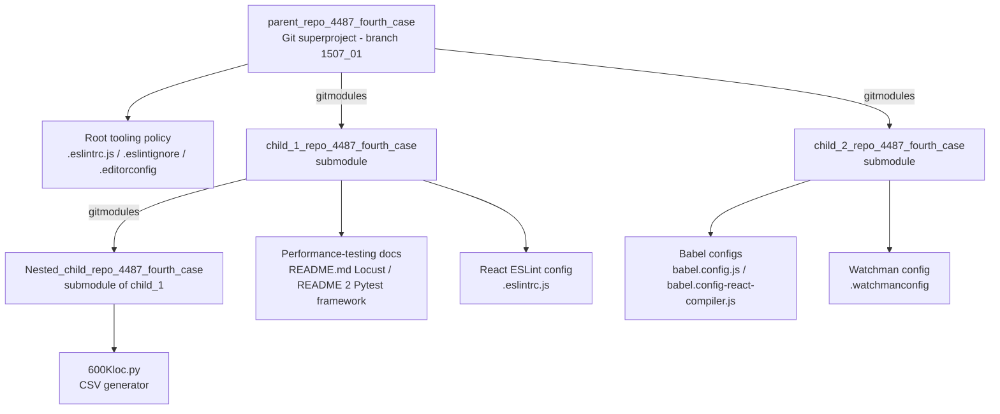

**Core Technical Approach**

The repository's approach is *composition by Git submodules*: a thin superproject binds independently versioned child repositories, one of which nests a further submodule. The documented performance-testing approach in `README (2).md` is Python-based and config-driven — it uses `pytest`, the `requests` HTTP client, and a `ThreadPoolExecutor` for parallel load generation, authenticates via Firebase, and emits an HTML report plus latency graphs. The Locust tool in `README.md` takes a batch-script approach on Windows, provisioning its own runtime. The JavaScript toolchain applies a `hermes-eslint`-parsed ESLint policy with language-version-specific overrides (Espree/ES5 for `es5Paths`, Hermes/ES8 modules for `esNextPaths`) and a Babel plugin pipeline for JSX/Flow and modern-JS transforms. The data-generation approach is a minimal standalone Python script.

### 1.2.3 Success Criteria

The repository does not define project-wide objectives, OKRs, or service-level agreements. The only measurable criteria that can be substantiated are the metrics and parameters documented for the performance-testing tools and the severity policy encoded in the lint configuration.

**Measurable Objectives and Key Performance Indicators (KPIs)**

| Metric / Parameter | Documented Value or Definition | Source |
|---|---|---|
| Latency percentiles | P90, P95, P99 (reported) | `child_1/README (2).md` |
| Central-tendency latency | Mean, Median, Min, Max (reported) | `child_1/README (2).md` |
| Throughput | Requests per second (RPS) | `child_1/README (2).md` |
| Reliability | Success / Failure count | `child_1/README (2).md` |
| Load volume (example config) | `total_requests` = 50 | `child_1/README (2).md` |
| Concurrency (example config) | `workers` = 10 | `child_1/README (2).md` |
| Locust run profile | 1 user, ramp-up 1, duration 10s | `child_1/README.md` |
| Functional pass condition | HTTP `status_code == 200` (example test) | `child_1/README (2).md` |
| Lint severity policy | `OFF=0`, `WARNING=1`, `ERROR=2` | `.eslintrc.js` |

**Critical Success Factors**

For the documented tooling to achieve its objectives, the following conditions — each drawn from the READMEs — must hold: successful Firebase → Platform authentication, successful automatic installation of Python dependencies, correctly initialized submodules at their pinned commits, and (for the Locust runner's first execution) available internet connectivity to download Python and Locust.

**Note on Thresholds:** the performance framework *reports* percentile and throughput metrics but the repository defines no numeric latency budget or pass/fail SLA against them; the only explicit pass condition in the documentation is the `status_code == 200` assertion shown in the `README (2).md` "Add New API" example. Any additional targets would be unsupported by the repository's contents.

## 1.3 Scope

This scope statement distinguishes what the repository *actually contains and documents* (in-scope) from what it references, targets, or excludes but does not itself provide (out-of-scope). It is derived entirely from the observed file inventory and file contents; it does not attribute capabilities to the repository that are not evidenced by its files.

### 1.3.1 In-Scope

**Core Features and Functionalities**

The following elements are present in the repository and are therefore in-scope for this specification:

| In-Scope Element | Description | Evidence |
|---|---|---|
| Submodule composition | Three-level Git submodule superproject structure | root `.gitmodules`, `child_1/.gitmodules`, `.git` gitlinks |
| Code-quality policy | 659-line ESLint config, 21-pattern ignore list, editor conventions | `.eslintrc.js`, `.eslintignore`, `.editorconfig` |
| Performance-testing documentation | Locust one-click runner and Blitzy Platform API performance framework, described in full | `child_1/README.md`, `child_1/README (2).md` |
| React build/watch configuration | Babel plugin pipelines and Watchman config | `child_2/babel.config.js`, `babel.config-react-compiler.js`, `.watchmanconfig` |
| Test-data generation | Deterministic 600,000-row CSV generator | `Nested_child_repo_4487_fourth_case/600Kloc.py` |

**Primary User Workflows (as documented)**

- **Config-driven API performance run** — execute `python run_tests.py`, which (per `README (2).md`) installs dependencies, authenticates via Firebase, runs `pytest`, generates an HTML report, and opens it.
- **One-click Windows load test** — double-click `run_locust.bat`, which (per `README.md`) checks for/downloads Python, installs/upgrades Locust, runs the test, and writes reports to `report/`.
- **Submodule initialization** — clone and initialize the submodule graph declared by the `.gitmodules` files.
- **Test-data regeneration** — run `600Kloc.py` to (re)generate the large CSV fixture.

**Essential Integrations**

Integrations that the documentation treats as required are: Firebase → Platform authentication and the target Blitzy Platform API (`README (2).md`); the Python packaging ecosystem for automatic dependency installation (both READMEs); Git submodules for composition (`.gitmodules`); and, at the configuration level, the ESLint (`prettier`, `jest`), Babel, and Watchman toolchains.

**Key Technical Requirements**

| Requirement | Applies To | Evidence |
|---|---|---|
| Python + `pytest`, `requests`, `ThreadPoolExecutor` | Blitzy Platform performance framework | `child_1/README (2).md` |
| Windows 10/11 + internet (first run) | Locust batch runner | `child_1/README.md` |
| JavaScript/Node toolchain with `hermes-eslint` | ESLint policy and Babel configs | `.eslintrc.js`, `child_2/babel.config.js` |
| Python 3 interpreter | CSV generation script | `Nested_child_repo_4487_fourth_case/600Kloc.py` |

**Implementation Boundaries**

| Boundary Dimension | In-Scope Definition | Evidence |
|---|---|---|
| System boundary | The superproject and its submodule working trees; the Blitzy Platform API is an external system reached over HTTPS | `.gitmodules`, `child_1/README (2).md` |
| User groups covered | QA/SDET engineers, CI pipelines, Windows load testers, JS/React developers, repository integrators | `child_1` READMEs, `.eslintrc.js` |
| Platform/market coverage | Performance framework is Linux/Mac/Windows/CI compatible; Locust runner is Windows 10/11 specific; no geographic scope stated | `child_1/README (2).md`, `README.md` |
| Data domains included | Synthetic CSV rows (`id,Sample Data i`), reported performance metrics, and tool configuration values | `600Kloc.py`, `child_1/README (2).md` |

### 1.3.2 Out-of-Scope

**Excluded Features and Capabilities**

The following are referenced or targeted by the repository's files but are not themselves provided, and are therefore out-of-scope:

| Excluded Item | Reason | Evidence |
|---|---|---|
| Performance-tool source implementations (`run_tests.py`, `config.json`, `tests/test_perf.py`, `locustfile.py`, `run_locust.bat`, `requirements.txt`) | Described in READMEs but absent from the repository | `child_1` READMEs vs. file inventory |
| Unresolved config dependencies (`./scripts/shared/pathsByLanguageVersion`, `./babel.config-ts`) | Required by configs but not present | `.eslintrc.js`, `child_2/babel.config-react-compiler.js` |
| React application/package source tree (`packages/*`, `compiler/`, DevTools builds) | Targeted by the lint/ignore/babel configs but not present here | `.eslintignore`, `babel.config.js` |
| `.csv` data files (including `large.csv`) | Explicitly excluded from inspection | `.blitzyignore` (`*.csv`) |

**Future-Phase Considerations**

The repository documents one explicit future change: `child_2/babel.config-react-compiler.js` contains a "HACK" note stating the intent to remove the workaround later "when we move eslint-plugin-react-hooks into the compiler directory." No roadmap, release plan, or other phased-delivery documentation exists in the repository.

**Integration Points Not Covered**

No runtime application server, web front-end, database, message broker, deployment manifest, or infrastructure-as-code is present. Although `README (2).md` asserts CI compatibility, no CI pipeline definition files are included; and although a Firebase authentication flow is described, no Firebase project configuration or credentials are present (the `config.json` example uses placeholders only).

**Unsupported Use Cases**

- Executing either performance-testing tool directly from this repository, since their source files are absent.
- Building or linting a React application from these configuration fragments as-is, since the required module paths and source tree are not present.
- Consuming or querying the `.csv` datasets, which are out of documentation scope by `.blitzyignore`.

## 1.4 References

The following repository files, folders, and metadata were inspected as evidence for this Introduction. Paths are relative to the repository root (`parent_repo_4487_fourth_case`).

**Files**

- `README.md` — root identity file containing only the project name.
- `.blitzyignore` — established that `*.csv` files are excluded from inspection.
- `.gitmodules` — declared the two direct submodules (`child_1_repo_4487_fourth_case`, `child_2_repo_4487_fourth_case`) and their GitHub URLs.
- `.eslintrc.js` — the 659-line, strict ESLint policy (hermes-eslint parser; `ft-flow`/`react`/`react-internal` plugins; `OFF`/`WARNING`/`ERROR` severity constants; 18 path-scoped override blocks); established the React-monorepo toolchain origin and the unresolved `./scripts/shared/pathsByLanguageVersion` requirement.
- `.eslintignore` — the 21-pattern ignore list referencing `packages/react-art`, `packages/react-devtools-*`, and `compiler/`; corroborated the React origin.
- `.editorconfig` — editor conventions (UTF-8, LF, 2-space indent, 80-column limit).
- `child_1_repo_4487_fourth_case/README.md` — documented the Locust one-click Windows batch load-test runner and its run profile (1 user, ramp-up 1, 10s).
- `child_1_repo_4487_fourth_case/README (2).md` — documented the "Blitzy Platform — API Performance Test Framework," including stack, Firebase→Platform auth flow, `base_url`, config values (`total_requests`=50, `workers`=10), metrics (P90/P95/P99, RPS), and outputs.
- `child_1_repo_4487_fourth_case/.eslintrc.js` — confirmed identical to the root ESLint policy.
- `child_1_repo_4487_fourth_case/.gitmodules` — declared the nested `Nested_child_repo_4487_fourth_case` submodule.
- `child_1_repo_4487_fourth_case/.git-blame-ignore-revs` — two commit hashes excluded from blame.
- `child_1_repo_4487_fourth_case/.gitattributes` — `* text=auto` line-ending normalization.
- `child_1_repo_4487_fourth_case/Nested_child_repo_4487_fourth_case/600Kloc.py` — the three-line script that writes a 600,000-row `large.csv`.
- `child_1_repo_4487_fourth_case/Nested_child_repo_4487_fourth_case/README.md` — identity file (title only).
- `child_2_repo_4487_fourth_case/babel.config.js` — the 17-plugin Babel pipeline (JSX, Flow strip-types, class properties, spread/destructuring in loose mode, block-scoping).
- `child_2_repo_4487_fourth_case/babel.config-react-compiler.js` — the React Compiler "HACK" note, the documented future change, and the unresolved `./babel.config-ts` requirement.
- `child_2_repo_4487_fourth_case/.watchmanconfig` — empty (`{}`) Watchman configuration.
- `child_2_repo_4487_fourth_case/README.md` — identity file (title only).

**Folders**

- `` (repository root) — the Git superproject/configuration-oriented root; contained submodule metadata and root lint/editor policy, with no first-order application-source directory.
- `child_1_repo_4487_fourth_case/` — performance-testing documentation, a React ESLint config, and the nested submodule.
- `child_1_repo_4487_fourth_case/Nested_child_repo_4487_fourth_case/` — the CSV data-generation utility submodule.
- `child_2_repo_4487_fourth_case/` — React/Babel build configuration and Watchman config.

**Repository Metadata**

- `.git` gitlink pointer files (in `child_1`, `child_2`, and the nested submodule) — confirmed the three-level submodule wiring into `.git/modules/...`.
- Git branch and commit history — branch `1507_01`; commits "Create .blitzyignore", "Add child repositories as submodules", and "Update child_1 to latest nested submodule" established that the repository was assembled by composition.

**External Sources**

- None. No web sources were used; all claims are grounded in the repository's own files.

# 2. Product Requirements

## 2.1 Feature Catalog

This section decomposes `parent_repo_4487_fourth_case` into discrete, testable features. As established in the Introduction (see §1.1 Executive Summary and §1.2.2 High-Level Description), the repository is **not a single deployable application** but a Git superproject that composes independent tooling and performance-testing assets through a three-level submodule hierarchy. Accordingly, the "features" cataloged below are the documented capabilities and present configuration/utility artifacts that the repository actually contains — no capability is asserted that is not grounded in an observed file.

Two of the six features (F-001 and F-002) are **documented-only**: their READMEs fully describe intended behavior, but the referenced source files (`run_tests.py`, `config.json`, `tests/test_perf.py`, `locustfile.py`, `run_locust.bat`, `requirements.txt`) are absent from the repository (see §1.3.2 Out-of-Scope). Their requirements therefore describe *documented intended behavior*, not behavior verified against present source.

### 2.1.1 Feature Conventions, Inventory, and Assumptions

**Identifier Scheme**

| Identifier Format | Applies To | Example |
|---|---|---|
| `F-XXX` | A discrete feature | `F-001` |
| `F-XXX-RQ-YYY` | A functional requirement belonging to feature `F-XXX` | `F-001-RQ-001` |

**Status Semantics** (mapped to the standard Proposed/Approved/In Development/Completed vocabulary, interpreted against *what the repository actually contains*):

| Status | Meaning in This Repository |
|---|---|
| Completed | The feature's artifact(s) are present in the repository as captured (may still reference external paths that are absent). |
| Proposed | The feature is fully documented in a README, but its implementation source is not present in the repository. |

**Priority Semantics:** The repository declares **no** formal feature priority, SLA, latency budget, or KPI (see §1.2.3 Success Criteria). The Critical/High/Medium/Low levels assigned below are a documentation aid that reflects the *relative emphasis and completeness* observed across the repository (per §1.1, "the most fully articulated purpose in the repository is performance testing"); they are not a repository-native ranking.

**Feature Inventory**

| Feature ID | Feature Name | Category | Priority |
|---|---|---|---|
| F-001 | Blitzy Platform API Performance Test Framework | Performance Testing / Quality Assurance | High |
| F-002 | One-Click Locust Load Test Runner | Performance Testing / Load Testing | Medium |
| F-003 | JavaScript/React Code-Quality Enforcement | Developer Tooling / Code Quality | High |
| F-004 | React Build Transformation (Babel) | Developer Tooling / Build Transformation | Medium |
| F-005 | Synthetic CSV Test-Data Generation | Utilities / Test-Data Generation | Low |
| F-006 | Git Submodule Composition | Repository Structure / Configuration Management | High |

**Feature Status and Primary Evidence**

| Feature ID | Status | Primary Evidence |
|---|---|---|
| F-001 | Proposed (documented; implementation absent) | `child_1_repo_4487_fourth_case/README (2).md` |
| F-002 | Proposed (documented; implementation absent) | `child_1_repo_4487_fourth_case/README.md` |
| F-003 | Completed (artifacts present; non-executable standalone) | `.eslintrc.js`, `.eslintignore`, `.editorconfig` |
| F-004 | Completed (base config present; compiler variant depends on absent file) | `child_2_repo_4487_fourth_case/babel.config.js`, `babel.config-react-compiler.js` |
| F-005 | Completed (self-contained, runnable) | `child_1_repo_4487_fourth_case/Nested_child_repo_4487_fourth_case/600Kloc.py` |
| F-006 | Completed (wired and committed) | `.gitmodules`, `child_1_repo_4487_fourth_case/.gitmodules` |

**Assumptions and Constraints**

| # | Assumption / Constraint | Basis |
|---|---|---|
| A-1 | The repository is an aggregation of tooling and documentation, not a runnable end-to-end product. | §1.1; root `README.md` (title only) |
| A-2 | F-001 and F-002 describe intended behavior only; their source files are not present, so their requirements are not runtime-verifiable from this repository. | §1.3.2; `child_1` READMEs vs. file inventory |
| A-3 | No formal priority, SLA, latency threshold, or KPI exists in the repository; only reported metrics and a `status_code == 200` example pass condition are documented. | §1.2.3; `README (2).md` line 110 |
| A-4 | `.csv` outputs (e.g., `large.csv`) are excluded from inspection by `.blitzyignore`, so F-005's output content is documented only by its generating code. | `.blitzyignore` (`*.csv`) |
| A-5 | F-003 and the F-004 compiler variant reference module paths absent here (`./scripts/shared/pathsByLanguageVersion`, `./babel.config-ts`) and a React source tree that is not present, so they are not executable standalone in this repository. | `.eslintrc.js` lines 3-6; `babel.config-react-compiler.js` line 15 |
| A-6 | Requirement baseline is **v1.0** as captured on branch `1507_01` at HEAD commit `ae40cd5`; the repository provides no native requirement-versioning mechanism, so version tracking is anchored to Git history. | `git log` on branch `1507_01` |

### 2.1.2 F-001 — Blitzy Platform API Performance Test Framework

**Metadata**

| Attribute | Value |
|---|---|
| Feature ID | F-001 |
| Feature Name | Blitzy Platform API Performance Test Framework |
| Category | Performance Testing / Quality Assurance |
| Priority | High |
| Status | Proposed (documented; implementation source absent) |

**Description**

- **Overview:** A config-driven API performance-testing framework documented in `child_1_repo_4487_fourth_case/README (2).md`, built (per the README) with Python, Pytest, Requests, `ThreadPoolExecutor`, HTML reports, and latency graphs, and "Designed for QA / SDET / CI pipelines."
- **Business Value:** Provides performance visibility for the target Blitzy Platform API by reporting latency percentiles and throughput, enabling data-driven performance assessment (see §1.1 value proposition).
- **User Benefits:** One-command execution (`python run_tests.py`), automatic dependency installation, automatic Firebase → Platform authentication, parallel test execution, a stage/production configuration switch, and an auto-opened HTML report with graphs.
- **Technical Context:** Targets `base_url` `https://platform.api.blitzystage.com`; documented example configuration sets `perf.total_requests = 50` and `perf.workers = 10`; the documented authentication chain is Email/Password → Firebase → ID Token → Platform → Access Token. The framework's source files (`run_tests.py`, `config.json`, `requirements.txt`, `tests/test_perf.py`) are **not present** in the repository.

**Dependencies**

| Dependency Type | Detail |
|---|---|
| Prerequisite Features | None internal to the repository (self-contained tool as documented). Would be delivered under the `child_1` submodule (F-006) if implemented. |
| System Dependencies | Python runtime; `pytest`, `requests`, and `ThreadPoolExecutor` (concurrent execution). |
| External Dependencies | Firebase authentication service; the Blitzy Platform API at `https://platform.api.blitzystage.com`; a Python package source for automatic dependency installation. |
| Integration Requirements | Valid `config.json` (email, password, `api_key`, `project_id`, `perf` settings); network egress; successful Firebase → Platform token exchange. |

### 2.1.3 F-002 — One-Click Locust Load Test Runner

**Metadata**

| Attribute | Value |
|---|---|
| Feature ID | F-002 |
| Feature Name | One-Click Locust Load Test Runner |
| Category | Performance Testing / Load Testing |
| Priority | Medium |
| Status | Proposed (documented; implementation source absent) |

**Description**

- **Overview:** A Windows "one-click" Locust load-test workflow documented in `child_1_repo_4487_fourth_case/README.md`, driven by a `run_locust.bat` batch script that requires no prior Python/pip/Locust installation.
- **Business Value:** Lowers the barrier to load testing by provisioning its own runtime, so a load test can be started with a single double-click (see §1.1).
- **User Benefits:** Double-click execution; automatic Python download when missing; automatic Locust install/upgrade; CSV and browser-viewable HTML reports; user-adjustable user count and duration by editing the batch file.
- **Technical Context:** Documented run profile is `-u 1 -r 1 -t 10s` (1 user, ramp-up 1, 10-second duration); reports (`report_stats.csv`, `report_failures.csv`, `report_requests.csv`, `report.html`) are written to `report/` and overwritten each run; requires Windows 10/11 and first-run internet connectivity; a Docker version is referenced for Linux/Mac. The documented files (`run_locust.bat`, `locustfile.py`, `.env`, `requirements.txt`, `report/`) are **not present** in the repository.

**Dependencies**

| Dependency Type | Detail |
|---|---|
| Prerequisite Features | None internal to the repository. Would be delivered under the `child_1` submodule (F-006) if implemented. |
| System Dependencies | Windows 10/11 operating system; batch-script host; Python (auto-provisioned); Locust. |
| External Dependencies | Internet connectivity on first run (to download Python and Locust); the target host/endpoint under load. |
| Integration Requirements | A `locustfile.py` defining the test; a `report/` output directory; optional `.env` for environment variables. |

### 2.1.4 F-003 — JavaScript/React Code-Quality Enforcement

**Metadata**

| Attribute | Value |
|---|---|
| Feature ID | F-003 |
| Feature Name | JavaScript/React Code-Quality Enforcement |
| Category | Developer Tooling / Code Quality |
| Priority | High |
| Status | Completed (artifacts present; not executable standalone here) |

**Description**

- **Overview:** A strict, comprehensive linting-and-editor-convention policy comprising a 659-line ESLint configuration (`.eslintrc.js`), a 33-line ignore list (`.eslintignore`), and editor conventions (`.editorconfig`). The identical ESLint configuration is present at the root and in `child_1_repo_4487_fourth_case/.eslintrc.js` (byte-for-byte identical).
- **Business Value:** Encodes consistency and correctness at scale for a large JavaScript/React codebase (per §1.1), consistent with the React (facebook/react) monorepo toolchain.
- **User Benefits:** Uniform lint severity, formatting, naming, and complexity policy; detection of unused disable directives; language-version-specific rule sets; React and React-internal correctness checks; editor-agnostic formatting via EditorConfig.
- **Technical Context:** Uses the `hermes-eslint` parser (`ecmaVersion: 9`, `sourceType: 'script'`); `extends: ['prettier', 'plugin:jest/recommended']`; `root: true`; `reportUnusedDisableDirectives: true`; loads eight plugins (`babel`, `ft-flow`, `jest`, `es`, `no-for-of-loops`, `no-function-declare-after-return`, `react`, `react-internal`); defines severity constants `OFF = 0`, `WARNING = 1`, `ERROR = 2`; and contains 18 path-scoped `files:` override blocks (including `es5Paths` → Espree/ES5/script, `esNextPaths` → Hermes/ES8/module, ESLint-rule sources, published React Hooks rules, and `@typescript-eslint`). `.editorconfig` sets UTF-8, LF, 2-space indentation, final newline, and an 80-column limit (relaxed for `*.md` and `COMMIT_EDITMSG`).

**Dependencies**

| Dependency Type | Detail |
|---|---|
| Prerequisite Features | None internal to the repository. |
| System Dependencies | Node.js/ESLint runtime; `hermes-eslint`, `espree`, and `@typescript-eslint/parser` parsers; the eight ESLint plugins; `prettier`; Jest ESLint plugin. |
| External Dependencies | `confusing-browser-globals` (imported as `restrictedGlobals`); `./scripts/shared/pathsByLanguageVersion` for `es5Paths`/`esNextPaths` (referenced but **absent** here). |
| Integration Requirements | A React/JavaScript source tree (e.g., `packages/*`) to lint (absent here); EditorConfig-aware editors to apply `.editorconfig`. |

### 2.1.5 F-004 — React Build Transformation (Babel)

**Metadata**

| Attribute | Value |
|---|---|
| Feature ID | F-004 |
| Feature Name | React Build Transformation (Babel) |
| Category | Developer Tooling / Build Transformation |
| Priority | Medium |
| Status | Completed (base config present; compiler variant depends on absent file) |

**Description**

- **Overview:** A Babel plugin pipeline for source-to-runtime transformation of JSX/Flow and modern JavaScript, defined in `child_2_repo_4487_fourth_case/babel.config.js`, plus a React Compiler compatibility variant (`babel.config-react-compiler.js`). A `.watchmanconfig` (empty `{}`) accompanies these as file-watching integration.
- **Business Value:** Enables transpilation of JSX/Flow and modern-JS features for a React build pipeline (per §1.2.2).
- **User Benefits:** Consistent, explicit transform behavior (loose mode where configured); a documented workaround path for known React Compiler build incompatibilities.
- **Technical Context:** `babel.config.js` exports a 17-entry `plugins` array beginning with `@babel/plugin-syntax-jsx` and `@babel/plugin-transform-flow-strip-types`, using loose mode for class properties, object-rest-spread (`useBuiltIns`), template literals, spread (`useBuiltIns`), and destructuring (`useBuiltIns`), and `@babel/plugin-transform-block-scoping` with `throwIfClosureRequired: true`. `babel.config-react-compiler.js` re-exports `baseConfig.plugins` from `./babel.config-ts` (which is **not present**) and carries a "HACK" note describing a Zod `.map`/loose-mode-spread conflict and a block-scoping incompatibility, plus an explicit future change (remove the workaround once `eslint-plugin-react-hooks` is moved into the compiler directory).

**Dependencies**

| Dependency Type | Detail |
|---|---|
| Prerequisite Features | None internal to the repository. |
| System Dependencies | Node.js; `@babel/core`; the 17 configured Babel plugins and `syntax-trailing-function-commas`. |
| External Dependencies | `./babel.config-ts` (required by the compiler variant but **absent** here); the `@poteto` React Compiler build artifact (context for the HACK note). |
| Integration Requirements | A Babel-driven build pipeline consuming these plugin lists; optionally the Watchman service (`.watchmanconfig`). |

### 2.1.6 F-005 — Synthetic CSV Test-Data Generation

**Metadata**

| Attribute | Value |
|---|---|
| Feature ID | F-005 |
| Feature Name | Synthetic CSV Test-Data Generation |
| Category | Utilities / Test-Data Generation |
| Priority | Low |
| Status | Completed (self-contained, runnable) |

**Description**

- **Overview:** A standalone, dependency-free Python script (`child_1_repo_4487_fourth_case/Nested_child_repo_4487_fourth_case/600Kloc.py`) that deterministically generates a large synthetic CSV dataset.
- **Business Value:** Provides a reproducible way to (re)generate a large CSV fixture (per §1.1, "reproducible test data").
- **User Benefits:** A single, three-line script produces a predictable 600,000-row dataset with no configuration or external dependencies.
- **Technical Context:** The script opens `large.csv` in write (truncate) mode and loops `range(600000)`, writing rows of the form `{i},Sample Data {i}` (integers 0–599999). It defines no imports, functions, arguments, validation, or error handling. The output `large.csv` is a `.csv` file and is therefore excluded from inspection by `.blitzyignore`.

**Dependencies**

| Dependency Type | Detail |
|---|---|
| Prerequisite Features | None. |
| System Dependencies | Python 3 interpreter; local filesystem write access in the current working directory. |
| External Dependencies | None (uses only Python built-ins). |
| Integration Requirements | None; produces `large.csv` in the working directory. |

### 2.1.7 F-006 — Git Submodule Composition

**Metadata**

| Attribute | Value |
|---|---|
| Feature ID | F-006 |
| Feature Name | Git Submodule Composition |
| Category | Repository Structure / Configuration Management |
| Priority | High |
| Status | Completed (wired and committed) |

**Description**

- **Overview:** The repository's foundational structural mechanism: a three-level Git submodule graph in which the superproject (`parent_repo_4487_fourth_case`) binds two direct submodules, one of which binds a further nested submodule (per §1.2.2).
- **Business Value:** Composes independently versioned, pre-existing artifacts without merging them into one codebase; each child is pinned at a specific commit.
- **User Benefits:** Repository integrators can clone and initialize the correct pinned submodule versions in a single recursive operation.
- **Technical Context:** Root `.gitmodules` declares `child_1_repo_4487_fourth_case` and `child_2_repo_4487_fourth_case` (GitHub URLs under `lakshya-blitzy/`); `child_1_repo_4487_fourth_case/.gitmodules` declares the nested `Nested_child_repo_4487_fourth_case`. Git history on branch `1507_01` records the composition ("Add child repositories as submodules", "Update child_1 to latest nested submodule"). Supporting metadata in `child_1` includes `.gitattributes` (`* text=auto`) and `.git-blame-ignore-revs` (two commit hashes).

**Dependencies**

| Dependency Type | Detail |
|---|---|
| Prerequisite Features | None (foundational; hosts F-001, F-002, F-005 conceptually within its submodule tree). |
| System Dependencies | Git with submodule support. |
| External Dependencies | The GitHub-hosted child repositories (`github.com/lakshya-blitzy/child_1_repo_4487_fourth_case`, `child_2_repo_4487_fourth_case`, `Nested_child_repo_4487_fourth_case`). |
| Integration Requirements | Network access to fetch submodules; recursive initialization (`git submodule update --init --recursive`). |

## 2.2 Functional Requirements

This section enumerates the functional requirements for each feature cataloged in §2.1. Requirement identifiers follow the `F-XXX-RQ-YYY` convention. Per assumption A-2 (§2.1.1), the acceptance criteria for the documented-only features (F-001, F-002) describe **documented expected behavior** that becomes runtime-verifiable once their referenced source files are present; for the present-artifact features (F-003–F-006) the acceptance criteria are verifiable directly against the committed files. Priority uses Must-Have/Should-Have/Could-Have; Complexity uses High/Medium/Low. Where the repository declares nothing for a validation dimension, this is stated explicitly rather than inferred.

### 2.2.1 F-001 — Blitzy Platform API Performance Test Framework

The documented end-to-end run process (per `child_1_repo_4487_fourth_case/README (2).md`) is:

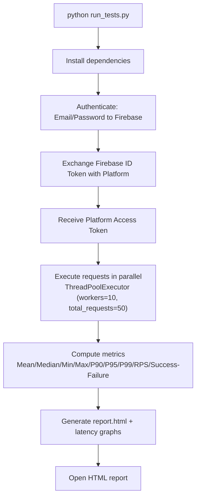

**Requirement Details**

| Requirement ID | Description | Priority | Complexity |
|---|---|---|---|
| F-001-RQ-001 | Load and honor a `config.json` (base URL, auth, project, perf settings) | Must-Have | Medium |
| F-001-RQ-002 | Orchestrate a full run from a single command (`python run_tests.py`): install deps → authenticate → run pytest → generate report → open HTML | Must-Have | High |
| F-001-RQ-003 | Authenticate via Firebase → Platform token exchange | Must-Have | High |
| F-001-RQ-004 | Execute API requests in parallel using `ThreadPoolExecutor` | Must-Have | Medium |
| F-001-RQ-005 | Compute and report latency and throughput metrics | Must-Have | Medium |
| F-001-RQ-006 | Emit report/artifact outputs (HTML report, metrics/response text, latency graphs) | Should-Have | Medium |
| F-001-RQ-007 | Support a stage/production configuration switch | Should-Have | Low |
| F-001-RQ-008 | Allow new test cases to be added (e.g., `test_new_api` asserting HTTP 200) | Could-Have | Low |

**Acceptance Criteria**

| Requirement ID | Acceptance Criteria (testable) |
|---|---|
| F-001-RQ-001 | With a populated `config.json`, the run consumes `base_url`, `auth.{email,password,api_key}`, `project.project_id`, and `perf.{total_requests,workers}` without code edits. |
| F-001-RQ-002 | A single `python run_tests.py` invocation completes all five documented steps and opens the HTML report, with no manual dependency install. |
| F-001-RQ-003 | Given valid credentials, the flow Email/Password → Firebase → ID Token → Platform → Access Token yields a usable Platform access token; invalid credentials cause a failed run. |
| F-001-RQ-004 | With `workers=10` and `total_requests=50`, 50 requests are dispatched across up to 10 concurrent workers. |
| F-001-RQ-005 | The output includes Mean, Median, Min, Max, P90, P95, P99, RPS, and success/failure counts. |
| F-001-RQ-006 | After a run, `reports/report.html`, `perf_metrics.txt`, `response.txt`, and one or more `.png` latency graphs exist. |
| F-001-RQ-007 | Changing the configured environment redirects requests to the corresponding base URL without further code changes. |
| F-001-RQ-008 | A test function issuing `requests.get(f"{BASE_URL}/v1/new-endpoint", headers=headers())` passes when the response `status_code == 200`. |

**Technical Specifications**

| Requirement ID | Input Parameters | Output / Response | Performance & Data Requirements |
|---|---|---|---|
| F-001-RQ-001 | `config.json` keys: `base_url`, `auth`, `project`, `perf` | Loaded configuration object | Example: `total_requests=50`, `workers=10` |
| F-001-RQ-002 | CLI invocation `python run_tests.py` | Console progress + opened HTML report | Auto dependency install prerequisite |
| F-001-RQ-003 | Email, password, Firebase `api_key`, `project_id` | Firebase ID token; Platform access token | Token used as bearer for subsequent calls |
| F-001-RQ-004 | HTTP requests to `{base_url}` endpoints | Per-request responses/latencies | Concurrency bounded by `workers` |
| F-001-RQ-005 | Collected per-request latencies + statuses | Aggregated metrics set | Percentiles P90/P95/P99; RPS |
| F-001-RQ-006 | Aggregated metrics + raw responses | `report.html`, `perf_metrics.txt`, `response.txt`, `.png` | Written under `reports/` |
| F-001-RQ-007 | Environment selector (stage/prod) | Effective `base_url` | Documented as "stage/prod switch" |
| F-001-RQ-008 | New `test_*` function + `headers()` | Assertion pass/fail | Pass condition `status_code == 200` |

**Validation Rules**

| Requirement ID | Business & Data Validation | Security Requirements | Compliance Requirements |
|---|---|---|---|
| F-001-RQ-001 | `config.json` must supply all documented keys | Credentials/API key held in `config.json` (placeholders documented) | None declared in repository |
| F-001-RQ-003 | Auth must succeed before test execution | Token-based auth; no anonymous access to Platform | None declared |
| F-001-RQ-005 | Success vs. failure classified per response | N/A | None declared |
| F-001-RQ-008 | Functional pass requires HTTP 200 | Requests carry auth headers via `headers()` | None declared |

### 2.2.2 F-002 — One-Click Locust Load Test Runner

The documented batch-runner process (per `child_1_repo_4487_fourth_case/README.md`) is:

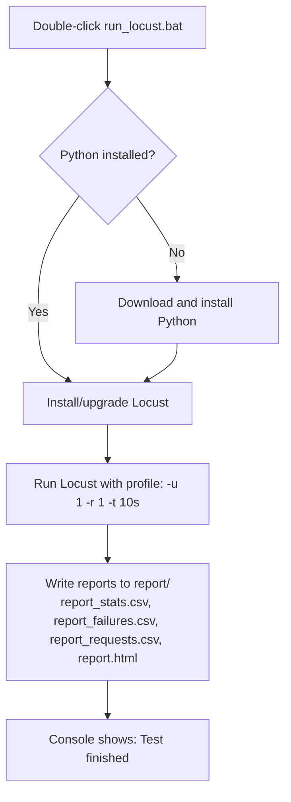

**Requirement Details**

| Requirement ID | Description | Priority | Complexity |
|---|---|---|---|
| F-002-RQ-001 | Launch the entire load test from a single double-click of `run_locust.bat` | Must-Have | Low |
| F-002-RQ-002 | Detect Python and download/install it automatically if missing | Must-Have | Medium |
| F-002-RQ-003 | Install or upgrade Locust automatically | Must-Have | Low |
| F-002-RQ-004 | Run the Locust test with profile `-u 1 -r 1 -t 10s` (editable in the batch file) | Must-Have | Low |
| F-002-RQ-005 | Write CSV and HTML reports to `report/`, overwriting prior reports each run | Must-Have | Low |
| F-002-RQ-006 | Operate on Windows 10/11 with first-run internet connectivity | Should-Have | Low |

**Acceptance Criteria**

| Requirement ID | Acceptance Criteria (testable) |
|---|---|
| F-002-RQ-001 | Double-clicking `run_locust.bat` starts the workflow with no other manual steps. |
| F-002-RQ-002 | On a machine without Python, the script downloads and installs Python before proceeding. |
| F-002-RQ-003 | Locust is present and current after the script's install/upgrade step. |
| F-002-RQ-004 | The executed run uses 1 user, ramp-up 1, and a 10-second duration unless the batch flags are edited. |
| F-002-RQ-005 | After completion, `report_stats.csv`, `report_failures.csv`, `report_requests.csv`, and `report.html` exist under `report/`, replacing any prior copies. |
| F-002-RQ-006 | A first run on Windows 10/11 with internet connectivity completes and prints a "Test finished" message. |

**Technical Specifications**

| Requirement ID | Input Parameters | Output / Response | Performance & Data Requirements |
|---|---|---|---|
| F-002-RQ-001 | Double-click action on `run_locust.bat` | Console progress | No pre-installed runtime required |
| F-002-RQ-002 | Presence/absence of Python on PATH | Installed Python runtime | Requires internet on first run |
| F-002-RQ-003 | Locust package availability | Installed/upgraded Locust | Requires internet on first run |
| F-002-RQ-004 | Locust flags `-u 1 -r 1 -t 10s` | Running load test | 1 user, ramp-up 1, 10s duration |
| F-002-RQ-005 | Locust run results | 3 CSV files + `report.html` in `report/` | Reports overwritten each run |
| F-002-RQ-006 | Windows 10/11 host | Completed run | First-run internet connectivity |

**Validation Rules**

| Requirement ID | Business & Data Validation | Security Requirements | Compliance Requirements |
|---|---|---|---|
| F-002-RQ-004 | Run profile flags must be valid Locust arguments | None declared in repository | None declared |
| F-002-RQ-005 | Reports directory populated after run; prior history is not preserved automatically | None declared | None declared |
| F-002-RQ-006 | Platform must be Windows 10/11 | Downloads require trusted network on first run | None declared |

### 2.2.3 F-003 — JavaScript/React Code-Quality Enforcement

**Requirement Details**

| Requirement ID | Description | Priority | Complexity |
|---|---|---|---|
| F-003-RQ-001 | Provide a strict baseline ESLint policy (extends `prettier` + `plugin:jest/recommended`; 8 plugins; `hermes-eslint` parser) | Must-Have | High |
| F-003-RQ-002 | Define a three-level severity model and report unused disable directives | Must-Have | Low |
| F-003-RQ-003 | Apply language-version-scoped and toolchain-scoped overrides (`es5Paths`, `esNextPaths`, TypeScript, React Hooks, ESLint rule sources) | Must-Have | High |
| F-003-RQ-004 | Exclude non-source/build/third-party paths from linting via `.eslintignore` | Should-Have | Low |
| F-003-RQ-005 | Enforce editor conventions via `.editorconfig` | Should-Have | Low |

**Acceptance Criteria**

| Requirement ID | Acceptance Criteria (testable) |
|---|---|
| F-003-RQ-001 | `.eslintrc.js` parses with `hermes-eslint`, sets `root: true`, `extends: ['prettier','plugin:jest/recommended']`, and loads the eight declared plugins. |
| F-003-RQ-002 | The config defines `OFF=0`, `WARNING=1`, `ERROR=2` and sets `reportUnusedDisableDirectives: true`. |
| F-003-RQ-003 | Files matching `es5Paths` are parsed by Espree as ES5/script; files matching `esNextPaths` are parsed by Hermes as ES8 modules with `no-var`/`prefer-const`; the 18 `files:` override blocks are present. |
| F-003-RQ-004 | `.eslintignore` contains the documented patterns (e.g., `**/node_modules`, `build/`, `compiler/`, `packages/react-devtools-*` outputs, `flow-typed/`). |
| F-003-RQ-005 | `.editorconfig` sets UTF-8, LF, 2-space indent, final newline, and `max_line_length = 80`, with `max_line_length = 0` for `*.md` and `COMMIT_EDITMSG`. |

**Technical Specifications**

| Requirement ID | Input Parameters | Output / Response | Performance & Data Requirements |
|---|---|---|---|
| F-003-RQ-001 | JS/JSX/Flow source files | Lint diagnostics (error/warning) | Requires `hermes-eslint` and 8 plugins |
| F-003-RQ-002 | Rule severities; inline disable directives | Enforced severities; unused-directive reports | Constants `OFF/WARNING/ERROR` |
| F-003-RQ-003 | File paths matched against `es5Paths`/`esNextPaths`/TS/DevTools globs | Parser + rule set selected per path | 18 override blocks; requires `./scripts/shared/pathsByLanguageVersion` (absent) |
| F-003-RQ-004 | Repository file tree | Ignored paths not linted | 33-line, ~21-pattern ignore list |
| F-003-RQ-005 | Any edited file | Editor formatting behavior | UTF-8/LF/2-space/80-col |

**Validation Rules**

| Requirement ID | Business & Data Validation | Security Requirements | Compliance Requirements |
|---|---|---|---|
| F-003-RQ-001 | Package JS must satisfy React-internal rules (e.g., production error codes, safe string coercion) | Rules discourage unsafe patterns (e.g., banned `WithStatement`) | React-internal engineering policy (repo-defined) |
| F-003-RQ-003 | Correct parser/rules must apply per language version | N/A | Repo-defined lint policy only |
| F-003-RQ-005 | Files must conform to editor conventions | N/A | EditorConfig standard |

### 2.2.4 F-004 — React Build Transformation (Babel)

**Requirement Details**

| Requirement ID | Description | Priority | Complexity |
|---|---|---|---|
| F-004-RQ-001 | Provide a Babel plugin pipeline that parses JSX, strips Flow types, and transforms modern JS (17 plugins) | Must-Have | Medium |
| F-004-RQ-002 | Configure loose-mode transforms for the designated plugins | Must-Have | Medium |
| F-004-RQ-003 | Configure block-scoping with `throwIfClosureRequired: true` | Should-Have | Low |
| F-004-RQ-004 | Provide a React Compiler compatibility variant reusing a minimal plugin set from `./babel.config-ts` | Should-Have | Medium |

**Acceptance Criteria**

| Requirement ID | Acceptance Criteria (testable) |
|---|---|
| F-004-RQ-001 | `babel.config.js` exports a `plugins` array whose first two entries are `@babel/plugin-syntax-jsx` and `@babel/plugin-transform-flow-strip-types`, totaling 17 plugin entries. |
| F-004-RQ-002 | `class-properties`, `object-rest-spread`, `template-literals`, `spread`, and `destructuring` are configured with `loose: true` (spread/rest/destructuring also `useBuiltIns: true`). |
| F-004-RQ-003 | `@babel/plugin-transform-block-scoping` is configured with `throwIfClosureRequired: true`. |
| F-004-RQ-004 | `babel.config-react-compiler.js` requires `./babel.config-ts` and exports `baseConfig.plugins`; the HACK note and future-change comment are present. |

**Technical Specifications**

| Requirement ID | Input Parameters | Output / Response | Performance & Data Requirements |
|---|---|---|---|
| F-004-RQ-001 | JSX/Flow/modern-JS source | Transformed JavaScript | Requires `@babel/core` + 17 plugins |
| F-004-RQ-002 | Plugin options `{loose, useBuiltIns}` | Loose-mode output semantics | Applies to 5 designated transforms |
| F-004-RQ-003 | `{throwIfClosureRequired: true}` | Build error if closure conversion needed | Deliberate strictness |
| F-004-RQ-004 | `require('./babel.config-ts')` | `plugins` array for compiler build | `./babel.config-ts` absent in repo |

**Validation Rules**

| Requirement ID | Business & Data Validation | Security Requirements | Compliance Requirements |
|---|---|---|---|
| F-004-RQ-001 | Output must preserve intended runtime semantics | None declared in repository | None declared |
| F-004-RQ-004 | Compiler variant must avoid the documented Zod/loose-spread and block-scoping failures | None declared | Temporary HACK to be removed per code comment |

### 2.2.5 F-005 — Synthetic CSV Test-Data Generation

**Requirement Details**

| Requirement ID | Description | Priority | Complexity |
|---|---|---|---|
| F-005-RQ-001 | Generate a CSV containing exactly 600,000 rows in the form `{i},Sample Data {i}` | Must-Have | Low |
| F-005-RQ-002 | Write to `large.csv` in truncate mode so each run replaces prior output | Must-Have | Low |

**Acceptance Criteria**

| Requirement ID | Acceptance Criteria (testable) |
|---|---|
| F-005-RQ-001 | After execution, `large.csv` contains 600,000 lines; row `i` equals `"{i},Sample Data {i}"` for `i` from 0 to 599999. |
| F-005-RQ-002 | Re-running the script overwrites (does not append to) any existing `large.csv`. |

**Technical Specifications**

| Requirement ID | Input Parameters | Output / Response | Performance & Data Requirements |
|---|---|---|---|
| F-005-RQ-001 | None (hard-coded `range(600000)`) | `large.csv` with 600,000 rows | Two fields per row: integer id + `Sample Data {i}` |
| F-005-RQ-002 | None | Truncated/recreated `large.csv` | Opened with mode `"w"` |

**Validation Rules**

| Requirement ID | Business & Data Validation | Security Requirements | Compliance Requirements |
|---|---|---|---|
| F-005-RQ-001 | No input validation (no parameters) | None declared in repository | Output `.csv` excluded from inspection by `.blitzyignore` |
| F-005-RQ-002 | No error handling for filesystem failures | None declared | None declared |

### 2.2.6 F-006 — Git Submodule Composition

**Requirement Details**

| Requirement ID | Description | Priority | Complexity |
|---|---|---|---|
| F-006-RQ-001 | Declare the two direct submodules with their paths and GitHub URLs in the root `.gitmodules` | Must-Have | Low |
| F-006-RQ-002 | Declare the nested submodule in `child_1_repo_4487_fourth_case/.gitmodules` | Must-Have | Low |
| F-006-RQ-003 | Support recursive initialization of the three-level graph at pinned commits | Should-Have | Medium |

**Acceptance Criteria**

| Requirement ID | Acceptance Criteria (testable) |
|---|---|
| F-006-RQ-001 | Root `.gitmodules` maps `child_1_repo_4487_fourth_case` and `child_2_repo_4487_fourth_case` to their paths and `lakshya-blitzy` GitHub URLs. |
| F-006-RQ-002 | `child_1_repo_4487_fourth_case/.gitmodules` maps `Nested_child_repo_4487_fourth_case` to its path and URL. |
| F-006-RQ-003 | `git submodule update --init --recursive` populates all three levels at their pinned commits (gitlinks resolve under `.git/modules/...`). |

**Technical Specifications**

| Requirement ID | Input Parameters | Output / Response | Performance & Data Requirements |
|---|---|---|---|
| F-006-RQ-001 | Root `.gitmodules` entries | Two initialized direct submodules | 2 `[submodule]` stanzas |
| F-006-RQ-002 | `child_1/.gitmodules` entry | One initialized nested submodule | 1 `[submodule]` stanza |
| F-006-RQ-003 | Clone + recursive init command | Fully populated 3-level tree | Requires network access to GitHub |

**Validation Rules**

| Requirement ID | Business & Data Validation | Security Requirements | Compliance Requirements |
|---|---|---|---|
| F-006-RQ-001 | Declared paths/URLs must resolve to real repositories | Fetch over HTTPS from GitHub | None declared in repository |
| F-006-RQ-003 | Pinned commits must exist in each child | N/A | None declared |

## 2.3 Feature Relationships

This section documents only relationships that are **clearly evident** in the repository's files and configuration. Because the system is an aggregation of independent artifacts (§1.1), most features are functionally independent; the strongest relationship is *physical containment* through the submodule graph (F-006), plus *shared runtimes/toolchains*. Relationships that are **not** evidenced are called out explicitly to avoid implying dependencies that do not exist.

### 2.3.1 Feature Dependency Map

The primary evident relationship is that F-006 (Git Submodule Composition) physically hosts the artifacts of every other feature, and the remaining features cluster by the runtime/toolchain they depend on:

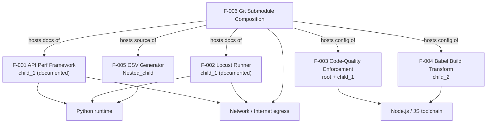

**Evident dependencies**

| Relationship | Type | Evidence |
|---|---|---|
| F-006 hosts all other features' artifacts | Containment (structural) | Root & `child_1` `.gitmodules`; file locations |
| F-001, F-002 both reside in `child_1` and share the performance-testing domain | Sibling (same category, independent) | `child_1/README (2).md`, `child_1/README.md` |
| F-003 config present identically at root and in `child_1` | Duplication of a shared artifact | Root `.eslintrc.js` byte-identical to `child_1/.eslintrc.js` |
| F-003, F-004 both handle JSX and Flow within the React/JS toolchain | Thematic (shared ecosystem, no code dependency) | `ft-flow` plugin + `plugin-transform-flow-strip-types`; JSX handling in both |

**Relationships explicitly NOT evident (not asserted):**

- No file in the repository consumes `large.csv` (F-005); the CSV outputs referenced by the performance tools are `report_*.csv` (F-002) and no import of `large.csv` appears in F-001's documentation. F-005 has **no evident downstream consumer** within this repository.
- F-001 and F-002 have **no code-level dependency** on each other; they are independent tools in the same submodule.
- The `eslint-plugin-react-hooks` reference in `babel.config-react-compiler.js` (F-004) is a code comment about a *future* move; it does not create a present dependency on F-003 in this repository.

### 2.3.2 Integration Points

| Feature | Integration Point | Type | Evidence |
|---|---|---|---|
| F-001 | Firebase authentication → Blitzy Platform API (`https://platform.api.blitzystage.com`) | External | `README (2).md` |
| F-001, F-002 | Python packaging ecosystem (automatic dependency install) | External | Both `child_1` READMEs |
| F-002 | Internet download of Python and Locust (first run) | External | `README.md` |
| F-003 | External npm ESLint plugins + `confusing-browser-globals`; unresolved `./scripts/shared/pathsByLanguageVersion` | External / Internal (absent) | `.eslintrc.js` |
| F-004 | `@babel` plugin packages; unresolved `./babel.config-ts`; optional Watchman service | External / Internal (absent) | `babel.config.js`, `babel.config-react-compiler.js`, `.watchmanconfig` |
| F-006 | GitHub-hosted child repositories (`lakshya-blitzy/*`) | External | Root & `child_1` `.gitmodules` |

### 2.3.3 Shared Components

| Shared Component | Shared By | Nature of Sharing |
|---|---|---|
| ESLint policy (`.eslintrc.js`) | F-003 (root and `child_1` copies) | Byte-identical duplication across two submodule levels |
| Flow / JSX handling | F-003 (`ft-flow`, JSX rules) and F-004 (`plugin-transform-flow-strip-types`, `plugin-syntax-jsx`) | Same language surfaces handled by lint vs. transform tooling |
| Automatic Python dependency provisioning + report generation | F-001 and F-002 | Analogous (independent) designs: auto-install deps, then emit reports (HTML; CSV for F-002) |
| Submodule metadata (`.gitmodules`, `.gitattributes`, `.git-blame-ignore-revs`) | F-006 (root and `child_1`) | Repository-composition configuration |

### 2.3.4 Common Services

| Service / Runtime | Consumed By | Role |
|---|---|---|
| Python runtime | F-001, F-002, F-005 | Executes the performance frameworks and the data generator |
| Node.js / JavaScript toolchain | F-003, F-004 | Runs ESLint and Babel transforms |
| Git (submodule support) | F-006 (underpins all) | Composes and initializes the three-level artifact graph |
| Network / Internet egress | F-001 (Firebase/Platform), F-002 (downloads), F-006 (fetch) | External connectivity for auth, provisioning, and submodule retrieval |
| HTML report rendering (browser) | F-001, F-002 | Presents `report.html` outputs to users |

## 2.4 Implementation Considerations

This section captures per-feature technical constraints, performance requirements, scalability considerations, security implications, and maintenance requirements. Consistent with §1.2.3, the repository defines no numeric SLAs or performance budgets; where a dimension is undefined, that is stated plainly.

### 2.4.1 F-001 — Blitzy Platform API Performance Test Framework

| Consideration Area | Detail |
|---|---|
| Technical Constraints | Requires Python with `pytest`, `requests`, and `ThreadPoolExecutor`; depends on external Firebase and the Blitzy Platform API; requires a populated `config.json`. Source files (`run_tests.py`, etc.) are absent, so the tool is not runnable from this repository. |
| Performance Requirements | Reports latency percentiles (P90/P95/P99), central-tendency latency, and RPS, but defines **no numeric latency budget or pass/fail SLA**; the only functional pass condition documented is `status_code == 200`. |
| Scalability Considerations | Load volume is governed by `perf.total_requests` (example 50) and concurrency by `perf.workers` (example 10); behavior beyond the documented example is unspecified. |
| Security Implications | Handles credentials (`email`, `password`, Firebase `api_key`) in `config.json` (placeholders documented); uses token-based Platform authentication; no secret-management mechanism is documented (plaintext config). |
| Maintenance Requirements | Extended by adding `test_*` functions; environment changed via a stage/prod switch; dependencies auto-installed at run time; requirement versioning anchored to Git history (A-6). |

### 2.4.2 F-002 — One-Click Locust Load Test Runner

| Consideration Area | Detail |
|---|---|
| Technical Constraints | Windows 10/11 only; requires a batch-script host and first-run internet connectivity; `run_locust.bat` and `locustfile.py` are absent from the repository. |
| Performance Requirements | Fixed documented run profile `-u 1 -r 1 -t 10s`; no SLA defined; results are reported via CSV files and `report.html`. |
| Scalability Considerations | User count and duration are adjustable by editing the batch-file flags; execution is single-machine; a Docker version is referenced for Linux/Mac. |
| Security Implications | Downloads and installs Python and Locust from the internet on first run (implies trust in the download sources); no other security controls declared. |
| Maintenance Requirements | Each run overwrites prior reports (manual copy required to retain history); customization is performed by editing the `.bat` file. |

### 2.4.3 F-003 — JavaScript/React Code-Quality Enforcement

| Consideration Area | Detail |
|---|---|
| Technical Constraints | Requires `hermes-eslint`, `espree`, `@typescript-eslint/parser`, and eight ESLint plugins; references the absent `./scripts/shared/pathsByLanguageVersion`; targets a React source tree that is not present; the root and `child_1` copies must be kept in sync (they are byte-identical). |
| Performance Requirements | None declared; this is lint-time tooling with no runtime performance target. |
| Scalability Considerations | 18 path-scoped `files:` override blocks scale rule sets across a large monorepo, with language-version-specific parsing (`es5Paths` vs. `esNextPaths`) and toolchain-specific overrides (TypeScript, React Hooks, ESLint-rule sources). |
| Security Implications | Encodes code-quality safety rules (e.g., banned `WithStatement`, safe string coercion, production error codes) — a code-hygiene control, not a runtime security control. |
| Maintenance Requirements | 659-line policy maintained in two identical locations; `reportUnusedDisableDirectives` aids hygiene; depends on external plugin versions remaining compatible. |

### 2.4.4 F-004 — React Build Transformation (Babel)

| Consideration Area | Detail |
|---|---|
| Technical Constraints | Requires `@babel/core` and the 17 configured plugins; the React Compiler variant depends on the absent `./babel.config-ts`; `block-scoping` with `throwIfClosureRequired: true` fails the build when closure conversion would be required. |
| Performance Requirements | None declared; this is build-time transformation with no runtime performance target. |
| Scalability Considerations | Loose-mode transforms apply uniformly to matched source; the compiler variant deliberately reuses a minimal plugin set to avoid known failures. |
| Security Implications | None declared; the feature performs source-to-runtime transformation only. |
| Maintenance Requirements | Carries a documented temporary "HACK" to be removed once `eslint-plugin-react-hooks` moves into the compiler directory; `.watchmanconfig` is empty; plugin versions must remain aligned with the build. |

### 2.4.5 F-005 — Synthetic CSV Test-Data Generation

| Consideration Area | Detail |
|---|---|
| Technical Constraints | Requires a Python 3 interpreter; the row count (600,000), filename (`large.csv`), and row format are hard-coded; no CLI parameters, validation, or error handling exist. |
| Performance Requirements | None declared; writes 600,000 rows sequentially in a single loop. |
| Scalability Considerations | Row count and format can only be changed by editing the source; the streaming write keeps memory usage low regardless of row count. |
| Security Implications | Writes to the current working directory without path validation; the resulting `.csv` output is excluded from inspection by `.blitzyignore`. |
| Maintenance Requirements | A trivial three-line script with no tests; changes are made by editing the in-line constants. |

### 2.4.6 F-006 — Git Submodule Composition

| Consideration Area | Detail |
|---|---|
| Technical Constraints | Requires Git with submodule support and network access to GitHub; the three-level nesting requires recursive initialization; each child is pinned at a specific commit. |
| Performance Requirements | None declared; fetch/initialization time depends on child repository sizes and network conditions. |
| Scalability Considerations | Additional submodules are added by extending the relevant `.gitmodules`; the current nesting depth is three levels. |
| Security Implications | Submodules are fetched over HTTPS from `github.com/lakshya-blitzy/*` (implies trust in those remotes); `.git-blame-ignore-revs` affects `git blame` output only. |
| Maintenance Requirements | Pinned commits are advanced by commits such as "Update child_1 to latest nested submodule"; `.gitmodules` URLs must remain valid; integrators must run recursive initialization. |

## 2.5 Requirements Traceability Matrix

This matrix traces every functional requirement to the repository evidence that substantiates it, the related technical-specification section, and the method by which it can be verified. Verification methods reflect §2.1.1 status: **Inspection** = confirmable against a present file; **Test/Demonstration** = executable/observable in this repository; **Analysis (doc)** = documented behavior verifiable by test once the referenced source is present (applies to F-001/F-002 per assumption A-2).

### 2.5.1 Feature-Level Traceability Summary

| Feature | Requirement Count | Primary Evidence | Related Spec Section |
|---|---|---|---|
| F-001 | 8 (RQ-001…RQ-008) | `child_1_repo_4487_fourth_case/README (2).md` | §1.2.2, §1.2.3, §1.3.1 |
| F-002 | 6 (RQ-001…RQ-006) | `child_1_repo_4487_fourth_case/README.md` | §1.2.2, §1.2.3, §1.3.1 |
| F-003 | 5 (RQ-001…RQ-005) | `.eslintrc.js`, `.eslintignore`, `.editorconfig` | §1.2.2, §1.2.3 |
| F-004 | 4 (RQ-001…RQ-004) | `child_2_repo_4487_fourth_case/babel.config.js`, `babel.config-react-compiler.js` | §1.2.2, §1.3.2 |
| F-005 | 2 (RQ-001…RQ-002) | `Nested_child_repo_4487_fourth_case/600Kloc.py` | §1.2.2, §1.3.1 |
| F-006 | 3 (RQ-001…RQ-003) | `.gitmodules`, `child_1_repo_4487_fourth_case/.gitmodules` | §1.2.2, §1.3.1 |

### 2.5.2 Requirement-Level Traceability Matrix

| Requirement ID | Source Evidence | Related Spec Section | Verification Method |
|---|---|---|---|
| F-001-RQ-001 | `README (2).md` (config.json block, lines 44-62) | §1.2.3 | Analysis (doc) |
| F-001-RQ-002 | `README (2).md` (Run section, lines 66-76) | §1.3.1 | Analysis (doc) |
| F-001-RQ-003 | `README (2).md` (Auth Flow, line 102) | §1.2.1 | Analysis (doc) |
| F-001-RQ-004 | `README (2).md` (`ThreadPoolExecutor`, lines 8, 21) | §1.2.2 | Analysis (doc) |
| F-001-RQ-005 | `README (2).md` (Metrics, lines 80-87) | §1.2.3 | Analysis (doc) |
| F-001-RQ-006 | `README (2).md` (Outputs, lines 91-96) | §1.2.2 | Analysis (doc) |
| F-001-RQ-007 | `README (2).md` (Config driven stage/prod, line 22) | §1.2.1 | Analysis (doc) |
| F-001-RQ-008 | `README (2).md` (Add New API, lines 106-110) | §1.2.3 | Analysis (doc) |
| F-002-RQ-001 | `README.md` (How to Run, lines 23-24) | §1.3.1 | Analysis (doc) |
| F-002-RQ-002 | `README.md` (Python check/download, line 25) | §1.2.2 | Analysis (doc) |
| F-002-RQ-003 | `README.md` (Install/upgrade Locust, line 26) | §1.2.2 | Analysis (doc) |
| F-002-RQ-004 | `README.md` (run profile, lines 27, 51) | §1.2.3 | Analysis (doc) |
| F-002-RQ-005 | `README.md` (reports, lines 28, 33-36, 47) | §1.2.2 | Analysis (doc) |
| F-002-RQ-006 | `README.md` (Requirements, lines 41-42) | §1.3.1 | Analysis (doc) |
| F-003-RQ-001 | `.eslintrc.js` (lines 14-40) | §1.2.2 | Inspection |
| F-003-RQ-002 | `.eslintrc.js` (lines 10-12, 20) | §1.2.3 | Inspection |
| F-003-RQ-003 | `.eslintrc.js` (overrides at lines 354, 368, 451, 523, 530-532) | §1.2.2 | Inspection |
| F-003-RQ-004 | `.eslintignore` (lines 1-34) | §1.3.1 | Inspection |
| F-003-RQ-005 | `.editorconfig` (lines 1-17) | §1.2.2 | Inspection |
| F-004-RQ-001 | `babel.config.js` (lines 4-25) | §1.2.2 | Inspection |
| F-004-RQ-002 | `babel.config.js` (loose-mode entries, lines 7, 10-13, 21, 23) | §1.2.2 | Inspection |
| F-004-RQ-003 | `babel.config.js` (line 24) | §1.2.2 | Inspection |
| F-004-RQ-004 | `babel.config-react-compiler.js` (lines 3-19) | §1.3.2 | Inspection |
| F-005-RQ-001 | `600Kloc.py` (lines 1-3) | §1.2.2 | Test (execute script) |
| F-005-RQ-002 | `600Kloc.py` (line 1, mode `"w"`) | §1.3.1 | Test (execute script) |
| F-006-RQ-001 | Root `.gitmodules` (lines 1-6) | §1.2.2 | Inspection |
| F-006-RQ-002 | `child_1_repo_4487_fourth_case/.gitmodules` (lines 1-3) | §1.2.2 | Inspection |
| F-006-RQ-003 | Git gitlinks under `.git/modules/...`; branch `1507_01` history | §1.3.1 | Demonstration (recursive init) |

## 2.6 References

The following repository files, folders, metadata, and cross-referenced specification sections were inspected as evidence for this Product Requirements section. Paths are relative to the repository root (`parent_repo_4487_fourth_case`).

**Files**

- `README.md` — root identity file (project name only); basis for assumption A-1 (not a runnable product).
- `.blitzyignore` — established the `*.csv` inspection exclusion (assumption A-4; F-005 output).
- `.gitmodules` — declared the two direct submodules and their `lakshya-blitzy` GitHub URLs (F-006, F-006-RQ-001).
- `.eslintrc.js` — the 659-line ESLint policy: parser, extends, plugins, severity constants, and 18 path-scoped overrides (F-003, F-003-RQ-001/002/003).
- `.eslintignore` — the 33-line, ~21-pattern ignore list (F-003-RQ-004; corroborates React-monorepo origin).
- `.editorconfig` — editor conventions UTF-8/LF/2-space/80-column with `*.md` and `COMMIT_EDITMSG` exceptions (F-003-RQ-005).
- `child_1_repo_4487_fourth_case/README.md` — documented the Locust one-click Windows batch runner: run profile, reports, requirements (F-002 and all its requirements).
- `child_1_repo_4487_fourth_case/README (2).md` — documented the Blitzy Platform API Performance Test Framework: stack, config, auth flow, metrics, outputs, and the `status_code == 200` example (F-001 and all its requirements).
- `child_1_repo_4487_fourth_case/.eslintrc.js` — confirmed byte-identical to the root ESLint policy (F-003 shared-component relationship, §2.3.3).
- `child_1_repo_4487_fourth_case/.gitmodules` — declared the nested `Nested_child_repo_4487_fourth_case` submodule (F-006-RQ-002).
- `child_1_repo_4487_fourth_case/.gitattributes` — `* text=auto` normalization (F-006 metadata).
- `child_1_repo_4487_fourth_case/.git-blame-ignore-revs` — two blame-excluded commit hashes (F-006 metadata).
- `child_1_repo_4487_fourth_case/Nested_child_repo_4487_fourth_case/600Kloc.py` — the three-line generator writing 600,000 rows to `large.csv` (F-005, F-005-RQ-001/002).
- `child_1_repo_4487_fourth_case/Nested_child_repo_4487_fourth_case/README.md` — nested identity file (title only).
- `child_2_repo_4487_fourth_case/babel.config.js` — the 17-plugin JSX/Flow/modern-JS Babel pipeline with loose-mode and `throwIfClosureRequired` settings (F-004, F-004-RQ-001/002/003).
- `child_2_repo_4487_fourth_case/babel.config-react-compiler.js` — the React Compiler variant re-exporting `./babel.config-ts` plugins, plus the HACK note and future-change comment (F-004-RQ-004; §1.3.2).
- `child_2_repo_4487_fourth_case/.watchmanconfig` — empty (`{}`) Watchman configuration (F-004 integration point).
- `child_2_repo_4487_fourth_case/README.md` — identity file (title only).

**Folders**

- `` (repository root) — the Git superproject; contained the root tooling policy and submodule metadata (F-003, F-006).
- `child_1_repo_4487_fourth_case/` — performance-testing documentation, a duplicated React ESLint config, and the nested submodule (F-001, F-002, F-006).
- `child_1_repo_4487_fourth_case/Nested_child_repo_4487_fourth_case/` — the CSV data-generation utility (F-005).
- `child_2_repo_4487_fourth_case/` — React/Babel build configuration and Watchman config (F-004).

**Repository Metadata**

- Git branch `1507_01` and commit history ("Initial commit", "Add files via upload", "Create .blitzyignore", "Add child repositories as submodules", "Update child_1 to latest nested submodule"; HEAD `ae40cd5`) — established the requirement baseline v1.0 (assumption A-6) and the composition provenance of F-006.
- Submodule gitlinks resolving under `.git/modules/...` — corroborated the three-level submodule wiring (F-006-RQ-003).

**Cross-Referenced Specification Sections**

- §1.1 Executive Summary — artifact clusters, documented-vs-implemented distinction, value proposition.
- §1.2 System Overview (1.2.1 Project Context, 1.2.2 High-Level Description, 1.2.3 Success Criteria) — capability list, component map, metrics/KPIs, and the "no SLA" position.
- §1.3 Scope (1.3.1 In-Scope, 1.3.2 Out-of-Scope) — in-scope workflows and the absent source files/paths that make F-001/F-002 documentation-only.
- §1.4 References — the Introduction's evidence inventory, reconciled with this section's file usage.

**External Sources**

- None. No web sources were used; every requirement and relationship in this section is grounded in the repository's own files and Git metadata.

# 3. Technology Stack

## 3.1 Programming Languages

`parent_repo_4487_fourth_case` (branch `1507_01`) is a Git superproject assembled from JavaScript/React tooling-configuration fragments, performance-testing tool documentation, and a single data-generation utility rather than a deployable application. Consequently, the set of programming languages **physically committed as source** is small and is dominated by tooling-configuration code. A file-extension census across the working tree — excluding Git internals and the `*.csv` artifacts excluded by the root `.blitzyignore` — reveals only two executable/source languages actually present: **JavaScript** (four CommonJS configuration modules) and **Python** (one script). No manifest declares a language runtime version, and no `.ts`, `.tsx`, `.jsx`, `.json`, `.sh`, or `.bat` file exists anywhere in the tree.

The following table maps languages to the components/clusters in which they appear, distinguishing what is committed from what is merely referenced by the committed configuration.

| Language | Component / Cluster | Evidence | Presence |
|---|---|---|---|
| JavaScript (CommonJS) | JS/React code-quality policy | `.eslintrc.js`, `child_1_repo_4487_fourth_case/.eslintrc.js` | Committed |
| JavaScript (CommonJS) | Babel build-transformation config | `child_2_repo_4487_fourth_case/babel.config.js`, `child_2_repo_4487_fourth_case/babel.config-react-compiler.js` | Committed |
| Python 3 | Synthetic test-data utility | `child_1_repo_4487_fourth_case/Nested_child_repo_4487_fourth_case/600Kloc.py` | Committed |
| Python 3 | Documented performance-test tooling | `child_1_repo_4487_fourth_case/README.md`, `child_1_repo_4487_fourth_case/README (2).md` | Referenced only |
| TypeScript | ESLint rule sources / Babel TS config | referenced in `.eslintrc.js`, `child_2_repo_4487_fourth_case/babel.config-react-compiler.js` | Referenced only |
| Flow-typed JS / JSX | React source targeted by lint & build | referenced in `.eslintrc.js`, `child_2_repo_4487_fourth_case/babel.config.js` | Referenced only |

### 3.1.1 JavaScript (Configuration and Tooling Language)

JavaScript is the dominant committed language and is used exclusively for build/lint configuration in the **CommonJS** module format. All four `.js` files begin with the `'use strict'` directive and expose configuration via `module.exports`, while the ESLint files pull in their dependencies with `require(...)`:

```javascript
'use strict';
module.exports = { /* ESLint / Babel configuration object */ };
```

- The root `.eslintrc.js` and `child_1_repo_4487_fourth_case/.eslintrc.js` (659 lines each, and **byte-identical** to one another) declare the linter's own parsing target through `parserOptions: { ecmaVersion: 9, sourceType: 'script' }` — that is, the configuration is authored against ECMAScript 2018 in classic (non-module) script mode.
- The two Babel modules in `child_2_repo_4487_fourth_case` (`babel.config.js`, `babel.config-react-compiler.js`) are likewise CommonJS; `babel.config-react-compiler.js` composes its plugin list by `require`-ing a sibling config and re-exporting `baseConfig.plugins`.

Because these files use `require`/`module.exports` and are strict-mode scripts (not ES modules), they are intended to be loaded directly by Node.js-based tooling (ESLint and Babel).

**ECMAScript language-version targets.** While ES2018 governs the configuration files themselves, the ESLint policy explicitly lints against three distinct ECMAScript baselines for the (absent) source tree it was written for, selected per file-path group via `overrides`:

| Path group (override) | Parser | ECMAScript target | Source type |
|---|---|---|---|
| Default | `hermes-eslint` | `ecmaVersion: 9` (ES2018) | `script` |
| `es5Paths` | `espree` | `ecmaVersion: 5` (ES5) | `script` |
| `esNextPaths` | `hermes-eslint` | `ecmaVersion: 8` (ES2017) | `module` (enforces `no-var`, `prefer-const`) |

The `es5Paths`/`esNextPaths` path lists are imported from `./scripts/shared/pathsByLanguageVersion`, which is **not present** in this repository, so the overrides cannot resolve their target files here.

### 3.1.2 Python (Utility and Documented Tooling Language)

Python is the second committed language, represented by exactly one script: `child_1_repo_4487_fourth_case/Nested_child_repo_4487_fourth_case/600Kloc.py`. The script is three lines long, imports nothing (relying solely on built-ins), and uses Python-3 f-string syntax to stream 600,000 comma-separated rows to an output file:

```python
with open("large.csv", "w") as f:
    for i in range(600000):
        f.write(f"{i},Sample Data {i}\n")
```

The f-string usage means a **Python 3** interpreter is required; there are no command-line arguments, configuration, or error handling, and the file name and row count are hard-coded.

Python is additionally the language of the two performance-testing tools documented in `child_1_repo_4487_fourth_case` — but their implementation source is **not committed**. `README (2).md` describes a Python framework built on `pytest`, `requests`, and `concurrent.futures.ThreadPoolExecutor`; `README.md` describes a one-click Locust runner. These are documentation-only artifacts (see §3.2 and §3.4); the referenced `run_tests.py`, `tests/test_perf.py`, `locustfile.py`, and `requirements.txt` do not exist in the tree.

### 3.1.3 Referenced-but-Absent Languages

TypeScript, JSX, and Flow-annotated JavaScript are all **referenced** by the committed tooling configuration yet have no corresponding source files in this repository:

- **TypeScript** — the ESLint configuration adds a `@typescript-eslint/parser` override (extending `plugin:@typescript-eslint/recommended`) scoped to `packages/eslint-plugin-react-hooks/src`, and `babel.config-react-compiler.js` performs `require('./babel.config-ts')`. Both the `packages/...` tree and `babel.config-ts` are absent.
- **JSX** — `babel.config.js` enables `@babel/plugin-syntax-jsx`, and the ESLint config loads `eslint-plugin-react`; no `.jsx`/`.tsx` files are committed.
- **Flow** — the ESLint config parses with the `hermes-eslint` parser and enforces `eslint-plugin-ft-flow`, declaring Flow globals such as `$FlowFixMe`; `babel.config.js` erases Flow annotations via `@babel/plugin-transform-flow-strip-types`. No Flow-annotated `.js` file is committed, and the `flow-typed/` directory named in `.eslintignore` is absent.

These references confirm that the configuration fragments originate from a React-style monorepo toolchain, but the languages they target are not part of this repository's committed content.

### 3.1.4 Selection Criteria, Constraints, and Dependencies

**Selection criteria (as observed).** JavaScript in CommonJS form is effectively mandated for the ESLint and Babel configuration files — this is a constraint imposed by those tools' loaders rather than a discretionary architectural choice. Python 3 was chosen for the standalone data-generation utility, which needs no third-party packages and therefore no dependency management.

**Constraints and dependencies.**

- **No version pinning.** No `package.json`, `requirements.txt`, or `pyproject.toml` exists, and a search for semantic-version patterns across the tree returns nothing. No JavaScript or Python runtime version is declared anywhere in the repository.
- **JavaScript runtime dependency.** The `.js` configuration files must be interpreted by Node.js-based tooling (ESLint, Babel). The ESLint config additionally `require`s `./scripts/shared/pathsByLanguageVersion` and `confusing-browser-globals`; because the former is absent, the configuration cannot be executed as-is within this repository.
- **Python runtime dependency.** `600Kloc.py` requires a Python 3 interpreter (for f-strings) and writes to the current working directory with no path validation.
- **Uniform source conventions.** `.editorconfig` (`root = true`) applies to every file: UTF-8 charset, LF line endings, 2-space indentation, an enforced final newline, and an 80-column maximum line length (relaxed to unlimited for Markdown and `COMMIT_EDITMSG`).


## 3.2 Frameworks & Libraries

Because the repository contains **no dependency manifest or lockfile** (`package.json`, `requirements.txt`, `pyproject.toml`, and any `*-lock` files are all absent) and **no semantic-version string appears anywhere in the tree**, none of the frameworks or libraries below are version-pinned inside this repository. They are identified from the `require(...)` calls, `extends`/`plugins` declarations, and `parser` selections inside the committed configuration files, and from the tool documentation in `child_1_repo_4487_fourth_case`. Two JavaScript toolchains are materially present as configuration — an ESLint-based code-quality stack and a Babel build-transformation stack — while the Python testing frameworks are documented only. Where a current stable release exists on the public registry, it is provided in this section strictly as an **external reference for orientation** (latest stable as of mid-2026); it does **not** reflect a version declared or locked by this repository.

### 3.2.1 JavaScript Code-Quality & Formatting Framework Stack

The core framework of the code-quality cluster is **ESLint**, configured through the legacy `.eslintrc.js` (eslintrc) format at both the root and in `child_1_repo_4487_fourth_case/.eslintrc.js` (the two files are byte-identical). The configuration is a strict-mode CommonJS module that sets `root: true` and `reportUnusedDisableDirectives: true`, and it defines its own `OFF`/`WARNING`/`ERROR` severity constants (`0`/`1`/`2`).

**Parsers (supporting libraries).** The stack composes three parsers, selected by file-path override:

| Parser | Applied to | Purpose |
|---|---|---|
| `hermes-eslint` | default + `esNextPaths` | Parse Flow-typed JavaScript (Meta's Hermes-based parser) |
| `espree` | `es5Paths` | Parse legacy ES5 sources |
| `@typescript-eslint/parser` | `packages/eslint-plugin-react-hooks/src` | Parse TypeScript rule sources |

**Plugins and shareable configs (supporting libraries).** The base `plugins` array declares `babel`, `ft-flow`, `jest`, `es`, `no-for-of-loops`, `no-function-declare-after-return`, `react`, and `react-internal`; `extends` pulls in `prettier` (the `eslint-config-prettier` shareable config) and `plugin:jest/recommended`. Additional plugins are activated in overrides: `eslint-plugin` (for local rule sources under `scripts/eslint-rules`), `eslint-plugin-react-hooks-published` (for `react-devtools-*` paths), and `@typescript-eslint`. The following table summarizes the ecosystem and each element's role.

| Package / identifier | Category | Role in the stack |
|---|---|---|
| `eslint` | Core framework | Lint engine driving the entire policy |
| `eslint-config-prettier` (`prettier`) | Shareable config | Disables stylistic rules that conflict with the formatter |
| `eslint-plugin-jest` (`jest`, `plugin:jest/recommended`) | Plugin | Lint rules for Jest test files |
| `eslint-plugin-react` (`react`) | Plugin | React/JSX lint rules |
| `eslint-plugin-ft-flow` (`ft-flow`) | Plugin | Flow-type lint rules |
| `@babel/eslint-plugin` (`babel`) | Plugin | Babel-aware rule variants |
| `@typescript-eslint/eslint-plugin` (`@typescript-eslint`) | Plugin | TypeScript lint rules for rule sources |
| `eslint-plugin-react-hooks-published` | Plugin | Rules-of-Hooks enforcement for DevTools paths |
| `es`, `no-for-of-loops`, `no-function-declare-after-return`, `react-internal`, `eslint-plugin` | Repo-local/named plugins | Project-specific rule sets (their rule sources — e.g. `scripts/shared/pathsByLanguageVersion`, `scripts/eslint-rules` — are not committed here) |
| `confusing-browser-globals` | Data module | `require`-d list of ambiguous browser globals |

**Prettier** functions as the code-formatting framework of this stack, integrated indirectly: ESLint `extends: ['prettier']` so that formatting is delegated to Prettier rather than duplicated by lint rules. **Jest** is the referenced testing framework — its presence is asserted through `eslint-plugin-jest`, the `plugin:jest/recommended` extension, and the `jest: true` environment plus the `jest` global — although no Jest test files or Jest configuration are committed.

**Compatibility requirement.** This configuration uses the **legacy eslintrc format**, not the newer flat-config (`eslint.config.js`) format. The current ESLint major line (v10, released February 2026) makes flat config the default and removed eslintrc support; therefore this policy is compatible with an **earlier ESLint major line** (v8/v9-era eslintrc support) and is not directly loadable by ESLint v10 without migration.

### 3.2.2 Babel Build-Transformation Framework

The build-transformation cluster is built on **Babel**. `child_2_repo_4487_fourth_case/babel.config.js` is a CommonJS module that exports a `plugins` array of **17 Babel plugins** implementing JSX syntax, Flow type-stripping, and down-levelling of modern JavaScript. The plugin set and notable options are:

| Babel plugin | Options | Purpose |
|---|---|---|
| `@babel/plugin-syntax-jsx` | — | Parse JSX syntax |
| `@babel/plugin-transform-flow-strip-types` | — | Remove Flow type annotations |
| `@babel/plugin-proposal-class-properties` | `loose: true` | Class fields |
| `@babel/plugin-syntax-trailing-function-commas` | — | Trailing commas in function args |
| `@babel/plugin-proposal-object-rest-spread` | `loose: true, useBuiltIns: true` | Object rest/spread |
| `@babel/plugin-transform-template-literals` | `loose: true` | Template literals |
| `@babel/plugin-transform-literals` | — | Unicode/number literals |
| `@babel/plugin-transform-arrow-functions` | — | Arrow functions |
| `@babel/plugin-transform-block-scoped-functions` | — | Block-scoped function decls |
| `@babel/plugin-transform-object-super` | — | `super` in object methods |
| `@babel/plugin-transform-shorthand-properties` | — | Shorthand properties |
| `@babel/plugin-transform-computed-properties` | — | Computed keys |
| `@babel/plugin-transform-for-of` | — | `for...of` iteration |
| `@babel/plugin-transform-spread` | `loose: true, useBuiltIns: true` | Array/call spread |
| `@babel/plugin-transform-parameters` | — | Default/rest params |
| `@babel/plugin-transform-destructuring` | `loose: true, useBuiltIns: true` | Destructuring |
| `@babel/plugin-transform-block-scoping` | `throwIfClosureRequired: true` | `let`/`const` scoping |

The `throwIfClosureRequired: true` option is a deliberate strictness constraint: block-scoping transformation is configured to **fail the build** rather than emit a slower closure-based transform when a closure conversion would be required.

`child_2_repo_4487_fourth_case/babel.config-react-compiler.js` is a variant that `require`s a sibling `./babel.config-ts` (which is **not present**) and re-exports its `baseConfig.plugins`. An in-file `HACK` comment attributes the variant to React Compiler build behavior (inlining of Zod), a parse failure under spread loose-mode, and the `throwIfClosureRequired` incompatibility, and records an intent to relocate `eslint-plugin-react-hooks` into a compiler directory. Because `./babel.config-ts` is absent, this variant cannot resolve within the repository.

**Core framework and compatibility requirement.** These plugins require the Babel compiler core (`@babel/core`) plus each plugin package at runtime; none is committed or pinned. Critically, the configuration uses **Babel 7-era plugin names** — for example `@babel/plugin-proposal-class-properties` and `@babel/plugin-proposal-object-rest-spread`, which were **renamed** to `@babel/plugin-transform-*` in Babel 8. The configuration is therefore written for the **Babel 7.x line** and is not name-compatible with a default Babel 8 installation. `child_2_repo_4487_fourth_case/.watchmanconfig` (an empty `{}` JSON object) accompanies this cluster, indicating the toolchain expects Facebook's Watchman file-watching service.

### 3.2.3 Documented Python Performance-Testing Frameworks

The two performance-testing tools in `child_1_repo_4487_fourth_case` are described entirely in prose; their framework dependencies are named in the READMEs but **no source, `requirements.txt`, or lockfile is committed**, so these are documentation-only and cannot be built or run from this repository.

- **Locust** — `README.md` ("One-Click Locust Load Test") describes a Windows batch runner (`run_locust.bat`) that installs and drives Locust, executing a `locustfile.py` for one user, ramp rate one, over ten seconds, and emitting CSV/HTML reports. Locust is an open-source, Python-based load-testing framework.
- **pytest + requests + ThreadPoolExecutor** — `README (2).md` ("Blitzy Platform — API Performance Test Framework") describes a Python framework that uses the **pytest** test framework, the **requests** HTTP client library, and `concurrent.futures.ThreadPoolExecutor` (Python standard library) for concurrency (`workers: 10`, `total_requests: 50`), producing an HTML report, latency graphs, and metric text files.

### 3.2.4 Versions, Compatibility & Pinning Summary

The table below consolidates every framework/library identified, how it appears in the repository, and — for orientation only — the latest public stable release. No version in the final column is declared or locked by this repository.

| Framework / library | Role | Appears in repo as | Pinned here? | Latest stable (external reference, mid-2026) |
|---|---|---|---|---|
| ESLint | JS lint engine (core) | Legacy `.eslintrc.js` | No | `10.7.0` — repo config targets an earlier (pre-v10, eslintrc) line |
| Prettier | Code formatter | `extends: ['prettier']` | No | `3.9.5` |
| Jest | Test runner | `eslint-plugin-jest`, `plugin:jest/recommended`, `jest` global | No | `30.4.2` |
| Flow (`flow-bin`) | Static type checker | `hermes-eslint` parser + `eslint-plugin-ft-flow` | No | `0.314.0` |
| `@babel/core` + 17 plugins | Build transformation | `babel.config.js` / `babel.config-react-compiler.js` | No | `8.0.1` — repo config is Babel **7.x**-style (legacy plugin names) |
| Locust | Load-testing framework | Documented only (`README.md`) | No | `2.45.0` |
| pytest | Test framework | Documented only (`README (2).md`) | No | `9.1.1` |
| requests | HTTP client library | Documented only (`README (2).md`) | No | `2.34.2` |

The two most consequential compatibility findings are that (1) the ESLint policy is written in the **legacy eslintrc format** and thus predates the ESLint v10 flat-config default, and (2) the Babel configuration uses **Babel 7 plugin naming**, so upgrading either toolchain to its current major release would require a migration step.


## 3.3 Open Source Dependencies

All third-party code this repository relies on is open-source, and every dependency is drawn from one of two public registries — **npm** (`registry.npmjs.org`) for the JavaScript toolchain and **PyPI** (`pypi.org`) for the documented Python tools. A defining characteristic of this repository is that these dependencies are **implicit and entirely unpinned**: there is no `package.json`, no `package-lock.json`/`yarn.lock`/`pnpm-lock.yaml`, no `requirements.txt`, and no `pyproject.toml`/`poetry.lock`. The dependencies are therefore inferred from `require(...)`/`plugins`/`parser` references in the committed configuration files and from prose in the READMEs, and no integrity hashes or version ranges are recorded anywhere in the tree.

### 3.3.1 Dependency Inventory and Registries

The repository declares its intent to consume open-source packages from two ecosystems, but commits no machine-readable declaration of them:

| Registry | Ecosystem | How dependencies surface in the repo | Manifest / lockfile present? |
|---|---|---|---|
| npm (`registry.npmjs.org`) | JavaScript / Node.js | `require(...)`, `plugins`, `extends`, `parser` in `.eslintrc.js` and `babel.config*.js` | None |
| PyPI (`pypi.org`) | Python | Named in `child_1_repo_4487_fourth_case` README prose only | None |

### 3.3.2 npm (JavaScript) Dependencies

The following npm packages are referenced by the committed ESLint and Babel configuration. None carries a version specifier in this repository.

| Package (npm) | Consumed by | Reference site | Version in repo |
|---|---|---|---|
| `eslint` | Lint engine | `.eslintrc.js` | Unpinned |
| `eslint-config-prettier` | ESLint (`extends: ['prettier']`) | `.eslintrc.js` | Unpinned |
| `prettier` | Formatter | via `eslint-config-prettier` | Unpinned |
| `eslint-plugin-jest` | ESLint (`jest`, `plugin:jest/recommended`) | `.eslintrc.js` | Unpinned |
| `eslint-plugin-react` | ESLint (`react`) | `.eslintrc.js` | Unpinned |
| `eslint-plugin-ft-flow` | ESLint (`ft-flow`) | `.eslintrc.js` | Unpinned |
| `@babel/eslint-plugin` | ESLint (`babel`) | `.eslintrc.js` | Unpinned |
| `@typescript-eslint/eslint-plugin` | ESLint (`@typescript-eslint`) | `.eslintrc.js` override | Unpinned |
| `@typescript-eslint/parser` | ESLint parser | `.eslintrc.js` override | Unpinned |
| `hermes-eslint` | ESLint parser (default) | `.eslintrc.js` | Unpinned |
| `espree` | ESLint parser (`es5Paths`) | `.eslintrc.js` | Unpinned |
| `eslint-plugin-react-hooks-published` | ESLint (DevTools paths) | `.eslintrc.js` override | Unpinned |
| `confusing-browser-globals` | `require`-d globals list | `.eslintrc.js` | Unpinned |
| `@babel/core` | Babel compiler core (implied) | `babel.config.js` | Unpinned |
| `@babel/plugin-*` / `@babel/plugin-syntax-*` / `@babel/plugin-proposal-*` / `@babel/plugin-transform-*` (17 plugins — enumerated in §3.2.2) | Babel transformation | `babel.config.js` | Unpinned |
| `jest` | Test runner (referenced) | via `eslint-plugin-jest` + `jest` global | Unpinned |

The public latest-stable releases of the headline packages (external reference only, mid-2026) are `eslint 10.7.0`, `prettier 3.9.5`, `jest 30.4.2`, `flow-bin 0.314.0`, and `@babel/core 8.0.1`; as established in §3.2, the committed configuration actually targets *earlier* major lines of ESLint (eslintrc) and Babel (7.x plugin naming).

### 3.3.3 PyPI (Python) Dependencies

The Python packages below are named only in `child_1_repo_4487_fourth_case`'s README documentation; the corresponding source and any `requirements.txt` are **not committed**, so these are prospective/documented dependencies rather than installed ones.

| Package (PyPI) | Documented in | Role | License (per PyPI) | Latest stable (external ref) |
|---|---|---|---|---|
| `locust` | `README.md` | Load-testing framework | MIT | `2.45.0` |
| `pytest` | `README (2).md` | Test framework | MIT | `9.1.1` |
| `requests` | `README (2).md` | HTTP client | Apache-2.0 | `2.34.2` |

In addition, `README (2).md` relies on `concurrent.futures.ThreadPoolExecutor`, which is part of the **Python 3 standard library** and is therefore not a third-party dependency.

### 3.3.4 Unresolved and Repository-Local Module References

Beyond registry packages, the committed configuration `require`s several **local modules that are not present** in this repository, which means the configurations cannot fully resolve as committed:

- `./scripts/shared/pathsByLanguageVersion` — required by `.eslintrc.js` to supply the `es5Paths`/`esNextPaths` override lists; the `scripts/` tree is absent.
- `./babel.config-ts` — required by `child_2_repo_4487_fourth_case/babel.config-react-compiler.js`; absent.
- The repo-local ESLint plugin identifiers `es`, `no-for-of-loops`, `no-function-declare-after-return`, `react-internal`, and `eslint-plugin` correspond to rule sources (e.g. under `scripts/eslint-rules`) that are likewise not committed.

**Supply-chain security implications.** The complete absence of a lockfile means there are **no integrity hashes and no reproducible dependency resolution** for the JavaScript toolchain — an installation would silently pick up whatever versions the registries serve at install time, which is a well-known supply-chain risk. The documented Locust runner compounds this by describing a first-run flow that **downloads and installs Python and Locust from the internet** (see §3.4 and §3.6), implicitly trusting those remote sources. Because no versions are pinned, the repository also has no defense against a dependency introducing a breaking or malicious change between installs.


## 3.4 Third-Party Services

Third-party service usage in this repository falls into three tiers: one service is **actually integrated** (GitHub, which hosts the submodules that compose the superproject), several are **documented as external integrations** of the not-yet-committed performance-testing tools (the Blitzy Platform API and Firebase authentication), and one is **expected by the committed tooling** (Watchman). No monitoring/observability service, no cloud-platform SDK, and no dedicated identity provider such as Auth0 is present or referenced.

### 3.4.1 External APIs and Integrations

**GitHub (source-control integration — actually present).** The superproject is composed by fetching two submodules from GitHub over HTTPS, as declared in the root `.gitmodules`:

- `child_1_repo_4487_fourth_case` → `https://github.com/lakshya-blitzy/child_1_repo_4487_fourth_case.git`
- `child_2_repo_4487_fourth_case` → `https://github.com/lakshya-blitzy/child_2_repo_4487_fourth_case.git`

A third, nested submodule (`Nested_child_repo_4487_fourth_case`) is declared inside `child_1_repo_4487_fourth_case/.gitmodules`, producing a three-level hierarchy. **Integration requirement:** a Git client with submodule support and outbound HTTPS access to `github.com` is required to recursively initialize the tree; each submodule is pinned at a specific commit by the superproject.

**Blitzy Platform API (documented integration — not committed).** `child_1_repo_4487_fourth_case/README (2).md` describes a performance-test framework whose target is the Blitzy Platform API at base URL `https://platform.api.blitzystage.com` (a staging host). The documented `config.json` also carries a `project_id` and performance parameters (`total_requests: 50`, `workers: 10`). Access to the platform is **token-based**: the framework exchanges a Firebase identity for a platform access token (see §3.4.2) before issuing authenticated requests, whose only documented pass condition is an HTTP `status_code == 200`. **Integration requirement:** a populated `config.json` plus network access to the staging API; neither the config nor the client source is committed.

### 3.4.2 Authentication Services

The documented Blitzy Platform framework authenticates through **Firebase** as an identity broker. `README (2).md` describes a multi-step token-exchange flow in which email/password credentials and a Firebase `api_key` yield a Firebase ID token, which is then exchanged with the Blitzy Platform for an access token used on subsequent requests:


**Security implications.** Per `README (2).md`, the credentials (`email`, `password`) and the Firebase `api_key` are stored in a plaintext `config.json` (committed only as placeholders). No secret-management mechanism (vault, environment-variable injection, or encrypted store) is documented or present, so any real deployment of the documented tool would keep long-lived secrets in cleartext on disk. Because the client source and a populated `config.json` are not committed, this flow cannot execute from the repository as-is; it is documented design only.

### 3.4.3 Developer Tooling and Provisioning Services

**Watchman (expected by committed tooling).** `child_2_repo_4487_fourth_case/.watchmanconfig` (an empty `{}` object) signals that the Babel/React toolchain expects Facebook's **Watchman** file-watching service to be available locally for incremental file watching. The file contains no configuration keys.

**Internet-based provisioning (documented).** `child_1_repo_4487_fourth_case/README.md` describes a one-click Locust runner whose first-run flow **downloads and installs Python and Locust from the internet** on a Windows 10/11 host. This constitutes an implicit dependency on public download/package endpoints and carries the trust-in-remote-source implication noted in §3.3.4; the batch script that would perform this provisioning (`run_locust.bat`) is not committed.

### 3.4.4 Monitoring and Cloud Services

No third-party **monitoring, observability, or APM** service (e.g. Datadog, Sentry, Prometheus, CloudWatch) is referenced anywhere in the repository, and the repository defines **no numeric SLAs or performance budgets** to monitor against. No **cloud-platform** integration is present: there is no AWS/GCP/Azure SDK, no infrastructure-as-code, and no service credentials beyond the documented Firebase/Blitzy Platform flow. The only cloud-hosted services touched by the repository are GitHub (for submodule hosting) and — in documentation only — Firebase and the Blitzy Platform staging API.


## 3.5 Databases & Storage

This repository has **no database layer of any kind and no managed storage service**. There is no database driver, ORM, connection string, schema, migration, seed, `docker-compose` service definition, or cache configuration anywhere in the committed tree. The only form of persistence exercised is **flat-file output written to the local filesystem** by a single utility script; the remaining storage artifacts are output files described in documentation for tools whose implementations are not committed.

### 3.5.1 Databases (Primary and Secondary)

No relational, document, key-value, graph, time-series, or embedded database is present or referenced. A full inspection of the committed files finds no database client library (e.g. no MongoDB, PostgreSQL, MySQL, SQLite, or Redis driver), no ORM/ODM, no connection URI, and no persistence configuration. This is consistent with the repository being a Git superproject of tooling configuration, tool documentation, and one data-generation utility rather than a running application. (The default-stack database MongoDB is **not** present.)

### 3.5.2 Caching

No caching solution is present or referenced — there is no in-process cache, no distributed cache (e.g. Redis/Memcached), and no HTTP/CDN caching configuration. The only cache-adjacent constructs in the tree are lint/build **ignore** rules in `.eslintignore` for generated directories such as `build/` and `coverage/`, which are exclusion patterns rather than a caching mechanism.

### 3.5.3 File-Based Persistence and Storage Artifacts

The repository's entire persistence surface is local files. The following artifacts are the only storage outputs identified:

| Artifact | Producer | Committed? | Notes |
|---|---|---|---|
| `large.csv` | `600Kloc.py` (data-generation utility) | No (generated) | 600,000 rows streamed line-by-line to the current working directory; **excluded from the repo by `.blitzyignore` (`*.csv`)** |
| `report_stats.csv`, `report_failures.csv`, `report_requests.csv`, `report.html` (in a `report/` directory) | Documented Locust runner (`README.md`) | No | Output of the not-committed one-click load-test tool |
| `reports/report.html`, `perf_metrics.txt`, `response.txt`, latency graph `.png` files | Documented Blitzy Platform framework (`README (2).md`) | No | Output of the not-committed API performance framework |

Key characteristics of this file-based approach:

- **Streaming write, no persistence engine.** `600Kloc.py` opens one file handle and writes rows in a loop using only Python built-ins, keeping memory usage low; it performs no path validation and truncates any existing `large.csv` on each run.
- **Outputs, not committed data.** Every report artifact above is an *output* of a tool that is documented but not present in the repository, so no such files exist in the committed tree.
- **No object/cloud storage.** There is no Amazon S3, Google Cloud Storage, Azure Blob, or equivalent storage-service integration; all documented I/O targets the local filesystem.


## 3.6 Development & Deployment

The repository provides **development-time tooling configuration** but contains **no build-orchestration manifest, no containerization, and no CI/CD pipeline definition**. In other words, the committed material configures *how code should be linted, formatted, and transformed*, but there is nothing that builds, packages, or deploys an artifact. Deployment in the conventional sense is not applicable: the superproject aggregates configuration fragments, tool documentation, and one utility script. The diagram below separates what is committed from what the committed files merely reference.

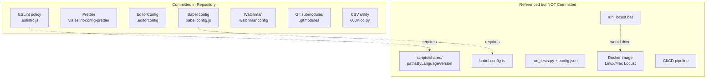

### 3.6.1 Development Tools

The committed development tooling is summarized below; all of it is static configuration consumed by external tools rather than executable project code.

| Tool | Configuration file | Role |
|---|---|---|
| ESLint | `.eslintrc.js` (root and `child_1_repo_4487_fourth_case/`) | Code-quality policy (see §3.2.1) |
| Prettier | via `extends: ['prettier']` in `.eslintrc.js` | Code formatting |
| EditorConfig | `.editorconfig` | Cross-editor conventions: UTF-8, LF, 2-space indent, final newline, 80-col limit |
| Babel | `child_2_repo_4487_fourth_case/babel.config.js`, `babel.config-react-compiler.js` | Source transformation (see §3.2.2) |
| Watchman | `child_2_repo_4487_fourth_case/.watchmanconfig` | Local file-watching service (empty `{}`) |
| Git submodules | root `.gitmodules`, `child_1_repo_4487_fourth_case/.gitmodules` | Repository composition (see §3.4.1) |
| Git attributes | `child_1_repo_4487_fourth_case/.gitattributes` | `* text=auto` line-ending normalization on commit |
| Git blame hygiene | `child_1_repo_4487_fourth_case/.git-blame-ignore-revs` | Lists two commit hashes for `git blame` to skip (bulk-reformat commits) |

### 3.6.2 Build System

There is **no build-system manifest**: no `package.json` with build scripts, no `Makefile`, no task runner, and no bundler configuration. The only build-related assets are the two Babel configuration modules in `child_2_repo_4487_fourth_case`, which define a 17-plugin transformation pipeline (§3.2.2) but are not wired to any invocation script within the repository. Two documented runners would serve as entry points for the performance tools — the Windows `run_locust.bat` batch script (`README.md`) and the `python run_tests.py` command against a `config.json` (`README (2).md`) — but neither script nor its configuration is committed. Consequently, nothing in the repository can be built or executed end-to-end except the standalone `600Kloc.py` utility, which is run directly by a Python 3 interpreter with no build step.

### 3.6.3 Containerization

**No containerization is present.** There is no `Dockerfile`, no `docker-compose.yml`, no container manifest, and no image definition anywhere in the tree. Docker appears **only as a textual reference** in `child_1_repo_4487_fourth_case/README.md`, which directs Linux/macOS users to a "Docker version" of the one-click Locust test (the Windows batch flow being the primary path). That referenced image is neither defined nor included here. (The default-stack containerization tool Docker is thus referenced but not implemented, and no orchestration platform such as Kubernetes is present.)

### 3.6.4 CI/CD

**No CI/CD pipeline is defined.** There is no `.github/workflows/` directory, no GitHub Actions workflow, and no configuration for any other CI system (GitLab CI, CircleCI, Jenkins, Travis, etc.). The Locust documentation notes that headless load-test execution is generally suitable for automation, but the repository commits no pipeline that would run it. The default-stack CI/CD tool **GitHub Actions is not present**, and — consistent with §3.4.4 — there is no infrastructure-as-code (no Terraform, CloudFormation, or equivalent) and no cloud deployment target.

**Version-control workflow (the de facto "deployment" model).** The only automated composition mechanism the repository actually uses is Git itself: the superproject pins each submodule at a specific commit and is initialized recursively over HTTPS from GitHub (§3.4.1). The commit history reflects this assembly workflow rather than an application build — its most recent commits add the child submodules, create the `.blitzyignore`, and update `child_1_repo_4487_fourth_case` to its latest nested submodule.


## 3.7 References

The following files, folders, cross-referenced specification sections, and external web sources were examined as evidence for Section 3.

**Repository files**

- `.blitzyignore` - Established the single ignore rule `*.csv`, which excludes all generated CSV artifacts (including `large.csv`) from the repository.
- `.editorconfig` - Established the uniform source conventions (UTF-8, LF, 2-space indent, final newline, 80-column limit).
- `.eslintignore` - Established the 21 ignore patterns and the React-monorepo origin (`packages/react-art`, `react-devtools-*`, `compiler/`, `flow-typed/`).
- `.eslintrc.js` - Established the ESLint core, the three parsers (`hermes-eslint`, `espree`, `@typescript-eslint/parser`), the plugin/config ecosystem, the ECMAScript version targets (ES5/ES2017/ES2018), the legacy eslintrc format, and the unresolved `./scripts/shared/pathsByLanguageVersion` reference.
- `.gitmodules` - Established the two GitHub-hosted submodules and their HTTPS origins.
- `README.md` - Established the minimal root title (no project description).
- `child_1_repo_4487_fourth_case/.eslintrc.js` - Established the byte-identical duplicate of the root ESLint policy.
- `child_1_repo_4487_fourth_case/.git-blame-ignore-revs` - Established the two commit hashes excluded from `git blame`.
- `child_1_repo_4487_fourth_case/.gitattributes` - Established `* text=auto` line-ending normalization.
- `child_1_repo_4487_fourth_case/.gitmodules` - Established the nested (third-level) submodule declaration.
- `child_1_repo_4487_fourth_case/README.md` - Established the documented one-click Locust load-test runner (Windows, internet provisioning, CSV/HTML reports, Docker reference).
- `child_1_repo_4487_fourth_case/README (2).md` - Established the documented Blitzy Platform API performance framework (Python + pytest + requests + ThreadPoolExecutor, Firebase→Platform token auth, base URL `platform.api.blitzystage.com`, plaintext `config.json` credentials, report outputs).
- `child_1_repo_4487_fourth_case/Nested_child_repo_4487_fourth_case/600Kloc.py` - Established the Python 3 CSV data-generation utility (streaming write of 600,000 rows to `large.csv`).
- `child_1_repo_4487_fourth_case/Nested_child_repo_4487_fourth_case/README.md` - Established the title-only nested README.
- `child_2_repo_4487_fourth_case/babel.config.js` - Established the 17-plugin Babel transformation pipeline, loose-mode options, and `throwIfClosureRequired: true`.
- `child_2_repo_4487_fourth_case/babel.config-react-compiler.js` - Established the React Compiler variant, the unresolved `./babel.config-ts` require, and the `HACK` compatibility notes.
- `child_2_repo_4487_fourth_case/.watchmanconfig` - Established the empty `{}` Watchman configuration (file-watching service dependency).
- `child_2_repo_4487_fourth_case/README.md` - Established the title-only child README.

**Repository folders**

- `` (repository root) - Established the Git superproject structure (root configuration files plus two submodules; no application-source directory).
- `child_1_repo_4487_fourth_case/` - Contained the ESLint copy, the two performance-testing documentation files, Git metadata, and the nested submodule.
- `child_1_repo_4487_fourth_case/Nested_child_repo_4487_fourth_case/` - Contained the `600Kloc.py` utility and its README.
- `child_2_repo_4487_fourth_case/` - Contained the Babel configuration modules and the Watchman configuration.

**Cross-referenced specification sections**

- `1.1 Executive Summary` - Corroborated the 18-file observable inventory and the three artifact clusters (JS/React tooling, performance-testing docs, data-generation utility).
- `1.2 System Overview` - Corroborated the three-level submodule hierarchy, the five primary capabilities, and the documentation-only status of the performance tools.
- `1.3 Scope` - Corroborated the in-scope/out-of-scope framework (absent perf-tool source, unresolved config dependencies, and `.csv` exclusion).
- `2.4 Implementation Considerations` - Corroborated the per-feature technical constraints and the security findings (plaintext credentials, internet provisioning, absence of numeric SLAs).

**External web sources (version orientation only — not pinned in the repository)**

- [web] npm — `eslint` package page - Confirmed latest stable `10.7.0`.
- [web] eslint.org (v10.0.0 release notes) - Confirmed ESLint v10 makes flat config the default and removes eslintrc support (basis for the legacy-format compatibility finding).
- [web] npm — `@babel/core` package page + babeljs.io (Babel 8 release, June 2026) - Confirmed latest stable `8.0.1`, ESM-only, and the Babel-7→8 plugin renaming (basis for the Babel 7.x-style finding).
- [web] npm — `prettier` package page - Confirmed latest stable `3.9.5`.
- [web] npm — `jest` package page - Confirmed latest stable `30.4.2`.
- [web] npm — `flow-bin` package page - Confirmed latest stable `0.314.0`.
- [web] PyPI — `locust` project page - Confirmed latest stable `2.45.0` and MIT license.
- [web] PyPI — `pytest` project page - Confirmed latest stable `9.1.1` and MIT license.
- [web] PyPI — `requests` project page - Confirmed latest stable `2.34.2`, Apache-2.0 license, and Python 3.10+ support.


# 4. Process Flowchart

## 4.1 System Workflows

This section documents the process flows that can be substantiated directly from the repository. As established in §1.2 System Overview and §2.1 Feature Catalog, `parent_repo_4487_fourth_case` is **not a single deployable application** — it is a Git superproject that composes independent tooling and performance-testing artifacts through a three-level submodule hierarchy. Consequently, the "workflows" documented here fall into three evidentiary categories, and each diagram is labeled accordingly:

| Category | Features | Workflow Basis |
|---|---|---|
| Present & runnable | F-005 (CSV generation), F-006 (submodule composition) | Executable/committed artifacts (`600Kloc.py`, `.gitmodules`) |
| Present, tool-invoked | F-003 (ESLint), F-004 (Babel) | Committed configuration consumed by external toolchains |
| Documented-only (implementation absent) | F-001 (API performance framework), F-002 (Locust runner) | README-described behavior; source files (`run_tests.py`, `config.json`, `locustfile.py`, `run_locust.bat`, `tests/`) are **not present** in the repository (see §1.2.1, §2.1.1 assumption A-2) |

**Scope note on absent process types:** The repository contains **no event-driven or message-queue processing** (no brokers, listeners, schedulers, or webhook handlers appear in any file), **no persistent database transactions**, and **no long-running services**. Where the Process Flowchart template anticipates such flows, their absence is stated explicitly rather than inferred. All requirement identifiers referenced below (`F-XXX-RQ-YYY`) trace to §2.2 Functional Requirements.

### 4.1.1 Actors, System Boundaries, and Swim-Lane Legend

The following actors and systems participate in the repository's workflows. They serve as the swim lanes / system boundaries in the diagrams throughout Section 4.

| Actor / System | Type | Role in Workflows | Evidence |
|---|---|---|---|
| Repository Integrator / Developer | Human actor | Clones the superproject, initializes submodules, invokes lint/build/data-generation tooling | `.gitmodules`, `.eslintrc.js`, `babel.config.js`, `600Kloc.py` |
| QA / SDET Engineer | Human actor | Invokes the documented performance-testing tools | `child_1/README (2).md`, `child_1/README.md` |
| Local Workstation / CI Runner | Compute boundary | Hosts the Node.js and Python runtimes and the local filesystem | `README (2).md` ("Linux / Mac / Windows / CI compatible") |
| Git / GitHub (`lakshya-blitzy/*`) | External system | Hosts and delivers the submodule repositories at pinned commits | Root & `child_1` `.gitmodules` |
| Node.js toolchain (ESLint, Babel) | Local runtime | Consumes `.eslintrc.js` and `babel.config.js` to lint/transform source | `.eslintrc.js`, `child_2/babel.config.js` |
| Python 3 runtime | Local runtime | Executes `600Kloc.py` and (as documented) the performance tools | `600Kloc.py`, `child_1` READMEs |
| Python / npm package sources | External system | Supply auto-installed dependencies and (documented) the Python/Locust runtime | `child_1` READMEs |
| Firebase Authentication | External system | Documented identity provider issuing an ID token for F-001 | `README (2).md` |
| Blitzy Platform API (`https://platform.api.blitzystage.com`) | External system | Documented system-under-test; issues an access token and serves requests | `README (2).md` |
| Local filesystem | Persistence boundary | Stores generated outputs (`large.csv`, report artifacts) | `600Kloc.py`, `child_1` READMEs |
| Web browser | Presentation boundary | Renders the documented `report.html` outputs | `child_1` READMEs |

**Diagram legend (applies to all Section 4 flowcharts):**

- **Stadium node** `([...])` — start or end point.
- **Rectangle** `[...]` — a process step.
- **Diamond** `{...}` — a decision point.
- **Parallelogram** `[/.../]` — an error state or an emitted artifact/diagnostic.
- **Cylinder** `[(...)]` — a persisted data store / file output.
- **Subgraph** — a system boundary / swim lane.
- **Dotted edge** `-. label .->` — an interaction that crosses into an external system boundary.

### 4.1.2 High-Level System Workflow

The master workflow below shows the single mandatory entry point common to every capability — cloning and initializing the submodule composition (F-006) — followed by the branch a developer or QA engineer takes to reach each feature. External systems are enclosed in the "External Services" boundary.

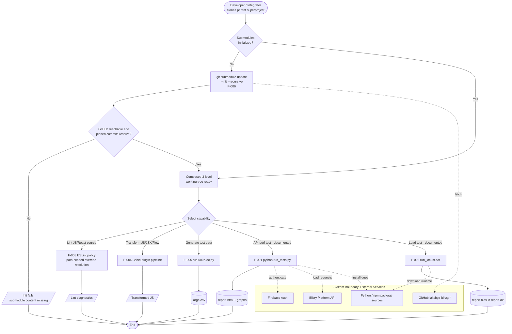

**Interpretation:** The composition step (F-006) is a hard prerequisite because the substantive artifacts live inside submodules; if `--recursive` initialization is skipped or GitHub is unreachable, the working tree is incomplete and downstream capabilities cannot run. Once the tree is composed, the five feature workflows are mutually independent — §2.3 Feature Relationships confirms there is **no code-level dependency** among them; the only shared coupling is the runtime each requires (Python for F-001/F-002/F-005, Node.js for F-003/F-004) and network egress for the external interactions.

### 4.1.3 Core Business Processes

Each core feature's detailed process flow is documented below with its start/end points, process steps, decision diamonds, error states, and the requirement IDs it satisfies.

#### 4.1.3.1 F-006 — Git Submodule Composition & Initialization

This is the foundational process that assembles the repository. It satisfies **F-006-RQ-001** (declare two direct submodules), **F-006-RQ-002** (declare the nested submodule), and **F-006-RQ-003** (recursive initialization at pinned commits).

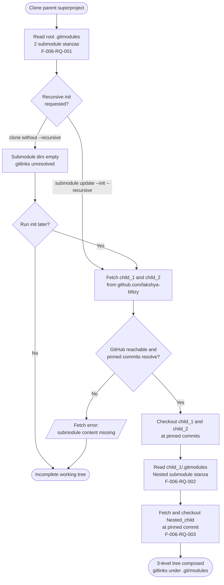

**Key characteristics:** The composition is declared across two `.gitmodules` files (root declares `child_1_repo_4487_fourth_case` and `child_2_repo_4487_fourth_case`; `child_1/.gitmodules` declares `Nested_child_repo_4487_fourth_case`). Git history records the composition through commits such as "Add child repositories as submodules" and "Update child_1 to latest nested submodule". There is no error-recovery automation — a failed fetch simply leaves an incomplete tree that the integrator must re-initialize manually (see §4.3.2).

#### 4.1.3.2 F-001 — Blitzy Platform API Performance Test Framework (documented-only)

> **Status caveat:** This workflow reflects behavior **documented** in `child_1/README (2).md`. The implementing source (`run_tests.py`, `config.json`, `tests/test_perf.py`) is **not present** in the repository, so the flow describes intended behavior, not behavior verified against committed source (§2.1.1 A-2). It expands the baseline flow shown in §2.2.1 with decision points, validation checkpoints, and error paths.

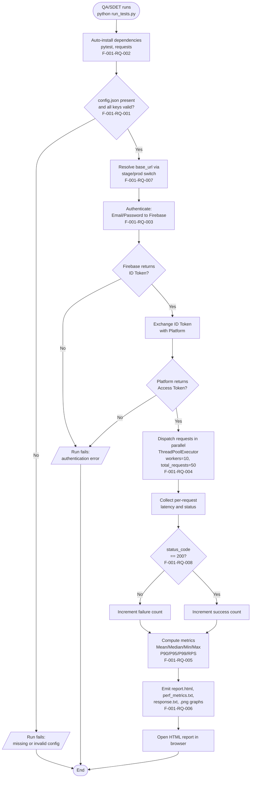

**Decision points:** configuration validity (F-001-RQ-001), Firebase ID-token issuance and Platform access-token exchange (F-001-RQ-003), and per-response success classification on `status_code == 200` (F-001-RQ-008). Authentication is a **gate** — the documented validation rule requires that "auth must succeed before test execution" (§2.2.1). Concurrency is bounded by `perf.workers` (documented example 10) over `perf.total_requests` (documented example 50).

#### 4.1.3.3 F-002 — One-Click Locust Load Test Runner (documented-only)

> **Status caveat:** Documented in `child_1/README.md`; the `run_locust.bat` and `locustfile.py` source files are **not present** (§2.1.1 A-2). Report outputs are `.csv`/HTML files written to `report/`; the `.csv` outputs are excluded from inspection by `.blitzyignore` and are referenced here only by their documented names.

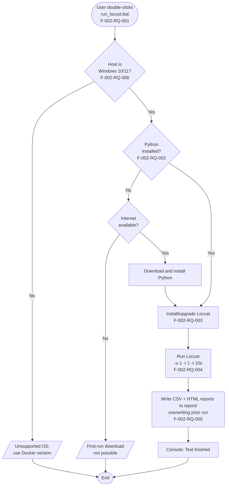

**Fallback / provisioning:** The "Python installed?" decision (F-002-RQ-002) drives the runner's only genuine fallback path — when Python is absent, the batch script provisions it (requires first-run internet connectivity). The run profile is fixed at `-u 1 -r 1 -t 10s` (1 user, ramp-up 1, 10-second duration) and is editable only by modifying the batch file (§2.4.2).

#### 4.1.3.4 F-005 — Synthetic CSV Test-Data Generation

This is the only fully runnable, self-contained executable in the repository. It satisfies **F-005-RQ-001** (600,000 rows of `{i},Sample Data {i}`) and **F-005-RQ-002** (truncate-write to `large.csv`). The complete implementation is three lines:

```python
with open("large.csv", "w") as f:
    for i in range(600000):
        f.write(f"{i},Sample Data {i}\n")
```

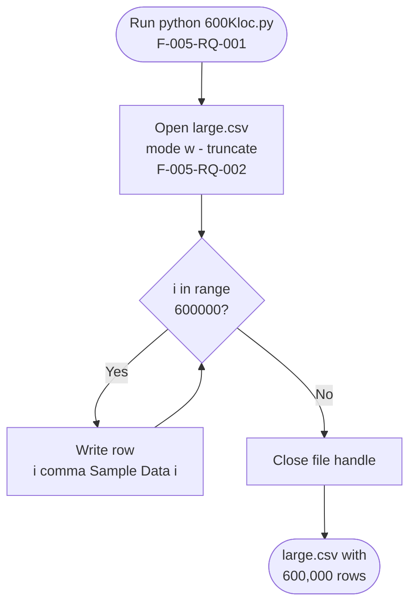

**Characteristics:** The script takes no parameters, performs **no input validation, and has no error handling** (§2.2.5, §2.4.5); a filesystem failure surfaces as an unhandled Python exception. Opening in mode `"w"` truncates any prior `large.csv`, so each run fully replaces the output. The streaming per-row write keeps memory usage constant regardless of row count.

#### 4.1.3.5 F-003 & F-004 — Developer Tooling Flows (ESLint & Babel)

These are lint-time and build-time tool invocations rather than runtime business processes. Their configuration artifacts are present, but both reference module paths that are **absent** from the checkout (`./scripts/shared/pathsByLanguageVersion` for F-003; `./babel.config-ts` for F-004), so neither is executable standalone here (§2.1.1 A-5).

**F-003 — ESLint path-scoped override resolution** (F-003-RQ-001 baseline; F-003-RQ-003 overrides; F-003-RQ-004 ignore; F-003-RQ-002 severities):

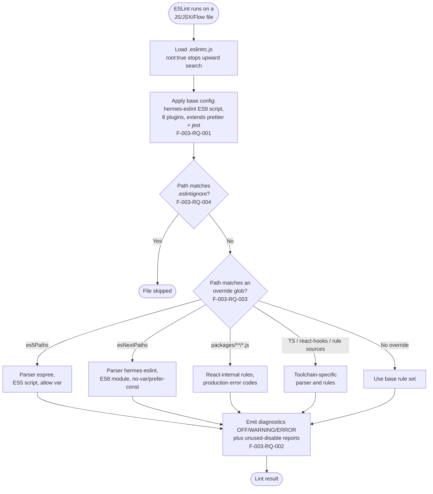

The base configuration parses with `hermes-eslint` (ECMAScript 9, script) and applies eighteen path-scoped `files:` override blocks; the two language-version blocks re-parse `es5Paths` with Espree (ES5/script) and `esNextPaths` with Hermes (ES8/module), while further blocks target `packages/**/*.js`, test files, DevTools, Scheduler, React Hooks sources, and `@typescript-eslint`.

**F-004 — Babel transform pipeline** (F-004-RQ-001 pipeline; F-004-RQ-004 compiler variant; F-004-RQ-002 loose mode; F-004-RQ-003 block-scoping):

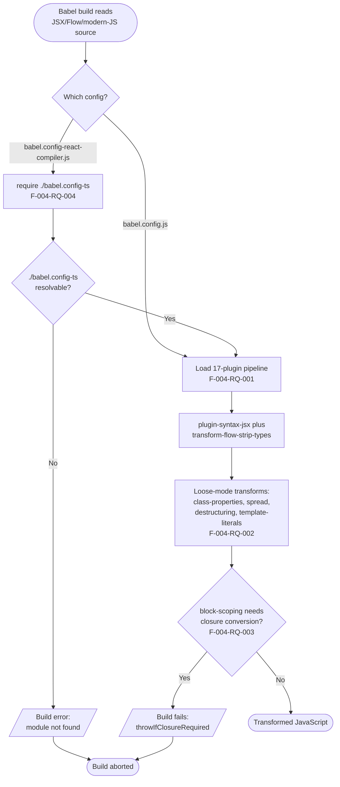

The React Compiler variant (`babel.config-react-compiler.js`) re-exports the plugin set from `./babel.config-ts`; because that module is absent, resolving it raises a module-not-found error. The base pipeline configures `@babel/plugin-transform-block-scoping` with `throwIfClosureRequired: true`, which deliberately aborts the build when a closure conversion would otherwise be required.

### 4.1.4 Integration Workflows

Integration in this repository is limited to (a) the composition/fetch of submodules from GitHub, (b) the documented external API/auth interactions of F-001, and (c) two documented package-provisioning integrations. There is **no internal service-to-service integration**, because there are no runnable services.

#### 4.1.4.1 Data Flow Between Systems

The diagram below shows how data crosses the local and external system boundaries. Documented-only elements are labeled as such.

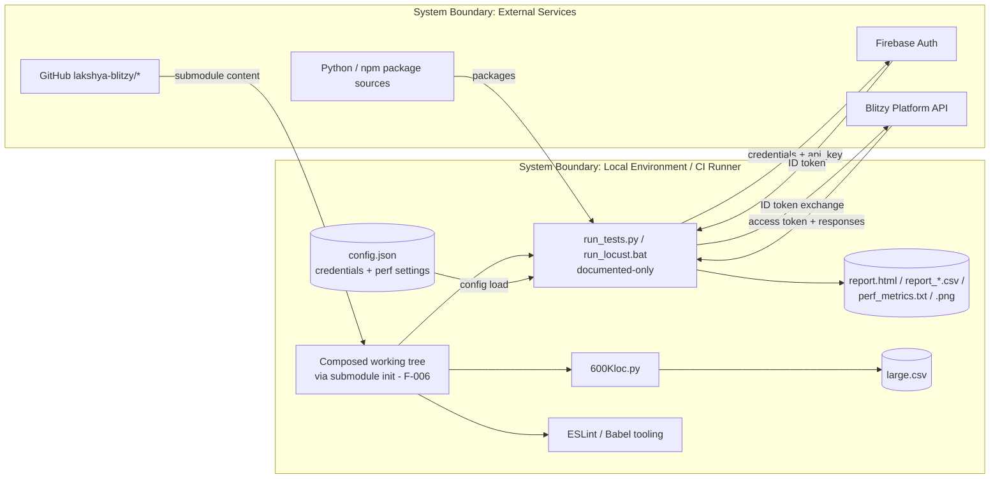

The only bidirectional external data exchanges are with Firebase (credentials in, ID token out) and the Blitzy Platform API (ID token/requests in, access token/responses out), both documented for F-001. GitHub delivers submodule content one-way into the working tree (F-006). Package sources deliver dependencies one-way (F-001/F-002).

#### 4.1.4.2 API Interaction Sequence (F-001, documented-only)

The sequence diagram below details the documented request/response choreography of the API performance framework. Each participant is a swim lane. This is the integration sequence for the documented Firebase → Platform authentication chain (Email/Password → Firebase → ID Token → Platform → Access Token) and the subsequent parallel load phase.

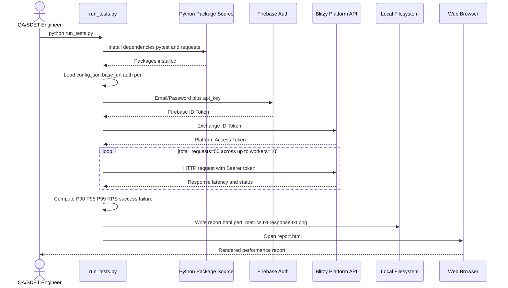

#### 4.1.4.3 Batch Processing Sequences

Three processes exhibit batch (fixed-iteration or fixed-profile, run-to-completion) semantics; none is scheduled or event-triggered — each is invoked manually:

| Batch Process | Trigger | Batch Unit | Termination | Requirement |
|---|---|---|---|---|
| CSV generation (F-005) | Manual `python 600Kloc.py` | 600,000 sequential row writes | Loop exhausts `range(600000)`; file closed | F-005-RQ-001 |
| Locust load run (F-002, documented) | Manual double-click | Fixed profile `-u 1 -r 1 -t 10s` (10-second bounded run) | Duration elapses; reports written | F-002-RQ-004/005 |
| API performance run (F-001, documented) | Manual `python run_tests.py` | `total_requests=50` dispatched over `workers=10` | All requests complete; metrics computed | F-001-RQ-004/005 |
| Submodule fetch (F-006) | Manual recursive init | Per-submodule fetch/checkout across 3 levels | All pinned commits checked out | F-006-RQ-003 |

#### 4.1.4.4 Event Processing Flows

**None evident.** No file in the repository defines an event source, message broker, queue, listener, scheduler (cron/timer), or webhook handler. The performance tools operate as synchronous, run-to-completion batch processes (§4.1.4.3), and the CSV generator is a single synchronous loop. Any event-driven behavior would be unsupported by the repository's contents and is therefore not documented.

## 4.2 Flowchart Requirements and Validation Rules

This section catalogs, for every workflow in §4.1, the required flowchart elements (start/end points, decision diamonds, system boundaries, user touchpoints, error states) and the validation rules that gate each step. All validation content is grounded in the requirement tables of §2.2; where the repository declares nothing for a validation dimension, that is stated explicitly rather than inferred.

### 4.2.1 Workflow Element Inventory

The table below enumerates the start point, terminal end points, and decision diamonds for each documented workflow.

| Workflow (Feature) | Start Point | End Point(s) | Decision Diamonds |
|---|---|---|---|
| Submodule composition (F-006) | Clone parent superproject | 3-level tree composed / incomplete tree | Recursive init requested?; Run init later?; GitHub reachable & commits resolve? |
| API performance run (F-001) | `python run_tests.py` | HTML report opened / run failed | config valid?; Firebase ID token?; Platform access token?; status_code == 200? |
| Locust load run (F-002) | Double-click `run_locust.bat` | "Test finished" / unsupported OS / no-internet | Windows 10/11?; Python installed?; Internet available? |
| CSV generation (F-005) | `python 600Kloc.py` | `large.csv` with 600,000 rows | Loop `i in range(600000)`? |
| ESLint lint (F-003) | ESLint runs on a file | Lint result / file skipped | Path matches `.eslintignore`?; Path matches override glob? |
| Babel transform (F-004) | Babel reads source | Transformed JavaScript / build aborted | Which config?; `./babel.config-ts` resolvable?; closure conversion required? |

The complementary table below records the system boundaries crossed, the user touchpoints, and the error states for each workflow.

| Workflow (Feature) | System Boundaries Crossed | User Touchpoint(s) | Error States |
|---|---|---|---|
| F-006 | Local ⇄ GitHub (HTTPS) | CLI `git clone` / `git submodule update` | Fetch error → submodule content missing |
| F-001 (documented) | Local ⇄ Firebase, Local ⇄ Platform API, Local ⇄ package source | CLI invocation; browser-rendered report | Missing/invalid config; authentication error |
| F-002 (documented) | Local ⇄ package/runtime download source | Double-click; console "Test finished"; browser report | Unsupported OS; first-run download impossible |
| F-005 | Local filesystem only | CLI invocation | Unhandled exception on filesystem write failure |
| F-003 | Node.js toolchain (local) | Lint diagnostics in editor/CI | Unresolved `./scripts/shared/pathsByLanguageVersion` (config load) |
| F-004 | Node.js toolchain (local) | Build output | `module not found` (`./babel.config-ts`); `throwIfClosureRequired` abort |

### 4.2.2 Business and Data Validation Checkpoints

The following validation rules apply at the indicated steps (transcribed from the Validation Rules tables in §2.2). "None declared" indicates the repository specifies no rule for that dimension.

| Requirement | Business Rule at Step | Data Validation |
|---|---|---|
| F-001-RQ-001 | `config.json` must supply all documented keys before a run proceeds | Keys `base_url`, `auth.{email,password,api_key}`, `project.project_id`, `perf.{total_requests,workers}` must be present |
| F-001-RQ-003 | Authentication must succeed before test execution (hard gate) | Firebase → Platform token exchange must yield a usable access token |
| F-001-RQ-005 | Each response is classified success vs. failure | Response status inspected per request |
| F-001-RQ-008 | Functional pass requires HTTP 200 | Assertion `status_code == 200` |
| F-002-RQ-004 | Run-profile flags must be valid Locust arguments | `-u 1 -r 1 -t 10s` (editable in the batch file) |
| F-002-RQ-005 | Reports directory populated after run; prior history not auto-preserved | Output files written under `report/`, overwriting prior copies |
| F-002-RQ-006 | Host platform must be Windows 10/11 | OS precondition checked before proceeding |
| F-003-RQ-001 | Package JavaScript must satisfy React-internal rules (e.g., production error codes, safe string coercion) | Rule set applied by `hermes-eslint`/plugins |
| F-003-RQ-003 | Correct parser and rule set must apply per language version | Path matched against `es5Paths`/`esNextPaths`/toolchain globs |
| F-003-RQ-005 | Files must conform to editor conventions | UTF-8, LF, 2-space indent, final newline, 80-col |
| F-004-RQ-001 | Transform output must preserve intended runtime semantics | JSX parsed, Flow stripped, modern-JS lowered |
| F-004-RQ-004 | Compiler variant must avoid the documented Zod/loose-spread and block-scoping failures | Reuses minimal plugin set from `./babel.config-ts` |
| F-005-RQ-001 | No input validation — the script accepts no parameters | Hard-coded `range(600000)`; no validation |
| F-005-RQ-002 | No error handling for filesystem failures | Mode `"w"` truncate; failure surfaces as exception |
| F-006-RQ-001 | Declared submodule paths/URLs must resolve to real repositories | `.gitmodules` stanzas validated at fetch time |
| F-006-RQ-003 | Pinned commits must exist in each child | Recursive checkout at pinned SHAs |

### 4.2.3 Authorization Checkpoints

Authorization controls are present in only two workflows; the remaining workflows declare none.

| Workflow | Authorization Checkpoint | Mechanism | Evidence |
|---|---|---|---|
| F-001 (documented) | No anonymous access to the Platform; auth must precede testing | Token-based: Firebase `api_key` + Email/Password → Firebase ID Token → Platform Access Token; subsequent requests carry auth headers via `headers()` | §2.2.1 Validation Rules; `README (2).md` |
| F-006 | Fetch of submodule content | HTTPS retrieval from `github.com/lakshya-blitzy/*` (implies trust in those remotes) | §2.4.6; root & `child_1` `.gitmodules` |
| F-002, F-003, F-004, F-005 | None | No authorization controls are declared for the local batch/lint/build/data-generation workflows | §2.2.2–§2.2.5 ("None declared") |

**Secret handling note:** For F-001, credentials (email, password, Firebase `api_key`) are documented as residing in `config.json` in plaintext (placeholders only); **no secret-management mechanism is documented** (§2.4.1).

### 4.2.4 Regulatory Compliance Checks

**No regulatory compliance requirements are declared anywhere in the repository.** Every Validation Rules table in §2.2 (F-001 through F-006) records "None declared" for the Compliance dimension. The only repository-native "compliance-like" controls are engineering policies, not regulatory ones:

- The ESLint policy (F-003) encodes **repo-defined React-internal engineering rules** (production error codes, banned `WithStatement`, safe string coercion) — a code-hygiene control, not a runtime security or regulatory control (§2.2.3, §2.4.3).
- The F-004 React Compiler workaround is governed by a **temporary code-comment "HACK"** to be removed once `eslint-plugin-react-hooks` moves into the compiler directory (§2.2.4) — a maintenance convention, not a compliance check.
- The `.blitzyignore` (`*.csv`) is a **repository-inspection policy** that excludes generated CSV outputs (including F-005's `large.csv`) from documentation; it is not a regulatory data-handling control.

### 4.2.5 Timing and SLA Considerations

Consistent with §1.2.3 and §2.4, **the repository defines no numeric latency budget, throughput target, or pass/fail SLA.** The only timing-related parameters and the single explicit pass condition are documented values, not service-level agreements:

| Parameter | Documented Value | Nature | Source |
|---|---|---|---|
| Locust run duration | 10 seconds (`-t 10s`) | Fixed run-profile timing constraint (editable) | `child_1/README.md` (F-002-RQ-004) |
| Locust ramp-up / users | ramp-up 1, 1 user (`-r 1 -u 1`) | Fixed run-profile constraint | `child_1/README.md` |
| F-001 concurrency | `workers = 10` over `total_requests = 50` | Documented example configuration | `README (2).md` (F-001-RQ-004) |
| Latency metrics | P90, P95, P99, Mean, Median, Min, Max, RPS | **Reported** metrics — no threshold attached | `README (2).md` (F-001-RQ-005) |
| Functional pass condition | `status_code == 200` | The only explicit pass/fail criterion in the repository | `README (2).md` (F-001-RQ-008) |
| Submodule fetch time | Undefined | Depends on child sizes and network conditions | §2.4.6 |

**Explicit note:** The performance framework *reports* percentile and throughput metrics but attaches **no numeric latency budget or SLA** against them; any additional timing targets would be unsupported by the repository's contents.

## 4.3 Technical Implementation Flows

This section documents the state-management and error-handling flows that underpin the workflows in §4.1. Because the repository contains no database, no long-running service, and no session/user-state layer (§1.2, §2.3), state is limited to transient per-run process lifecycles, Git submodule state, and output-file existence; error handling is correspondingly minimal. Both dimensions are documented exactly as evidenced — absent mechanisms are named as absent.

### 4.3.1 State Management

#### 4.3.1.1 State Transitions

Three workflows have a meaningful state lifecycle. The state-transition diagrams below capture each.

**F-001 API performance run lifecycle** (documented-only; per `README (2).md` and F-001-RQ-002/003/005):

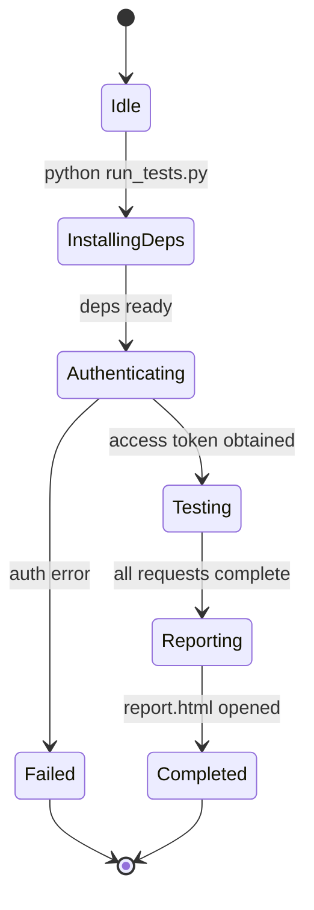

**F-006 submodule state** (per `.gitmodules` and F-006-RQ-003):

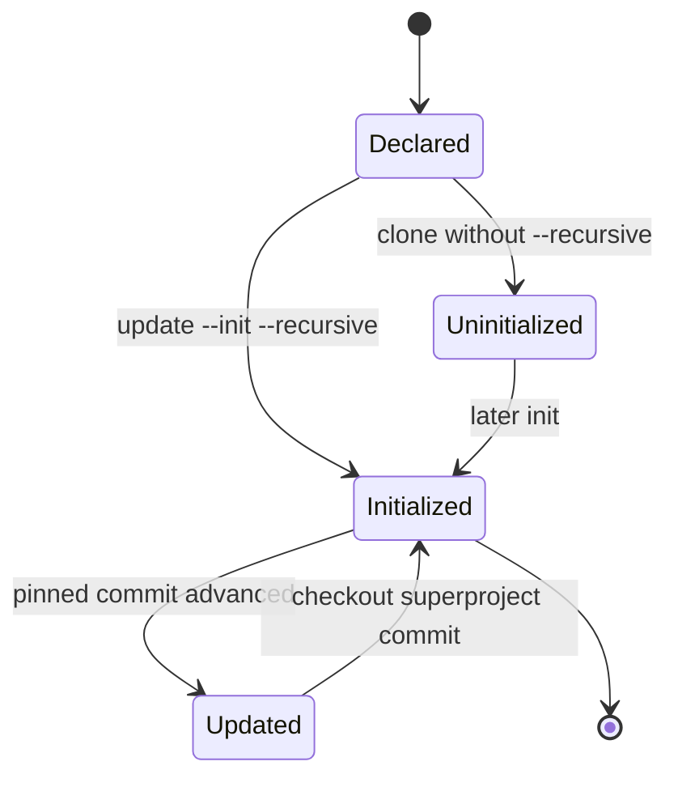

**F-005 output-file lifecycle** (per `600Kloc.py` and F-005-RQ-002):

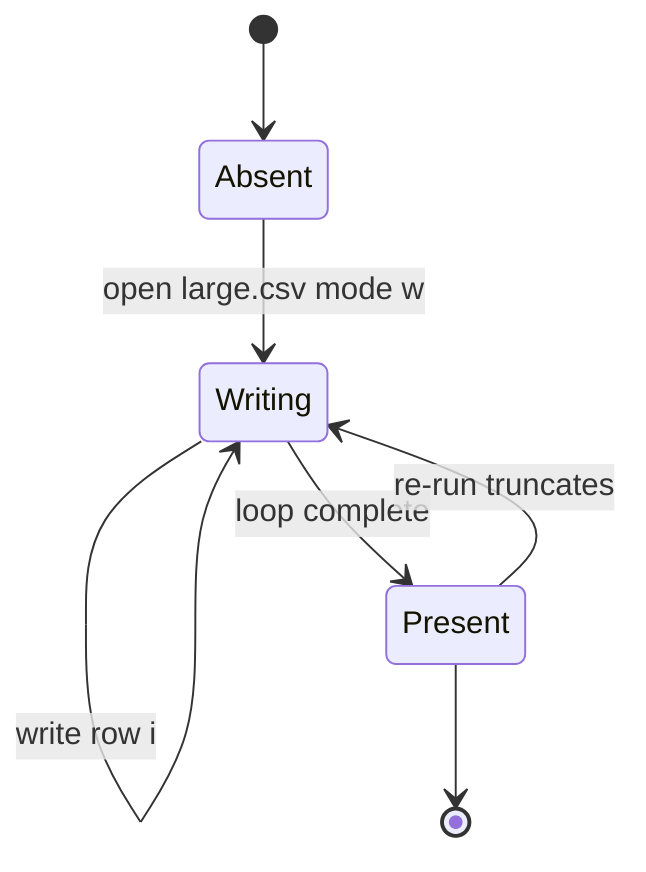

**F-003/F-004 (developer tooling)** are **stateless** transformations: ESLint reads a file and emits diagnostics; Babel reads source and emits transformed output. Neither maintains persistent state between invocations.

#### 4.3.1.2 Data Persistence Points

| Persistence Point | Produced By | Lifecycle | Evidence |
|---|---|---|---|
| `config.json` | User-provided input (documented) | Read at run start; not written by the tool | `README (2).md` |
| `report.html`, `perf_metrics.txt`, `response.txt`, `.png` graphs | F-001 (documented) | Written under `reports/` per run | `README (2).md` |
| `report_stats.csv`, `report_failures.csv`, `report_requests.csv`, `report.html` | F-002 (documented) | Written under `report/`, **overwritten** each run | `README.md` |
| `large.csv` | F-005 | Truncated and fully rewritten each run | `600Kloc.py` |
| Submodule working data (`.git/modules/...` gitlinks) | F-006 | Persists fetched child content locally after init | root & `child_1` `.gitmodules` |
| ESLint diagnostics / Babel output | F-003 / F-004 | Transient (stream to stdout / build output); not persisted by config | `.eslintrc.js`, `babel.config.js` |

#### 4.3.1.3 Caching Requirements

**No application-level caching is defined in the repository.** There is no in-memory cache, no cache server (e.g., Redis), no CDN, and no memoization layer in any file. The only forms of local persistence that resemble caching are external tooling behaviors, not repository-defined caches:

- Git stores fetched submodule content under `.git/modules/...`, so re-initialization does not necessarily re-download unchanged content (a Git mechanism, not a repo-defined cache).
- The documented auto-install steps (F-001/F-002) may reuse a package manager's own download cache (external tooling behavior).

Any additional caching behavior would be unsupported by the repository's contents.

#### 4.3.1.4 Transaction Boundaries

**No database or ACID transactions exist** (there is no datastore). The only run-scoped "units of work" are filesystem and Git operations, and none carries transactional (atomic/rollback) guarantees:

| Boundary | Unit of Work | Guarantee | Evidence |
|---|---|---|---|
| F-005 file write | `open("large.csv","w")` → write-loop → implicit close | None: a crash mid-loop leaves a partial file (no atomic rename) | `600Kloc.py` |
| F-002 report write (documented) | Whole `report/` directory rewritten per run | Prior reports are overwritten; no history retained | `README.md` |
| F-006 commit pinning | Superproject commit records each child's pinned SHA | Git-level atomic pointer update; recursive checkout restores pinned state | `.gitmodules`; git history |

### 4.3.2 Error Handling

Error handling across the repository is **minimal and largely manual**. There is no centralized error framework, no structured logging, and no alerting/monitoring integration in any file. The consolidated flow and matrices below document the actual behavior.

#### 4.3.2.1 Consolidated Error-Handling Flow

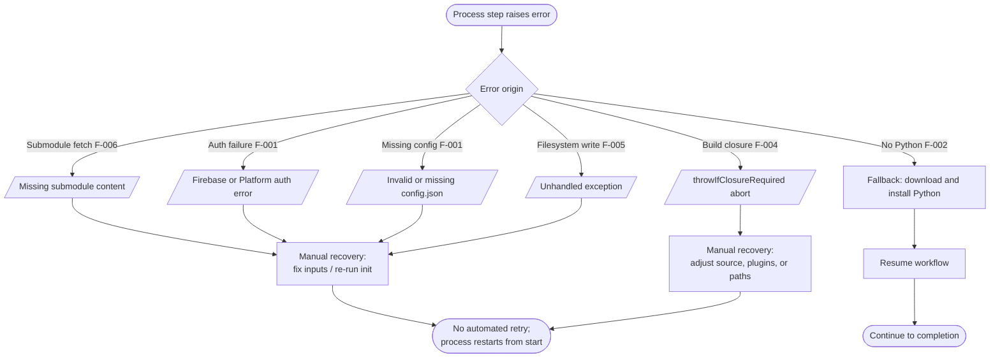

The single automated recovery path in the entire repository is F-002's Python-provisioning fallback; every other error terminates the process and requires manual intervention.

#### 4.3.2.2 Error-Handling Dimension Matrix

| Dimension | Evident in Repository? | Detail |
|---|---|---|
| Retry mechanisms | **No** | No retry, back-off, or re-attempt logic appears in any file or documentation |
| Fallback processes | **Partial (one)** | F-002 only: if Python is absent, the batch script downloads and installs it (F-002-RQ-002); no other fallback exists |
| Error notification flows | **Console only** | F-002 prints a "Test finished" message; F-001 surfaces a "failed run"; there is no alerting, email, webhook, or monitoring integration |
| Recovery procedures | **Manual only** | Re-run the command; for F-006, re-run `git submodule update --init --recursive`; no automated rollback or self-healing |

#### 4.3.2.3 Per-Workflow Error Behavior

| Workflow | Error Trigger | Behavior | Recovery |
|---|---|---|---|
| F-006 | GitHub unreachable / commit missing | Fetch error; incomplete working tree | Manual re-run of recursive init |
| F-001 (documented) | Missing/invalid `config.json` | Run fails before authentication | Fix config; re-run |
| F-001 (documented) | Firebase/Platform auth failure | Run fails at the auth gate (before testing) | Fix credentials; re-run |
| F-002 (documented) | Python absent | **Fallback**: download & install Python, then continue | Automatic (requires internet) |
| F-002 (documented) | Non-Windows OS / no first-run internet | Run cannot proceed | Use Docker version / provide connectivity |
| F-004 | `./babel.config-ts` absent (compiler variant) | `module not found`; build error | Provide the absent module |
| F-004 | Closure conversion required | Build aborts (`throwIfClosureRequired: true`) | Adjust source/plugins |
| F-005 | Filesystem write failure | Unhandled exception (no `try/except`) | Re-run script |
| F-003 | `./scripts/shared/pathsByLanguageVersion` absent | Config fails to load standalone | Provide the absent module |

**Summary:** The repository's error posture is *fail-fast with manual recovery*. This is consistent with its nature as a composition of configuration and documentation artifacts rather than a resilient runtime system (§1.2, §2.4).

## 4.4 References

The following repository files, folders, and technical-specification sections were examined as evidence for the workflows, diagrams, validation rules, state models, and error-handling flows documented in Section 4.

**Files examined**

- `.blitzyignore` - Established the `*.csv` inspection-exclusion policy honored throughout (F-005 `large.csv`, F-002 `report_*.csv` referenced by documented name only).
- `.gitmodules` - Root submodule declarations for `child_1_repo_4487_fourth_case` and `child_2_repo_4487_fourth_case`; basis for the F-006 composition/initialization flow and the high-level workflow entry point.
- `.eslintrc.js` - Root ESLint policy (659 lines): parser `hermes-eslint` (ES9/script), 8 plugins, `root: true`, severity constants, and the eighteen path-scoped override blocks (`es5Paths`, `esNextPaths`, `packages/**/*.js`, TypeScript, React Hooks) that ground the F-003 override-resolution flow.
- `.eslintignore` - Ignore patterns feeding the "path matches `.eslintignore`?" decision in the F-003 flow.
- `.editorconfig` - Editor-convention data validation (UTF-8, LF, 2-space, 80-col) cited in §4.2.2.
- `README.md` (root) - Confirmed the superproject is a title-only aggregation (no application entry point).
- `child_1_repo_4487_fourth_case/README.md` - Source for the F-002 One-Click Locust Load Test workflow (Python-provisioning fallback, `-u 1 -r 1 -t 10s`, `report/` outputs) and its validation/timing rules.
- `child_1_repo_4487_fourth_case/README (2).md` - Source for the F-001 API Performance Test Framework workflow, the Firebase → Platform auth sequence, `ThreadPoolExecutor` concurrency (`workers=10`, `total_requests=50`), reported metrics (P90/P95/P99/RPS), and the `status_code == 200` pass condition.
- `child_1_repo_4487_fourth_case/.eslintrc.js` - Byte-identical copy of the root ESLint policy (F-003 duplication across submodule levels).
- `child_1_repo_4487_fourth_case/.gitmodules` - Declares the nested `Nested_child_repo_4487_fourth_case` submodule (third level of the F-006 flow).
- `child_1_repo_4487_fourth_case/Nested_child_repo_4487_fourth_case/600Kloc.py` - The only runnable executable; complete source for the F-005 CSV-generation flow, output-file state diagram, and its "no validation / no error handling" characterization.
- `child_2_repo_4487_fourth_case/babel.config.js` - The 17-plugin pipeline (JSX, Flow-strip, loose-mode transforms, `block-scoping` with `throwIfClosureRequired: true`) grounding the F-004 transform flow.
- `child_2_repo_4487_fourth_case/babel.config-react-compiler.js` - React Compiler variant that `require`s the absent `./babel.config-ts`; basis for the F-004 `module not found` error branch.
- `child_2_repo_4487_fourth_case/.watchmanconfig` - Empty (`{}`) file-watching configuration; confirmed no watch/event triggers exist (supports the "no event processing" finding).

**Folders examined**

- `` (repository root) - Git superproject / configuration-oriented root; established the overall composition and the absence of any application-source directory.
- `child_1_repo_4487_fourth_case/` - Performance-testing documentation (F-001, F-002) plus a React ESLint copy; confirmed the referenced implementation files (`run_tests.py`, `config.json`, `locustfile.py`, `run_locust.bat`, `tests/`) are absent.
- `child_1_repo_4487_fourth_case/Nested_child_repo_4487_fourth_case/` - Data-generation utility submodule (F-005).
- `child_2_repo_4487_fourth_case/` - Babel build-transformation and Watchman configuration submodule (F-004).

**Repository metadata examined**

- Git history on branch `1507_01` - Composition commits ("Add child repositories as submodules", "Update child_1 to latest nested submodule") corroborating the F-006 submodule-state transitions.

**Technical Specification sections cross-referenced**

- `1.2 System Overview` - Confirmed the repository is a non-deployable Git superproject; source of the submodule topology, documented-vs-absent component table, and the "no numeric SLA" success-criteria framing.
- `2.1 Feature Catalog` - Authoritative feature taxonomy (F-001–F-006), statuses (documented-only vs. present), and assumptions (A-2, A-5) used to label each workflow.
- `2.2 Functional Requirements` - Requirement IDs (`F-XXX-RQ-YYY`), baseline F-001/F-002 flow diagrams, and the Validation Rules transcribed into §4.2.
- `2.3 Feature Relationships` - Confirmed feature independence, integration points (Firebase → Platform API, GitHub, package sources), and the explicit absence of event/downstream-consumer relationships.
- `2.4 Implementation Considerations` - Per-feature technical constraints, security implications (plaintext credentials), and the repeated "no SLA / no caching declared" findings used in §4.2.5 and §4.3.

# 5. System Architecture

## 5.1 High-Level Architecture

This section establishes the architectural frame for `parent_repo_4487_fourth_case`. As established in §1.2 System Overview and §2.1 Feature Catalog, the repository is **not a single deployable application**; it is a Git superproject (branch `1507_01`, HEAD commit `ae40cd5`) that composes independently versioned artifacts through a three-level submodule hierarchy. The architecture therefore describes a *repository-composition and tooling* system rather than a running service topology. Every element below is grounded in the observed file inventory; where the architecture template anticipates a construct that the repository does not contain (a runtime service, a datastore, a message bus), that absence is stated explicitly rather than inferred.

### 5.1.1 System Overview

#### 5.1.1.1 Architecture Style and Rationale

The system implements a **composition-by-Git-submodules** architecture: a thin superproject binds two direct child repositories, one of which nests a further submodule, without merging their contents into a single codebase. This is an *aggregation* style — closer to a mono-repo-of-references than to a service-oriented or layered runtime architecture. The composition is declared in `.gitmodules` at the root (`child_1_repo_4487_fourth_case`, `child_2_repo_4487_fourth_case`) and in `child_1_repo_4487_fourth_case/.gitmodules` (`Nested_child_repo_4487_fourth_case`), and each child is pinned at a specific commit (`git submodule status` reports `child_1` at `31eaf8ee…` and `child_2` at `f2bfcd6f…`).

The rationale that the evidence supports is:

- **Independent versioning without code merge.** Each artifact cluster (root tooling policy, performance-testing documentation, build/watch configuration, data-generation utility) evolves in its own repository and is bound at a pinned commit, so the superproject records a reproducible snapshot without absorbing the children's history.
- **Aggregation of heterogeneous concerns.** The children carry unrelated toolchains — a React-derived JavaScript lint/build policy and Python performance-testing documentation — that share no code-level dependency (§2.3). Submodules keep them isolated while making them retrievable in a single recursive clone.
- **Configuration and documentation as the primary deliverable.** The substantive committed material is declarative configuration (`.eslintrc.js`, `babel.config.js`, `.editorconfig`, `.watchmanconfig`) and prose specifications (the `child_1` READMEs), not application source. The architecture optimizes for *carrying and pinning* these artifacts rather than executing them.

#### 5.1.1.2 Key Architectural Principles and Patterns

The following principles are evident directly from the committed files:

- **Composition over integration.** The superproject aggregates rather than integrates: there is no build step that fuses the children, and §2.3 confirms no inter-feature code dependency. The only binding mechanism is Git's submodule gitlink.
- **Pinned-version immutability.** Each submodule is checked out at a superproject-recorded SHA; advancing a child is an explicit commit on the superproject (git history includes "Update child_1 to latest nested submodule").
- **Configuration-as-artifact.** Tool policies are committed as declarative modules consumed by *external* toolchains (ESLint, Babel, Watchman); the repository ships no engine to run them.
- **Separation of concerns by submodule.** Root owns lint/editor policy; `child_1` owns performance-testing documentation and (via its nested submodule) the CSV utility; `child_2` owns build/watch configuration.
- **Documentation-as-contract.** For F-001 and F-002, the READMEs are the specification; the implementing sources (`run_tests.py`, `config.json`, `locustfile.py`, `run_locust.bat`) are absent, so the documented behavior is a contract rather than verified runtime behavior (§1.3.2, §2.1.1 A-2).
- **Fail-fast with manual recovery, no runtime state.** There is no long-running service, session store, or datastore; the only automated recovery path anywhere is F-002's Python-provisioning fallback (§4.3.2).

#### 5.1.1.3 System Boundaries and Major Interfaces

The **system boundary** is the superproject working tree together with its three initialized submodule working trees. Everything reached over the network — GitHub, and the documented Firebase and Blitzy Platform endpoints — is external. The major interfaces that cross this boundary are:

- **Version-control interface (present):** Git submodule fetch/checkout over HTTPS against `github.com/lakshya-blitzy/*`.
- **Command-line tool-invocation interface (present):** ESLint and Babel consume the committed configuration; a Python 3 interpreter runs `600Kloc.py`.
- **Filesystem interface (present):** flat-file output to the local working directory (`large.csv` and, for the documented tools, report artifacts).
- **Documented HTTPS/REST + token interfaces (documented-only):** Firebase identity exchange and Bearer-token requests to the Blitzy Platform API for F-001.
- **Local service interface (expected):** the empty `.watchmanconfig` signals that the build toolchain expects the Watchman file-watching service.

The system-context view below shows the boundary, the human actors, and the external systems each interface reaches. It is an interface/context view and is deliberately distinct from the ownership topology in §1.2.2.

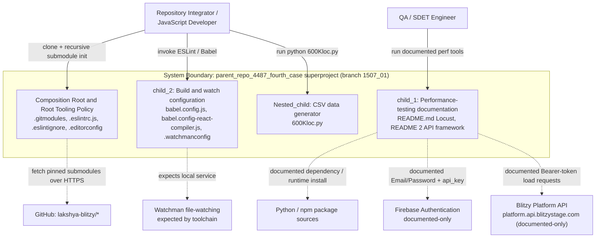

### 5.1.2 Core Components

The system decomposes into five architectural components: the composition root plus one component per artifact cluster. These map onto the feature catalog (§2.1) as annotated. Because the prompt's five attributes exceed the four-column limit, the component descriptors are split across two tables that share the **Component** key.

**Table A — Responsibility and Dependencies**

| Component | Primary Responsibility | Key Dependencies |
|---|---|---|
| Composition Root (superproject; F-006) | Declare and pin the two direct submodules and, transitively, the nested submodule; own root lint/editor policy | Git with submodule support; GitHub (`lakshya-blitzy/*`) |
| Code-Quality Policy (F-003) | Encode the 659-line ESLint policy (18 path-scoped overrides) and editor conventions | Node.js/ESLint, `hermes-eslint`, 8 ESLint plugins, `prettier`, `eslint-plugin-jest`; absent `./scripts/shared/pathsByLanguageVersion` |
| Performance-Testing Documentation (F-001, F-002) | Specify the API performance framework and the one-click Locust runner as prose contracts | Documented: Python/`pytest`/`requests`/`ThreadPoolExecutor`, Locust; Firebase; Blitzy Platform API |
| CSV Test-Data Generator (F-005) | Deterministically generate a 600,000-row `large.csv` | Python 3 standard library; local filesystem write access |
| Build and Watch Configuration (F-004) | Define the 17-plugin Babel JSX/Flow + modern-JS transform pipeline and signal Watchman | Node.js, `@babel/core` + configured plugins; absent `./babel.config-ts`; Watchman |

**Table B — Integration Points and Critical Considerations**

| Component | Integration Points | Critical Considerations |
|---|---|---|
| Composition Root (F-006) | Root `.gitmodules`; `child_1/.gitmodules`; gitlinks under `.git/modules/…` | Hard prerequisite for every other component; a non-recursive or offline clone leaves an incomplete tree |
| Code-Quality Policy (F-003) | Consumed by ESLint over a JS/React source tree; `.editorconfig` by editors | Not executable standalone here (references an absent module and an absent `packages/*` tree); root and `child_1` copies must stay byte-identical |
| Performance-Testing Documentation (F-001, F-002) | Documented HTTPS to Firebase and Blitzy Platform; documented package/runtime provisioning | Implementation source absent, so behavior is contractual only; documented secrets held in plaintext `config.json` |
| CSV Test-Data Generator (F-005) | Writes `large.csv` to the current working directory | Only fully runnable artifact; truncates prior output; no path validation or error handling; output excluded by `.blitzyignore` |
| Build and Watch Configuration (F-004) | Consumed by a Babel build pipeline; `.watchmanconfig` by Watchman | Base config present; the React-compiler variant fails to resolve because `./babel.config-ts` is absent; `throwIfClosureRequired: true` aborts on required closure conversion |

### 5.1.3 Data Flow Description

Because there is no runtime service, no database, and no message broker (§3.5, §4.1.4.4), data flow in this system is limited to (a) version-control content delivery, (b) command-line tool input/output, (c) local file generation, and (d) the documented external exchanges of the performance tools. There is no internal service-to-service data flow.

**Primary data flows.** The foundational flow is one-way delivery of submodule content: GitHub streams each pinned child repository into the composed working tree during recursive initialization (F-006). Once the tree is composed, three independent, manually invoked flows exist. First, the ESLint policy is read by the Node.js toolchain, which consumes a JavaScript/React source file and emits diagnostics (a read-only analysis flow, no source mutation). Second, the Babel configuration drives a transform flow in which JSX/Flow/modern-JS source is read and transformed JavaScript is emitted. Third, `600Kloc.py` produces a generative flow that streams 600,000 rows to `large.csv`. The documented F-001 flow is bidirectional with two external systems: credentials flow out to Firebase and an ID token returns; that ID token flows to the Blitzy Platform, which returns an access token; authenticated requests then flow out and latency/status responses return, after which computed metrics and report artifacts are written to disk. The documented F-002 flow provisions a runtime from package sources and writes report files.

**Integration patterns and protocols.** Four distinct patterns are present or documented: (1) **Git-over-HTTPS** submodule fetch (present); (2) **CLI invocation** of ESLint, Babel, and the Python interpreter, in which configuration and source files are the inputs (present); (3) **local file I/O** to the working directory (present for F-005, documented for F-001/F-002 outputs); and (4) **documented HTTPS/REST with Bearer-token authorization** for the Firebase→Platform exchange (documented-only). No RPC, GraphQL, WebSocket, event, or queue protocol appears anywhere in the tree.

**Data transformation points.** The identifiable transformation points are: Babel, which transforms JSX/Flow/modern-JS source into runtime JavaScript (F-004); `600Kloc.py`, which transforms loop indices into CSV rows of the form `{i},Sample Data {i}` (F-005); and — documented only — the F-001 framework, which reduces per-request latency and status samples into aggregate statistics (mean/median/min/max, P90/P95/P99, RPS, success/failure counts). ESLint is explicitly a non-transforming point: it analyzes and reports without mutating source.

**Key data stores and caches.** There is **no database and no cache** of any kind (§3.5.1, §3.5.2, §4.3.1.3). The entire persistence surface is the local filesystem: `large.csv` (generated by F-005; excluded from inspection by `.blitzyignore`), and — for the documented tools — `report/`/`reports/` artifacts (`report.html`, `report_*.csv`, `perf_metrics.txt`, `response.txt`, latency `.png` graphs), none of which are committed. The only store-like construct in the committed system is Git's local object store under `.git/modules/…`, which retains fetched submodule content so re-initialization need not re-download unchanged data — a Git mechanism, not a repository-defined cache.

### 5.1.4 External Integration Points

The external systems the repository actually integrates with, documents, or expects are enumerated below. Only GitHub is *actually integrated*; Firebase, the Blitzy Platform API, and the package sources are *documented-only* integrations of the absent performance tools; Watchman is *expected* by the committed build tooling. Consistent with §1.2.3, §3.4.4, and §4.2, the repository defines **no numeric SLA, latency budget, or availability target** for any of them. The five prompt attributes are split across two tables sharing the **System** key.

**Table A — Integration Type and Exchange Pattern**

| System | Integration Type | Data Exchange Pattern |
|---|---|---|
| GitHub (`lakshya-blitzy/*`) | Source-control / submodule host (present) | One-way pull of pinned submodule content on recursive init |
| Blitzy Platform API (`platform.api.blitzystage.com`) | System-under-test (documented-only) | Request/response; Bearer-token authenticated load requests |
| Firebase Authentication | Identity broker (documented-only) | Credential-for-token exchange (ID token issuance) |
| Python / npm package sources | Runtime/dependency provisioning (documented-only) | One-way download/install of packages and runtimes |
| Watchman | Local file-watching service (expected) | Local file-change notifications to the toolchain |

**Table B — Protocol/Format and SLA**

| System | Protocol / Format | SLA Requirements |
|---|---|---|
| GitHub (`lakshya-blitzy/*`) | Git over HTTPS; submodule gitlinks + `.gitmodules` | None defined in repository |
| Blitzy Platform API | HTTPS/REST; `Bearer` access token; documented pass condition `status_code == 200` | None defined in repository (metrics reported, no budget) |
| Firebase Authentication | HTTPS; Firebase `api_key` + Email/Password → ID token | None defined in repository |
| Python / npm package sources | HTTPS package download/install (documented) | None defined in repository |
| Watchman | Local IPC to the Watchman daemon; `.watchmanconfig` (`{}`) | None defined in repository |


## 5.2 Component Details

This section details each architectural component identified in §5.1.2. For every component it states purpose and responsibilities, the technologies and frameworks it uses, its key interfaces and APIs, its data-persistence requirements, and its scaling considerations. The three architecture diagrams required by the section — a component-interaction diagram, a state-transition diagram, and a sequence diagram for a key flow — are provided in §5.2.1, §5.2.7, and §5.2.8 respectively, and are deliberately drawn from an architecture lens distinct from the process/workflow diagrams in §4. Throughout, F-001 and F-002 are marked *documented-only* because their implementing sources are absent (§1.3.2, §2.1.1 A-2).

### 5.2.1 Component Interaction Model

The components interact along three axes: the composition root *contains and pins* every other artifact; the configuration and utility artifacts are *consumed by* external toolchains; and two configuration artifacts *fail to resolve* against modules that are absent from the checkout. The diagram below layers the components accordingly and renders the unresolved references as dashed edges to explicit "Absent" nodes. There is no runtime edge between the functional components — consistent with §2.3, they share no code-level dependency.

```mermaid
flowchart TB
    subgraph CompLayer["Composition Layer"]
        direction TB
        SP["Superproject F-006<br/>.gitmodules + gitlinks"]
    end
    subgraph ConfigLayer["Tooling-Configuration Layer"]
        direction TB
        ESL["ESLint policy F-003<br/>.eslintrc.js, .eslintignore"]
        EDC["EditorConfig F-003<br/>.editorconfig"]
        BAB["Babel base config F-004<br/>babel.config.js"]
        BABC["Babel react-compiler variant F-004<br/>babel.config-react-compiler.js"]
        WMC["Watchman config F-004<br/>.watchmanconfig"]
    end
    subgraph UtilLayer["Utility Layer"]
        direction TB
        GEN["CSV generator F-005<br/>600Kloc.py"]
    end
    subgraph DocLayer["Documentation / Contract Layer"]
        direction TB
        RM1["Locust runner spec F-002<br/>README.md"]
        RM2["API framework spec F-001<br/>README (2).md"]
    end
    subgraph Consumers["External Toolchains and Systems"]
        direction TB
        NODE["Node.js / ESLint runtime"]
        BABEL["Babel build pipeline"]
        PY["Python 3 runtime"]
        GIT["Git / GitHub"]
        EXT["Firebase + Blitzy Platform + package sources"]
        WM["Watchman daemon"]
    end
    Absent1["Absent module:<br/>scripts/shared/pathsByLanguageVersion"]
    Absent2["Absent module:<br/>babel.config-ts"]

    SP --> ESL
    SP --> EDC
    SP --> BAB
    SP --> BABC
    SP --> WMC
    SP --> GEN
    SP --> RM1
    SP --> RM2
    SP -. "pinned fetch over HTTPS" .-> GIT
    ESL --> NODE
    ESL -. "unresolved require" .-> Absent1
    EDC --> NODE
    BAB --> BABEL
    BABC -. "unresolved require" .-> Absent2
    BABC --> BABEL
    WMC --> WM
    GEN --> PY
    RM1 -. "documented interaction" .-> EXT
    RM2 -. "documented interaction" .-> EXT
```

### 5.2.2 Composition Root — Git Submodule Composition (F-006)

| Aspect | Detail |
|---|---|
| Purpose and responsibilities | Declare and pin the two direct submodules and, transitively, the nested submodule; own the root lint/editor policy; provide a single recursive-clone entry point that materializes the three-level working tree that hosts every other component |
| Technologies and frameworks | Git with submodule support; GitHub hosting; INI-style `.gitmodules` declarations; gitlink pointer files resolving into `.git/modules/…` |
| Key interfaces and APIs | Git CLI (`git submodule update --init --recursive`); root `.gitmodules` (two stanzas: `child_1_repo_4487_fourth_case`, `child_2_repo_4487_fourth_case`) and `child_1/.gitmodules` (one stanza: `Nested_child_repo_4487_fourth_case`); HTTPS transport to `github.com/lakshya-blitzy/*` |
| Data persistence | Pinned child SHAs recorded in the superproject commit (`child_1` at `31eaf8ee…`, `child_2` at `f2bfcd6f…`); fetched child content persisted locally under `.git/modules/…`; no application data |
| Scaling considerations | Scales along submodule count and nesting depth (currently two direct + one nested = three levels); recursive-init time grows with tree size and network latency; no runtime scaling dimension exists |

### 5.2.3 Code-Quality Policy (F-003)

| Aspect | Detail |
|---|---|
| Purpose and responsibilities | Encode a strict, 659-line ESLint policy (severity constants, eight plugins, eighteen path-scoped override blocks) and cross-editor conventions for a JavaScript/React source tree |
| Technologies and frameworks | ESLint in the legacy `.eslintrc.js` format; parsers `hermes-eslint` (ecmaVersion 9, `sourceType: 'script'`), Espree (for `es5Paths`), and `@typescript-eslint/parser`; eight plugins (`babel`, `ft-flow`, `jest`, `es`, `no-for-of-loops`, `no-function-declare-after-return`, `react`, `react-internal`); `extends: ['prettier', 'plugin:jest/recommended']`; EditorConfig |
| Key interfaces and APIs | ESLint configuration resolution with `root: true` (stops upward search); `files:` override globs; `.eslintignore` patterns; module imports of `./scripts/shared/pathsByLanguageVersion` (**absent**) and `confusing-browser-globals` |
| Data persistence | None — stateless analysis; diagnostics stream to the ESLint reporter; no state is retained between invocations |
| Scaling considerations | Policy applies uniformly regardless of source-tree size; ESLint parallelism/caching is an external concern; the root and `child_1` copies are byte-identical and must be kept in sync, so the policy scales in duplication rather than in a single source of truth |

### 5.2.4 Build and Watch Configuration (F-004)

| Aspect | Detail |
|---|---|
| Purpose and responsibilities | Define a 17-entry Babel plugin pipeline that transforms JSX/Flow and modern JavaScript (loose mode where configured); provide a React-Compiler-compatible variant; signal that the toolchain expects Watchman |
| Technologies and frameworks | Babel (`@babel/core` plus the configured plugins, using Babel-7-era plugin naming); `@babel/plugin-syntax-jsx`, `@babel/plugin-transform-flow-strip-types`, loose-mode class-properties/spread/destructuring/template-literals, and `@babel/plugin-transform-block-scoping` with `throwIfClosureRequired: true`; Watchman |
| Key interfaces and APIs | `module.exports.plugins` array consumed by a Babel build; `babel.config-react-compiler.js` re-exports `require('./babel.config-ts').plugins` (**absent** module); `.watchmanconfig` (empty `{}`) consumed by the Watchman daemon |
| Data persistence | None — stateless transform; transformed JavaScript is emitted to the build pipeline and is not persisted by the configuration |
| Scaling considerations | Transform cost scales with source volume (an external Babel concern); the `throwIfClosureRequired` setting intentionally aborts rather than silently degrade; no runtime scaling dimension exists |

### 5.2.5 CSV Test-Data Generator (F-005)

| Aspect | Detail |
|---|---|
| Purpose and responsibilities | Deterministically (re)generate a 600,000-row synthetic CSV fixture whose rows have the form `{i},Sample Data {i}` |
| Technologies and frameworks | Python 3 standard library only — no imports, no third-party dependencies, no configuration |
| Key interfaces and APIs | CLI invocation `python 600Kloc.py`; no command-line arguments or flags; writes `large.csv` in the current working directory. The full implementation is three lines: `with open("large.csv", "w") as f:` / `for i in range(600000):` / `f.write(f"{i},Sample Data {i}\n")` |
| Data persistence | Streams rows to `large.csv` opened in truncate mode (`"w"`), fully replacing any prior file; the output is a `.csv` file and is therefore excluded from inspection by `.blitzyignore`; no other persistence |
| Scaling considerations | Per-row streaming write keeps memory usage constant (O(1)) regardless of row count; the row count is hard-coded to `600000` (no parameterization); single-threaded, run-to-completion, no atomic-rename guarantee (a crash mid-loop leaves a partial file, per §4.3.1.4) |

### 5.2.6 Performance-Testing Framework and Runner (F-001, F-002)

Both capabilities in this component are **documented-only**: their READMEs fully specify intended behavior, but no implementing source is committed. The details below therefore describe the documented contract.

| Aspect | Detail |
|---|---|
| Purpose and responsibilities | F-001 (documented) measures Blitzy Platform API latency and throughput via parallel requests and emits an HTML report with graphs; F-002 (documented) runs a one-click Windows Locust load test that provisions its own runtime |
| Technologies and frameworks | F-001 — Python, `pytest`, `requests`, `ThreadPoolExecutor`, HTML reports, latency graphs; F-002 — Locust, a Windows batch runner (`run_locust.bat`), and auto-provisioned Python |
| Key interfaces and APIs | F-001 — `python run_tests.py` reading `config.json`; documented HTTPS to Firebase (Email/Password + `api_key` → ID token) and to the Blitzy Platform (`Bearer` access token; pass condition `status_code == 200`); F-002 — double-click `run_locust.bat` with the fixed profile `-u 1 -r 1 -t 10s` |
| Data persistence | F-001 (documented) writes `reports/report.html`, `perf_metrics.txt`, `response.txt`, and `.png` latency graphs; F-002 (documented) writes `report/report_stats.csv`, `report_failures.csv`, `report_requests.csv`, and `report.html`, overwriting prior output each run; none of these files are committed |
| Scaling considerations | F-001 concurrency is bounded by `perf.workers` (documented example 10) over `perf.total_requests` (documented example 50); F-002 load is bounded by the `-u`/`-r`/`-t` profile (documented 1 user, 10-second run); no distributed load-generation topology is documented, and behavior is unverifiable because the source is absent |

### 5.2.7 Architectural State Transitions

At the architecture level, the meaningful lifecycle is the **composition readiness** of the superproject working tree — the state that gates every capability. The diagram below captures this readiness lifecycle, including the failure state (unreachable GitHub or missing pinned commit) and the *degraded-standalone* state that results when the present ESLint or Babel-compiler configuration is invoked but cannot resolve an absent module. This is complementary to, and distinct from, the per-feature state diagrams in §4.3.1.1.

```mermaid
stateDiagram-v2
    [*] --> Cloned: git clone superproject only
    Cloned --> CompositionFailed: fetch error, GitHub unreachable or pinned SHA missing
    Cloned --> PartiallyComposed: submodule update --init non-recursive
    Cloned --> FullyComposed: submodule update --init --recursive
    PartiallyComposed --> FullyComposed: recursive init of nested submodule
    CompositionFailed --> FullyComposed: manual re-initialization
    FullyComposed --> Runnable: run 600Kloc.py or read committed configs
    Runnable --> DegradedStandalone: ESLint or Babel-compiler resolves an absent module
    DegradedStandalone --> Runnable: supply the absent module and source tree
    Runnable --> [*]
```

### 5.2.8 Key-Flow Sequence: Recursive Submodule Composition

The single most important flow in the architecture is the recursive composition of the three-level working tree (F-006), because it is the hard prerequisite for every other component (§5.1.2, §4.1.2). The sequence below details the request/response choreography between the integrator, the Git client, GitHub, and the composed working tree. It is the architectural counterpart to the F-006 flowchart in §4.1.3.1 and is distinct from the F-001 API interaction sequence in §4.1.4.2.

```mermaid
sequenceDiagram
    actor Dev as Repository Integrator
    participant Git as Git Client
    participant GH as GitHub lakshya-blitzy
    participant SP as Superproject Working Tree
    Dev->>Git: git clone parent_repo (branch 1507_01)
    Git->>GH: fetch superproject
    GH-->>Git: superproject at ae40cd5 (.gitmodules + gitlinks)
    Git->>SP: checkout superproject (submodule dirs empty)
    Dev->>Git: git submodule update --init --recursive
    Git->>SP: read root .gitmodules (child_1, child_2)
    Git->>GH: fetch child_1 at 31eaf8ee
    GH-->>Git: child_1 content plus its .gitmodules
    Git->>GH: fetch child_2 at f2bfcd6f
    GH-->>Git: child_2 content
    Git->>SP: read child_1/.gitmodules (Nested)
    Git->>GH: fetch Nested_child at pinned commit
    GH-->>Git: Nested content (600Kloc.py)
    Git->>SP: checkout all children at pinned commits
    SP-->>Dev: three-level working tree composed
```


## 5.3 Technical Decisions

This section records the architectural decisions that the repository's contents evidence, together with their rationale and tradeoffs. Because the repository is a composition of configuration and documentation rather than a running application (§1.2, §5.1), most decisions concern *how artifacts are aggregated, configured, and persisted* rather than runtime concerns such as service topology or scaling. Every decision below is inferred from an observed file or a confirmed absence; no decision is attributed that the evidence does not support.

### 5.3.1 Decision Summary

| Decision Area | Choice | Rationale (Evidence) | Key Tradeoff |
|---|---|---|---|
| Architecture style | Composition by Git submodules (aggregation) | Bind independently versioned, heterogeneous artifacts without merging history (`.gitmodules`, pinned SHAs) | Reproducibility vs. recursive-init complexity and no runtime cohesion |
| Communication pattern | Synchronous VCS + CLI + documented REST; no messaging | No services to connect (§4.1.4.4); Git over HTTPS, CLI tool invocation, documented Bearer REST | Simplicity vs. no decoupling/resilience |
| Data storage | Flat files only; no database | No runtime state to persist; only a generated fixture + documented reports (§3.5) | Zero operational overhead vs. no query/index/durability |
| Caching strategy | None (rely on Git object store only) | Nothing recomputed at runtime; generator is one-shot batch (§4.3.1.3) | N/A — no cache needed for present artifacts |
| Security mechanism | HTTPS transport; documented Firebase→Platform token exchange | GitHub over HTTPS (present); token auth for F-001 (documented) | Standard token auth vs. plaintext secrets, no secret manager |
| Build/deploy model | No build/CI/CD/containerization; submodule pinning is the composition mechanism | No manifest/Dockerfile/`.github` present (§3.6) | Minimal footprint vs. no automated build/verify |

### 5.3.2 Architecture Style Decision and Tradeoffs

**Decision.** Aggregate the artifacts as a three-level Git submodule composition rather than as a merged monorepo, a vendored `git subtree`, or a set of published packages. This is directly evidenced by the two `.gitmodules` files, the gitlink pointers into `.git/modules/…`, and the pinned submodule SHAs.

**Rationale.** The children are heterogeneous (a React-derived JS toolchain and Python performance-testing documentation) with independent upstream histories and no code-level dependency (§2.3). Submodules let the superproject pin each child at an exact commit and materialize them in a single recursive clone, preserving each child's identity while producing a reproducible snapshot. A published-package approach was not viable because the repository has no build or publish infrastructure (§3.6.2); a subtree would have vendored the children's content into the superproject history, defeating independent versioning.

**Tradeoffs.**

- **Gains:** reproducible, pinned composition; independent child evolution; single recursive-clone entry point.
- **Costs:** submodules require `--recursive` initialization (a common operational pitfall — a non-recursive or offline clone yields an incomplete tree, §4.1.2); pinned commits must be advanced by explicit superproject commits; there is no runtime cohesion because the composition is structural, not executable.

The decision tree below reconstructs the selection logic and terminates at the chosen mechanism.

```mermaid
flowchart TD
    Q1{Aggregate heterogeneous,<br/>independently-versioned artifacts?}
    Q1 -->|"No, one codebase"| MONO["Plain monorepo<br/>single merged history"]
    Q1 -->|Yes| Q2{Preserve each artifact's<br/>own repository and history?}
    Q2 -->|No| MONO
    Q2 -->|Yes| Q3{Merge child content into<br/>the superproject history?}
    Q3 -->|"Yes, vendored copy"| SUBTREE["git subtree"]
    Q3 -->|"No, reference only"| Q4{Build and publish<br/>infrastructure available?}
    Q4 -->|"Yes, versioned packages"| PKG["Package-registry dependency"]
    Q4 -->|No| SUB["Git submodules<br/>CHOSEN: pinned gitlinks"]
    SUB --> Outcome["Three-level submodule<br/>composition (F-006)"]
```

### 5.3.3 Communication Pattern Choices

**Decision.** Use only synchronous, request/response and batch-invocation interactions; introduce no messaging, event, queue, or RPC layer. This is evidenced by the complete absence of any broker, listener, scheduler, or webhook in the tree (§4.1.4.4) and by the interaction inventory in §5.1.3.

**Rationale.** There are no runnable internal services to connect, so there is nothing to decouple with asynchronous messaging. The three communication patterns that do exist each match their purpose: Git-over-HTTPS delivers submodule content (present); CLI invocation drives the stateless ESLint/Babel tools and the Python generator (present); and documented HTTPS/REST with a `Bearer` token carries the F-001 Firebase→Platform exchange (documented-only).

**Tradeoff.** The synchronous, run-to-completion model is maximally simple and has no infrastructure footprint, but it provides no back-pressure, buffering, retry, or decoupling; any resilience must be supplied manually (§4.3.2). Because there is no service mesh or API gateway, cross-component communication is limited to the shared filesystem and the Git working tree.

### 5.3.4 Data Storage Solution Rationale

**Decision.** Persist exclusively to local flat files; adopt no relational, document, key-value, graph, time-series, or embedded database, and no object/cloud storage. This is evidenced by the absence of any driver, ORM, connection string, schema, or migration (§3.5.1) and by the fact that the only storage producer present is `600Kloc.py`.

**Rationale.** The system holds no long-lived runtime state: the composition root's data is Git metadata; the configurations are stateless; the utility emits a one-shot fixture; and the documented tools write self-contained report files. A database would add operational surface (provisioning, schema, connections, backups) with no data to justify it.

**Tradeoff.** Flat-file persistence carries zero operational overhead and keeps the utility dependency-free, but it provides no querying, indexing, concurrency control, or durability guarantee — for example, `600Kloc.py` writes without an atomic rename, so an interrupted run leaves a partial `large.csv` (§4.3.1.4).

### 5.3.5 Caching Strategy Justification

**Decision.** Implement no caching layer of any kind — no in-process cache, no distributed cache (e.g., Redis/Memcached), no CDN, and no memoization. This is evidenced by §3.5.2 and §4.3.1.3.

**Rationale.** Caching optimizes repeated, expensive computation or I/O in a runtime; this system has none. The generator is a single-pass batch, the tools are invoked ad hoc, and the composition is fetched once. The only cache-like behavior is external and incidental: Git retains fetched submodule content under `.git/modules/…` (so re-initialization need not re-download unchanged data), and a package manager may reuse its own download cache during the documented provisioning steps. Neither is a repository-defined cache.

**Tradeoff.** Omitting a cache removes a class of consistency and invalidation problems at no cost, because there is no hot path to accelerate. Should the documented performance tools ever be implemented, a results/report cache could become relevant, but the repository defines none today.

### 5.3.6 Security Mechanism Selection

**Decision.** Rely on HTTPS transport for the one present integration (GitHub submodule fetch) and, for the documented F-001 framework, on a Firebase→Platform token exchange with `Bearer`-token authorization; adopt no secret-management mechanism. This is evidenced by the `https://` submodule URLs, the documented auth chain in `README (2).md`, and the absence of any vault, encrypted store, or environment-injection scheme.

**Rationale.** GitHub over HTTPS is the standard secure transport for submodule delivery. For the documented API framework, brokering identity through Firebase and exchanging it for a short-scoped platform access token is a conventional token-based pattern that avoids sending raw credentials on every request. No identity provider such as Auth0 and no monitoring/secret service is present (§3.4.4).

**Tradeoffs.**

- The documented design stores the `email`, `password`, and Firebase `api_key` in a plaintext `config.json` (placeholders only in the repo), so a real deployment would keep long-lived secrets in cleartext on disk — a notable weakness with no mitigating secret manager (§3.4.2).
- Because the F-001/F-002 sources are absent, none of these mechanisms is exercised from the repository; they are contractual. The present artifacts (configs, utility) require no authentication because they are local, non-networked operations.

### 5.3.7 Architecture Decision Records (ADRs)

The following ADRs formalize the decisions above in a consistent Context/Decision/Consequences form. Each is grounded in observed evidence and reflects the repository *as captured* on branch `1507_01` at commit `ae40cd5`.

**ADR-001 — Compose Artifacts via Git Submodules**
- **Status:** Accepted (implemented; F-006).
- **Context:** Multiple heterogeneous, independently versioned artifacts must be assembled into one reproducible repository without a build/publish pipeline.
- **Decision:** Bind the children as pinned Git submodules declared across two `.gitmodules` files, producing a three-level hierarchy.
- **Consequences:** Reproducible pinned snapshots and independent child evolution; but recursive initialization is mandatory and a failed/partial init leaves the tree unusable until manually re-initialized.

**ADR-002 — Ship Tool Configuration as Artifacts Without the Governed Source**
- **Status:** Accepted (implemented; F-003, F-004).
- **Context:** The repository carries React-monorepo ESLint/Babel/EditorConfig/Watchman configuration but not the `packages/*` source tree those tools operate on.
- **Decision:** Commit the configuration as declarative artifacts consumed by external toolchains, accepting references to modules that are absent here (`./scripts/shared/pathsByLanguageVersion`, `./babel.config-ts`).
- **Consequences:** The policies are portable and reviewable, but they are not executable standalone in this checkout (a *degraded-standalone* state, §5.2.7); the ESLint config is duplicated byte-for-byte into `child_1`, creating a synchronization burden (see ADR-006).

**ADR-003 — Persist Only to Flat Files; No Database or Cache**
- **Status:** Accepted (implemented; F-005) / Documented (F-001, F-002 outputs).
- **Context:** The only data produced is a synthetic fixture and (documented) report files; there is no runtime state.
- **Decision:** Use local flat-file I/O exclusively; introduce no database, ORM, cache, or object/cloud storage.
- **Consequences:** Zero operational overhead and no dependencies, at the cost of no querying, concurrency control, or durability (non-atomic writes, §4.3.1.4).

**ADR-004 — No Build Orchestration, Containerization, or CI/CD**
- **Status:** Accepted (implemented).
- **Context:** The committed material configures how code is linted/transformed but never builds, packages, or deploys an artifact.
- **Decision:** Omit any build manifest, `Dockerfile`, and CI pipeline; treat Git submodule pinning as the de facto composition/"deployment" mechanism (§3.6).
- **Consequences:** Minimal footprint and no infrastructure to maintain, but no automated build, test, or verification path — the sole runnable artifact (`600Kloc.py`) is executed directly.

**ADR-005 — Specify the Performance Tools Documentation-First**
- **Status:** Accepted (implemented as documentation); implementation Proposed/absent (F-001, F-002).
- **Context:** The performance-testing capabilities are described in detail in the `child_1` READMEs, but their source files are not committed.
- **Decision:** Treat the READMEs as the behavioral contract (config schema, auth chain, metrics, run profile) pending implementation.
- **Consequences:** Intended behavior is clearly specified and reviewable, but nothing is runtime-verifiable from this repository, and downstream sections must caveat these features as documented-only.

**ADR-006 — Duplicate the ESLint Policy into `child_1`**
- **Status:** Accepted (implemented; F-003).
- **Context:** Both the superproject root and the `child_1` submodule carry an ESLint configuration.
- **Decision:** Keep a byte-for-byte identical copy of `.eslintrc.js` in `child_1` rather than referencing a single shared source.
- **Consequences:** Each context can be linted independently, but the two copies must be manually kept in sync, and any divergence would silently change lint behavior between the root and the submodule.


## 5.4 Cross-Cutting Concerns

Cross-cutting concerns are documented here exactly as the repository evidences them. Because the system is a composition of configuration, documentation, and one utility script — with no long-running service, datastore, or deployment target (§1.2, §3.5, §3.6) — most operational concerns are either absent or minimal. Each is reported honestly: where a concern has no mechanism in the repository, that is stated plainly rather than described aspirationally. The consolidated posture is summarized first, then each concern is detailed.

| Concern | Present in Repository? | Mechanism / Evidence |
|---|---|---|
| Monitoring and observability | No infrastructure | Only the documented perf tools *report* metrics (§3.4.4, `README (2).md`) |
| Logging and tracing | Console output only | No log framework, files, or trace IDs (§4.3.2) |
| Error handling | Fail-fast + manual recovery | One automated fallback (F-002 Python provisioning) (§4.3.2) |
| Authentication / authorization | HTTPS + documented token exchange | GitHub HTTPS (present); Firebase→Platform Bearer (documented) (§3.4.2) |
| Performance requirements / SLAs | No numeric SLA | Documented parameters + reported metrics only (§1.2.3, §4.2) |
| Disaster recovery | Re-clone / re-init / re-run | Pinned commits on GitHub; deterministic regeneration (§4.3.2) |

### 5.4.1 Monitoring and Observability

The repository contains **no monitoring or observability infrastructure**. There is no APM agent, metrics exporter, health-check endpoint, dashboard, or third-party service such as Datadog, Sentry, Prometheus, or CloudWatch anywhere in the tree (§3.4.4). This is consistent with the system having no running service to observe.

The closest analog to observability is a *product feature* of the documented performance tools rather than an operational capability of this repository: the F-001 framework is documented to compute and report latency statistics (mean/median/min/max, P90/P95/P99), requests-per-second, and success/failure counts, and to emit an HTML report with latency graphs; F-002 is documented to write Locust CSV/HTML reports. These are outputs a QA/SDET engineer inspects after a run, not telemetry emitted by a monitored system, and — because the tools' sources are absent — they are documented-only.

### 5.4.2 Logging and Tracing

There is **no logging framework and no distributed tracing** in the repository. No structured logger, log-configuration file, log sink, correlation ID, or trace-context propagation appears in any file (§4.3.2). Diagnostic output is limited to whatever each tool prints to the console:

- `600Kloc.py` (F-005) has no logging; a filesystem error surfaces as an unhandled Python traceback on stderr.
- ESLint (F-003) and Babel (F-004) emit their own diagnostics/build errors to their respective reporters; the repository configures no additional logging.
- The documented tools print minimal console signals — F-002 a "Test finished" message and F-001 a failed-run indication — with no persistent log file.

Because there is no request lifecycle spanning services, there is nothing to trace; any tracing capability would be unsupported by the repository's contents.

### 5.4.3 Error Handling Patterns

The repository's error posture is **fail-fast with manual recovery**, as established in §4.3.2. There is no centralized error framework, no retry/back-off logic, and no alerting integration. The single automated recovery path in the entire system is F-002's documented fallback that downloads and installs Python when it is absent; every other failure terminates the operation and requires manual intervention.

Viewed through an architecture lens, failures fall into four *recoverability classes*, which the diagram below classifies. This complements the origin-routing error flow in §4.3.2.1 by organizing the same failures according to how (and whether) they can be recovered.

```mermaid
flowchart TD
    Start(["Failure occurs in a component"]) --> Class{"Failure class?"}
    Class -->|"Transient / external"| T["GitHub unreachable, auth error,<br/>or missing config.json"]
    Class -->|"Provisioning gap"| P["Python runtime absent (F-002)"]
    Class -->|"Structural / absent reference"| S["babel.config-ts or<br/>pathsByLanguageVersion missing"]
    Class -->|"Local I/O fault"| L["Filesystem write failure (F-005)"]
    T --> M1["Manual: fix input or<br/>re-run recursive init"]
    P --> A1["Automated fallback:<br/>download and install Python"]
    S --> M2["Non-resolvable standalone:<br/>supply absent module and source"]
    L --> M3["Manual: re-run script<br/>(no try/except)"]
    A1 --> Resume["Resume run to completion"]
    M1 --> Restart["Restart from start<br/>(no retry state)"]
    M2 --> Restart
    M3 --> Restart
    Resume --> Done(["Continue"])
    Restart --> Done
```

The **transient/external** class (unreachable GitHub, Firebase/Platform auth failure, missing `config.json`) recovers by fixing the input and re-running. The **provisioning gap** class is the only class with an automated fallback (F-002). The **structural/absent-reference** class (`./babel.config-ts`, `./scripts/shared/pathsByLanguageVersion`) cannot be resolved standalone in this checkout and requires supplying the absent module and its source tree. The **local I/O** class (F-005 write failure) surfaces as an unhandled exception because the script has no `try/except`. No class carries automated retry state; recovery always restarts the operation from the beginning.

### 5.4.4 Authentication and Authorization Framework

There is **no application-level authentication or authorization framework** (no RBAC, session management, user store, or identity provider such as Auth0) in the repository. Authentication is relevant only at two surfaces, summarized below.

| Surface | Authentication | Authorization |
|---|---|---|
| GitHub submodule fetch (present) | The integrator's own Git/HTTPS credentials — not stored in the repo | Governed externally by GitHub repository permissions |
| Local tooling and utility (present) | None — local, non-networked operations | None |
| Blitzy Platform API (documented F-001) | Firebase Email/Password + `api_key` → Firebase ID token → Platform access token | `Bearer` access token presented on each request |
| Firebase (documented F-001) | Firebase `api_key` with Email/Password credentials | Not applicable (acts as identity broker) |

The documented F-001 chain (Email/Password → Firebase → ID Token → Platform → Access Token) is a conventional token-brokering pattern, gated so that authentication must succeed before test execution (§4.1.3.2). Its principal weakness, noted in §3.4.2 and §5.3.6, is that the documented credentials and Firebase `api_key` reside in a plaintext `config.json` with no secret-management layer. Because the F-001 source is absent, this framework is contractual, not exercised from the repository.

### 5.4.5 Performance Requirements and SLAs

The repository defines **no numeric SLA, latency budget, throughput target, or availability objective** for any component (§1.2.3, §4.2). The only performance-related values present are documented tool parameters and the metrics those tools are documented to *report* — none is a pass/fail threshold except the single documented `status_code == 200` condition.

| Parameter / Metric | Documented Value | Nature |
|---|---|---|
| F-001 request volume | `total_requests = 50` (example) | Documented config, not an SLA |
| F-001 concurrency | `workers = 10` (example) | Documented ThreadPoolExecutor bound |
| F-001 reported metrics | mean/median/min/max, P90/P95/P99, RPS, success/failure | Reported values, no threshold |
| F-001 pass condition | `status_code == 200` | Only explicit pass criterion in the repo |
| F-002 run profile | `-u 1 -r 1 -t 10s` | Documented, editable in the batch file |
| F-005 volume | 600,000 rows; constant (O(1)) memory | Utility characteristic, not a target |

Any additional performance target would be unsupported by the repository's contents. The architectural performance implication of the design is qualitative: the streaming CSV write keeps memory constant regardless of scale (F-005), and the documented performance framework's throughput is bounded by its configured worker/ request counts (F-001).

### 5.4.6 Disaster Recovery Procedures

The repository defines **no formal disaster-recovery plan, backup schedule, replication scheme, or RTO/RPO objective**. Recovery is inherent in the composition model rather than an explicit procedure, and it works because the artifacts are either re-fetchable or deterministically regenerable:

- **Composition recovery (F-006):** the superproject and its children live on GitHub at pinned commits, so the entire working tree can be reconstructed by re-cloning and re-running `git submodule update --init --recursive`. A partial or failed initialization is recovered by re-running the same command (§4.3.2.3).
- **Data recovery (F-005):** `large.csv` is fully reproducible by re-running `600Kloc.py`; because generation is deterministic and truncating, the output need never be backed up.
- **Configuration/documentation recovery (F-003, F-004, F-001, F-002):** all configs and READMEs are version-controlled, so any prior state is recoverable from Git history.

The residual risks are correspondingly external: recovery depends on GitHub availability and on the pinned commits remaining present in the remote (a force-removed or rewritten remote commit would break `--recursive` initialization). No secondary mirror or backup of the remotes is defined in the repository.


## 5.5 References

The following files, folders, Git metadata, and previously authored specification sections were examined as evidence for Section 5. No external web sources were used for this section; all claims are grounded in the repository as captured on branch `1507_01` at HEAD commit `ae40cd5`.

**Repository Files**

- `.gitmodules` - Declared the two direct submodules and their GitHub URLs; grounds the composition-by-submodules architecture, the GitHub integration, and F-006.
- `.eslintrc.js` - The 659-line ESLint policy (parser, plugins, override blocks, absent module import); grounds the Code-Quality Policy component (F-003) and the configuration-as-artifact decision.
- `.eslintignore` - Ignore patterns (`build/`, `coverage/`, etc.); used to distinguish exclusion rules from a caching mechanism.
- `.editorconfig` - Cross-editor conventions; part of the Code-Quality Policy component (F-003).
- `README.md` - Title-only root README; confirms the superproject is an aggregator rather than an application.
- `.blitzyignore` - The `*.csv` exclusion; grounds the data-store scope (the generated `large.csv` is out of inspection scope).
- `child_1_repo_4487_fourth_case/.eslintrc.js` - Byte-for-byte duplicate of the root policy; grounds ADR-006 (duplication/sync burden).
- `child_1_repo_4487_fourth_case/.gitmodules` - Declares the nested submodule; grounds the three-level composition.
- `child_1_repo_4487_fourth_case/README.md` - Locust one-click runner specification; grounds F-002 (documented-only) and its run profile.
- `child_1_repo_4487_fourth_case/README (2).md` - Blitzy Platform API performance framework specification; grounds F-001 (documented-only), the Firebase→Platform auth chain, reported metrics, and documented config parameters.
- `child_1_repo_4487_fourth_case/Nested_child_repo_4487_fourth_case/600Kloc.py` - The three-line CSV generator; grounds the CSV Test-Data Generator component (F-005), its streaming write, and flat-file persistence.
- `child_2_repo_4487_fourth_case/babel.config.js` - The 17-plugin Babel pipeline; grounds the Build and Watch Configuration component (F-004) and the transform data-flow point.
- `child_2_repo_4487_fourth_case/babel.config-react-compiler.js` - The React-Compiler variant that requires the absent `./babel.config-ts`; grounds the degraded-standalone state and the structural-failure class.
- `child_2_repo_4487_fourth_case/.watchmanconfig` - Empty `{}` file; grounds the Watchman "expected local service" interface.

**Repository Folders**

- `child_1_repo_4487_fourth_case/` - Direct submodule holding the performance-testing documentation and the duplicated ESLint policy.
- `child_1_repo_4487_fourth_case/Nested_child_repo_4487_fourth_case/` - Nested (third-level) submodule holding the CSV generator utility.
- `child_2_repo_4487_fourth_case/` - Direct submodule holding the Babel build configuration and Watchman config.

**Git Metadata**

- Superproject branch `1507_01`, HEAD commit `ae40cd5` ("Update child_1 to latest nested submodule") - version anchor for all claims.
- `git submodule status` - Confirmed pinned commits (`child_1` at `31eaf8ee…`, `child_2` at `f2bfcd6f…`) and the gitlink resolution into `.git/modules/…`.

**Cross-Referenced Specification Sections**

- `1.2 System Overview` - Superproject definition, three-level topology, and the established terminology reused here.
- `1.3 Scope` - In-scope vs. out-of-scope boundary, including absent-but-referenced components.
- `2.1 Feature Catalog` - Canonical feature IDs (F-001–F-006) and documented-only status semantics.
- `2.3 Feature Relationships` - Confirmation that the components share no code-level dependency.
- `2.4 Implementation Considerations` - Per-feature technical, security, and scaling constraints.
- `3.4 Third-Party Services` - GitHub (present), Firebase and Blitzy Platform (documented), Watchman (expected); no monitoring/cloud.
- `3.5 Databases & Storage` - Confirmation of no database and no cache; flat-file persistence only.
- `3.6 Development & Deployment` - Absence of build manifest, containerization, and CI/CD; submodule pinning as the composition model.
- `4.1 System Workflows` - Actors, system boundaries, and the existing workflow diagrams that Section 5 complements.
- `4.2 Flowchart Requirements and Validation Rules` - Confirmation that no numeric SLA/timing threshold exists.
- `4.3 Technical Implementation Flows` - Existing state-transition and error-handling diagrams that Section 5's architecture-lens diagrams complement.


# 6. SYSTEM COMPONENTS DESIGN

## 6.1 Core Services Architecture

### 6.1.1 Applicability Assessment

**Core Services Architecture is not applicable for this system.**

The repository documented by this specification is not a microservices, service-oriented, or otherwise distributed system, and it defines no distinct service components. As established in §1.2 System Overview and §5.1 High-Level Architecture, `parent_repo_4487_fourth_case` is a Git *superproject* that composes independently versioned artifacts through a three-level submodule hierarchy (branch `1507_01`, HEAD `ae40cd5`); §5.1 characterizes it as a system that "describes a *repository-composition and tooling* system rather than a running service topology." There is no runtime service, server process, session store, datastore, or message broker anywhere in the tree, and consequently there is no inter-service communication, no service fleet, and no service-level resilience layer to design.

The determination is grounded in the complete, verified file inventory: excluding `.git` internals and the `*.csv` data files excluded by `.blitzyignore`, the entire repository is a set of build/lint tooling configuration files (`.eslintrc.js`, `.eslintignore`, `.editorconfig`, `babel.config.js`, `babel.config-react-compiler.js`, `.watchmanconfig`), documentation READMEs, submodule declarations (`.gitmodules`), and exactly one executable source file — `Nested_child_repo_4487_fourth_case/600Kloc.py`, a three-line batch script. The table below evaluates the repository against each construct that a Core Services Architecture would require.

**Table 6.1.1-1 — Evaluation Against Core-Services Constructs**

| Core-Services Construct | Present in Repository? | Evidence / Observation |
|---|---|---|
| Independently deployable service processes | No | The only executable artifact is `600Kloc.py`, a single-process batch script; no servers, daemons, or long-running processes exist (§5.1) |
| Distinct service boundaries | No | The five architectural elements are a composition root plus four *artifact clusters* (configuration, documentation, one utility script), not services (§5.1.2) |
| Inter-service communication (RPC / REST / messaging) | No | Interactions are limited to Git-over-HTTPS submodule fetch, command-line tool invocation, and one documented-only REST client (§5.3.3) |
| Service discovery | No | No registry, DNS-based discovery, or endpoint catalog appears in any file |
| Load balancer / reverse proxy | No | No proxy, ingress, or balancing configuration is present in the tree |
| Message broker / event bus | No | No broker, queue, listener, scheduler, or webhook exists (§4.1.4.4) |
| Container / orchestration manifests | No | No Dockerfile, `docker-compose`, Kubernetes, Helm, or Procfile is present (§3.6; §5.3.7 ADR-004) |
| Backing datastore / cache | No | No database, ORM, driver, connection string, or cache of any kind exists (§3.5) |

The absence of a service architecture is a deliberate consequence of the design decisions recorded in §5.3.7 — ADR-001 (compose heterogeneous artifacts via Git submodules) and ADR-004 (no build orchestration, containerization, or CI/CD). The committed material is declarative configuration consumed by *external* toolchains (ESLint, Babel, Watchman), prose documentation, and one utility script, none of which runs as a service. The two performance-testing tools described in the `child_1` READMEs — F-001 (Blitzy Platform API Performance Test Framework) and F-002 (One-Click Locust Load Test Runner) — are single-process *client* utilities that would exercise an external system-under-test; they are, in any case, documentation-only (their implementing source is absent), so they introduce no service topology into this repository.

Because the standard Core Services Architecture constructs do not exist here, the remaining sub-sections (§6.1.2 – §6.1.4) walk through each area the section template enumerates — service components, scalability design, and resilience patterns — and record, item by item, that it is not applicable, together with the small set of architecturally relevant characteristics that the repository *does* exhibit (single-process execution, manual and parameter-driven sizing, and a re-clone / re-run recovery model). Each required diagram in those sub-sections illustrates the actual model rather than an invented service topology.

### 6.1.2 Service Components (Not Applicable)

No service components exist in this repository. There are no service boundaries, no inter-service communication, no service discovery, no load balancing, and no circuit-breaker or service-level retry/fallback machinery, because there are no running services to bound, connect, discover, balance, or protect. The responsibilities that a service architecture would distribute across services are instead partitioned — statically, at rest — across the four artifact clusters and one composition root described in §5.1.2. This sub-section addresses each service-component concern the template enumerates and records what the repository contains in place of it.

**Table 6.1.2-1 — Service-Component Concerns and Their Disposition**

| Requested Concern | Applicability | What Exists Instead / Evidence |
|---|---|---|
| Service boundaries and responsibilities | Not applicable | Responsibilities are split across four static artifact clusters plus a composition root, not services (§5.1.2) |
| Inter-service communication patterns | Not applicable | No service-to-service calls; only Git-over-HTTPS fetch, CLI invocation, local file I/O, and one documented-only REST client (§5.1.3, §5.3.3) |
| Service discovery mechanisms | Not applicable | No registry, DNS, or endpoint catalog; submodules resolve by static pinned commit SHAs in `.gitmodules` (F-006) |
| Load balancing strategy | Not applicable | No load balancer or reverse proxy; each tool runs as a single local process |
| Circuit breaker patterns | Not applicable | No circuit breakers; there is no networked call graph to protect (fail-fast posture, §4.3.2) |
| Retry and fallback mechanisms | Minimal / documented-only | No retry logic exists; the sole automated fallback is F-002's documented Python-provisioning step; all other recovery is manual re-run (§4.3.2, §5.4.3) |

#### 6.1.2.1 Actual Interaction Model

In place of a service topology, the system exhibits four interaction patterns, all of which are either version-control operations, one-shot command-line invocations, local file I/O, or documented-only external calls — none is a persistent connection between co-resident services. As catalogued in §5.1.3 and §5.3.3, these are: (1) **Git-over-HTTPS** submodule fetch from `github.com/lakshya-blitzy/*` during recursive initialization (F-006); (2) **command-line invocation** of the external Node.js toolchain (ESLint/Babel) and the Python 3 interpreter, which read the committed configuration and script as inputs; (3) **local filesystem I/O** in which `600Kloc.py` writes `large.csv` to the working directory (F-005); and (4) the **documented-only HTTPS/REST with Bearer-token authorization** of the absent F-001 framework (Firebase → Platform token exchange). No RPC, GraphQL, WebSocket, event, or queue protocol appears anywhere in the tree (§4.1.4.4).

The diagram below depicts this actual interaction model. It is deliberately labeled to show that the boundary contains *artifacts consumed by external tools*, not services communicating with one another — there are no edges between the elements inside the system boundary.

**Diagram 6.1.2-A — Actual Interaction Model (in lieu of a service-interaction topology)**

```mermaid
flowchart TB
    Dev["Repository Integrator /<br/>JavaScript Developer"]
    QA["QA / SDET Engineer"]
    subgraph SB["System Boundary: superproject working tree (no runtime services)"]
        direction TB
        Root["Composition Root<br/>.gitmodules (F-006)"]
        Lint["Lint / Editor Policy Artifacts<br/>.eslintrc.js, .editorconfig (F-003)"]
        Build["Build Config Artifacts<br/>babel.config.js (F-004)"]
        Gen["CSV Generator Script<br/>600Kloc.py (F-005)"]
        Docs["Perf-Tool Documentation<br/>child_1 READMEs (F-001, F-002; source absent)"]
    end
    GH["GitHub<br/>lakshya-blitzy/*"]
    NodeTC["Node.js Toolchain<br/>ESLint / Babel (external CLI)"]
    Py["Python 3 Interpreter<br/>(external CLI)"]
    FB["Firebase Auth<br/>(documented-only)"]
    API["Blitzy Platform API<br/>(documented-only)"]

    Dev -->|"recursive submodule init (Git / HTTPS)"| Root
    Root -. "fetch pinned submodules" .-> GH
    Dev -->|"invoke"| NodeTC
    NodeTC -->|"reads policy"| Lint
    NodeTC -->|"reads config"| Build
    Dev -->|"run script"| Py
    Py -->|"executes"| Gen
    QA -->|"(documented) run perf tools"| Docs
    Docs -. "documented token exchange" .-> FB
    Docs -. "documented Bearer requests" .-> API
```

#### 6.1.2.2 Discovery, Balancing, and Circuit Breaking

Service **discovery** is not applicable: the only "discovery" analog is Git's static resolution of each submodule to a pinned commit SHA recorded in the two `.gitmodules` files (root and `child_1`), which is a build-time, deterministic pointer rather than a runtime lookup against a registry. **Load balancing** is not applicable: every tool executes as a single local process invoked on demand, so there is no traffic to distribute and no proxy, ingress, or balancer configuration in the repository. **Circuit breakers** are not applicable: a circuit breaker guards a caller against a failing downstream dependency in a networked call graph, and no such call graph exists — the documented-only F-001 client would call external systems, but its source is absent and it defines no breaker.

#### 6.1.2.3 Retry and Fallback Mechanisms

The repository implements no retry, back-off, or automated failover logic (§4.3.2). Its posture is **fail-fast with manual recovery**: `600Kloc.py` has no `try`/`except` and surfaces a filesystem fault as an unhandled traceback; ESLint and Babel abort on error; and recovery from a partial submodule initialization is to re-run `git submodule update --init --recursive`. The single automated fallback anywhere in the system is a *documented* behavior of the absent F-002 Locust runner: when the Python runtime is missing, the runner is documented to download and install it before proceeding (§5.4.3). Because that tool's implementation is not present, even this one fallback is contractual rather than exercised. There is no retry state, so any recovery restarts the operation from the beginning.

### 6.1.3 Scalability Design (Not Applicable)

Scalability design is not applicable in the service-architecture sense, because there is no running service, service fleet, or orchestrated workload to scale. The repository defines no horizontal-scaling mechanism, no auto-scaling triggers, no resource-allocation policy, and no capacity model. What the repository *does* exhibit is a small set of single-process, manually invoked execution characteristics — most notably a constant-memory streaming write in the F-005 utility — which are documented below so the section is complete rather than aspirational.

**Table 6.1.3-1 — Scalability Concerns and Their Disposition**

| Requested Concern | Applicability | Evidence / Observation |
|---|---|---|
| Horizontal / vertical scaling approach | Not applicable | No service to replicate; the one script is a single process bounded only by host CPU/RAM/disk — "vertical" only in a trivial sense (§5.2, §5.4.5) |
| Auto-scaling triggers and rules | Not applicable | No orchestrator, autoscaler, HPA, metric, or threshold is defined anywhere in the tree |
| Resource allocation strategy | Not applicable | No CPU/memory requests or limits, quotas, or scheduling configuration; execution is ad hoc on the local host or CI runner |
| Performance optimization techniques | Minimal (one technique) | F-005 streams line-by-line writes → constant O(1) memory regardless of row count (§5.4.5, §4.3.1) |
| Capacity planning guidelines | Not applicable | No numeric SLA, throughput target, or capacity model exists (§1.2.3, §5.4.5) |

The diagram below summarizes the scaling model: a human operator sizes work by editing static parameters, one process runs per invocation, and no elastic-scaling infrastructure exists.

**Diagram 6.1.3-A — Scalability Architecture (single-process, manually sized)**

```mermaid
flowchart TB
    Human["Operator<br/>(manual, parameter-driven sizing only)"]
    subgraph Present["Present: single-process, manually invoked"]
        direction TB
        Gen["600Kloc.py (F-005)<br/>one process; streaming write;<br/>constant memory; 600,000 rows hard-coded"]
        Tool["ESLint / Babel (F-003 / F-004)<br/>stateless CLI; one process per run"]
    end
    subgraph Documented["Documented-only concurrency (F-001)"]
        direction TB
        Pool["ThreadPoolExecutor<br/>workers=10; total_requests=50 (example config)"]
    end
    subgraph Absent["Absent: elastic-scaling infrastructure"]
        direction TB
        NoAS["No auto-scaler / HPA"]
        NoLB["No load balancer"]
        NoOrch["No orchestrator<br/>(Kubernetes / Compose)"]
    end
    Human -->|"edit hard-coded row count"| Gen
    Human -->|"run on demand"| Tool
    Human -->|"edit workers / requests"| Pool
```

#### 6.1.3.1 Performance Characteristics Present

The only genuine performance-optimization technique in the committed code is the **streaming write** in `600Kloc.py`: the script opens `large.csv` once and writes rows one at a time inside the loop, so process memory remains constant (O(1)) regardless of the 600,000-row volume (§5.4.5). "Scaling" this workload means editing the hard-coded row count in the source — a manual code change, not an elastic operation — and the binding constraint at larger volumes is disk throughput and wall-clock time rather than memory. The documented-only F-001 framework bounds its own throughput through two static configuration values, a `ThreadPoolExecutor` worker count (example `workers = 10`) and a request budget (example `total_requests = 50`); these are operator-edited parameters, not auto-scaling rules, and the implementing source is absent. ESLint and Babel (F-003, F-004) are stateless and run as one CLI process per invocation, so their capacity is simply whatever the host allots to a single process.

#### 6.1.3.2 Resource Allocation and Capacity Planning

There is **no resource-allocation strategy** and **no capacity-planning guideline** in the repository. No file declares CPU or memory requests/limits, quotas, replica counts, or scheduling policy, and — consistent with §1.2.3 and §5.4.5 — the repository defines no numeric SLA, latency budget, throughput target, or availability objective against which capacity could be planned. The only volume figures anywhere are the hard-coded 600,000 rows of F-005 and the example `total_requests`/`workers` values of F-001, none of which is a capacity target. The single axis that even conceptually applies is **vertical** (running the one process on a larger host), and because the generator's memory footprint is flat, that axis yields faster completion rather than larger working sets. Horizontal scaling is neither possible nor designed, because nothing in the repository runs as a replicable service.

### 6.1.4 Resilience Patterns (Not Applicable)

Service-level resilience patterns are not applicable, because there is no continuously running service to make fault-tolerant, fail over, or gracefully degrade. The repository defines no high-availability runtime, no replica or standby, no failover target, and no RTO/RPO objective. Resilience here is instead an inherent property of the composition model documented in §5.4.6: every artifact is either re-fetchable from version control or deterministically regenerable, so recovery is achieved by *reconstruction* rather than by redundant live infrastructure. This sub-section addresses each resilience concern the template enumerates.

**Table 6.1.4-1 — Resilience Concerns and Their Disposition**

| Requested Concern | Applicability | Evidence / Observation |
|---|---|---|
| Fault tolerance mechanisms | Fail-fast, minimal | No redundant runtime; fail-fast with manual recovery; the sole automated fallback is F-002's documented Python-provisioning step (§4.3.2, §5.4.3) |
| Disaster recovery procedures | Inherent, not formal | No formal DR plan or RTO/RPO; recovery is re-clone + recursive submodule init + deterministic regeneration (§5.4.6) |
| Data redundancy approach | Version-control only | Artifacts are redundantly held as pinned commits on GitHub and in the local Git object store; no secondary mirror or backup is defined (§5.4.6) |
| Failover configurations | Not applicable | No standby, replica, or failover target exists; nothing runs continuously to fail over (§5.1) |
| Service degradation policies | Not applicable | No service to degrade; the nearest analog is the static "degraded-standalone" config-resolution gap in §5.2.7 |

The diagram below depicts the resilience/recovery model as implemented: a failure or loss event is classified, and each class maps to a reconstruction or fix-and-rerun action, all terminating in a recovered state.

**Diagram 6.1.4-A — Resilience Pattern Implementation (reconstruction-based recovery)**

```mermaid
flowchart TD
    Start(["Failure or loss event"]) --> Q{"What was lost or failed?"}
    Q -->|"Working tree / partial submodule init"| R1["Re-clone + git submodule<br/>update --init --recursive (F-006)"]
    Q -->|"large.csv corrupt or partial"| R2["Re-run 600Kloc.py<br/>deterministic regeneration (F-005)"]
    Q -->|"Config / documentation loss"| R3["Restore from Git history<br/>pinned commits on GitHub (F-003/F-004)"]
    Q -->|"Python runtime missing (F-002, documented)"| R4["Automated fallback:<br/>download + install Python"]
    Q -->|"Transient external error<br/>(GitHub / auth / config)"| R5["Fail-fast: fix input,<br/>re-run (no retry state)"]
    R1 --> Done(["Recovered / re-composed"])
    R2 --> Done
    R3 --> Done
    R4 --> Done
    R5 --> Restart(["Restart operation from start"])
    Restart --> Done
```

#### 6.1.4.1 Inherent Recovery Model

As established in §5.4.6, three reconstruction paths cover the entire system. **Composition recovery (F-006):** the superproject and its children reside on GitHub at pinned commits, so the whole working tree is reconstructable by re-cloning and running `git submodule update --init --recursive`; a partial or failed initialization is recovered by re-running that same command. **Data recovery (F-005):** `large.csv` is fully reproducible by re-running `600Kloc.py`, and because generation is deterministic and truncating, the output never requires backup. **Configuration/documentation recovery (F-003, F-004, F-001, F-002):** all configuration files and READMEs are version-controlled, so any prior state is recoverable from Git history. None of these paths involves a live redundant component; each is a re-fetch or a re-run.

#### 6.1.4.2 Redundancy, Failover, and Degradation

**Data redundancy** is limited to version control: each artifact exists as a pinned commit on the GitHub remote and in the local Git object store under `.git/modules/…`, which retains fetched submodule content. No secondary mirror, backup schedule, or replication scheme is defined, so the residual risk is external — recovery depends on GitHub availability and on the pinned commits remaining present in the remote, since a force-removed or rewritten commit would break `--recursive` initialization (§5.4.6). **Failover** is not applicable: there is no standby instance, replica, or hot/cold secondary, because nothing runs continuously. **Service degradation** is not applicable in the graceful-degradation sense; the nearest analog is the static *degraded-standalone* state noted in §5.2.7, in which the ESLint and React-compiler Babel configurations reference modules that are absent from this checkout (`./scripts/shared/pathsByLanguageVersion`, `./babel.config-ts`) and therefore cannot execute standalone here — a build-time resolution gap, not a runtime degradation policy. Overall **fault tolerance** is fail-fast with manual recovery: there is no retry state anywhere, so every recovery restarts its operation from the beginning, and the single automated fallback in the system is F-002's documented Python provisioning (§4.3.2, §5.4.3).

### 6.1.5 References

The following repository artifacts, Git metadata, and previously authored specification sections were examined as evidence for the determination and content of §6.1. No web sources were consulted for this section.

**Repository files examined**

- `.blitzyignore` — Established the `*.csv` exclusion honored throughout (no CSV content viewed or documented).
- `README.md` (root) — Confirmed the superproject is titled `parent_repo_4487_fourth_case` with no service description.
- `.gitmodules` (root) — Declared the two direct submodules (`child_1`, `child_2`); basis for the composition-root/service-boundary discussion (F-006).
- `.eslintrc.js`, `.eslintignore`, `.editorconfig` (root) — Confirmed the lint/editor policy is a declarative *artifact* consumed by an external toolchain, not a service (F-003).
- `child_1_repo_4487_fourth_case/.gitmodules` — Declared the nested `Nested_child_repo_4487_fourth_case` submodule (third level of the composition).
- `child_1_repo_4487_fourth_case/README.md` — Documented the F-002 Locust one-click load-test runner (documentation-only; the sole automated Python-provisioning fallback).
- `child_1_repo_4487_fourth_case/README (2).md` — Documented the F-001 API performance framework, including the `ThreadPoolExecutor` `workers`/`total_requests` parameters and the Firebase→Platform token exchange (documentation-only client).
- `child_1_repo_4487_fourth_case/Nested_child_repo_4487_fourth_case/600Kloc.py` — The only executable file; established the single-process, constant-memory streaming write (F-005).
- `child_2_repo_4487_fourth_case/babel.config.js` — Confirmed the build transform config is a static artifact (F-004).
- `child_2_repo_4487_fourth_case/babel.config-react-compiler.js` — Established the "degraded-standalone" analog via its reference to the absent `./babel.config-ts` (F-004).
- `child_2_repo_4487_fourth_case/.watchmanconfig` — Confirmed the Watchman file-watcher is expected locally, not run as a repository service (F-004).

**Repository folders examined**

- `child_1_repo_4487_fourth_case/` — Direct submodule containing the performance-testing documentation and a duplicated ESLint policy.
- `child_1_repo_4487_fourth_case/Nested_child_repo_4487_fourth_case/` — Third-level submodule containing the CSV data-generation utility.
- `child_2_repo_4487_fourth_case/` — Direct submodule containing the Babel/Watchman build configuration.

**Git metadata examined**

- Branch `1507_01`, HEAD commit `ae40cd5` — Identified the captured state documented in this section.
- `git submodule status` — Confirmed the pinned commits (`child_1` @ `31eaf8ee`, `child_2` @ `f2bfcd6f`, `Nested_child` pinned @ `5901478c`), grounding the static "discovery"/redundancy discussion. Repository-wide `find` confirmed the absence of any Dockerfile, `docker-compose`, Kubernetes/Helm/Procfile, or CI directory.

**Cross-referenced specification sections**

- §1.2 System Overview (incl. §1.2.3 Success Criteria) — Superproject definition; absence of project-wide SLAs/OKRs.
- §3.5 Databases & Storage — Confirmed no database, ORM, or cache exists.
- §3.6 Development & Deployment — Confirmed no build orchestration, containerization, or CI/CD.
- §4.1.4.4 — Confirmed no event/message-queue processing (no broker, listener, scheduler, or webhook).
- §4.3.2 Error Handling — Fail-fast posture; single documented automated fallback.
- §5.1 High-Level Architecture (incl. §5.1.2 Core Components, §5.1.3 Data Flow) — "Repository-composition and tooling system rather than a running service topology."
- §5.2 Component Details (§5.2.7) — The "degraded-standalone" configuration state.
- §5.3 Technical Decisions (§5.3.3 Communication Patterns; §5.3.7 ADR-001, ADR-004) — Synchronous VCS/CLI/documented-REST model; no messaging; no build/CI/CD/containerization.
- §5.4 Cross-Cutting Concerns (§5.4.3 Error Handling, §5.4.5 Performance/SLAs, §5.4.6 Disaster Recovery) — Recovery-by-reconstruction model; no numeric SLA; no formal DR/RTO/RPO.

## 6.2 Database Design

### 6.2.1 Applicability Assessment

**Database Design is not applicable to this system.**

The repository documented by this specification defines no database and no managed persistent-storage service, so there is no schema, data model, index, constraint, partitioning scheme, replication topology, or backup architecture to design. As established in §3.5 Databases & Storage — "This repository has no database layer of any kind and no managed storage service" — and consistent with §1.2 System Overview and §6.1 Core Services Architecture, `parent_repo_4487_fourth_case` is a Git *superproject* (branch `1507_01`, HEAD `ae40cd5`) that composes independently versioned artifacts through a three-level submodule hierarchy. It is a repository of build/lint tooling configuration, prose documentation, and a single data-generation utility rather than a running application with a data tier.

This determination is grounded in the complete, verified file inventory. Excluding `.git` internals and the `*.csv` files excluded by `.blitzyignore`, the entire committed tree is a set of tooling configuration files (`.eslintrc.js`, `.eslintignore`, `.editorconfig`, `babel.config.js`, `babel.config-react-compiler.js`, `.watchmanconfig`), submodule declarations (`.gitmodules`), documentation READMEs, Git metadata (`.gitattributes`, `.git-blame-ignore-revs`), and exactly one executable source file — `child_1_repo_4487_fourth_case/Nested_child_repo_4487_fourth_case/600Kloc.py`, a three-line batch script. A repository-wide keyword scan for database, ORM, driver, connection, schema, migration, index, cache, and object-storage terms returned no matches other than references to Firebase used strictly as an **authentication** provider in `child_1_repo_4487_fourth_case/README (2).md` (a documented token exchange, not a datastore). Repository-wide `find` located no `docker-compose`/`*.yml`/`*.yaml` service definition, no `*.sql` DDL, no `*.prisma` schema, no `migrations/` directory, no `.env` file, and no `*.json` configuration of any kind. The table below evaluates the repository against each construct that a Database Design would require.

**Table 6.2.1-1 — Evaluation Against Database-Design Constructs**

| Database Construct | Present in Repository? | Evidence / Observation |
|---|---|---|
| Relational database (PostgreSQL/MySQL/etc.) | No | No driver, connection string, or DDL; `find` for `*.sql` is empty (§3.5.1) |
| NoSQL / document / key-value / graph / time-series store | No | No client library or connection anywhere; the default-stack MongoDB is absent (§3.5.1) |
| ORM / ODM / query builder | No | No Sequelize/TypeORM/Prisma/Mongoose/Knex; no model or entity definitions |
| Embedded database (SQLite and similar) | No | No `*.db`/`*.sqlite` artifact and no embedded-DB driver in the tree |
| In-memory / distributed cache (Redis, Memcached) | No | No cache of any kind — in-process, distributed, or HTTP/CDN (§3.5.2) |
| Object / cloud storage (S3, GCS, Azure Blob) | No | No storage SDK or bucket configuration; all documented I/O is local (§3.5.3) |
| Schema, migrations, or seed data | No | No `migrations/` directory, DDL, or seed script; `find` confirms absence |
| Connection pooling / datasource configuration | No | No datasource, pool, or connection declaration exists |
| `docker-compose` / container data-service definition | No | No `docker-compose`, `*.yml`, or orchestration manifest anywhere (§3.6) |
| Committed persistence mechanism | Flat file only | `600Kloc.py` (F-005) writes rows to a local `large.csv` — the sole persistence in the tree |

#### 6.2.1.1 Actual Persistence Surface

In place of a database, the system's entire persistence surface is **local flat files**. Only one persistence path is exercised by committed code: `600Kloc.py` (feature F-005) opens a single file handle and streams 600,000 rows to `large.csv` in the current working directory. Every other storage artifact named anywhere in the repository is an *output* of a performance-testing tool whose implementing source is **not committed** — the F-002 Locust runner (`child_1/README.md`) and the F-001 API performance framework (`child_1/README (2).md`) — so no such file exists in the captured tree. The `large.csv` content itself is excluded from inspection by `.blitzyignore` (`*.csv`) and is therefore outside the documented system.

**Table 6.2.1-2 — Persistence Artifacts (Local Files Only)**

| Artifact | Producer | Committed? | Notes |
|---|---|---|---|
| `large.csv` | `600Kloc.py` (F-005; committed) | No — generated | 600,000 rows streamed to the working directory; truncated on each run; content excluded by `.blitzyignore` |
| `report_stats.csv`, `report_failures.csv`, `report_requests.csv`, `report.html` | F-002 Locust runner (documented; source absent) | No | Documented outputs written to a `report/` folder; overwritten on each run |
| `reports/report.html`, `perf_metrics.txt`, `response.txt`, latency `.png` | F-001 API performance framework (documented; source absent) | No | Documented outputs of the not-committed framework |

The diagram below depicts the actual data flow of this file-based persistence. It is deliberately labeled to show that data terminates in the local filesystem as flat files and that no database, cache, or object-store sink exists anywhere in the system.

**Diagram 6.2.1-A — Actual Data Flow (flat-file persistence, in lieu of a database)**

```mermaid
flowchart LR
    Dev["Developer / CI operator"]
    subgraph SB["Persistence surface - local filesystem only"]
        direction TB
        Gen["600Kloc.py (F-005)<br/>committed; single-process streaming writer"]
        CSV["large.csv<br/>600,000 rows; truncated each run<br/>(content excluded by .blitzyignore)"]
        Rep["Perf-test report files (F-001 / F-002)<br/>.csv / .html / .txt / .png<br/>documented-only; producing source absent"]
    end
    NoDB{{"No data tier present:<br/>no RDBMS, NoSQL, key-value,<br/>cache, or object store"}}

    Dev -->|"run: python 600Kloc.py"| Gen
    Gen -->|"open(large.csv, w) + row-by-row write"| CSV
    Dev -.->|"(documented) run perf tools"| Rep
    Gen -. "no DB client or connection string exists" .-> NoDB
```

Because the standard Database Design constructs do not exist here, the remaining sub-sections (§6.2.2 – §6.2.5) walk through each area the section template enumerates — schema design, data management, compliance considerations, and performance optimization — and record, item by item, that it is not applicable, together with the small set of data-handling characteristics the repository *does* exhibit (a deterministic flat-file write, Git-based artifact versioning, and a single-process streaming batch write). Each required diagram in those sub-sections illustrates the actual model rather than an invented database topology.


### 6.2.2 Schema Design (Not Applicable)

Schema design is not applicable, because there is no database in which to define a schema. The repository contains no tables, collections, entities, relationships, indexes, constraints, partition keys, replicas, or backup targets. The only data structure that exists anywhere in the committed tree is the flat, headerless record emitted by `600Kloc.py` (F-005), which is a filesystem artifact rather than a database object. This sub-section addresses each schema-design concern the section template enumerates and records what the repository contains in place of it.

**Table 6.2.2-1 — Schema-Design Concerns and Their Disposition**

| Requested Concern | Applicability | Evidence / Observation |
|---|---|---|
| Entity relationships | Not applicable | No entities or tables; no relational, document, or graph model exists (§3.5.1) |
| Data models and structures | Flat file only | One two-field CSV record per line — an integer counter plus fixed text; no typed schema |
| Indexing strategy | Not applicable | No index of any kind; `600Kloc.py` performs a sequential append-style write, never a lookup |
| Partitioning approach | Not applicable | Output is one monolithic file; there is no partition key, shard, or table split |
| Replication configuration | Not applicable | No database nodes to replicate; the only redundancy is version control (§5.4.6, §6.1.4) |
| Backup architecture | Not applicable | No backup system; generated data is recovered by deterministic regeneration (§6.1.4) |

#### 6.2.2.1 Data Structure and the Absence of a Schema

The single data structure in the repository is defined implicitly by one line of code in `600Kloc.py`: `f.write(f"{i},Sample Data {i}\n")`. Each output line is a two-field, comma-separated record with no header, no declared types, and no keys. Representing this structure in entity-relationship notation yields a single "entity" with two attributes and — by design — **no relationships, no primary key, and no constraints**, which is precisely why it is a flat file and not a schema.

**Diagram 6.2.2-A — Sole Flat-File Record Structure (ERD notation; not a database schema)**

```mermaid
erDiagram
    CSV_ROW {
        integer field_1_index "positional counter i from 0 to 599999 - not a primary key"
        string  field_2_text  "literal Sample Data followed by i - free text - no constraint"
    }
```

The record is characterised in the field table below. Because there is no database, there are no indexes and no constraints to document; the "document all indexes and constraints" requirement is satisfied by explicitly recording their absence in Table 6.2.2-3.

**Table 6.2.2-2 — Flat-File Field Structure (`large.csv` row, per F-005)**

| Field | Type (inferred) | Description |
|---|---|---|
| Field 1 | Integer text | Loop counter `i` for `i` in `range(600000)` — values `0`–`599999`, written as text |
| Field 2 | String | The literal `Sample Data ` concatenated with `i` |
| Row terminator | Newline | Each record ends with `\n`; the file has no header row |

**Table 6.2.2-3 — Indexes and Constraints**

| Object | Type | Definition |
|---|---|---|
| (none) | — | No database exists; `large.csv` has no primary key, no unique/foreign-key constraint, no index, and no header — it is an unindexed, unconstrained flat file |

#### 6.2.2.2 Indexing and Partitioning

Neither indexing nor partitioning applies. Indexing accelerates lookups against a stored dataset, but `600Kloc.py` never reads or queries data — it opens `large.csv` once in write mode and streams rows in a single pass, so no access path, B-tree, hash index, or full-text index exists or is needed. Partitioning distributes a logical dataset across shards or table partitions to bound size or spread load; here the output is a single monolithic file written by one process, with no partition key, no sharding scheme, and no table to split.

#### 6.2.2.3 Replication and Backup Architecture

Database **replication** is not applicable: there are no primary/replica nodes, no synchronous or asynchronous log shipping, and no failover cluster, because nothing in the repository is a running database. The nearest analog to "replication" is the version-control redundancy of the *configuration and documentation* artifacts, which exist both in the local working tree and as pinned commits on the GitHub remotes (`github.com/lakshya-blitzy/*`) — child_1 at `31eaf8ee`, child_2 at `f2bfcd6f`, and the nested submodule at `5901478c`. Database **backup architecture** is likewise not applicable: there is no backup schedule, snapshot, or point-in-time recovery, and — consistent with §6.1.4 — the *generated* data (`large.csv`) is never backed up because it is fully and deterministically reproducible by re-running `600Kloc.py`. The diagram below depicts this durability/redundancy model in lieu of a database replication topology.

**Diagram 6.2.2-B — Durability and Redundancy Model (in lieu of database replication)**

```mermaid
flowchart LR
    subgraph Local["Local working tree - single copy"]
        direction TB
        Cfg["Config + docs + 600Kloc.py<br/>(F-003 / F-004 / F-005 / F-006)"]
        Data["large.csv<br/>generated data"]
    end
    GH[("GitHub remotes<br/>lakshya-blitzy/* at pinned commits")]
    Regen["Re-run 600Kloc.py<br/>deterministic regeneration"]

    Cfg -->|"git push / fetch - only redundancy"| GH
    GH -->|"re-clone + submodule update --init --recursive"| Cfg
    Data -. "not replicated, not backed up" .-> Regen
    Regen -->|"recreates identical output"| Data
```


### 6.2.3 Data Management (Not Applicable)

Data management in the database sense is not applicable, because there is no database, schema, or managed dataset to migrate, version, archive, query, or cache. The only data-management behavior exercised by committed code is a single, deterministic, truncating write to a flat file. This sub-section records the disposition of each data-management concern the template enumerates.

**Table 6.2.3-1 — Data-Management Concerns and Their Disposition**

| Requested Concern | Applicability | Evidence / Observation |
|---|---|---|
| Migration procedures | Not applicable | No schema or DB to evolve; no `migrations/` directory, migration tool, or DDL exists |
| Versioning strategy | Version control only | No data versioning; configuration and docs are versioned via Git submodule commit pinning (F-006) |
| Archival policies | Not applicable | No archival tier or lifecycle; outputs are overwritten each run (§6.2.1.1) |
| Data storage and retrieval | Write-only flat file | `600Kloc.py` writes sequentially; no query, index, or read path exists in committed code |
| Caching policies | Not applicable | No in-process, distributed, or HTTP/CDN cache anywhere (§3.5.2) |

#### 6.2.3.1 Storage and Retrieval Mechanisms

The sole committed storage mechanism is a Python built-in file write. `600Kloc.py` executes `open("large.csv", "w")`, which creates the file if absent and **truncates** it if present, then writes 600,000 rows inside a single loop using only the file handle's `write` method. There is no corresponding *retrieval* mechanism in the committed tree: no code reads, parses, queries, or indexes `large.csv`, and there is no data-access layer, repository/DAO pattern, or query interface. The documented-but-absent performance-testing tools (F-001, F-002) would write their own report files to the local filesystem, but their implementing source is not committed, so they contribute no storage or retrieval code to this repository.

#### 6.2.3.2 Migration, Versioning, and Archival

Because no schema exists, **migration** is moot — there is nothing to alter, and the repository contains no migration framework, versioned DDL, or seed/rollback scripts. The only **versioning** present is Git version control applied to source and configuration artifacts: the superproject pins each submodule to a specific commit (child_1 `31eaf8ee`, child_2 `f2bfcd6f`, nested `5901478c` on branch `1507_01`, HEAD `ae40cd5`), which versions the *code and configuration*, not any dataset. **Archival** is not applicable and is, in practice, the opposite of what the code does: each execution of `600Kloc.py` truncates and overwrites `large.csv`, and `child_1/README.md` explicitly notes that each Locust run overwrites prior reports and that a user who wants history must manually copy the report files elsewhere. There is no automated retention, tiering, cold-storage, or archival policy anywhere in the repository.

#### 6.2.3.3 Caching Policies

No caching policy exists. As recorded in §3.5.2, the repository contains no in-process cache, no distributed cache (Redis/Memcached), and no HTTP/CDN caching configuration. The only cache-adjacent constructs anywhere are lint/build **ignore** rules in `.eslintignore` for generated directories such as `build/` and `coverage/`, which are exclusion patterns for tooling rather than a data cache. Caching is revisited from the performance angle in §6.2.5.2.


### 6.2.4 Compliance Considerations (Not Applicable)

Database-layer compliance controls are not applicable, because there is no database, no persistent store of records, and no personal or regulated data managed by the repository. No data-retention rule, backup/fault-tolerance policy, privacy control, audit mechanism, or access-control grant is defined at a data tier, because no data tier exists. The repository also declares no regulatory framework — a scan finds no GDPR/HIPAA/PCI/SOC-style policy or control, consistent with the regulatory-compliance checkpoints recorded in §4.2. This sub-section records the disposition of each compliance concern the template enumerates.

**Table 6.2.4-1 — Compliance Concerns and Their Disposition**

| Requested Concern | Applicability | Evidence / Observation |
|---|---|---|
| Data retention rules | Not applicable | No datastore or retention configuration; generated `large.csv` is truncated and overwritten each run |
| Backup and fault tolerance policies | Not applicable | No DB backup or HA; recovery is by deterministic reconstruction / re-clone (§6.1.4, §5.4.6) |
| Privacy controls | Not applicable | No store of personal data; generated content is synthetic (`Sample Data <i>`) with no PII |
| Audit mechanisms | Version history only | No DB audit log, change-data-capture, or access log; only Git commit history records artifact changes |
| Access controls | Not applicable at data layer | No DB users/roles/grants; the only auth is a documented-only, app-level token exchange (F-001) |

#### 6.2.4.1 Data Retention and Privacy

There is no data-retention rule to enforce because the system stores no records: the only committed data path (`600Kloc.py`, F-005) generates a purely **synthetic** dataset whose every row is the literal `Sample Data ` followed by an integer counter, containing no personal, sensitive, or regulated information, and it truncates any prior output on each run. The one credential-handling concern anywhere in the repository is documentary and application-level, not database-related: `child_1/README (2).md` describes a `config.json` (which is **not committed**) that would hold an `email`, `password`, and a Firebase `api_key` in plaintext for authenticating to the Blitzy Platform API under test. This is an authentication-configuration consideration for an absent client tool, and there is no secret-management mechanism documented; it is called out here for completeness because it is the only credential surface in the tree, but it is not a database privacy control.

#### 6.2.4.2 Access Control, Audit, and Fault Tolerance

**Access control** at a data layer does not exist — there are no database accounts, roles, row-level security policies, or `GRANT` statements, because there is no database. The two access-control-adjacent mechanisms in the system are both external and outside any data tier: (1) the documented-only Firebase → Platform token flow of F-001 (Email/Password → Firebase → ID Token → Platform → Access Token), which authorizes calls to the *external* API under test rather than protecting any local store; and (2) Git-over-HTTPS authentication to GitHub when the submodules are fetched (F-006). **Audit mechanisms** are limited to version control: there is no database audit trail, change-data-capture stream, or data-access log; the only record of change is the Git commit history of the configuration and documentation artifacts. **Backup and fault tolerance** at the data layer are not applicable and are addressed structurally in §6.1.4 — the repository provides no redundant runtime or backup, and durability is achieved by reconstruction (re-clone plus deterministic regeneration) rather than by a compliance-driven backup policy. No RTO, RPO, or retention SLA is defined anywhere in the repository.


### 6.2.5 Performance Optimization (Not Applicable)

Database performance optimization is not applicable, because there is no database engine, query, connection, or replica set to optimize. There are no query plans to tune, no cache to warm, no connection pool to size, and no read/write split to configure. The single genuine performance technique in the committed code is a memory-efficient streaming write, described below; it is a file-I/O property, not a database optimization. This sub-section records the disposition of each performance concern the template enumerates.

**Table 6.2.5-1 — Performance-Optimization Concerns and Their Disposition**

| Requested Concern | Applicability | Evidence / Observation |
|---|---|---|
| Query optimization patterns | Not applicable | No query engine, planner, `EXPLAIN`, or index tuning; nothing queries data |
| Caching strategy | Not applicable | No data cache of any kind (§3.5.2, §6.2.3.3) |
| Connection pooling | Not applicable | No database connection or datasource exists, so there is no pool to configure |
| Read/write splitting | Not applicable | No primary/replica; the sole committed path is a write-only single file |
| Batch processing approach | Streaming batch write | `600Kloc.py` writes 600,000 rows in one pass with constant O(1) memory (F-005) |

#### 6.2.5.1 The One Genuine Technique: Streaming Batch Write

The only performance-relevant optimization in the committed tree is the **streaming write** in `600Kloc.py`, which is the closest analog to a "batch processing approach." The script opens `large.csv` once and writes rows one at a time inside the loop rather than materializing the full 600,000-row dataset in memory, so process memory remains effectively constant (O(1)) regardless of the row count, and the binding constraint at larger volumes is disk throughput and wall-clock time rather than memory (§6.1.3.1). "Tuning" this workload means editing the hard-coded row count in the source — a manual code change — not adjusting a database parameter. This single batch write is the entirety of the system's data-throughput design.

#### 6.2.5.2 Caching, Connection Pooling, and Read/Write Splitting

None of these database performance mechanisms is present or needed. There is **no caching layer** (§3.5.2), **no connection pool** (no database connection exists to pool), and **no read/write splitting** (there is no primary/replica topology, and the committed code only writes). The one construct that superficially resembles a performance-scaling control is the `ThreadPoolExecutor` described for the documented-only F-001 framework, configured in its example `config.json` with `workers = 10` against `total_requests = 50`; this is **client-side HTTP request concurrency** aimed at load-testing an external API, not a database connection pool or read replica, and its implementing source is not committed. Accordingly, no database performance-optimization pattern applies to this repository.


### 6.2.6 References

The following repository artifacts, Git metadata, and previously authored specification sections were examined as evidence for the determination and content of §6.2. No web sources were consulted for this section.

**Repository files examined**

- `.blitzyignore` — Established the `*.csv` exclusion honored throughout; no CSV content was viewed or documented.
- `README.md` (root) — Confirmed the superproject is `parent_repo_4487_fourth_case` with no application or data-tier description.
- `.gitmodules` (root) — Declared the two direct submodules (basis for the composition and durability discussion, F-006).
- `.eslintrc.js`, `.editorconfig` (root) — Confirmed the committed material is declarative tooling configuration, not persistence code.
- `.eslintignore` (root) — Confirmed the only cache-adjacent constructs are build/coverage *ignore* patterns, not a data cache (§6.2.3.3).
- `child_1_repo_4487_fourth_case/.gitmodules` — Declared the nested `Nested_child_repo_4487_fourth_case` submodule (third composition level).
- `child_1_repo_4487_fourth_case/README.md` — Documented the F-002 Locust runner and its overwrite-each-run report outputs (documentation-only; implementation absent).
- `child_1_repo_4487_fourth_case/README (2).md` — Documented the F-001 API performance framework: the `config.json` fields (plaintext credentials, `firebase_api_key`), the Firebase → Platform token flow, the `ThreadPoolExecutor` `workers`/`total_requests` values, and the report outputs (documentation-only; implementation absent).
- `child_1_repo_4487_fourth_case/Nested_child_repo_4487_fourth_case/600Kloc.py` — The only executable file; established the sole persistence path (a truncating, streaming flat-file write) that underpins §6.2.1–§6.2.5 (F-005).
- `child_1_repo_4487_fourth_case/Nested_child_repo_4487_fourth_case/README.md` — Confirmed the nested repository contains only an identifier heading, no data documentation.
- `child_2_repo_4487_fourth_case/babel.config.js`, `child_2_repo_4487_fourth_case/babel.config-react-compiler.js`, `child_2_repo_4487_fourth_case/.watchmanconfig` — Confirmed build/watch tooling configuration with no database, connection, or storage reference (F-004).
- `child_1_repo_4487_fourth_case/.gitattributes`, `child_1_repo_4487_fourth_case/.git-blame-ignore-revs` — Git metadata; confirmed no persistence content.

**Repository folders examined**

- `` (repository root) — The Git superproject; confirmed no data-tier directory among its children.
- `child_1_repo_4487_fourth_case/` — Direct submodule holding the performance-testing documentation and a duplicated ESLint policy.
- `child_1_repo_4487_fourth_case/Nested_child_repo_4487_fourth_case/` — Third-level submodule holding the CSV data-generation utility.
- `child_2_repo_4487_fourth_case/` — Direct submodule holding the Babel/Watchman build configuration.

**Git metadata and repository-wide scans examined**

- Branch `1507_01`, HEAD commit `ae40cd5` — Identified the captured state documented in this section.
- `git submodule status` — Confirmed the pinned submodule commits (child_1 `31eaf8ee`, child_2 `f2bfcd6f`, nested `5901478c`), grounding the durability/redundancy discussion (§6.2.2.3).
- Repository-wide `find` and keyword `grep` — Confirmed the absence of any `docker-compose`/`*.yml`/`*.yaml`, `*.sql`, `*.prisma`, `migrations/`, `.env`, CI directory, or `*.json` file, and that the only database-keyword matches are Firebase used as an authentication provider.

**Cross-referenced specification sections**

- §1.2 System Overview — Superproject definition; Firebase-as-authentication; documentation-only status of the performance tools.
- §3.5 Databases & Storage (incl. §3.5.1, §3.5.2, §3.5.3) — Confirmed no database, cache, or managed storage; flat-file outputs only.
- §3.6 Development & Deployment — Confirmed no `docker-compose` or containerized data service.
- §4.2 Flowchart Requirements and Validation Rules — Regulatory-compliance checkpoints; none declared.
- §5.4 Cross-Cutting Concerns — Recovery-by-reconstruction; absence of numeric SLA/RTO/RPO.
- §6.1 Core Services Architecture (incl. §6.1.3.1, §6.1.4) — The not-applicable determination pattern, the streaming-write performance characteristic, and the reconstruction-based recovery/redundancy model.


## 6.3 Integration Architecture

### 6.3.1 Integration Landscape and Applicability

Integration Architecture **is applicable to this system, but in a deliberately constrained form**. Unlike §6.1 Core Services Architecture and §6.2 Database Design — both of which are *not applicable* because the repository contains no runtime services and no persistent datastore — `parent_repo_4487_fourth_case` does depend on at least one live external integration: it is a Git superproject whose very existence requires fetching its child repositories from **GitHub over HTTPS** (root `.gitmodules`, `child_1_repo_4487_fourth_case/.gitmodules`). That single integration is real and load-bearing, so a blanket "Integration Architecture is not applicable" statement would be inaccurate.

Around that one present integration sits a set of **documented-only** integrations (the Blitzy Platform API and Firebase authentication used by the not-yet-committed performance-testing tools) and one integration that is merely **expected** by the committed build tooling (Watchman). This tiered picture is consistent with §3.4 Third-Party Services and §5.1.4 External Integration Points.

Equally important is what the system does **not** integrate through. As verified by a whole-tree keyword scan, the superproject **exposes no inbound/server-side API** of its own (no REST, GraphQL, or gRPC endpoint; no OpenAPI/Swagger specification; no web framework such as Flask/FastAPI/Express), operates **no message-oriented middleware** (no Kafka/RabbitMQ/SQS/SNS/Redis/NATS/MQTT/Kinesis/EventBridge, no event bus, no webhooks), fronts **no API gateway or reverse proxy** (no nginx/Kong/Envoy/ingress), and defines **no legacy-system interface** (no SOAP/FTP/EDI/mainframe bridge). The only outbound API interaction of any kind is *documented-only* client behavior belonging to feature F-001.

#### 6.3.1.1 Integration Inventory

The complete set of external systems the repository integrates with, documents, or expects is enumerated below (three-tier model per §3.4). "Status" uses the tech-spec-wide convention: **Present** = actually integrated by committed artifacts; **Documented-only** = specified by a README whose implementing source is absent; **Expected** = required by committed tooling but not itself integrated in-repo.

| External System | Status | Integration Role |
|---|---|---|
| GitHub (`github.com/lakshya-blitzy/*`) | Present | Hosts and delivers the three pinned submodules that compose the superproject |
| Blitzy Platform API (`platform.api.blitzystage.com`) | Documented-only | System-under-test for the F-001 API performance framework |
| Firebase Authentication | Documented-only | Identity broker in the F-001 credential-to-token exchange |
| Python / npm / Locust package sources | Documented-only | First-run runtime/dependency provisioning for F-001 and F-002 |
| Watchman daemon | Expected | Local file-watching service assumed by the F-004 Babel/React toolchain |

#### 6.3.1.2 Applicability of Integration Constructs

The table maps each integration construct anticipated by this section's template to its actual presence in the repository, so that the remainder of §6.3 documents only what evidence supports.

| Integration Construct | Present? | Evidence / Note |
|---|---|---|
| Inbound/served API (REST/GraphQL/gRPC) | No | No endpoint, router, or OpenAPI spec anywhere in the tree |
| Outbound API consumption | Documented-only | F-001 `requests`-based client vs. Firebase + Platform (source absent) |
| Version-control integration | Yes | Git submodule fetch over HTTPS (F-006) |
| Message queue / broker | No | No broker, topic, exchange, or consumer/producer |
| Event / stream processing | No | No event bus, listener, scheduler, or stream processor |
| Batch processing | Yes | F-005 runnable; F-001/F-002 documented (see §6.3.3) |
| API gateway / reverse proxy | No | No gateway, ingress, or proxy configuration |
| Legacy-system interface | No | No SOAP/FTP/EDI/mainframe/file-drop interface |

#### 6.3.1.3 Integration Flow Diagram

The landscape diagram below groups every external system by tier and shows the direction and nature of each integration edge. **Solid edges are present/live integrations; dotted edges are documented-only or expected.** It is an integration-tier view and is deliberately distinct from the ownership topology in §1.2.2 and the system-context view in §5.1.1.3.

```mermaid
flowchart TB
    subgraph SUP["parent_repo_4487_fourth_case superproject (system boundary, branch 1507_01)"]
        direction TB
        ROOT["Composition Root<br/>.gitmodules, .eslintrc.js"]
        C1DOC["child_1: performance-testing documentation<br/>F-001 API framework, F-002 Locust"]
        C2CFG["child_2: build/watch configuration<br/>F-004"]
    end
    subgraph T1["Tier 1: Actually integrated (present)"]
        direction TB
        GH["GitHub<br/>github.com/lakshya-blitzy/*"]
    end
    subgraph T2["Tier 2: Documented-only (implementation absent)"]
        direction TB
        FB["Firebase Authentication"]
        API["Blitzy Platform API<br/>platform.api.blitzystage.com"]
        PKG["Python / npm / Locust<br/>package sources"]
    end
    subgraph T3["Tier 3: Expected by committed tooling"]
        direction TB
        WM["Watchman daemon"]
    end
    ROOT -->|"submodule fetch over HTTPS"| GH
    C1DOC -.->|"Email/Password + api_key"| FB
    FB -.->|"Firebase ID token"| API
    C1DOC -.->|"Bearer-token REST calls"| API
    C1DOC -.->|"first-run download/install"| PKG
    C2CFG -.->|"local file-watch IPC"| WM
```

Consistent with §1.2.3, §3.4.4, and §5.1.4, the repository defines **no numeric SLA, latency budget, or availability target** for any integration in this landscape. The subsections that follow detail the API design of the outbound/consumed interfaces (§6.3.2), the message and batch processing posture (§6.3.3), and the external-system contracts (§6.3.4).

### 6.3.2 API Design

The superproject **exposes no inbound (server-side) API**. A whole-tree scan finds no HTTP server, router, endpoint handler, or web framework, and no machine-readable API description (no OpenAPI/Swagger). Consequently, "API design" here documents the two API surfaces the system actually touches: (a) the **Git-over-HTTPS transport** by which the composition root fetches its submodules from GitHub (present), and (b) the **outbound REST client contract** by which the documented F-001 framework consumes Firebase and the Blitzy Platform API (documented-only). All specifics below are drawn from `child_1_repo_4487_fourth_case/README (2).md` and the two `.gitmodules` files.

#### 6.3.2.1 Protocol Specifications

| Integration | Protocol / Format | Status |
|---|---|---|
| GitHub submodule fetch | Git smart-transfer over HTTPS; `.gitmodules` + gitlinks | Present |
| Blitzy Platform API | HTTPS / REST, JSON; URI path-versioned (`/v1/…`); `GET` documented | Documented-only |
| Firebase identity exchange | HTTPS / REST token issuance | Documented-only |
| Package / runtime provisioning | HTTPS download + install (`pip` / `npm`) | Documented-only |
| Watchman | Local IPC to the Watchman daemon | Expected |

The API-consumption architecture of the documented F-001 client is shown below. It is an outbound-topology view — how a request is assembled and where it is sent — and is distinct from the credential-to-token flowchart in §3.4.2 and the system-context diagram in §5.1.1.3.

```mermaid
flowchart LR
    subgraph CLIENT["Documented client: run_tests.py (F-001, source absent)"]
        direction TB
        CFG["config.json<br/>base_url, auth, project_id, perf"]
        HDR["headers(): Authorization: Bearer access_token"]
        REQ["requests.get(BASE_URL + /v1/endpoint)"]
    end
    FBAUTH["Firebase Auth REST<br/>Email/Password + api_key"]
    PLATTOK["Platform token exchange<br/>consumes Firebase ID token"]
    PLATAPI["Blitzy Platform REST API<br/>/v1/* endpoints (HTTPS, JSON)"]
    CFG --> FBAUTH
    FBAUTH -->|"Firebase ID token"| PLATTOK
    PLATTOK -->|"Platform access token"| HDR
    HDR --> REQ
    REQ -->|"HTTPS GET, expect status 200"| PLATAPI
```

#### 6.3.2.2 Authentication Methods

The present GitHub integration requires only anonymous HTTPS access to public repositories (no credentials are committed). The documented F-001 framework authenticates through a multi-step Firebase→Platform token exchange, summarized as `Email/Password → Firebase → ID Token → Platform → Access Token` in `README (2).md`.

| Integration | Authentication Method | Credential Source |
|---|---|---|
| GitHub | Anonymous HTTPS for public repos (Git credential helper only if access-controlled) | None committed (public) |
| Firebase (documented) | Email/Password + Firebase `api_key` → Firebase ID token | Plaintext `config.json` (placeholders only) |
| Blitzy Platform API (documented) | `Bearer` access token from Firebase→Platform exchange | Derived at runtime from the Firebase ID token |

Per §3.4.2, the documented credentials and the Firebase `api_key` are held in a **plaintext `config.json`**; no vault, environment-injection, or encrypted store is documented, so this is a security consideration for any real deployment of the (absent) tool.

#### 6.3.2.3 Authorization Framework

The repository **enforces no authorization of its own** because it serves no API. On the consumed Blitzy Platform API, authorization is **bearer-token based**: a `headers()` helper injects `Authorization: Bearer <access_token>` on each request, and requests are scoped to the configured `project_id`. The only documented success/authorization criterion is an HTTP `200` response, illustrated by the framework's own "Add New API" example:

```python
r = requests.get(f"{BASE_URL}/v1/new-endpoint", headers=headers())
assert r.status_code == 200
```

No role-based access control, OAuth scopes, permission model, or policy engine is defined anywhere in the repository. GitHub authorization reduces to repository read access, which is public for the `lakshya-blitzy/*` submodule sources.

#### 6.3.2.4 Rate Limiting Strategy

The repository defines **no rate limiting, throttling, quota, or client-side backoff**. This is not an omission to be flagged as a gap but a direct consequence of what the tools are: the documented F-001 framework is a **load generator** that deliberately issues concurrent requests (`ThreadPoolExecutor` with `workers: 10` dispatching `total_requests: 50`) to *measure* throughput and latency percentiles, and F-002 similarly generates load with Locust (`-u 1 -r 1 -t 10s`). Neither throttles; both intentionally maximize request pressure within their small configured bounds. Any request throttling that applies would be imposed server-side by the external Blitzy Platform API, which is outside the repository's scope and undocumented here. No `Retry-After` handling, retry loop, or circuit breaker is present (consistent with §4.3.2 and §6.1's resilience findings).

#### 6.3.2.5 Versioning Approach

Because no API is served, there is no semantic version of a published interface to manage. The versioning that *does* exist operates at three levels:

| Versioning Dimension | Approach in Repository | Evidence |
|---|---|---|
| External API endpoints | URI path segment `/v1/` on Platform endpoints | `README (2).md` example `GET .../v1/new-endpoint` |
| Target environment | Config-driven `base_url` (documented stage/prod switch) | `README (2).md` `base_url` + "Config driven (stage/prod switch)" |
| Composed artifacts | Submodule commit-pinning; superproject records exact child SHAs | `.gitmodules` + `git submodule status` |

The composition's de-facto "version" is therefore the superproject commit (HEAD `ae40cd5`) together with its pinned children (`child_1` at `31eaf8ee`, `child_2` at `f2bfcd6f`), as established in §5.1.1.2.

#### 6.3.2.6 Documentation Standards

API and integration documentation follows the **documentation-as-contract** pattern (§5.1.1.2): Markdown READMEs are the authoritative specification. `child_1_repo_4487_fourth_case/README (2).md` specifies the F-001 framework through a prose feature list, a `config.json` schema example, the `Auth Flow` line, and a request/assertion code snippet; `child_1_repo_4487_fourth_case/README.md` specifies F-002. There is **no machine-readable API description** (no OpenAPI/Swagger/RAML/API Blueprint), no generated client or SDK, and no hosted API reference. Diagrammatic documentation across the specification uses Mermaid.

#### 6.3.2.7 Authorization Sequence (Key Flow)

The sequence below is the canonical outbound integration flow for F-001, presented with an **authentication/authorization lens**: it emphasizes the token handshake across the two distinct external systems and a single representative authorized call. The high-volume batch execution loop that wraps this call is intentionally not re-drawn here — see §4.1.4.2 for the load-execution sequence.

```mermaid
sequenceDiagram
    participant C as run_tests.py client
    participant F as Firebase Auth
    participant P as Blitzy Platform API
    Note over C: Load config.json (base_url, email, password, api_key, project_id)
    C->>F: Email/Password + api_key over HTTPS
    F-->>C: Firebase ID token
    C->>P: Exchange Firebase ID token
    P-->>C: Platform access token
    Note over C: Build headers() = Authorization: Bearer access_token
    C->>P: GET /v1/endpoint with Bearer token
    P-->>C: HTTP response (pass condition: status 200)
    Note over C,P: Batch loop (total_requests=50, workers=10) detailed in section 4.1.4.2
```

### 6.3.3 Message Processing

The system has **no message-oriented middleware and no event-driven or streaming runtime**. The whole-tree keyword scan (§6.3.1) returned no broker, queue, topic, event bus, listener, scheduler, or webhook. The only bulk-processing category the repository actually exhibits is **batch processing** — bounded, synchronously triggered operations that generate or exercise a fixed quantity of data and then terminate. The constructs anticipated by this subsection map as follows:

| Construct | Present? | Note |
|---|---|---|
| Event processing / pub-sub | No | No event bus, emitter, listener, or webhook |
| Message queue / broker | No | No Kafka/RabbitMQ/SQS/SNS/Redis/NATS/MQTT/Kinesis |
| Stream processing | No | `600Kloc.py` streams rows to a file; not a data-stream processor |
| Batch processing | Yes | One runnable (F-005) + two documented (F-001, F-002) |
| Client-side concurrency | Documented-only | F-001 `ThreadPoolExecutor` (`workers=10`) |

#### 6.3.3.1 Event Processing Patterns

Not present. There are no event emitters, subscribers, handlers, or webhooks, and nothing in the repository reacts to asynchronous events. Every executable or documented entry point is invoked **synchronously from a command line** (`python 600Kloc.py`, `python run_tests.py`, or a double-click of `run_locust.bat`). This is consistent with §4.1.4.4 (no event/message-queue processing) and §6.1 (no inter-service communication or service-to-service events).

#### 6.3.3.2 Message Queue Architecture

Not present. No message broker or queue technology is declared, configured, or imported anywhere in the tree — no Kafka, RabbitMQ/AMQP, AWS SQS/SNS, Redis, NATS, ZeroMQ, MQTT, Kinesis, or EventBridge. There are no producer/consumer definitions, topics, exchanges, or dead-letter queues. Because no queue exists, queue-oriented concerns such as partitioning, consumer groups, and redrive policies are not applicable to this system.

#### 6.3.3.3 Stream Processing Design

No stream-processing framework is present (no Kafka Streams, Flink, Spark Streaming, or reactive-stream pipeline). The single behavior that superficially resembles "streaming" is `child_1_repo_4487_fourth_case/Nested_child_repo_4487_fourth_case/600Kloc.py`, which writes 600,000 rows to `large.csv` one line at a time inside a `for` loop rather than materializing the file in memory — an O(1)-memory **file write**, not a processor consuming an unbounded input stream. It is therefore classified as batch generation (§6.3.3.4), not stream processing.

#### 6.3.3.4 Batch Processing Flows

Batch processing is the one processing category the system genuinely exhibits: one flow is runnable today (F-005) and two are documented contracts whose implementing source is absent (F-001, F-002). Each is a bounded, non-interactive run that produces file artifacts.

```mermaid
flowchart LR
    subgraph GEN["F-005 CSV batch generation (runnable)"]
        direction LR
        G1["python 600Kloc.py"] --> G2["loop i in range(600000)"]
        G2 --> G3["stream-write row to large.csv"]
        G3 --> G4["file complete; prior output truncated"]
    end
    subgraph PERF["F-001 parallel batch perf test (documented)"]
        direction LR
        P1["authenticate once"] --> P2["ThreadPoolExecutor workers=10"]
        P2 --> P3["dispatch total_requests=50 to /v1/*"]
        P3 --> P4["aggregate P90/P95/P99, RPS, pass/fail"]
    end
    subgraph LOAD["F-002 Locust batch load (documented)"]
        direction LR
        L1["run_locust.bat"] --> L2["Locust -u 1 -r 1 -t 10s"]
        L2 --> L3["write report CSV/HTML; overwrite"]
    end
```

| Batch Flow | Trigger / Parameters | Primary Output |
|---|---|---|
| F-005 CSV generation (runnable) | `python 600Kloc.py`; hardcoded 600,000 rows | `large.csv` (truncate-overwrite) |
| F-001 perf batch (documented) | `python run_tests.py`; `workers=10`, `total_requests=50` | `reports/report.html`, `perf_metrics.txt`, `.png` |
| F-002 Locust batch (documented) | `run_locust.bat`; `-u 1 -r 1 -t 10s` | `report_*.csv`, `report.html` (overwrite) |

The F-001 flow is the only one with an *external* dependency during its batch: it fans out `total_requests` authenticated calls across a `ThreadPoolExecutor` of `workers` threads (documented client-side concurrency, not a distributed job scheduler). F-005 and F-002 are entirely local except for F-002's one-time internet provisioning of Python/Locust.

#### 6.3.3.5 Error Handling Strategy

The batch error-handling posture is **fail-fast with manual recovery**, matching the system-wide finding in §4.3.2 and §5.4.3. There is no automatic retry, no dead-letter path (there is no queue to hold failed messages), and no orchestrated compensation.

| Error-Handling Dimension | Observed Behavior |
|---|---|
| Retry / backoff | None documented at any layer |
| Dead-letter / redrive | Not applicable — no queue exists |
| Fallback | Only automated fallback anywhere: F-002 downloads/installs Python if missing |
| Failure notification | Console/stdout only; F-001 reports a success/failure count |
| Recovery | Manual re-invocation; F-005 leaves a partial `large.csv` on interruption (no atomic rename) |

Within the documented F-001 batch, an individual request that does not return HTTP `200` is recorded as a failure in the reported success/failure count rather than aborting the run or triggering a retry; the batch continues and the outcome surfaces in the generated report.

### 6.3.4 External Systems

This subsection consolidates how the superproject relates to the outside world and documents every external dependency. It complements the authoritative inventory in §5.1.4 with an integration-pattern lens. All entries reduce to a small number of patterns, and two categories the template anticipates — legacy interfaces and an API gateway — are absent.

#### 6.3.4.1 Third-Party Integration Patterns

Every integration in the system fits one of four patterns. There are **no inbound/server-push, message-based, or peer-to-peer** integrations; the only *live* pattern is a version-control pull.

| Pattern | System(s) | Status |
|---|---|---|
| Version-control composition (pull) | GitHub submodule fetch over HTTPS | Present |
| Outbound REST client (request/response) | Firebase, Blitzy Platform API | Documented-only |
| Package / runtime provisioning (download + install) | Python / npm / Locust sources | Documented-only |
| Local service IPC | Watchman daemon | Expected |

The one present pattern — **composition-by-Git-submodules** — is the system's defining integration: on a recursive clone, Git pulls each pinned child repository from `github.com/lakshya-blitzy/*` over HTTPS. Its step-by-step recursive-fetch sequence is already given in §5.2.8 and is not re-drawn here. Note that the third (nested) submodule declared in `child_1_repo_4487_fourth_case/.gitmodules` is pinned at `5901478c` but was **uninitialized** in the observed checkout, so a full `git submodule update --init --recursive` is required to resolve the complete three-level tree.

#### 6.3.4.2 Legacy System Interfaces

**None.** No legacy-integration mechanism of any kind is present or documented — there is no SOAP/WSDL, XML-RPC, FTP/SFTP, EDI, flat-file drop/pickup exchange, database link, mainframe/terminal bridge, or enterprise service bus adapter. The system talks only to modern HTTPS endpoints (GitHub for real, and — in documentation only — Firebase, the Blitzy Platform API, and package registries). Because there is no legacy counterpart, there is likewise no compatibility shim or anti-corruption layer.

#### 6.3.4.3 API Gateway Configuration

**None.** There is no API gateway, ingress controller, reverse proxy, or edge router (no nginx, Kong, Envoy, AWS API Gateway, Traefik, or Kubernetes ingress) anywhere in the repository. Because the system serves no API and runs no long-lived service (§6.1), there is nothing to place a gateway in front of. The documented F-001 client issues its calls **directly** to the Firebase and Blitzy Platform endpoints named in `config.json`, with no intermediary, aggregation layer, or routing tier. This is consistent with §3.6 (no containerization or CI/CD) and §6.1 (no load balancing or service discovery).

#### 6.3.4.4 External Service Contracts

The two tables below document **all external dependencies** of the system. The first gives each dependency's locator and integration pattern; the second gives its contract terms (authentication and success criteria). Across every dependency, the repository defines **no numeric SLA, latency, or availability target** (§1.2.3, §3.4.4, §5.1.4).

| External Dependency | Endpoint / Locator | Integration Pattern |
|---|---|---|
| GitHub | `github.com/lakshya-blitzy/{child_1,child_2,Nested}` | Git-over-HTTPS submodule pull (present) |
| Blitzy Platform API | `https://platform.api.blitzystage.com` (+ `/v1/*`) | Outbound REST request/response (documented) |
| Firebase Authentication | Firebase Auth service (project `api_key`) | Outbound REST token exchange (documented) |
| Python / npm / Locust sources | Public package registries | HTTPS download + install (documented) |
| Watchman | Local Watchman daemon | Local IPC (expected) |

| External Dependency | Auth / Credentials | Success Criteria / SLA |
|---|---|---|
| GitHub | Public repos; no committed credentials | Recursive init resolves all three submodules; no SLA defined |
| Blitzy Platform API | `Bearer` access token; `project_id` scope | HTTP `status_code == 200`; no SLA defined |
| Firebase Authentication | Email/Password + `api_key` (plaintext `config.json`) | Firebase ID token issued; no SLA defined |
| Python / npm / Locust sources | None documented | Successful download/install; no SLA defined |
| Watchman | None | Daemon available locally; no SLA defined |

For the key integration flows referenced by these contracts: the present GitHub composition sequence is in §5.2.8; the documented API authorization handshake is in §6.3.2.7; and the documented load-execution loop against the Platform API is in §4.1.4.2.

### 6.3.5 References

The following repository artifacts, Git metadata, and specification sections were examined as evidence for §6.3. No web sources were consulted for this section (external dependency version facts are covered in §3).

**Repository files**

- `.gitmodules` (root) — Declared the two GitHub submodules and their HTTPS URLs (`github.com/lakshya-blitzy/*`); the present version-control integration
- `child_1_repo_4487_fourth_case/.gitmodules` — Declared the nested submodule, establishing the three-level composition
- `child_1_repo_4487_fourth_case/README (2).md` — Primary evidence for the F-001 outbound API/auth contract: `base_url`, `config.json` schema, `total_requests=50`/`workers=10`, `Email/Password → Firebase → ID Token → Platform → Access Token`, `/v1/` endpoint versioning, `headers()`/Bearer authorization, and the `status_code == 200` pass condition
- `child_1_repo_4487_fourth_case/README.md` — F-002 one-click Locust runner: first-run internet provisioning of Python/Locust, `-u 1 -r 1 -t 10s`, and report outputs with overwrite semantics
- `child_1_repo_4487_fourth_case/Nested_child_repo_4487_fourth_case/600Kloc.py` — F-005 batch CSV generation (streaming write of 600,000 rows, truncate-overwrite)
- `child_2_repo_4487_fourth_case/.watchmanconfig` — Expected Watchman local file-watching service (empty `{}`)
- `.eslintrc.js` (root) — Confirmed that the only keyword-scan hits for messaging/API-server terms were false positives, corroborating the absence of a served API and message middleware
- `.blitzyignore` (root) — `*.csv` exclusion honored; `large.csv` outputs referenced but never viewed

**Repository folders**

- `child_1_repo_4487_fourth_case/` — Submodule carrying the performance-testing documentation (F-001, F-002) and the nested submodule
- `child_1_repo_4487_fourth_case/Nested_child_repo_4487_fourth_case/` — Nested submodule carrying the F-005 CSV generator
- `child_2_repo_4487_fourth_case/` — Submodule carrying the F-004 build/watch configuration and the Watchman expectation

**Git metadata**

- Branch `1507_01`, HEAD `ae40cd5`; `git submodule status` pins — `child_1` at `31eaf8ee`, `child_2` at `f2bfcd6f`, and the nested submodule at `5901478c` (uninitialized in the observed checkout)

**Cross-referenced specification sections**

- §1.2 System Overview — Superproject topology (§1.2.2) and the no-SLA position (§1.2.3)
- §3.4 Third-Party Services — Three-tier integration model, Firebase→Platform auth flow (§3.4.2), and the no-monitoring/no-SLA findings (§3.4.4)
- §3.6 Development & Deployment — Confirmed absence of containerization and CI/CD (no gateway/proxy infrastructure)
- §4.1 System Workflows — F-001 API interaction sequence (§4.1.4.2) and the no-event/no-queue finding (§4.1.4.4)
- §4.3 Technical Implementation Flows — Fail-fast-with-manual-recovery error posture (§4.3.2)
- §5.1 High-Level Architecture — Architectural principles (§5.1.1.2), system boundaries/interfaces (§5.1.1.3), and the authoritative External Integration Points tables (§5.1.4)
- §5.2 Component Details — Recursive submodule composition sequence (§5.2.8)
- §5.4 Cross-Cutting Concerns — Error-handling classification (§5.4.3)
- §6.1 Core Services Architecture — No services, load balancing, or service discovery (applicability contrast)
- §6.2 Database Design — Not-applicable determination (applicability contrast)

## 6.4 Security Architecture

### 6.4.1 Applicability Assessment and Standard Security Practices

**Detailed Security Architecture is not applicable for this system.**

`parent_repo_4487_fourth_case` is a Git *superproject* (branch `1507_01`, HEAD `ae40cd5`) that composes build/lint tooling configuration, prose documentation, and a single data-generation utility through a three-level submodule hierarchy. It is not a deployed application, a network service, or a multi-user system, and it therefore implements no runtime that authenticates users, authorizes requests, terminates TLS, or persists protected data. As established in §5.4 Cross-Cutting Concerns, there is **no application-level authentication or authorization framework** (no RBAC, session management, user store, or identity provider such as Auth0), and §6.1 Core Services Architecture and §6.2 Database Design each record — under the same not-applicable determination — that no service tier and no data tier exist. This section is documented consistently with those findings: it records the small set of standard security practices the repository *does* exhibit, walks item by item through the Authentication, Authorization, and Data-Protection areas the template enumerates (§6.4.2 – §6.4.4), and provides the required security-zone, authentication-flow, and authorization-flow diagrams and control matrices, each depicting the actual posture rather than an invented control set.

This determination is grounded in the complete, verified file inventory and a repository-wide scan. Excluding `.git` internals and the `*.csv` files excluded by `.blitzyignore`, the committed tree contains only tooling configuration (`.eslintrc.js`, `.eslintignore`, `.editorconfig`, `babel.config.js`, `babel.config-react-compiler.js`, `.watchmanconfig`), submodule declarations (`.gitmodules`), documentation READMEs, Git metadata (`.gitattributes`, `.git-blame-ignore-revs`), and exactly one executable source file — `child_1_repo_4487_fourth_case/Nested_child_repo_4487_fourth_case/600Kloc.py`, a three-line batch script. A repository-wide keyword scan for cryptography, hashing, TLS, JWT/OAuth, session/cookie/CSRF, RBAC/role/ACL/permission, key/keystore/vault, and environment-secret constructs returned **no implementing code**; its only near-matches are a single React-DevTools lint-policy path string (`withPermissionsCheck.js`) naming a file that is not present, and a *documented — not executed* authentication flow in `child_1_repo_4487_fourth_case/README (2).md`. No credential or secret material is committed: a `find` for `.env`, `config.json`, `*.pem`, `*.key`, `id_rsa*`, `*.keystore`, and `secrets*` returned nothing.

**Table 6.4.1-1 — Evaluation Against Security-Architecture Constructs**

| Security Construct | Present in Repository? | Evidence / Observation |
|---|---|---|
| Identity provider / user store | No | No Auth0/Cognito/LDAP/user table; §5.4 confirms no identity provider exists |
| Authentication code (login, credential verification) | Documented-only | Only the F-001 Firebase → Platform token exchange in `child_1/README (2).md`; no implementing source committed |
| Authorization / access-control engine (RBAC, ACL, policy) | No | No role/permission/ACL/policy code; §6.3 confirms no RBAC or OAuth scope model |
| Session / token management | No | No session store, cookie, or JWT handling in any committed file |
| Cryptography / hashing (encryption, password hashing) | No | No crypto/hashlib/bcrypt/AES/RSA usage anywhere in the tree |
| Key / secret management (vault, KMS, env injection) | No | No vault/KMS/dotenv/`process.env`/`os.environ` use; §3.4 confirms no encrypted store |
| TLS / transport-security configuration | Delegated to providers | No certificates or server config; HTTPS is supplied by GitHub and the documented external APIs |
| Committed credentials or secret files | No | `find` for `.env`/`config.json`/`*.pem`/`*.key`/`*.keystore`/`secrets*` is empty |
| Audit logging | No | §5.4 confirms no logging framework and no audit log; console output only |

Because a formal security architecture is not applicable, security is upheld here by a small set of **standard, repository-appropriate practices** rather than by dedicated controls. These are the practices the repository actually exhibits or relies upon, each verifiable against a committed artifact.

**Table 6.4.1-2 — Standard Security Practices Applied Instead**

| Standard Practice | How It Is Realized Here | Evidence |
|---|---|---|
| Transport encryption (HTTPS) | Submodule fetch and all documented external calls use HTTPS endpoints (`github.com/...`, `platform.api.blitzystage.com`) | §6.3; `.gitmodules` |
| No secrets in version control | No credential or secret file is committed; README config values are placeholders only | Repository-wide `find`; `child_1/README (2).md` |
| Artifact integrity via commit pinning | The superproject pins each submodule to an exact commit SHA, making the composed tree tamper-evident | `.gitmodules`; `git submodule status` |
| Least network exposure of local tooling | ESLint, Babel, and `600Kloc.py` run locally with no listening port, inbound socket, or network authentication | §5.4; `600Kloc.py` |
| Data minimization / synthetic data | The only generated data is synthetic, non-PII rows (`Sample Data <i>`); real CSV content is excluded by `.blitzyignore` | `600Kloc.py`; `.blitzyignore` |
| Documentation-as-contract for the one auth design | The intended F-001 authentication is specified in prose so it can be reviewed before any implementation | `child_1/README (2).md`; §3.4 |

#### 6.4.1.1 Security Zones and Trust Boundaries

Although no runtime enforces them programmatically, three distinct trust zones can be identified from the repository's structure and documentation. They are useful for framing the remainder of this section because every security-relevant interaction crosses one of their boundaries. **Zone A** is the operator's local working tree, where the only executable code runs; **Zone B** is the version-control layer reached over public HTTPS from GitHub; and **Zone C** comprises the external identity and API services that appear *only* in F-001 documentation and are not implemented by any committed client. The boundary between Zones A/B and Zone C is therefore exercised only on paper.

**Table 6.4.1.1-1 — Security Zones and Trust Boundaries**

| Zone | Trust Level | Boundary Control / Notes |
|---|---|---|
| Zone A — Local working tree | Trusted (operator-controlled) | ESLint (F-003), Babel (F-004), and `600Kloc.py` (F-005) run under the operator's OS account with local filesystem permissions; no inbound network surface |
| Zone B — Version control (GitHub over HTTPS) | Semi-trusted (public remotes) | Public read; integrity enforced by exact submodule commit pins; write requires the integrator's own GitHub credentials, which are not stored in the repository |
| Zone C — Documented external services | Untrusted / out-of-scope | Firebase and the Blitzy Platform API are described only in F-001 documentation; no implementing client is committed, so the boundary is only documentary |

The diagram below depicts these zones, the trust boundaries between them, and the flows that cross those boundaries. Solid edges denote interactions realized by committed artifacts; dotted edges denote the documented-only F-001 authentication flow whose implementing source is absent.

**Diagram 6.4.1.1-A — Security Zones and Trust Boundaries**

```mermaid
flowchart TB
    Dev["Integrator / CI operator"]
    subgraph ZA["Zone A - Local trusted working tree"]
        direction TB
        Lint["ESLint policy .eslintrc.js<br/>F-003 static enforcement"]
        Babel["Babel transforms babel.config.js<br/>F-004 build-time"]
        Gen["600Kloc.py<br/>F-005 local CSV writer"]
        Runner["Perf / load test client<br/>F-001 / F-002 documented-only"]
    end
    subgraph ZB["Zone B - Version control over public HTTPS"]
        direction TB
        Super["Superproject checkout<br/>HEAD ae40cd5"]
        Sub1["Submodule child_1<br/>31eaf8ee"]
        Sub2["Submodule child_2<br/>f2bfcd6f"]
        Nest["Nested submodule<br/>5901478c"]
    end
    subgraph ZC["Zone C - Documented external services (not implemented)"]
        direction TB
        Fire["Firebase identity broker"]
        Plat["Blitzy Platform API<br/>platform.api.blitzystage.com"]
    end
    Dev -->|"local execution"| Lint
    Dev -->|"local execution"| Babel
    Dev -->|"local execution"| Gen
    Dev -->|"git clone + submodule update over HTTPS"| Super
    Super --> Sub1
    Super --> Sub2
    Sub1 --> Nest
    Runner -. "documented email/password + api_key" .-> Fire
    Fire -. "ID token then access token" .-> Plat
    Runner -. "Bearer token requests (documented)" .-> Plat
```

Trust-boundary observations that shape §6.4.2 – §6.4.4: (1) no boundary within Zone A or between Zones A and B is protected by application-level authentication — access is governed by the operator's OS account and by GitHub repository permissions respectively; and (2) the only credential-bearing boundary (into Zone C) exists solely in F-001 documentation, so its handling of secrets is a design consideration rather than a live control.

### 6.4.2 Authentication Framework

The repository implements **no application-level authentication framework**. As recorded in §5.4 Cross-Cutting Concerns, there is no login flow, credential-verification routine, identity provider, or user store in any committed file, and the repository-wide scan for authentication constructs (JWT/OAuth, session/cookie, credential handling) returned no implementing code. Authentication is relevant only at three boundaries, and of those only two are exercised by committed artifacts; the third exists solely in F-001 documentation.

**Table 6.4.2-1 — Authentication Surfaces**

| Surface | Authentication Mechanism | Status / Evidence |
|---|---|---|
| Local tooling (F-003/F-004/F-005) | None — process runs under the operator's OS account | Present; no network authentication (§5.4; `600Kloc.py`) |
| GitHub submodule fetch (F-006) | Anonymous HTTPS for public repos; write requires the integrator's own GitHub credentials | Present; no credential stored in the repo (§6.3; `.gitmodules`) |
| Firebase identity broker (F-001) | Email + password + api_key exchanged for a Firebase ID token | Documented-only; implementing source absent (`child_1/README (2).md`; §3.4) |
| Blitzy Platform API (F-001) | Firebase ID token exchanged for a Platform access token used as a Bearer credential | Documented-only; implementing source absent (`child_1/README (2).md`; §6.3) |

The following diagram traces how each actor-initiated operation resolves to one of these surfaces. It uses a decision/gate lens — deliberately distinct from the linear provider diagram in §3.4 and the handshake sequence in §6.3 — to show where authentication is skipped entirely (local, GitHub public read) and where the documented F-001 chain gates further work behind two token-issuance checks.

**Diagram 6.4.2-A — Authentication Decision Flow**

```mermaid
flowchart TD
    Start(["Actor initiates an operation"]) --> Which{"Which surface?"}
    Which -->|"Local tooling (F-003/F-004/F-005)"| Local["Run ESLint / Babel / 600Kloc.py"]
    Local --> NoAuth["No authentication performed<br/>OS account + filesystem only"]
    NoAuth --> Done(["Operation proceeds"])
    Which -->|"Fetch submodules (F-006)"| GH{"Repo is public?"}
    GH -->|"Yes - anonymous read"| GHok["git clone / update over HTTPS<br/>no credential stored in repo"]
    GH -->|"No - write access"| GHcreds["Integrator's own GitHub credentials<br/>(not part of this repository)"]
    GHok --> Done
    GHcreds --> Done
    Which -->|"Blitzy Platform perf test (F-001, documented-only)"| Cfg["Load config.json<br/>email + password + api_key"]
    Cfg --> FB["Authenticate to Firebase<br/>email/password + api_key"]
    FB --> IDT{"Firebase ID token issued?"}
    IDT -->|"No"| Fail(["Abort - authentication failure"])
    IDT -->|"Yes"| Exch["Exchange ID token at Platform<br/>for access token"]
    Exch --> AT{"Access token issued?"}
    AT -->|"No"| Fail
    AT -->|"Yes"| Ready["Bearer token held for API requests"]
    Ready --> Done
```

The table below dispositions each authentication concern the template enumerates; the sub-sections that follow provide detail.

**Table 6.4.2-2 — Authentication Framework Concern Disposition**

| Requested Concern | Applicability | Evidence / Observation |
|---|---|---|
| Identity management | Not implemented | No user store/directory; only OS and external GitHub identities; Firebase is an external broker in F-001 docs (§3.4) |
| Multi-factor authentication | Not implemented | No MFA code/config; documented F-001 is single-factor email/password + api_key (`child_1/README (2).md`) |
| Session management | Not implemented | No session/cookie/server; F-001 holds a Bearer token in-process for one run only (§5.4; §6.3) |
| Token handling | Documented-only | Firebase ID token exchanged for a Platform access token; no issuance/validation/rotation code (§6.3) |
| Password policies | Not implemented | No policy or hashing; only a plaintext `password` placeholder in the documented config.json (§3.4; §5.4) |

#### 6.4.2.1 Identity Management

There is no identity-management component: no user registry, directory service, account provisioning, or profile store exists in the committed tree. Two identities are relevant, and both are external to the repository. In **Zone A**, the acting identity is simply the operator's local OS account, under which ESLint (F-003), Babel (F-004), and `600Kloc.py` (F-005) execute. In **Zone B**, the acting identity is the integrator's own GitHub account, which GitHub — not this repository — manages; anonymous read suffices for the public submodule remotes declared in `.gitmodules`. The documented F-001 flow treats **Firebase as an external identity broker** for a single service account expressed as an `email`/`password` pair in the (uncommitted) `config.json`; as §3.4 records, Firebase is used strictly as an authentication provider and never as a datastore, and no local identity records are created or stored.

#### 6.4.2.2 Multi-Factor Authentication

No multi-factor authentication is implemented, configured, or referenced by any committed artifact. The documented F-001 authentication described in `child_1/README (2).md` is **single-factor**: it presents an email, a password, and an `api_key` to Firebase, with no second factor (no TOTP, WebAuthn, SMS, or push challenge) in the design.

**Table 6.4.2.2-1 — MFA Posture by Surface**

| Surface | MFA Status | Notes |
|---|---|---|
| Local tooling (Zone A) | Not applicable | No authentication step exists to add a factor to |
| GitHub (Zone B) | Provider-controlled | Any MFA is enforced by GitHub on the integrator's account, outside this repository |
| Firebase / Platform (Zone C, F-001) | Not implemented | Documented flow is single-factor email/password + api_key (`child_1/README (2).md`) |

#### 6.4.2.3 Session Management

No session-management mechanism exists. The repository ships no server, no session store, and no cookie/CSRF handling, and §5.4 confirms the absence of any session framework. Local tooling executes as single-shot, short-lived processes that terminate on completion and hold no cross-invocation session state. In the documented F-001 flow, the only session-like artifact is the Platform **access token held in process memory** for the duration of a single performance-test run (§6.3); the documentation describes no persistent session, no idle/absolute timeout, and no refresh or re-authentication behaviour.

#### 6.4.2.4 Token Handling

No token issuance, validation, storage, or revocation code is committed. Tokens appear only in the documented F-001 design, where a **Firebase ID token is exchanged for a Blitzy Platform access token** that is then presented as a Bearer credential scoped to a `project_id` (§6.3). Because the implementing source is absent, none of the usual token-handling controls are realized.

**Table 6.4.2.4-1 — Token Handling in the Documented F-001 Flow**

| Token | Purpose (as documented) | Handling Status |
|---|---|---|
| Firebase ID token | Proof of Firebase authentication, exchanged at the Platform | Documented-only; obtained then immediately exchanged; no storage/rotation described |
| Platform access token | Bearer credential for Platform API calls, scoped to `project_id` | Documented-only; would be held in-process for one run; no persistence, rotation, or revocation described |

#### 6.4.2.5 Password Policies

There is no password policy, no password store, and no password-hashing routine in the repository — no complexity, expiry, history, or lockout rules, and no `bcrypt`/`argon2`/`scrypt`/`hashlib` usage anywhere in the tree. The only password reference is the documented `password` field of the F-001 `config.json`, which the design keeps in **plaintext** alongside `email` and `api_key`. As §3.4 and §5.4 note, this plaintext-secret arrangement — with no vault, environment-variable injection, or encrypted store — is a security weakness for any real deployment of F-001; it is highlighted again in the residual-risk register in §6.4.5. In the repository as it stands the field is only a placeholder, and the `config.json` file itself is not committed.

### 6.4.3 Authorization System

The repository enforces **no authorization system of its own**. It exposes no served API, and — as recorded in §6.3 Integration Architecture — the one documented external integration uses a single Bearer token scoped to a `project_id` with **no role-based access control, no OAuth scope model, and no policy engine**. Every authorization decision that matters is therefore delegated to a platform outside the repository boundary (GitHub or the operating system), except for the documented-only F-001 case, where a Platform-side token check is described but not implemented.

**Table 6.4.3-1 — Authorization by Resource Class**

| Resource Class | Authorization Basis | Status / Evidence |
|---|---|---|
| GitHub repositories (F-006) | GitHub repo settings — anonymous public read; write requires GitHub permissions | Present; external to repo (§6.3; `.gitmodules`) |
| Local filesystem (F-003/F-004/F-005) | POSIX file permissions of the operator's OS account | Present; no application-level check (§5.4; `600Kloc.py`) |
| Blitzy Platform API (F-001) | Bearer access token scoped to a single `project_id`; HTTP 200 treated as authorized | Documented-only; no RBAC/scopes (`child_1/README (2).md`; §6.3) |

**Table 6.4.3-2 — Authorization Concern Disposition**

| Requested Concern | Applicability | Evidence / Observation |
|---|---|---|
| Role-based access control | Not implemented | No roles/groups/claims; §6.3 confirms no RBAC or scope model |
| Permission management | Not implemented | No permission catalog, grant/revoke workflow, or assignment store in the tree |
| Resource authorization | Delegated / documented-only | GitHub and OS permissions (present); Platform Bearer scoped to `project_id` (documented) |
| Policy enforcement points | None in repository | No gateway/middleware/guard/decorator/policy engine; enforcement is provider- or OS-side |
| Audit logging | Not implemented | §5.4 confirms no logging or audit framework; console output only |

The diagram below evaluates authorization per resource class, showing where the decision is delegated (GitHub, OS) and where the documented F-001 token check would apply. It uses a per-resource decision lens not present elsewhere in the specification.

**Diagram 6.4.3-A — Authorization Decision Flow**

```mermaid
flowchart TD
    Req(["Request to access a resource"]) --> Type{"Resource type?"}
    Type -->|"GitHub repository (F-006)"| GHpub{"Public repository?"}
    GHpub -->|"Yes"| GHread["Anonymous read permitted<br/>governed by GitHub repo settings"]
    GHpub -->|"No"| GHwrite["Requires integrator's GitHub permissions<br/>(external to this repo)"]
    GHread --> Allow(["Access granted"])
    GHwrite --> Allow
    Type -->|"Local filesystem"| OS["Enforced by OS file permissions<br/>no app-level check"]
    OS --> Allow
    Type -->|"Blitzy Platform API (F-001, documented-only)"| Bearer{"Bearer access token present?"}
    Bearer -->|"No"| Deny(["Denied - not authenticated"])
    Bearer -->|"Yes"| Scope["Request scoped to project_id"]
    Scope --> Resp{"HTTP 200 returned?"}
    Resp -->|"Yes"| Allow
    Resp -->|"No"| RecFail["Non-200 recorded as failed request<br/>no RBAC / no scope model"]
    RecFail --> Deny
```

#### 6.4.3.1 Role-Based Access Control

No role-based access control exists. The committed tree defines no roles, groups, role assignments, or role-to-permission mappings, and §6.3 explicitly confirms that the documented Platform integration relies on a single project-scoped Bearer token with no OAuth scopes, role claims, or permission tiers. The only distinctions that function like coarse "roles" are environmental rather than application-defined: the operator's OS account (Zone A), the GitHub principal in its two modes of anonymous read versus authenticated write (Zone B), and the single documented Platform project identity (Zone C).

#### 6.4.3.2 Permission Management

There is no permission-management subsystem — no permission catalog, no grant/revoke workflow, and no assignment store anywhere in the repository. The permissions that actually apply are those of the underlying platforms: GitHub repository permissions (managed within GitHub) and POSIX filesystem permissions (managed by the operating system). The documented F-001 flow carries no permission model beyond possession of a valid, project-scoped Bearer token, so there is nothing in the repository to administer.

#### 6.4.3.3 Resource Authorization

Authorization decisions, where they occur, are made by the resource owner or platform rather than by repository code. For **GitHub** resources, anonymous read is permitted for the public submodule remotes and write requires GitHub-side permissions. For the **local filesystem**, the OS enforces read/write/execute according to the operator's account. For the documented **Platform API**, a request is authorized only if it carries a valid access token scoped to the target `project_id`; the F-001 documentation treats an HTTP 200 response as authorized success and records any non-200 as a failed request (§6.3), with no per-endpoint or per-object authorization rules described.

#### 6.4.3.4 Policy Enforcement Points

The repository contains no policy enforcement points: there is no API gateway, request middleware, route guard, decorator, filter, or embedded policy engine (such as OPA or Casbin). Enforcement, to the extent it happens at all, occurs entirely outside the repository boundary.

**Table 6.4.3.4-1 — Enforcement Points by Boundary**

| Boundary | Enforcement Point | Repository Role |
|---|---|---|
| Zone A — local files | OS filesystem permissions | None — relies on the operating system |
| Zone B — GitHub | GitHub access-control layer | None — relies on GitHub |
| Zone C — Platform API (F-001) | Platform-side Bearer-token check | Documented-only; not implemented in the repository |

#### 6.4.3.5 Audit Logging

No audit logging is implemented. §5.4 confirms the absence of any logging framework and any audit log; the only runtime output is console text emitted by the tooling, and the documented performance-test tools would likewise emit console and report output rather than a security audit trail. No security events — authentication successes or failures, authorization decisions, or resource accesses — are captured, correlated, or persisted by the repository. Any relevant audit records exist only in the external platforms: GitHub retains its own server-side access logs, and the operating system may record filesystem access per its own configuration; both are outside the scope and control of this repository.

### 6.4.4 Data Protection

The repository processes no sensitive or personal data and persists nothing beyond local flat files. The only data it generates is synthetic, non-PII CSV produced by `600Kloc.py`, and that content is excluded from version control by `.blitzyignore` (`*.csv`). There is no cryptographic, key-management, or masking code anywhere in the tree, and — as §6.2 Database Design records — **encryption at rest is not applicable because no datastore exists**. Data protection here therefore reduces to two standard measures: transport encryption (HTTPS, supplied by the external providers) and data minimization (synthetic, non-identifying content).

**Table 6.4.4-1 — Data Protection Concern Disposition**

| Requested Concern | Applicability | Evidence / Observation |
|---|---|---|
| Encryption standards | Transit only | No crypto in the repo; HTTPS/TLS supplied by GitHub and the documented APIs (§6.3) |
| Key management | Not implemented | No keys/keystore/vault; documented `api_key`/tokens are placeholders (§3.4) |
| Data masking rules | Not applicable | Only synthetic non-PII rows (`Sample Data <i>`); README config values are placeholders |
| Secure communication | Delegated (HTTPS) | GitHub HTTPS (present) plus documented Firebase/Platform HTTPS (§6.3) |
| Compliance controls | None declared | No GDPR/HIPAA/PCI/SOC 2; no PII and no datastore (§6.2) — consolidated in §6.4.5 |

#### 6.4.4.1 Encryption Standards

No cryptographic implementation exists in the repository — there are no symmetric or asymmetric ciphers, no hashing routines, no TLS termination, and no encryption-at-rest logic in any committed file. Encryption is present only **in transit**, and only because it is provided by the external endpoints the repository talks to: HTTPS to GitHub for submodule fetch, and (in the documented F-001 design) HTTPS to Firebase and the Blitzy Platform API. Encryption at rest is not applicable: the only persisted artifact is a local plaintext CSV, and §6.2 records that no datastore exists to encrypt.

**Table 6.4.4.1-1 — Encryption by Data State**

| Data State | Encryption | Notes |
|---|---|---|
| In transit | TLS / HTTPS (provider-supplied) | GitHub fetch; documented Firebase/Platform calls (§6.3) |
| At rest | None | Local plaintext CSV only; no datastore (§6.2); content excluded by `.blitzyignore` |
| In use | None | Single-process local execution; no in-memory protection mechanism |

#### 6.4.4.2 Key Management

No key-management capability exists. The repository ships no keys, keystores, certificates, KMS integration, or secret vault, and performs no environment-variable secret injection; §3.4 confirms the absence of any vault, environment-injection, or encrypted store for the documented flow. The only key-like value is the Firebase `api_key` (and the ID/access tokens derived from it) named in the F-001 `config.json`, which the documented design keeps in plaintext as a placeholder. TLS certificates and their private keys are owned and rotated by the external providers (GitHub, Firebase, the Platform), never by this repository, and no key rotation, escrow, or lifecycle process is defined here.

#### 6.4.4.3 Data Masking Rules

No data masking is implemented, and none is required, because the repository handles no sensitive data. The sole data generator, `600Kloc.py` (F-005), writes rows consisting of a monotonically increasing integer and a fixed synthetic label (`Sample Data <i>`) — there are no names, personal identifiers, financial data, or health data involved. The generated `large.csv` is furthermore excluded from version control by `.blitzyignore`, so even this synthetic content is not committed. The configuration values shown in `child_1/README (2).md` (`email`, `password`, `api_key`, `base_url`) are documentation placeholders rather than live secrets. With no sensitive data present, masking, tokenization, and redaction have nothing to act upon.

#### 6.4.4.4 Secure Communication

All network communication that the repository engages in — or documents — uses HTTPS. Submodule fetch to GitHub uses HTTPS remotes as declared in `.gitmodules`, and the documented F-001 flow targets HTTPS endpoints, including the Platform `base_url` `https://platform.api.blitzystage.com` and Firebase. The local tooling (ESLint, Babel, `600Kloc.py`) performs no network I/O at all — it opens no listening port and no outbound socket — so it presents no communication surface to secure. No plaintext transport protocol (HTTP, FTP, telnet) appears anywhere in the tree.

**Table 6.4.4.4-1 — Communication Channels**

| Channel | Protocol | Status |
|---|---|---|
| GitHub submodule fetch (F-006) | HTTPS | Present (`.gitmodules`) |
| Firebase authentication (F-001) | HTTPS | Documented-only (`child_1/README (2).md`) |
| Blitzy Platform API (F-001) | HTTPS (`platform.api.blitzystage.com`) | Documented-only (§6.3) |
| Local tooling (F-003/F-004/F-005) | None — no network I/O | Present; no communication surface |

#### 6.4.4.5 Compliance Controls

No compliance controls are implemented and none are declared. The repository names no regulatory regime — there is no reference to GDPR, HIPAA, PCI-DSS, SOC 2, or ISO 27001 in any committed file — and none is applicable given that it processes only synthetic, non-PII data, maintains no datastore (§6.2), holds no user accounts, and produces no audit trail (§5.4). The consolidated compliance posture, including the rationale for each non-applicable regime, is presented in §6.4.5.

### 6.4.5 Security Control Matrix and Compliance Requirements

This sub-section consolidates the posture documented in §6.4.1 – §6.4.4 into a single security-control matrix, states the applicable compliance requirements, and records the residual risks that would become relevant if the documented-only F-001 flow were ever implemented. Every entry reflects an observed repository fact, not an assumed or aspirational control.

#### 6.4.5.1 Consolidated Security Control Matrix

The matrix maps each standard control domain to whatever the repository actually provides. "Delegated" means the control is supplied by an external platform (GitHub or the OS); "documented-only" means it appears solely in F-001 prose with no implementing code; "not applicable" means the condition the control addresses does not exist here.

**Table 6.4.5.1-1 — Consolidated Security Control Matrix**

| Control Domain | Control in This Repository | Status |
|---|---|---|
| Authentication | None at application level; GitHub HTTPS (present); Firebase/Platform token exchange (documented) | Delegated / documented-only |
| Authorization | None at application level; GitHub and OS permissions; Platform Bearer scoped to `project_id` (documented) | Delegated / documented-only |
| Encryption in transit | HTTPS to GitHub (present) and to documented APIs | Provider-supplied |
| Encryption at rest | None; no datastore exists | Not applicable |
| Key / secret management | None; plaintext placeholder in the documented `config.json` | Not implemented |
| Secrets in version control | No credential or secret file committed | Enforced (verified) |
| Artifact integrity | Submodule pinning to exact commit SHAs | Present |
| Audit logging / monitoring | None; console output only; no APM | Not implemented |
| Data masking / minimization | Synthetic non-PII data; CSV content excluded by `.blitzyignore` | Present (by design) |
| Network exposure | Local tooling opens no listening port or socket | Minimal (by design) |

#### 6.4.5.2 Compliance Requirements

No compliance regime is declared in the repository, and a repository-wide scan of the complete tracked inventory found no `SECURITY.md`, policy document, threat model, license, or `CODEOWNERS` file in the superproject or any submodule. The table below records each regime commonly assessed and the concrete basis for its non-applicability; because the system holds no personal, health, or payment data and maintains no datastore, no regulatory obligation attaches.

**Table 6.4.5.2-1 — Compliance Requirements Assessment**

| Regime / Standard | Applicability | Basis |
|---|---|---|
| GDPR / CCPA (privacy) | Not applicable | No personal data; only synthetic non-PII rows from `600Kloc.py` |
| HIPAA (health) | Not applicable | No health data is processed or stored |
| PCI-DSS (payment) | Not applicable | No cardholder or payment data; no payment flows exist |
| SOC 2 / ISO 27001 | Not declared | No organizational controls, audit logging, or attestations in the repo |
| Internal security policy | None defined | No `SECURITY.md`, policy document, or threat model is committed |

#### 6.4.5.3 Residual Risks and Recommendations

The current repository carries little security risk because it runs no service and stores no sensitive data. The items below are the residual considerations worth tracking — most become material only if the documented F-001 framework is implemented — together with the recommended mitigation. They are recorded for completeness and are consistent with the weaknesses already noted in §3.4 and §5.4.

**Table 6.4.5.3-1 — Residual Risks and Recommendations**

| Residual Risk | Applies When | Recommendation |
|---|---|---|
| Plaintext secrets in the documented `config.json` (email, password, `api_key`) | Only if F-001 is implemented and populated with real credentials | Source secrets from environment variables or a secret manager; keep `config.json` out of version control (§3.4; §5.4) |
| Composed-tree integrity depends on submodule commit pins | Whenever the superproject is cloned/updated | Verify the pinned SHAs on clone; consider signed commits or tags for stronger assurance |
| Uninitialized nested submodule | When the nested submodule's content is needed | Initialize and verify the nested submodule (`5901478c`) before relying on it |
| No audit trail for security-relevant events | If any authenticated service is added later | Introduce structured, tamper-evident audit logging alongside any future service (currently none per §5.4) |

### 6.4.6 References

The following repository artifacts, Git metadata, and specification sections were examined as evidence for §6.4. Every factual claim in this section traces to one of these sources.

**Repository files examined**

- `.blitzyignore` — establishes the `*.csv` exclusion underpinning data minimization and confirms which artifacts are withheld from version control
- `.gitmodules` (superproject and `child_1`) — confirms HTTPS submodule remotes and the commit-pinning basis for artifact integrity
- `.eslintrc.js` (superproject; identical copy in `child_1`) — F-003 lint policy; source of the only security-keyword near-match (`withPermissionsCheck.js` path string) and confirmation that no security control is implemented
- `child_1_repo_4487_fourth_case/README (2).md` — the sole security-relevant artifact: the documented-only F-001 Firebase → Platform authentication flow and its `config.json` fields (`email`, `password`, `api_key`, `base_url`)
- `child_1_repo_4487_fourth_case/Nested_child_repo_4487_fourth_case/600Kloc.py` — F-005 synthetic, non-PII CSV generator; confirms no network I/O and no sensitive data
- `child_1_repo_4487_fourth_case/README.md` and `child_2_repo_4487_fourth_case/README.md` — documentation content; no security controls
- `child_2_repo_4487_fourth_case/babel.config.js` and `babel.config-react-compiler.js` — F-004 build transforms (present; no security relevance)
- `child_2_repo_4487_fourth_case/.watchmanconfig`, `.editorconfig`, `.eslintignore`, `child_1_repo_4487_fourth_case/.git-blame-ignore-revs`, `child_1_repo_4487_fourth_case/.gitattributes` — tooling and Git metadata confirmed to contain no security logic

**Repository folders examined**

- Superproject root (`parent_repo_4487_fourth_case`) — top-level composition and tooling configuration
- `child_1_repo_4487_fourth_case/` — documentation submodule containing the documented-only F-001 flow
- `child_1_repo_4487_fourth_case/Nested_child_repo_4487_fourth_case/` — nested submodule holding `600Kloc.py` (uninitialized in the checkout)
- `child_2_repo_4487_fourth_case/` — Babel/Watchman configuration submodule

**Git metadata and repository-wide scans examined**

- `git rev-parse` / branch inspection — confirmed branch `1507_01`, HEAD `ae40cd5`
- `git submodule status` — confirmed pinned SHAs (`child_1` `31eaf8ee`, `child_2` `f2bfcd6f`, nested `5901478c`)
- `git ls-files --recurse-submodules` — complete tracked inventory; confirmed absence of any `SECURITY.md`, policy, threat-model, license, `CODEOWNERS`, `.env`, or secret file
- Repository-wide keyword scan (cryptography, hashing, TLS, JWT/OAuth, session/cookie/CSRF, RBAC/role/ACL/permission, key/keystore/vault, environment-secret) — returned no implementing code
- `find` for `.env`, `config.json`, `*.pem`, `*.key`, `id_rsa*`, `*.keystore`, `secrets*` — returned no matches

**Cross-referenced specification sections**

- §1.2 System Overview — repository nature and submodule topology
- §3.4 Third-Party Services — Firebase identity broker; plaintext `config.json`; no vault/environment injection
- §5.4 Cross-Cutting Concerns — no application-level authentication/authorization framework; no logging or audit framework
- §6.1 Core Services Architecture — no service tier (not-applicable pattern)
- §6.2 Database Design — no data tier; encryption-at-rest not applicable
- §6.3 Integration Architecture — GitHub anonymous HTTPS; documented Firebase/Platform token exchange; Bearer scoped to `project_id`; no RBAC or scope model

No web sources were consulted for this section; all findings derive from direct inspection of the repository and the cross-referenced specification sections above.

## 6.5 Monitoring and Observability

### 6.5.1 Applicability Assessment and Standard Monitoring Practices

**Detailed Monitoring Architecture is not applicable for this system.**

`parent_repo_4487_fourth_case` is a Git *superproject* (branch `1507_01`, HEAD `ae40cd5`) that composes build/lint tooling configuration, prose documentation, and a single data-generation utility through a three-level submodule hierarchy. It runs no long-lived service, exposes no network endpoint, and persists no operational state, so there is nothing for a monitoring or observability stack to instrument, scrape, trace, or alert on. As established in §5.4 Cross-Cutting Concerns, the repository contains **no monitoring or observability infrastructure** — no APM agent, metrics exporter, health-check endpoint, dashboard, or third-party service such as Datadog, Sentry, Prometheus, or CloudWatch — and §6.1 Core Services Architecture records, under the same not-applicable determination, that no runtime service exists to observe. This section is documented consistently with those findings: it records the small set of basic monitoring practices the repository *does* follow, walks item by item through the Monitoring Infrastructure, Observability Patterns, and Incident Response areas the template enumerates (§6.5.2 – §6.5.4), and still provides the required monitoring-architecture, alert-flow, and dashboard-layout diagrams together with the metrics, threshold, and SLA tables — each depicting the actual posture rather than an invented telemetry pipeline.

This determination is grounded in the complete, verified file inventory and a repository-wide scan. Excluding `.git` internals and the `*.csv` files excluded by `.blitzyignore`, the committed tree contains only tooling configuration (`.eslintrc.js`, `.eslintignore`, `.editorconfig`, `babel.config.js`, `babel.config-react-compiler.js`, `.watchmanconfig`), submodule declarations (`.gitmodules`), documentation READMEs, Git metadata, and exactly one executable source file — `child_1_repo_4487_fourth_case/Nested_child_repo_4487_fourth_case/600Kloc.py`, a three-line batch script. A `git ls-files --recurse-submodules` inventory and a repository-wide keyword scan for metrics/telemetry (Prometheus, StatsD, OpenTelemetry), log shippers (ELK, Fluentd, Loki), tracing (Jaeger, Zipkin), alerting (Alertmanager, PagerDuty, Opsgenie), APM/error-tracking (Datadog, New Relic, Sentry, CloudWatch), and health probes (`/healthz`, `/metrics`, readiness/liveness) returned **no implementing code and no configuration**. There is also no `.github/workflows/`, Dockerfile, or infrastructure-as-code (§3.6), so no deployment-time monitoring is defined either. The table below evaluates the repository against each construct a monitoring and observability architecture would require.

**Table 6.5.1-1 — Evaluation Against Monitoring & Observability Constructs**

| Monitoring / Observability Construct | Present in Repository? | Evidence / Observation |
|---|---|---|
| Metrics collection agent / exporter | No | No Prometheus client, StatsD, Micrometer, or `/metrics` endpoint anywhere in the tree (§5.4) |
| Time-series / metrics backend | No | No Prometheus, InfluxDB, Graphite, or CloudWatch configuration is committed |
| Log aggregation pipeline | No | No logging framework, log file, sink, or shipper (ELK/Fluentd/Loki); console output only (§5.4) |
| Distributed tracing | No | No OpenTelemetry, Jaeger, Zipkin, or trace-context propagation; no cross-service request lifecycle to trace (§5.4) |
| Health-check endpoint / probe | No | No HTTP server, `/healthz`, readiness/liveness probe, or heartbeat exists (§6.1) |
| Dashboarding | No | No Grafana, Kibana, or dashboard-as-code; the only reports are documented-only perf-tool HTML output (§5.4) |
| Alerting / alert manager | No | No Alertmanager, PagerDuty, or notification rule; the only signals are console text and process exit codes |
| APM / error-tracking service | No | No Datadog, New Relic, Sentry, or CloudWatch agent anywhere in the tree (§5.4) |
| Uptime / synthetic monitoring | No | Nothing runs continuously to probe; no scheduler, cron, or heartbeat exists (§6.1) |

Because a formal monitoring architecture is not applicable, operational awareness is upheld here by a small set of **basic, repository-appropriate practices** rather than by a telemetry platform. These are the practices the repository actually exhibits or relies upon, each verifiable against a committed artifact or a Git operation.

**Table 6.5.1-2 — Basic Monitoring Practices Applied Instead**

| Basic Practice | How It Is Realized Here | Evidence |
|---|---|---|
| Exit-code and console-diagnostic checking | ESLint, Babel, and `600Kloc.py` surface success or failure through process exit status and console text an operator reads | §5.4; `.eslintrc.js`; `600Kloc.py` |
| Composition-integrity verification | `git submodule status` reports each submodule's pinned commit SHA, making drift or an uninitialized module observable | `git submodule status`; `.gitmodules` |
| Static logging governance (lint policy) | The `react-internal/no-production-logging` rule (severity `ERROR`) constrains where logging calls may appear; the stock `no-console` rule is `OFF` | `.eslintrc.js` (lines 238, 307, 441) |
| Post-run performance reporting (documented-only) | The F-001/F-002 tools are documented to emit HTML reports, latency graphs, and CSV summaries an engineer inspects after a run | `child_1/README (2).md`; `child_1/README.md` |
| Deterministic re-run verification | Output correctness is confirmed by re-running the deterministic `600Kloc.py`, not by live monitoring (§5.4) | `600Kloc.py`; §5.4 |

#### 6.5.1.1 Monitoring Architecture

There is no monitoring architecture in the conventional sense — no collection agents, no time-series store, no dashboard layer, and no alerting tier. What exists instead is a set of *pull-by-human* signals: the local toolchain emits console output and a process exit code that an operator (or a CI runner, were one configured) reads directly, and the composed tree's integrity is confirmed on demand with `git submodule status`. The only artifacts that resemble telemetry are the post-run reports of the documented-only performance tools (F-001, F-002), and those observe an *external* system-under-test (the Blitzy Platform API), not this repository. The diagram below depicts this actual model. Solid edges denote interactions realized by committed artifacts and Git operations; dotted edges denote the documented-only performance-tool flow whose implementing source is absent. The right-hand cluster enumerates the runtime monitoring components that are deliberately **absent**.

**Diagram 6.5.1.1-A — Monitoring Architecture (observed model)**

```mermaid
flowchart TB
    Operator["Operator / CI runner<br/>(manual, on-demand invocation)"]
    subgraph Present["Present: local signals and post-run reports"]
        direction TB
        CLI["ESLint / Babel / 600Kloc.py<br/>console diagnostics + process exit code"]
        Git["Composition-integrity check<br/>git submodule status maps to pinned SHAs"]
        Reports["Perf-tool reports F-001 / F-002<br/>HTML report, latency graphs, CSV (documented-only)"]
    end
    subgraph SUT["External system-under-test (documented-only)"]
        direction TB
        API["Blitzy Platform API<br/>platform.api.blitzystage.com"]
    end
    subgraph Absent["Absent: runtime monitoring & observability stack"]
        direction TB
        NoMetrics["No metrics collector / TSDB<br/>(no Prometheus / StatsD)"]
        NoLogs["No log aggregation<br/>(no ELK / Fluentd / Loki)"]
        NoTrace["No distributed tracing<br/>(no OpenTelemetry / Jaeger)"]
        NoDash["No dashboards / alerting<br/>(no Grafana / Alertmanager)"]
        NoAPM["No APM / error tracking<br/>(no Datadog / Sentry / CloudWatch)"]
    end
    Operator -->|"run tooling"| CLI
    Operator -->|"verify composition"| Git
    Operator -.->|"documented run"| Reports
    Reports -.->|"observes (documented-only)"| API
    CLI -->|"human reads output"| Operator
    Git -->|"human reads output"| Operator
```

The architectural takeaways that frame §6.5.2 – §6.5.4 are: (1) every signal in the present system is synchronous, local, and pulled by a human — there is no continuously running collector or push pipeline; (2) the only metric-bearing artifacts are the documented-only perf-tool reports, which are a *product feature* aimed at an external target rather than telemetry emitted by this repository; and (3) the sole always-available integrity signal is the exact submodule commit pin recorded in `.gitmodules` and reported by `git submodule status`.

### 6.5.2 Monitoring Infrastructure (Not Applicable)

No monitoring infrastructure exists in this repository. There is no metrics-collection agent, log-aggregation pipeline, tracing backend, alert manager, or dashboard layer, because — as established in §6.5.1 — there is no running service, endpoint, or persistent state to instrument. This sub-section addresses each infrastructure concern the section template enumerates and records what the repository contains in place of it. Every "documented-only" note refers to the F-001 API Performance Test Framework and F-002 Locust runner described in the `child_1` READMEs, whose implementing source is absent from the tree.

**Table 6.5.2-1 — Monitoring-Infrastructure Concern Disposition**

| Requested Concern | Applicability | What Exists Instead / Evidence |
|---|---|---|
| Metrics collection | Not applicable | No instrumentation library, counter/gauge/histogram, or scrape endpoint; F-001 *reports* metrics about an external API (documented-only) (§5.4) |
| Log aggregation | Not applicable | No logging framework, log file, sink, or shipper; console output only (§5.4) |
| Distributed tracing | Not applicable | No OpenTelemetry/Jaeger/Zipkin, span, or trace context; no cross-service request lifecycle to trace (§6.1) |
| Alert management | Not applicable (minimal) | No alert manager or notification channel; the only signal is a non-zero exit code / console error line |
| Dashboard design | Not applicable (documented-only) | No Grafana/Kibana; the only report layouts are the documented F-001/F-002 HTML/CSV outputs (§5.4) |

#### 6.5.2.1 Metrics Collection

There is no metrics-collection mechanism. No instrumentation library (Prometheus client, StatsD, Micrometer, OpenTelemetry metrics), no counters, gauges, or histograms, and no scrape or push endpoint appears in any committed file. The only metric-like values anywhere in the system are **computed and reported by the documented-only F-001 framework** at the end of a run — latency central tendency (mean, median, min, max), latency percentiles (P90, P95, P99), throughput (requests per second), and success/failure counts (`child_1/README (2).md`). These are product outputs describing an *external* system-under-test, not telemetry collected from this repository, and their implementing source is absent. The values are catalogued as metric definitions in §6.5.3.2.

#### 6.5.2.2 Log Aggregation

There is no log aggregation and, as §5.4 records, no logging framework at all — no structured logger, log-configuration file, log sink, correlation ID, or shipper (ELK, Fluentd, Loki). Diagnostic output is limited to whatever each tool prints to the console:

- `600Kloc.py` (F-005) contains no logging; a filesystem error surfaces as an unhandled Python traceback on `stderr`.
- ESLint (F-003) and Babel (F-004) emit diagnostics and build errors to their own reporters; the repository configures no additional logging.
- The documented tools print minimal console signals — F-002 a "Test finished" message and F-001 a failed-run indication — with no persistent log file.

The only logging-related *governance* in the repository is a static lint policy, not a log pipeline: in `.eslintrc.js` the stock `no-console` rule is `OFF` (line 238), while the custom `react-internal/no-production-logging` rule is `ERROR` in production code paths (line 307) and `OFF` in test/`scripts`/`react-devtools` paths (line 441). This constrains *where* logging calls may appear in source; it neither emits nor collects logs.

#### 6.5.2.3 Distributed Tracing

Distributed tracing is not applicable. No tracing SDK (OpenTelemetry, Jaeger, Zipkin), no span creation, no trace-context propagation, and no correlation identifiers exist anywhere in the tree. Tracing exists to follow a request across service boundaries, and — per §6.1 — there are no services and no multi-hop request lifecycle here; the only executable path is the single-process `600Kloc.py`. Any tracing capability would therefore be unsupported by the repository's contents.

#### 6.5.2.4 Alert Management

There is no alert-management infrastructure: no alert manager, no notification channel (email, Slack, PagerDuty, Opsgenie), and no alerting rule set. The only "alert" analog is a **non-zero process exit code or an error line an operator reads on the console**; there is no automated detection, deduplication, routing, or escalation (the routing and escalation posture is detailed in §6.5.4). Because the repository defines no numeric thresholds — §5.4 confirms there is no numeric SLA, latency budget, or throughput target — an alert threshold matrix has almost nothing to populate. The single documented pass/fail condition anywhere in the system is the F-001 `status_code == 200` example. The matrix below records the observable signals and their conditions honestly, including that none is wired to an automated alert.

**Table 6.5.2.4-1 — Alert Threshold Matrix**

| Observable Signal | Threshold / Condition | Automated Alert? |
|---|---|---|
| ESLint / Babel invocation (F-003 / F-004) | Non-zero exit code on any lint error or build failure | No — operator or CI reads the exit status/console |
| `600Kloc.py` invocation (F-005) | Unhandled exception on `stderr` (e.g., disk full); no `try`/`except` | No — fail-fast; surfaced as a traceback |
| Submodule composition integrity (F-006) | `git submodule status` shows `-` (uninitialized) or `+`/`U` (drift/conflict) | No — manual, on-demand verification |
| F-001 request outcome (documented-only) | Any response where `status_code != 200` recorded as a failed request | No — tallied in the post-run report, not alerted live |
| F-001 latency percentiles / RPS (documented-only) | No numeric threshold defined | No — reported values only, no pass/fail bound |

#### 6.5.2.5 Dashboard Design

No operational dashboard exists — there is no Grafana, Kibana, or dashboard-as-code, and no live metric source to feed one. The only artifacts that resemble a dashboard are the **documented-only post-run report files** of the performance tools. F-001 is documented to emit an HTML report (`reports/report.html`), a `perf_metrics.txt` summary, a `response.txt`, and latency-graph `.png` charts; F-002 is documented to write Locust report files (`report_stats.csv`, `report_requests.csv`, `report_failures.csv`) plus `report.html` for a browser summary (`child_1/README (2).md`, `child_1/README.md`). These are static, after-the-fact report layouts an engineer opens once a run completes — not live dashboards — and because both tools' implementing source is absent, even these are documentation-only. The diagram below depicts that documented report layout as the nearest "dashboard" analog.

**Diagram 6.5.2.5-A — Dashboard Layout (documented-only performance-tool reports)**

```mermaid
flowchart TB
    Viewer["QA / SDET engineer<br/>opens reports after a run (documented-only)"]
    subgraph F1["F-001 report.html panel layout"]
        direction TB
        S1["Summary: success / failure counts"]
        S2["Latency table: mean / median / min / max"]
        S3["Percentiles: P90 / P95 / P99"]
        S4["Throughput: requests per second (RPS)"]
        S5["Latency graphs (.png)"]
    end
    subgraph F1F["F-001 companion text outputs"]
        direction TB
        M1["perf_metrics.txt"]
        M2["response.txt"]
    end
    subgraph F2["F-002 Locust report layout"]
        direction TB
        L1["report.html summary"]
        L2["report_stats"]
        L3["report_requests"]
        L4["report_failures"]
    end
    Viewer --> S1
    Viewer --> M1
    Viewer --> L1
```

Two observations frame the dashboard posture: (1) these panels are populated only when a QA/SDET engineer manually runs the (absent) tool and then opens the resulting files, so there is no auto-refresh, no time window, and no drill-down; and (2) every value on them pertains to the external Blitzy Platform API under test, not to this repository, which itself surfaces no dashboardable metric.

### 6.5.3 Observability Patterns (Not Applicable)

Observability patterns are not applicable to this repository, because there is no running system to expose health, performance, business, SLA, or capacity signals. This sub-section addresses each pattern the template enumerates, records the few static or on-demand analogs the repository exhibits, and provides the required metrics-definition and SLA tables — every entry reflecting an observed fact rather than an assumed target.

**Table 6.5.3-1 — Observability-Pattern Concern Disposition**

| Requested Concern | Applicability | Evidence / Observation |
|---|---|---|
| Health checks | Not applicable | No HTTP server, `/healthz`, or probe; nearest analog is `git submodule status` + a tool's exit code (§6.1) |
| Performance metrics | Documented-only | F-001 *reports* latency/percentile/throughput values about an external API; none is emitted by this repo (§5.4) |
| Business metrics | Not applicable | No business domain, transaction, or KPI stream; no project-wide OKRs (§1.2) |
| SLA monitoring | Not applicable | No numeric SLA/SLO/error-budget; only pass condition is `status_code == 200` (§5.4) |
| Capacity tracking | Not applicable (minimal) | No utilization/saturation metric; F-005 constant-memory write and F-001 fixed params are static, unmonitored (§6.1) |

#### 6.5.3.1 Health Checks

There is no health-check endpoint or probe. No HTTP server exposes `/healthz` or `/health`, no readiness/liveness probe or heartbeat is defined, and no uptime monitor runs (§6.1). The nearest analogs to a "health" signal are static and pulled on demand rather than continuous:

- **Composition health** — `git submodule status` reveals whether the composed tree is healthy (all submodules initialized at their pinned SHAs — `child_1` `31eaf8ee`, `child_2` `f2bfcd6f`) or degraded. In the current checkout the nested submodule `5901478c` is uninitialized, which `git submodule status` marks with a leading `-`; that marker is the closest thing to a failing "readiness" indicator in the system.
- **Run health** — a tool's process exit code indicates whether its single invocation succeeded (ESLint/Babel non-zero on failure; `600Kloc.py` raises on I/O error).

Neither is a continuous liveness signal, because — consistent with §6.1 — nothing in the repository runs continuously to be probed.

#### 6.5.3.2 Performance Metrics

The repository emits no performance metrics of its own. The only performance metrics in the system are those the **documented-only F-001 framework** computes and reports about the external Blitzy Platform API at the end of a test run (`child_1/README (2).md`); the F-002 Locust runner is documented to produce comparable request-count, response-time, and failure statistics in its report files (`child_1/README.md`). Each F-001 metric is a *reported* value with no associated pass/fail threshold (see §6.5.3.4). They are defined below.

**Table 6.5.3.2-1 — Performance Metrics Defined (documented-only, F-001)**

| Metric | Definition | Source |
|---|---|---|
| Mean / Median latency | Central-tendency response time across all requests in a run | `child_1/README (2).md` |
| Min / Max latency | Fastest and slowest observed response times in a run | `child_1/README (2).md` |
| P90 / P95 / P99 latency | 90th / 95th / 99th percentile response latency | `child_1/README (2).md` |
| Requests per second (RPS) | Throughput — completed requests per unit time | `child_1/README (2).md` |
| Success / Failure count | Requests tallied by whether `status_code == 200` | `child_1/README (2).md` |

A separate, non-reported performance *characteristic* is that of the one executable utility: `600Kloc.py` (F-005) performs a streaming line-by-line write, so its memory footprint is constant (O(1)) regardless of the 600,000-row output volume (§6.1). This is an inherent property of the code, not a metric that is measured, emitted, or collected.

#### 6.5.3.3 Business Metrics

No business metrics exist. The repository has no business domain, no user-facing transactions, and no revenue, conversion, engagement, or usage events to instrument, and — as §1.2 records — it defines no project-wide objectives, OKRs, or KPIs. The only quantitative figures anywhere are tool parameters (for example, F-001's example `workers`/`total_requests`, F-002's `-u 1 -r 1 -t 10s` profile) and the F-001 reported performance metrics, none of which is a business metric. The nearest "business-relevant" purpose is the QA/SDET intent of the documented performance tools — measuring the Blitzy Platform API's performance — which is a testing activity rather than a business-KPI stream, and it is documented-only in any case.

#### 6.5.3.4 SLA Monitoring

There is no SLA monitoring because no SLA is defined. As §5.4 and §1.2 record, the repository declares no numeric latency budget, throughput target, availability objective, or error budget for any component; consequently there is no SLO tracker, burn-rate calculation, or compliance report. The table documents the SLA-related posture: the documented values that could *inform* an SLA if one were ever established, and the single explicit pass condition that exists today.

**Table 6.5.3.4-1 — SLA Requirements**

| SLA Dimension | Defined Value | Status |
|---|---|---|
| Availability / uptime | None defined | Not applicable — nothing runs continuously to measure uptime |
| Latency target (e.g., P95 budget) | None defined | F-001 reports P90/P95/P99 but sets no threshold |
| Throughput target | None defined | F-001 reports RPS but sets no threshold |
| Error rate / success criterion | `status_code == 200` per request (F-001 example) | Only explicit pass condition in the repository |
| Error budget / SLO window | None defined | No SLO or burn-rate tracking exists |
| Recovery objective (RTO / RPO) | None defined | Recovery is re-clone / re-init / re-run (§5.4) |

#### 6.5.3.5 Capacity Tracking

No capacity tracking is implemented. No resource-utilization metric (CPU, memory, disk, open connections), saturation signal, autoscaling trigger, or capacity model appears anywhere in the tree (§6.1). The only capacity-relevant characteristics are static and manually sized, and neither is measured or monitored at runtime:

- **F-005 (`600Kloc.py`)** streams its output line by line, so process memory remains constant (O(1)) regardless of the hard-coded 600,000-row volume; at larger volumes the binding constraint is disk throughput and wall-clock time, not memory (§6.1).
- **F-001 (documented-only)** bounds its own generated load through two operator-edited parameters — an example `ThreadPoolExecutor` `workers = 10` and a request budget `total_requests = 50` (`child_1/README (2).md`) — which are static configuration values, not tracked capacity.

"Scaling" either workload means editing a source constant or a config value, not observing a utilization signal, so there is no capacity trend to track.

### 6.5.4 Incident Response (Not Applicable)

A formal incident-response capability is not applicable to this system. There is no on-call rotation, alert router, paging integration, runbook library, post-mortem process, or improvement-tracking backlog, because there is no production service that can suffer an incident. This is consistent with the **fail-fast with manual recovery** posture recorded in §6.1 and the **recovery-by-reconstruction** model in §5.4. The sub-section walks through each incident-response concern the template enumerates, provides the required alert-flow diagram depicting the actual human-in-the-loop signal path, and records the minimal analogs the repository exhibits.

**Table 6.5.4-1 — Incident-Response Concern Disposition**

| Requested Concern | Applicability | Evidence / Observation |
|---|---|---|
| Alert routing | Not applicable | No alert source or router; a failure signal reaches only the invoking shell's console/exit status |
| Escalation procedures | Not applicable | No on-call schedule, severity tier, or paging policy; single-operator, on-demand execution |
| Runbooks | Minimal (usage/recovery notes) | No incident runbooks; the READMEs' run steps and recovery one-liners are the nearest guidance (§5.4) |
| Post-mortem processes | Not applicable | No incident log, RCA template, or retrospective doc; only Git history exists |
| Improvement tracking | Minimal (VCS + code notes) | No issue tracker/backlog/CHANGELOG; only Git history and inline `HACK` comments (`babel.config-react-compiler.js`) |

The diagram below shows how a failure signal actually flows: it is emitted to a console or exit code (never to an automated router), may go unnoticed if no operator is watching, and — once observed — is triaged and resolved by a manual fix-and-re-run with no retry state.

**Diagram 6.5.4-A — Alert / Signal Flow (manual, human-in-the-loop)**

```mermaid
flowchart TD
    subgraph Signals["Failure signals (no automated emitter)"]
        direction TB
        Lint["ESLint / Babel<br/>non-zero exit code"]
        Script["600Kloc.py<br/>unhandled traceback on stderr"]
        Sub["Submodule drift / uninitialized<br/>git submodule status marker"]
        Perf["F-001 non-200 response<br/>(documented-only)"]
    end
    Observe{"Operator observes<br/>console / exit code / report?"}
    Lint --> Observe
    Script --> Observe
    Sub --> Observe
    Perf -.-> Observe
    Observe -->|"No - unattended"| Missed["Signal unnoticed until next manual check<br/>(no paging, no routing)"]
    Observe -->|"Yes"| Triage{"Classify the failure"}
    Triage -->|"Lint / build error"| Fix["Fix source, re-run tool"]
    Triage -->|"I/O error (F-005)"| Rerun["Free resource, re-run script"]
    Triage -->|"Composition gap (F-006)"| Init["git submodule update --init --recursive"]
    Triage -->|"External / auth (documented F-001)"| Ext["Fix input or credentials, re-run"]
    Fix --> Resolve(["Resolved - restart from start (no retry state)"])
    Rerun --> Resolve
    Init --> Resolve
    Ext --> Resolve
    Missed --> Resolve
```

#### 6.5.4.1 Alert Routing

There is no alert routing. The repository defines no alert source, router, or destination — no Alertmanager routing tree, no severity-based dispatch, and no notification integration. A failure signal (a non-zero ESLint/Babel exit code, a Python traceback from `600Kloc.py`, a `git submodule status` drift/uninitialized marker, or a documented-only F-001 non-200 response) is delivered only to the console and exit status of the invoking shell or CI job. It is therefore "routed" solely by whoever happens to be watching that output; there is no queue, no on-call target, and no fan-out to a channel.

#### 6.5.4.2 Escalation Procedures

There are no escalation procedures. The repository defines no on-call schedule, no severity tiers, no escalation timers, and no paging policy (no PagerDuty, Opsgenie, or equivalent). Because execution is single-operator and on-demand, "escalation" collapses to a manual judgment by the operator: decide whether a failure is self-fixable by re-running, or whether it requires supplying an absent dependency — for example the missing `./babel.config-ts` or `./scripts/shared/pathsByLanguageVersion` module, or real F-001 credentials — which cannot be resolved from this checkout alone. This maps directly to the recoverability classes documented in §5.4 (transient/external, provisioning gap, structural/absent-reference, and local I/O) rather than to any tiered human-escalation path.

#### 6.5.4.3 Runbooks

No formal runbooks exist — there is no `runbook/` directory, operations guide, or on-call playbook in the tree. The nearest procedural guidance is embedded in the READMEs and the recovery commands documented elsewhere in this specification: the F-002 README's "How to Run" steps (run the batch script, wait for the "Test finished" message, open the reports) and the F-001 README's `python run_tests.py` flow (install dependencies, authenticate, run the tests, generate the report). These are usage instructions plus recovery one-liners, not incident runbooks with detection, diagnosis, and mitigation stages. The table maps each recognized failure condition to its documented procedure.

**Table 6.5.4.3-1 — Failure-to-Procedure Map**

| Failure Condition | Documented Procedure | Source |
|---|---|---|
| Partial / failed submodule initialization (F-006) | Re-run `git submodule update --init --recursive` | §5.4; `.gitmodules` |
| Corrupt or partial `large.csv` (F-005) | Re-run `600Kloc.py` (deterministic, truncating write) | `600Kloc.py`; §5.4 |
| Missing Python runtime (F-002, documented-only) | Runner downloads and installs Python, then proceeds | `child_1/README.md` |
| Lint or build error (F-003 / F-004) | Fix the flagged source, then re-run ESLint / Babel | `.eslintrc.js`; `babel.config.js` |
| Configuration or documentation loss | Restore from Git history (pinned commits on GitHub) | §5.4 |

#### 6.5.4.4 Post-Mortem Processes

No post-mortem process is defined. There is no incident log, root-cause-analysis template, blameless-post-mortem document, or incident-tracking system anywhere in the repository. The only durable record of change is the Git commit history — for example, the superproject's assembly commits and the `child_1_repo_4487_fourth_case/.git-blame-ignore-revs` file, which lists bulk-reformat commit hashes for `git blame` to skip. That is source-history metadata, not an incident-retrospective artifact. Because no incidents are captured, there is nothing on which to conduct a post-mortem.

#### 6.5.4.5 Improvement Tracking

No improvement-tracking mechanism is committed. There is no issue tracker, backlog, roadmap, `TODO`, or `CHANGELOG` file in the tree, and no `.github/` directory with issue or pull-request templates. The only forward-looking, improvement-relevant signals are inline code comments and the version-control history itself. The most explicit is the `HACK` comment in `child_2_repo_4487_fourth_case/babel.config-react-compiler.js`, which documents a React-Compiler/Zod interaction workaround and records the author's stated intent to remove the workaround later and to move `eslint-plugin-react-hooks` into the compiler directory. This is a developer note, not a tracked improvement process with owners, priorities, or due dates.

### 6.5.5 References

The following repository artifacts, Git metadata, and previously authored specification sections were examined as evidence for the determination and content of §6.5. Every factual claim in this section traces to one of these sources. No web sources were consulted for this section; all findings derive from direct inspection of the repository and the cross-referenced specification sections below.

**Repository files examined**

- `.blitzyignore` — established the `*.csv` exclusion honored throughout (no CSV content viewed or documented).
- `README.md` (root) — confirmed the superproject title and the absence of any monitoring description.
- `.gitmodules` (root and `child_1_repo_4487_fourth_case/`) — declared the submodule composition and the commit-pin basis for the composition-integrity signal (F-006).
- `.eslintrc.js` (root; byte-identical copy in `child_1`) — the only logging-related governance: `no-console` `OFF` (line 238) and `react-internal/no-production-logging` `ERROR` (line 307) / `OFF` in the test/scripts/devtools override (line 441); confirmed no telemetry or instrumentation exists.
- `.editorconfig` — part of the confirmed tooling-config inventory; contains no monitoring logic.
- `child_1_repo_4487_fourth_case/README.md` — documented the F-002 Locust runner, its "Test finished" console signal, the `report_stats`/`report_requests`/`report_failures` and `report.html` outputs, and the `-u 1 -r 1 -t 10s` run profile.
- `child_1_repo_4487_fourth_case/README (2).md` — documented the F-001 framework's reported metrics (mean/median/min/max, P90/P95/P99, RPS, success/failure), its `reports/report.html`, `perf_metrics.txt`, `response.txt`, and latency-graph outputs, the example `workers`/`total_requests` parameters, and the `status_code == 200` pass condition.
- `child_1_repo_4487_fourth_case/Nested_child_repo_4487_fourth_case/600Kloc.py` — the only executable file; established the absence of logging (unhandled traceback on `stderr`) and the constant-memory streaming write (F-005).
- `child_1_repo_4487_fourth_case/.git-blame-ignore-revs` — the bulk-reformat commit list cited in the post-mortem/change-record discussion.
- `child_2_repo_4487_fourth_case/babel.config.js` — confirmed as a static build-config artifact (F-004) with no monitoring relevance.
- `child_2_repo_4487_fourth_case/babel.config-react-compiler.js` — source of the `HACK` comment cited under improvement tracking (author's stated intent to remove the workaround later).
- `child_2_repo_4487_fourth_case/.watchmanconfig` — empty `{}` file-watcher config; part of the tooling inventory, no monitoring role.

**Repository folders examined**

- Superproject root (`parent_repo_4487_fourth_case`) — top-level composition and tooling configuration.
- `child_1_repo_4487_fourth_case/` — documentation submodule containing the F-001/F-002 performance-tool READMEs.
- `child_1_repo_4487_fourth_case/Nested_child_repo_4487_fourth_case/` — nested submodule holding `600Kloc.py` (uninitialized in the checkout).
- `child_2_repo_4487_fourth_case/` — Babel/Watchman configuration submodule.

**Git metadata and repository-wide scans examined**

- Branch / HEAD inspection — confirmed branch `1507_01`, HEAD `ae40cd5` (the captured state documented here).
- `git submodule status` — confirmed pinned SHAs (`child_1` `31eaf8ee`, `child_2` `f2bfcd6f`, nested `5901478c` uninitialized), grounding the composition-health and integrity signals.
- `git ls-files --recurse-submodules` — complete tracked inventory; confirmed the absence of any monitoring, alerting, dashboard, CI/CD, or `.github/workflows/` files.
- Repository-wide keyword scan (Prometheus/StatsD/OpenTelemetry, ELK/Fluentd/Loki, Jaeger/Zipkin, Alertmanager/PagerDuty/Opsgenie, Datadog/New Relic/Sentry/CloudWatch, `/healthz`//metrics/readiness/liveness) — returned no implementing code and no configuration.

**Cross-referenced specification sections**

- §1.2 System Overview — superproject definition; absence of project-wide OKRs, SLAs, and KPIs.
- §3.6 Development & Deployment — no build orchestration, containerization, CI/CD, or IaC, hence no deployment-time monitoring.
- §5.4 Cross-Cutting Concerns — §5.4.1 (no monitoring/observability infrastructure), §5.4.2 (no logging framework or tracing; console output only), §5.4.3 (fail-fast, recoverability classes), §5.4.5 (no numeric SLA), §5.4.6 (recovery by reconstruction).
- §6.1 Core Services Architecture — no runtime service to observe; fail-fast with manual recovery; single-process execution.

## 6.6 Testing Strategy

### 6.6.1 Testing Approach

**Detailed Testing Strategy is not applicable for this system in the conventional sense.**

`parent_repo_4487_fourth_case` is a Git superproject (branch `1507_01`, HEAD `ae40cd5`) that composes lint/build tooling configuration, prose documentation, and a single data-generation utility through a three-level submodule hierarchy (§1.2, §3.6). It ships no application source code, exposes no runtime service or API, and — critically for this section — contains no automated test suite, no test-runner manifest, and no CI test pipeline. A repository-wide scan confirms the absence of any `*.test.js`/`*.spec.js` file, any `__tests__/` directory, any `package.json`/`jest.config`/`pytest.ini`, and any `.github/workflows/` (consistent with §3.6). There is therefore no application behavior to exercise with unit, integration, or end-to-end tests inside this repository.

What the repository *does* contain is test-adjacent material of two kinds, and this section documents each precisely against the template rather than inventing a test plan the code does not support:

1. **Declared Jest conventions.** The root and `child_1` `.eslintrc.js` files (byte-identical) inherit the React monorepo's Jest-based unit-testing policy — `extends: ['prettier', 'plugin:jest/recommended']`, the `jest` plugin, `env.jest = true`, and a family of `__tests__`/test-helper override globs and test globals. These declare *how* JavaScript unit tests would be written and linted, but the React packages and test files they target are not checked out.
2. **Documented-only performance/load-testing tools.** The two `child_1` READMEs describe a Python API Performance Test Framework (F-001) and a one-click Locust load-test runner (F-002), whose implementing source (`run_tests.py`, `config.json`, `tests/test_perf.py`, `locustfile.py`, `run_locust.bat`) is absent (§1.2, §6.5).

Following the same documentation approach adopted for §6.4 Security Architecture and §6.5 Monitoring and Observability, this section states the not-applicable determination up front, then walks item-by-item through the Testing Approach, Test Automation (§6.6.2), and Quality Metrics (§6.6.3) areas the template enumerates — each entry recording the actual posture (**present** / **documented-only** / **not applicable**) with its evidence, and supplying the required test-execution-flow, test-environment-architecture, and test-data-flow diagrams and the requested matrices.

**Table 6.6.1-1 — Evaluation Against Testing-Strategy Constructs**

| Testing Construct | Present in Repository? | Evidence / Observation |
|---|---|---|
| Automated unit-test suite | No | No `*.test.js`/`*.spec.js` file and no `__tests__/` directory anywhere in the tree |
| Test-runner install / manifest | No (config-only) | `.eslintrc.js` declares Jest conventions, but no `package.json`, `jest.config`, or committed Jest dependency exists |
| Integration-test suite | No | No service, API-client, or DB integration code; F-001's API tests are documented-only (§1.2) |
| End-to-end / UI-test suite | No | No Selenium/Playwright/Cypress config and no UI to drive |
| Performance / load tests | Documented-only | F-001 (pytest) and F-002 (Locust) are described in `child_1` READMEs; implementing source absent (§6.5) |
| CI test automation | No | No `.github/workflows/` or other CI configuration (§3.6) |
| Coverage tooling / report | No (ignore-only) | `.eslintignore` lists a `coverage/` output dir, but no coverage tool or report is committed |
| Security test tooling (SAST/DAST) | No | No `eslint-plugin-security`, dependency scanner, or DAST config; only general-purpose ESLint static analysis exists |

Because a formal testing strategy is not applicable, quality is upheld here by a small set of **basic, repository-appropriate practices** rather than by a test pyramid. Each is verifiable against a committed artifact.

**Table 6.6.1-2 — Basic Testing Practices Applied Instead**

| Basic Practice | How It Is Realized Here | Evidence |
|---|---|---|
| Static analysis as the primary quality gate | ESLint policy (`plugin:jest/recommended` + React/Flow rules) run at `ERROR` severity fails the check on violation | `.eslintrc.js` |
| Declared Jest unit-test conventions | Override globs reserve `**/__tests__/*.js` and test-helper files; test globals (`gate`, `IS_REACT_ACT_ENVIRONMENT`, `spyOnDev`) are pre-declared | `.eslintrc.js` (lines 380–427, 640–653) |
| Documented performance validation | F-001/F-002 READMEs prescribe how to measure the external API's latency and throughput | `child_1/README (2).md`; `child_1/README.md` |
| Deterministic data-generation check | Re-running `600Kloc.py` reproduces a byte-identical 600,000-row dataset (self-verifying) | `600Kloc.py` |
| Exit-code / console verification | ESLint, Babel, and `600Kloc.py` signal pass/fail via process exit status and console text an operator reads | §6.5; `.eslintrc.js` |

The test-strategy matrix below maps each conventional test layer to the tool that would own it, the scope it targets, and its concrete status in this repository.

**Table 6.6.1-3 — Test Strategy Matrix**

| Test Layer | Tool / Framework | Target Scope | Status in Repository |
|---|---|---|---|
| Unit | Jest (declared via ESLint `plugin:jest/recommended`) | JS/React modules under `__tests__/` | Convention declared; no test code committed |
| Integration | pytest + `requests` (F-001) | Blitzy Platform API endpoints + Firebase auth | Documented-only |
| Load / performance | Locust (F-002); pytest + `ThreadPoolExecutor` (F-001) | External API under concurrent load | Documented-only |
| Static analysis | ESLint + Prettier (F-003) | JavaScript source & test files | Config committed; runnable given dependencies |
| Build verification | Babel (F-004) | Flow/JSX → JavaScript transform | Config committed; not wired to a runner (§3.6) |
| Data-fixture generation | Python 3 (F-005) | `large.csv` synthetic dataset | Committed and runnable |

The "test environment" that actually exists is the local developer/QA toolchain; there is no dedicated, provisioned test tier. The diagram below separates the present toolchain (solid edges), the documented-only performance harness and its external system-under-test (dotted edges), and the test infrastructure that is deliberately absent.

**Diagram 6.6.1-A — Test Environment Architecture**

```mermaid
flowchart TB
    Operator["Developer / QA-SDET<br/>(manual, on-demand)"]
    subgraph Present["Present toolchain environment"]
        direction TB
        Lint["ESLint + Prettier (F-003)<br/>plugin:jest/recommended policy"]
        Bab["Babel transform (F-004)<br/>Flow strip + JSX, via child_2"]
        Pyu["Python 3 runtime<br/>runs 600Kloc.py (F-005)"]
    end
    subgraph Documented["Documented-only performance harness"]
        direction TB
        Perf["Python + pytest + requests<br/>ThreadPoolExecutor (F-001)"]
        Loc["Locust one-click runner (F-002)<br/>run_locust.bat on Windows"]
    end
    subgraph External["External system-under-test (documented-only)"]
        direction TB
        Fb["Firebase<br/>identity / token exchange"]
        Api["Blitzy Platform API<br/>platform.api.blitzystage.com"]
    end
    subgraph Absent["Absent test infrastructure"]
        direction TB
        NoCi["No CI runner<br/>(no .github/workflows)"]
        NoDb["No test database<br/>or fixture store"]
        NoGrid["No browser grid<br/>or E2E/UI harness"]
    end
    Operator -->|"lint"| Lint
    Operator -->|"build transform"| Bab
    Operator -->|"generate data"| Pyu
    Operator -.->|"documented run"| Perf
    Operator -.->|"documented run"| Loc
    Perf -.->|"authenticate"| Fb
    Perf -.->|"HTTP requests"| Api
    Loc -.->|"HTTP load"| Api
```

Test environment needs are minimal and entirely local: a Node.js runtime for ESLint/Babel (F-003/F-004), a Python 3 interpreter for F-005 and the documented Python tools (F-001/F-002), and — for the documented performance runs only — outbound HTTPS access to Firebase and the Blitzy Platform API plus first-run internet access to provision Python/Locust (§3.4). No dedicated test environment, test database, service-virtualization layer, or browser grid is required or present; per-tool resource requirements are tabulated in §6.6.2.

#### 6.6.1.1 Unit Testing

No unit tests are committed. The repository *declares* — but does not populate — a Jest-based unit-testing convention inherited from the React monorepo toolchain; the sole evidence-bearing artifact is `.eslintrc.js` (identical at the root and in `child_1`). The table records that declared convention against each unit-testing concern the template enumerates, and states plainly where no artifact exists.

**Table 6.6.1.1-1 — Declared Unit-Testing Conventions**

| Aspect | Declared Convention / Status | Evidence |
|---|---|---|
| Framework & runner | Jest — `extends: ['prettier', 'plugin:jest/recommended']`, `jest` plugin, `env.jest = true`; source/test transform via Babel (Flow strip + JSX) | `.eslintrc.js` (lines 15, 25, 554); `child_2/babel.config.js` |
| Test organization | Co-located `**/__tests__/*.js`; setup helpers `setupTests.js` / `setupEnv.js`; feature-flag helper `jest/TestFlags.js` | `.eslintrc.js` (lines 380, 397–404) |
| Mocking strategy | Jest module mocking plus React dev/prod spy helpers `spyOnDev`, `spyOnDevAndProd`, `spyOnProd`, and `__unmockReact` (declared globals) | `.eslintrc.js` (lines 641–650) |
| Coverage requirements | None defined; a `coverage/` output directory is git-ignored but no threshold or gate is configured | `.eslintignore` |
| Naming conventions | Files under `__tests__/`; `it`/`test` interchangeable (`jest/consistent-test-it` OFF); custom titles permitted in helpers (`jest/valid-title` OFF) | `.eslintrc.js` (lines 384, 410) |
| Test data management | No committed fixture store (`fixtures/` is git-ignored); synthetic data generated on demand by `600Kloc.py` | `.eslintignore`; `600Kloc.py` |

The declared policy is unmistakably React's dual-mode unit-testing style: `spyOnDev`/`spyOnProd` anticipate asserting different behavior in development vs. production builds, `gate` and the `jest/TestFlags.js` helper anticipate gating tests behind feature flags, and `IS_REACT_ACT_ENVIRONMENT` anticipates `act()`-wrapped rendering. Several stock `eslint-plugin-jest` rules are relaxed for test files, each with a documented rationale — `jest/no-conditional-expect` is OFF because <cite index="770-2">the project does conditions based on feature flags</cite>, and `jest/expect-expect` / `jest/no-standalone-expect` are OFF because <cite index="760-1">the project has its own assertion helpers</cite>. These are conventions for code that is not present; no assertion helper, spy, or `__tests__` file exists to lint in this checkout.

The following snippet is *illustrative* of the declared convention (no such test is committed) and is shown only to make the anticipated pattern concrete:

```javascript
// Illustrative of the declared Jest convention (no such test is committed):
test('renders under a feature flag', () => gate(flags => flags.enableX));
```

No security-focused unit tests exist; the only static safety checks are general-purpose ESLint rules (for example `react-internal/no-production-logging` at `ERROR`, §6.5). Security testing requirements are addressed under integration testing (§6.6.1.2) and quality gates (§6.6.3).

#### 6.6.1.2 Integration Testing

No integration tests execute in the repository. The only integration-flavored asset is the **documented-only** F-001 framework, which describes an end-to-end integration with two external systems: Firebase (identity) and the Blitzy Platform API (the endpoints under test). Because the system has no database (§6.2), database integration testing is not applicable; because no mock server is described, the external services would be exercised live.

**Table 6.6.1.2-1 — Integration-Testing Disposition**

| Aspect | Disposition | Evidence |
|---|---|---|
| Service integration approach | No internal services exist (§6.1); F-001 integrates with external Firebase + Platform API (documented-only) | §6.1; `child_1/README (2).md` |
| API testing strategy | Documented: `requests` calls to `/v1/*` endpoints with a bearer/access token; pass condition `status_code == 200` | `child_1/README (2).md` |
| Database integration testing | Not applicable — no database, ORM, or datastore in the system (§6.2) | §6.2 |
| External service mocking | None — F-001 authenticates against real Firebase and hits the real Platform API; no mock/stub/record-replay layer is documented | `child_1/README (2).md` |
| Test environment management | Config-driven stage/prod switch via `config.json` (`base_url`, credentials, `workers`, `total_requests`) — documented-only | `child_1/README (2).md` |

The one concrete, repository-documented API-test pattern is the "Add New API" example in `child_1/README (2).md`, reproduced below verbatim because it is the only committed test example anywhere in the tree:

```python
def test_new_api():
    r = requests.get(f"{BASE_URL}/v1/new-endpoint", headers=headers())
    assert r.status_code == 200
```

**Security testing requirements.** The documented F-001 authentication chain — <cite index="569-569">Email/Password to Firebase to ID Token to Platform to Access Token</cite> — is the sole security-relevant integration path in the system. As §6.4 records, that design would place credentials (`email`, `password`, Firebase `api_key`) in a plaintext `config.json` with no secret-management, so any real deployment of F-001 should add credential handling and negative-path auth assertions before it is trusted. No such security integration test exists in the repository today; the only exercised security control is the static ESLint policy (§6.6.3).

#### 6.6.1.3 End-to-End Testing

There is no conventional end-to-end (UI-driven) testing, because the system has no user interface, no browser-facing application, and no served endpoints of its own (§6.3). The closest analogs to end-to-end validation are the two **documented-only** performance/load workflows — each of which drives a complete request lifecycle against the external Blitzy Platform API — together with the **runnable** `600Kloc.py` step that produces the synthetic test dataset.

**Table 6.6.1.3-1 — End-to-End & Performance Scenario Inventory**

| Scenario | Tool / Profile | Status |
|---|---|---|
| Full auth-then-load run | F-001: authenticate → parallel `requests` via `ThreadPoolExecutor` (`workers=10`, `total_requests=50`) → report | Documented-only |
| One-click load test | F-002: Locust `-u 1 -r 1 -t 10s` (1 user, ramp 1, 10 s) → CSV/HTML reports | Documented-only |
| Synthetic dataset generation | F-005: `600Kloc.py` writes a 600,000-row `large.csv` | Runnable |
| UI / browser end-to-end | None — no UI and no browser-automation harness | Not applicable |

- **UI automation approach** — Not applicable. No Selenium, Playwright, Cypress, or WebdriverIO configuration exists, and there is no rendered UI to automate.
- **Test data setup / teardown** — F-005 performs setup by writing `large.csv` with a truncating open, so each run overwrites the prior dataset (implicit teardown); the generated CSV is excluded from the tree by `.blitzyignore`. For the documented tools, F-002's README states that <cite index="579-2">each run overwrites the old reports in the report folder</cite>, and F-001 emits a fresh `report.html`, `perf_metrics.txt`, `response.txt`, and latency `.png` charts per run.
- **Performance testing requirements** — F-001 is documented to report mean/median/min/max latency, P90/P95/P99 percentiles, requests-per-second throughput, and success/failure counts; F-002 produces Locust request/response/failure statistics. No numeric latency budget or throughput target is defined (§6.5); the only explicit pass condition anywhere is `status_code == 200`.
- **Cross-browser testing strategy** — Not applicable. No browser or rendered UI participates in the system, so there is no cross-browser matrix.

The diagram below traces how test data moves through the (mostly documented-only) end-to-end flow: from generation of the synthetic dataset, through the documented inputs and authenticated execution, to the report outputs and their overwrite-on-rerun teardown.

**Diagram 6.6.1.3-A — Test Data Flow**

```mermaid
flowchart LR
    subgraph Setup["Test-data setup"]
        direction TB
        Gen["600Kloc.py (F-005)<br/>range(600000) loop"]
        Csv["large.csv<br/>rows: i,Sample Data i<br/>(excluded by .blitzyignore)"]
    end
    subgraph Inputs["Documented-only inputs (F-001)"]
        direction TB
        Cfg["config.json<br/>base_url, workers=10, total_requests=50"]
        Cred["Firebase credentials<br/>email / password / api_key"]
    end
    subgraph Exec["Documented-only execution"]
        direction TB
        Auth["Firebase to Platform<br/>token exchange"]
        Req["Parallel HTTP requests<br/>ThreadPoolExecutor / Locust users"]
    end
    subgraph Teardown["Outputs and teardown"]
        direction TB
        Rep["report.html + latency .png<br/>perf_metrics.txt / response.txt"]
        LocOut["Locust report_stats / requests / failures (F-002)"]
        Over["Re-run overwrites prior outputs<br/>(truncating write)"]
    end
    Gen -->|"truncating write"| Csv
    Cfg -.-> Auth
    Cred -.-> Auth
    Auth -.-> Req
    Req -.-> Rep
    Req -.-> LocOut
    Rep -.-> Over
```

### 6.6.2 Test Automation

Test automation is effectively absent from this repository as committed. There is no CI/CD pipeline, no automated trigger, no test-orchestration script, and no report-publishing step; every check is invoked manually and on demand. This is consistent with §3.6, which establishes that the tree contains no `.github/workflows/`, no other CI configuration (GitLab CI, CircleCI, Jenkins, Travis), no build manifest, and no containerization. The one automated mechanism the repository actually relies on is Git itself — recursive submodule initialization pins each child at a fixed commit (§3.6) — which is a *composition* workflow, not a *test* workflow. This sub-section records each automation concern the template enumerates against that reality, and provides the required test-execution-flow diagram and a resource-requirements table.

**Table 6.6.2-1 — Test-Automation Concern Disposition**

| Concern | Disposition | Evidence |
|---|---|---|
| CI/CD integration | None committed; F-001 is *documented* as "CI compatible" but no pipeline exists | §3.6; `child_1/README (2).md` |
| Automated test triggers | None — all invocation is manual/on-demand; the documented one-click runners are themselves absent | `child_1/README.md`; `child_1/README (2).md` |
| Parallel test execution | Documented *load*-parallelism only: F-001 `ThreadPoolExecutor` (`workers=10`); F-002 Locust user model | `child_1/README (2).md`; `child_1/README.md` |
| Test reporting | Documented post-run report files (HTML/CSV/PNG/TXT); ESLint/Babel report to the console | `child_1/README (2).md`; `child_1/README.md` |
| Failed-test handling | Fail-fast via non-zero exit code / recorded failure count; no automatic retry | §6.5; `child_1/README (2).md` |
| Flaky-test management | None — no retry, quarantine, or stabilization mechanism | (absent) |

**CI/CD integration.** No continuous-integration or continuous-delivery pipeline is defined anywhere in the tree (§3.6). The F-001 README does state a *design intent* for automation — it describes the framework as "Designed for QA / SDET / CI pipelines" and "Linux / Mac / Windows / CI compatible" (`child_1/README (2).md`) — but no workflow file, job definition, or runner configuration implements that intent, and the framework's own source is absent. Consequently there is nothing for a CI system to build, lint, or test automatically.

**Automated test triggers.** There are no event-driven triggers (no push/PR hooks, no scheduled cron, no file-watch test runner). The `child_2/.watchmanconfig` file is an empty `{}` and configures no watch-and-run behavior. The documented tools describe *manual* entry points only — F-002 is launched by double-clicking `run_locust.bat` (Windows) and F-001 by running `python run_tests.py` — and neither runner is committed, so even the manual triggers do not exist in this checkout.

**Parallel test execution.** The only parallelism described is *load* parallelism, not test-suite sharding. F-001 uses a `ThreadPoolExecutor` with an example `workers = 10` to issue an example `total_requests = 50` concurrently (`child_1/README (2).md`), and F-002 drives Locust with its documented `-u 1 -r 1 -t 10s` profile (`child_1/README.md`). Both are mechanisms for generating concurrent traffic against the external API, not for distributing test cases across CI nodes. The declared ESLint Jest policy commits no `--maxWorkers`, shard, or parallel-runner configuration.

**Test reporting.** Reporting is post-run and file-based, and — for the performance tools — documented-only. F-001 is documented to emit `reports/report.html`, `perf_metrics.txt`, `response.txt`, and latency-graph `.png` charts; F-002 is documented to write `report_stats.csv`, `report_requests.csv`, `report_failures.csv`, and a `report.html` browser summary (`child_1/README (2).md`, `child_1/README.md`). The tooling that *is* present (ESLint, Babel, `600Kloc.py`) reports only to the console and process exit code; no JUnit-XML, coverage, or dashboard-publishing artifact is produced (§6.5).

**Failed-test handling.** Handling is fail-fast with manual recovery (§6.5). ESLint and Babel exit non-zero on the first error; `600Kloc.py` surfaces an I/O failure as an unhandled Python traceback on `stderr`. In the documented F-001 flow, any response where `status_code != 200` is tallied as a failed request and captured by the framework's "Failure logging" and success/failure count (`child_1/README (2).md`). There is no automatic re-run, backoff, or continue-on-error behavior; a failed check is fixed at the source and re-run by the operator.

**Flaky-test management.** No flaky-test mechanism exists — there is no retry-on-failure, test quarantine, rerun-until-green, or flakiness dashboard. This is notable because the documented tools depend on inherently variable inputs (a live Firebase auth exchange, a live Platform API over the network, and first-run internet provisioning that downloads Python and Locust per `child_1/README.md`), all classic flakiness sources; yet the only mitigation available is a manual re-run, matching the recovery-by-rerun posture in §6.5.

The diagram below depicts the actual test-execution flow: a manual, human-in-the-loop sequence in which the present toolchain runs locally (solid edges) and the documented-only performance run branches off (dotted edges), with every failure resolving to "read the console, fix, re-run" rather than to an automated gate.

**Diagram 6.6.2-A — Test Execution Flow**

```mermaid
flowchart TD
    Start(["Change made / tool invoked by operator"])
    Trigger{"How is a check triggered?"}
    Manual["Manual local invocation<br/>(no CI runner present)"]
    subgraph Static["Present: static + build checks"]
        direction TB
        Es["Run ESLint (F-003)"]
        EsOk{"Lint passes?<br/>(exit code 0)"}
        Ba["Run Babel transform (F-004)"]
    end
    subgraph Data["Present: data utility"]
        direction TB
        Gen["Run 600Kloc.py (F-005)"]
        GenOk{"large.csv written?"}
    end
    subgraph PerfRun["Documented-only: performance run"]
        direction TB
        Auth["Authenticate via Firebase"]
        Exec["pytest / Locust parallel run"]
        Assert{"status_code == 200?"}
        Report["Emit HTML report + metrics"]
    end
    Fail["Read console error / exit code<br/>fix source, re-run (no retry state)"]
    Done(["Result reviewed by operator"])
    Start --> Trigger
    Trigger -->|"local"| Manual
    Manual --> Es
    Es --> EsOk
    EsOk -->|"no"| Fail
    EsOk -->|"yes"| Ba
    Ba --> Gen
    Gen --> GenOk
    GenOk -->|"no"| Fail
    GenOk -->|"yes"| Done
    Manual -.->|"documented"| Auth
    Auth -.-> Exec
    Exec -.-> Assert
    Assert -.->|"no"| Fail
    Assert -.->|"yes"| Report
    Report -.-> Done
    Fail --> Done
```

**Resource requirements for test execution.** Because there is no shared test environment, resource needs are per-tool and modest. The table specifies the runtime host and key resources each activity requires; only the documented performance tools require network access, and only F-002 is host-constrained (Windows batch).

**Table 6.6.2-2 — Resource Requirements per Test Activity**

| Test Activity | Runtime / Host | Key Resources |
|---|---|---|
| ESLint / Prettier (F-003) | Node.js, any OS | ESLint + 8 plugins + `hermes-eslint`; CPU-bound; no network |
| Babel transform (F-004) | Node.js, any OS | `@babel/core` + 17 configured plugins; CPU-bound; no network |
| CSV generation (F-005) | Python 3, any OS | Constant O(1) memory; ~15 MB disk for `large.csv`; wall-clock for 600,000 rows |
| API performance run (F-001) | Python 3 (Linux/Mac/Windows/CI) | pytest + requests + `ThreadPoolExecutor`; outbound HTTPS to Firebase + Platform; ~10 worker threads |
| Locust load run (F-002) | Windows 10/11 (batch) | Python + Locust (auto-provisioned); first-run internet; outbound HTTP to target |

### 6.6.3 Quality Metrics

The repository defines almost no quantitative quality targets, and the ones that do exist govern *static analysis* rather than *test execution*. There is no coverage threshold, no suite-level success-rate requirement, and — consistent with §1.2 and §6.5 — no numeric latency or throughput budget anywhere in the tree. The single enforceable quality gate is the ESLint severity policy; the documented performance tools *report* metrics but bind none of them to a pass/fail limit. This sub-section records each quality-metric concern the template enumerates, distinguishing targets that are defined from those that are merely reported or absent.

**Table 6.6.3-1 — Quality-Metric Targets**

| Quality Metric | Target Defined? | Evidence / Observation |
|---|---|---|
| Code coverage target | No | No coverage tool or `coverageThreshold`; `coverage/` appears only as a git-ignored output directory (`.eslintignore`) |
| Test success-rate requirement | No (per-request only) | No suite-level success-rate threshold; F-001 reports success/failure counts with pass = `status_code == 200` (`child_1/README (2).md`) |
| Latency threshold (e.g., P95 budget) | No | F-001 reports P90/P95/P99 and mean/median/min/max but sets no numeric bound (§6.5) |
| Throughput threshold (RPS) | No | F-001 reports requests-per-second but defines no target (§6.5) |
| Performance test volume | Example values only | F-001 `total_requests=50`, `workers=10`; F-002 `-u 1 -r 1 -t 10s` — example parameters, not gates (`child_1` READMEs) |
| Lint severity policy | Yes | `OFF=0` / `WARNING=1` / `ERROR=2`; violations at `ERROR` fail the lint run (`.eslintrc.js`) |

**Code coverage targets.** None are defined. No coverage instrument (Jest `--coverage`, Istanbul/nyc, `coverage.py`) is configured, and no `coverageThreshold` gate exists. The only trace of coverage anywhere is that `.eslintignore` lists a `coverage/` directory so that ESLint will skip a coverage *report* if one were ever generated — an inherited React-monorepo convention, not an active target. Because no test suite exists, there is no code to cover.

**Test success-rate requirements.** There is no suite-level success-rate metric, because no test suite runs. The only success/failure concept in the system is per-request and documented-only: F-001 tallies each response as a success or failure according to the `status_code == 200` criterion and reports success/failure counts (`child_1/README (2).md`), while F-002 records Locust request/failure statistics (`child_1/README.md`). Neither defines a minimum acceptable pass rate; the counts are reported for an engineer to interpret.

**Performance test thresholds.** None are defined. F-001 is documented to compute latency central tendency (mean/median/min/max), latency percentiles (P90/P95/P99), throughput (RPS), and success/failure counts, and F-002 produces comparable Locust statistics — but as §6.5 and §1.2 record, the repository declares no numeric latency budget, throughput target, or error budget against any of them. The only fixed numeric values are example configuration parameters (`total_requests=50`, `workers=10`) and the Locust run profile (1 user, ramp 1, 10 s), which size a run rather than gate it.

**Quality gates.** The gates that are actually enforceable are code-quality and composition gates, not test gates. The table below records each; only the ESLint policy is a true blocking check, and even it requires its (unpinned) dependencies to be installed to run.

**Table 6.6.3-2 — Quality Gates**

| Quality Gate | How It Is Enforced | Status |
|---|---|---|
| Lint policy (F-003) | ESLint at `ERROR` severity; `reportUnusedDisableDirectives: true`; `react-internal/prod-error-codes` and `no-production-logging` at `ERROR` | Enforced when ESLint is run (deps required) |
| Build transform (F-004) | Babel must transpile successfully; `transform-block-scoping {throwIfClosureRequired: true}` fails the build if closure conversion is required | Enforced when Babel is run |
| Formatting conventions | Prettier (via `extends: ['prettier']`) + EditorConfig (UTF-8, LF, 2-space, 80-col, final newline) | Advisory; not wired to a blocking check |
| Composition integrity (F-006) | `git submodule status` must show every submodule initialized at its pinned SHA | Manual, on-demand verification |
| Coverage / performance / security gate | None | Not applicable — no coverage, perf, or SAST/DAST threshold is defined |

No security-testing gate is present: there is no `eslint-plugin-security`, dependency vulnerability scanner, secret scanner, or DAST step, so the security posture is enforced only by general-purpose static analysis and the manual credential-handling caveats recorded in §6.4. Any real deployment of F-001 would need to add such a gate before the documented plaintext-credential flow could be trusted.

**Documentation requirements.** In the absence of executable tests, documentation is the repository's primary quality artifact, and this is deliberate: because F-001 and F-002 have no committed source, their READMEs *are* the authoritative contract for how each tool is structured, configured, run, and measured (the documentation-as-contract posture noted in §6.3). Each README enumerates the tool's file layout, configuration schema, run steps, reported metrics, and output files, and the F-001 README additionally documents the `status_code == 200` pass condition and the "Add New API" test pattern. Source-formatting documentation is enforced mechanically by `.editorconfig` (UTF-8, LF, 2-space indent, 80-column limit, final newline) and by ESLint's Jest rules — for example `jest/no-commented-out-tests`, which discourages dead test code (relaxed only for helper and `TestFlags.js` files). There is, however, no formal test-documentation mandate: no test plan, no coverage-report requirement, and no documentation-coverage tool is committed. The net quality model is therefore *static-and-documentary* — correctness is upheld by lint/build gates, deterministic re-runs, and prose contracts, not by a dynamic test suite.

### 6.6.4 References

The following repository artifacts, Git metadata, and previously authored specification sections were examined as evidence for §6.6. Every factual claim in this section traces to one of these sources. No web sources were consulted; all findings derive from direct inspection of the repository and the cross-referenced sections below. The `.blitzyignore` `*.csv` exclusion was honored throughout — no CSV content was viewed or documented.

**Repository files examined**

- `.eslintrc.js` (root; byte-identical copy in `child_1_repo_4487_fourth_case/`) — the authoritative unit-testing-convention artifact: `extends: ['prettier', 'plugin:jest/recommended']` (line 15), `jest` plugin (line 25), severity constants `OFF=0`/`WARNING=1`/`ERROR=2` (lines 10–12), `env.jest = true` (line 554), `__tests__`/test-helper override globs (lines 380, 397–427), relaxed Jest rules with rationale (lines 384–392), test-support package globs (lines 325–343), and test globals `gate`/`IS_REACT_ACT_ENVIRONMENT`/`spyOnDev`/`spyOnProd`/`__unmockReact` (lines 640–653); also `no-console` OFF (line 238) and `react-internal/no-production-logging` ERROR (line 307).
- `.eslintignore` — established the git-ignored `coverage/`, `build/`, and `fixtures/` output directories referenced under coverage and test-data management.
- `.editorconfig` — source-formatting conventions (UTF-8, LF, 2-space indent, 80-column limit, final newline) cited as the documentation/formatting quality gate.
- `README.md` (root) — confirmed the superproject title and the absence of any test description at the root.
- `.gitmodules` (root and `child_1_repo_4487_fourth_case/`) — declared the submodule composition underpinning composition-integrity (F-006).
- `child_1_repo_4487_fourth_case/README.md` — documented the F-002 Locust one-click runner: the `-u 1 -r 1 -t 10s` profile, first-run internet provisioning of Python/Locust, the `report_stats.csv`/`report_requests.csv`/`report_failures.csv`/`report.html` outputs, and the overwrite-on-rerun behavior.
- `child_1_repo_4487_fourth_case/README (2).md` — documented the F-001 API Performance Test Framework: the Python/pytest/requests/`ThreadPoolExecutor` stack, `config.json` (`base_url`, `workers=10`, `total_requests=50`), the Firebase→Platform auth flow, the reported metrics (mean/median/min/max, P90/P95/P99, RPS, success/failure), the `report.html`/`perf_metrics.txt`/`response.txt`/`.png` outputs, the `status_code == 200` pass condition, the CI-compatibility statement, and the "Add New API" test pattern.
- `child_1_repo_4487_fourth_case/Nested_child_repo_4487_fourth_case/600Kloc.py` — the only runnable code (F-005); established the deterministic, truncating 600,000-row `large.csv` generation used as synthetic test data (setup/teardown).
- `child_2_repo_4487_fourth_case/babel.config.js` — the F-004 transform pipeline (Flow strip + JSX + 17 plugins) that would transpile source and tests; `transform-block-scoping {throwIfClosureRequired: true}` cited as a build gate.
- `child_2_repo_4487_fourth_case/babel.config-react-compiler.js` — the React-Compiler transform variant (references the absent `./babel.config-ts`), part of the build-verification posture.
- `child_2_repo_4487_fourth_case/.watchmanconfig` — empty `{}`; confirmed no watch-and-run test trigger is configured.

**Repository folders examined**

- Superproject root (`parent_repo_4487_fourth_case`) — top-level composition and root tooling/lint policy.
- `child_1_repo_4487_fourth_case/` — documentation submodule containing the F-001/F-002 performance-tool READMEs and a copy of the ESLint policy.
- `child_1_repo_4487_fourth_case/Nested_child_repo_4487_fourth_case/` — nested submodule holding `600Kloc.py` (uninitialized in the checkout).
- `child_2_repo_4487_fourth_case/` — Babel/Watchman configuration submodule.

**Git metadata and repository-wide scans examined**

- Branch / HEAD inspection — branch `1507_01`, HEAD `ae40cd5` (the captured state documented here).
- `git submodule status` — pinned SHAs `child_1` `31eaf8ee`, `child_2` `f2bfcd6f`, nested `5901478c` (uninitialized) — grounding the composition-integrity gate.
- Repository-wide test-asset scan — confirmed the absence of any `package.json`, `jest.config*`, `*.test.js`/`*.spec.js`, `__tests__/` directory, `pytest.ini`/`tox.ini`, `.github/workflows/`, `Dockerfile`, and `*.yml`/`*.yaml`, establishing that no automated test suite, test-runner manifest, or CI configuration exists in the tree.

**Cross-referenced specification sections**

- §1.2 System Overview — superproject definition; documented-only status of F-001/F-002; absence of project-wide OKRs, SLAs, and KPIs.
- §3.4 Third-Party Services — the external Firebase/Platform integration and internet-based provisioning that the documented performance runs require.
- §3.6 Development & Deployment — no CI/CD pipeline, no build manifest, no containerization; Git submodule pinning as the only automated composition mechanism.
- §6.1 Core Services Architecture — no runtime service, hence no service to integration-test; fail-fast with manual recovery.
- §6.2 Database Design — no database, hence database integration testing is not applicable.
- §6.3 Integration Architecture — no served API; the documentation-as-contract posture and the documented API/auth design.
- §6.4 Security Architecture — plaintext-credential design and absence of secret-management, grounding the security-testing requirements and gate.
- §6.5 Monitoring and Observability — documented-only reported metrics, absence of any numeric SLA/threshold, the recovery-by-rerun posture, and the applicability-assessment house style adopted here.

# 7. User Interface Design

## 7.1 User Interface Assessment

**Determination:**

```
No user interface required.
```

`parent_repo_4487_fourth_case` does not define, contain, or design any user interface. A complete inspection of the Git superproject and all three of its submodules found no user-interface source of any kind — no HTML pages, no JSX/TSX or other component files, no stylesheets, no screen/view/page/route definitions, no client-side application entry point, and no front-end build manifest. Consequently, the standard User Interface Design topics (core UI technologies, UI use cases, UI/backend interaction boundaries, UI schemas, screens, user interactions, and visual design considerations) are **not applicable** to this repository, and the remainder of this section documents the evidence supporting that determination rather than a UI design.

This finding is consistent with the system characterization established elsewhere in this specification. As documented in **§1.2 System Overview**, the repository is a Git superproject that composes independent developer-tooling configuration and performance-testing documentation through a three-level submodule hierarchy — it is explicitly "not a single deployable application." As documented in **§2.1 Feature Catalog**, the system's six features (F-001 through F-006) are API performance testing, one-click load testing, JavaScript/React code-quality enforcement, Babel build transformation, synthetic CSV test-data generation, and Git submodule composition; none of these features presents or requires an interactive end-user interface. The two performance-testing features (F-001, F-002) are, moreover, documented-only — their implementing source is absent from the repository — and both are command-line/batch-driven rather than UI-driven.

**Basis for Determination — Complete Repository Inventory**

The following is the exhaustive inventory of files that are physically present in the repository (excluding Git internals and `*.csv` files, which are excluded from inspection by `.blitzyignore`). None of these files is a user-interface artifact; every file is configuration, documentation, or a standalone data-generation utility:

```
parent_repo_4487_fourth_case/                       Git superproject (branch 1507_01)
├── .blitzyignore                                   ignore policy (*.csv)
├── .editorconfig                                   editor conventions (UTF-8/LF/indent 2/80 cols)
├── .eslintignore                                   ESLint ignore patterns
├── .eslintrc.js                                    ESLint policy (JavaScript/React lint rules)
├── .gitmodules                                     submodule declarations (child_1, child_2)
├── README.md                                       title only
├── child_1_repo_4487_fourth_case/                  submodule
│   ├── .eslintrc.js                                ESLint policy (identical to root)
│   ├── .git-blame-ignore-revs                      two commit hashes
│   ├── .gitattributes                              "* text=auto"
│   ├── .gitmodules                                 nested submodule declaration
│   ├── README.md                                   Locust load-test documentation (F-002)
│   ├── README (2).md                               API performance-test framework docs (F-001)
│   └── Nested_child_repo_4487_fourth_case/         nested submodule
│       ├── 600Kloc.py                              Python CSV data generator (F-005)
│       └── README.md                               title only
└── child_2_repo_4487_fourth_case/                  submodule
    ├── .watchmanconfig                             empty JSON object ({})
    ├── README.md                                   title only
    ├── babel.config.js                             Babel transform plugin list
    └── babel.config-react-compiler.js              Babel React Compiler compatibility config
```

By file type, the entire tracked codebase comprises four JavaScript files (all ESLint or Babel *configuration*, not application code), five Markdown files (four are title-only or prose documentation), and one Python file (a data generator). There are zero files with a UI-indicative extension (`.html`, `.jsx`, `.tsx`, `.vue`, `.svelte`, `.css`, `.scss`, `.less`), and there are no `src/`, `public/`, `components/`, `pages/`, `views/`, `screens/`, or `assets/` directories anywhere in the tree.

**Absence of User-Interface Artifact Types**

The following table records the outcome of searching the repository for each category of user-interface artifact:

| UI Artifact Type | Present in Repository? | Evidence |
|---|---|---|
| HTML pages / templates (`.html`, `.ejs`, `.hbs`, `.pug`) | No | Full-tree scan returns zero `.html`/template files |
| Component files (`.jsx`, `.tsx`, `.vue`, `.svelte`) | No | Extension census: none present |
| Stylesheets / styling (`.css`, `.scss`, `.less`, CSS-in-JS) | No | Full-tree scan: none present |
| Client entry point / bootstrap (`index.html`, `main.*`, `App.*`) | No | No application entry point exists |
| UI build manifest (`package.json`, `vite`/`webpack`/`next` config) | No | No `package.json` or bundler configuration present |
| Screen / view / page / route definitions | No | No `pages/`, `views/`, `screens/`, or `routes/` directories |
| Design assets (images, icons, fonts, `assets/`, `public/`) | No | No asset or public directories present |
| UI framework application code (React/Angular/Vue app) | No | Only lint/transform *config* references React; no app code |

**Clarification — React/JSX References Are Toolchain Configuration, Not a UI**

The repository contains configuration that references React and JSX, which could be mistaken for evidence of a user interface. These references are exclusively build-and-lint *toolchain* configuration for a React codebase that is **not present** in this repository:

- `.eslintrc.js` (present at the root and, byte-for-byte identical, at `child_1_repo_4487_fourth_case/.eslintrc.js`) enables the `react` and `react-internal` ESLint plugins and declares `react/jsx-*` lint *rules*. These rules govern how JSX would be linted; the file-scoped overrides target upstream paths such as `packages/react-devtools-shared/src/frontend/...` that do not exist in this checkout. This is a lint policy, not an interface.
- `child_2_repo_4487_fourth_case/babel.config.js` lists `@babel/plugin-syntax-jsx` and `@babel/plugin-transform-flow-strip-types` among its transform plugins. These enable JSX/Flow *parsing during transpilation*; they do not constitute UI source. The companion `babel.config-react-compiler.js` re-exports plugins from `./babel.config-ts`, which is likewise absent from the repository.

In short, no React (or other framework) application, component tree, or rendered view exists here — only the tooling that such a codebase would use, per the analysis in **§3.1 Programming Languages** and **§3.2 Frameworks & Libraries**.

**Clarification — Referenced `report.html` Files Are Generated Test Artifacts, Not Designed Screens**

The two READMEs in `child_1_repo_4487_fourth_case` mention HTML output, which could be mistaken for a UI. These are runtime-generated reporting artifacts produced by third-party testing tools, not designed application screens, and they are not present in the repository:

- `child_1_repo_4487_fourth_case/README.md` (the F-002 "One-Click Locust Load Test" documentation) states that a run writes CSV files and a `report.html` into a `report/` folder for viewing in a browser. This `report.html` is emitted by Locust's built-in reporting; neither the `report/` directory nor the generating `locustfile.py`/`run_locust.bat` exists in the repository.
- `child_1_repo_4487_fourth_case/README (2).md` (the F-001 "Blitzy Platform — API Performance Test Framework" documentation) lists `reports/report.html` plus `.png` latency graphs among its outputs. These are generated by the framework's HTML reporting; neither the outputs nor the generating `run_tests.py`/`tests/test_perf.py` sources exist in the repository.

Such generated report files are test *outputs*, produced on demand by tooling, and carry no repository-owned screen definitions, layouts, or interaction logic. They therefore do not constitute a user interface in the sense of this section.

**Applicability of Standard UI Documentation Topics**

For completeness, the table below maps each topic the User Interface Design section would ordinarily cover to its applicability for this repository, with the supporting basis:

| UI Documentation Topic | Applicability | Basis in Repository |
|---|---|---|
| Core UI technologies | Not applicable | No UI runtime or application; only JavaScript lint and Babel transform configuration are present |
| UI use cases | Not applicable | Features F-001–F-006 are testing/tooling/utility capabilities; none is an interactive end-user flow |
| UI / backend interaction boundaries | Not applicable | No client tier exists; the documented tools are CLI/batch-driven (`python run_tests.py`, `run_locust.bat`) |
| UI schemas | Not applicable | No forms, view models, or component prop/state schemas exist |
| Screens required | Not applicable | No screen, view, page, or route definitions exist in the tree |
| User interactions | Not applicable | The only user "interactions" documented are command-line invocation and a Windows double-click of a batch script |
| Visual design considerations | Not applicable | No stylesheets, design tokens, themes, color palettes, typography, or layout assets exist |


## 7.2 References

The determination in this section is grounded in a complete inspection of every file and folder present in the repository. The items below were examined as evidence.

**Files Examined**

- `.blitzyignore` — Established the inspection boundary; excludes only `*.csv`, confirming no UI files are hidden by the ignore policy.
- `.eslintrc.js` (root) — Confirmed the `react`/`react-internal` plugins and `react/jsx-*` rules are lint policy (toolchain), not UI source; targets an absent React source tree.
- `.eslintignore` — Confirmed ignore patterns reference upstream React build outputs, not local UI code.
- `.editorconfig` — Editor conventions only; no UI relevance.
- `.gitmodules` (root) — Declares the two submodules; confirms composite structure, not an application.
- `README.md` (root) — Title only; no UI documentation.
- `child_1_repo_4487_fourth_case/.eslintrc.js` — Byte-for-byte identical to the root ESLint policy; lint config, not UI.
- `child_1_repo_4487_fourth_case/README.md` — F-002 Locust load-test documentation; source of the generated `report.html` reference clarified as a test artifact.
- `child_1_repo_4487_fourth_case/README (2).md` — F-001 API performance-test framework documentation; source of the generated `reports/report.html` and `.png` graph references clarified as test artifacts.
- `child_1_repo_4487_fourth_case/.gitmodules` — Declares the nested submodule.
- `child_1_repo_4487_fourth_case/.gitattributes` — `* text=auto`; no UI relevance.
- `child_1_repo_4487_fourth_case/.git-blame-ignore-revs` — Git metadata; no UI relevance.
- `child_1_repo_4487_fourth_case/Nested_child_repo_4487_fourth_case/600Kloc.py` — F-005 Python CSV data generator; the only executable application code, and it has no UI.
- `child_1_repo_4487_fourth_case/Nested_child_repo_4487_fourth_case/README.md` — Title only.
- `child_2_repo_4487_fourth_case/babel.config.js` — Confirmed `@babel/plugin-syntax-jsx`/`flow-strip-types` are transpilation plugins, not UI source.
- `child_2_repo_4487_fourth_case/babel.config-react-compiler.js` — React Compiler compatibility config; re-exports from the absent `./babel.config-ts`.
- `child_2_repo_4487_fourth_case/.watchmanconfig` — Empty `{}`; file-watching config, no UI relevance.
- `child_2_repo_4487_fourth_case/README.md` — Title only.

**Folders Examined**

- `child_1_repo_4487_fourth_case/` — Submodule containing performance-testing documentation and the ESLint policy; no UI directories.
- `child_1_repo_4487_fourth_case/Nested_child_repo_4487_fourth_case/` — Nested submodule containing only the CSV generator and a title-only README.
- `child_2_repo_4487_fourth_case/` — Submodule containing Babel and Watchman configuration; no UI directories.

**Cross-Referenced Technical Specification Sections**

- **1.2 System Overview** — Confirmed the repository is a Git superproject composing tooling and documentation, not a deployable application, with no UI capability.
- **2.1 Feature Catalog** — Confirmed the six features (F-001–F-006) are testing/tooling/utility capabilities; none is a user interface, and F-001/F-002 are documented-only.
- **3.1 Programming Languages** and **3.2 Frameworks & Libraries** — Confirmed that the present JavaScript files are ESLint/Babel configuration and that React/JSX appears only as toolchain references, with no front-end application present.


# 8. Infrastructure

## 8.1 Infrastructure Applicability Assessment

**Detailed Infrastructure Architecture is not applicable for this system.**

`parent_repo_4487_fourth_case` is a Git *superproject* (branch `1507_01`, HEAD `ae40cd5`) that composes build/lint tooling configuration, prose documentation, and a single data-generation utility through a three-level submodule hierarchy. It builds no deployable artifact, runs no long-lived service, exposes no network endpoint, and provisions no server, so there is no infrastructure to provision, deploy, scale, or operate. This determination is consistent with the findings already recorded in §3.6 Development & Deployment (no build-orchestration manifest, no containerization, no CI/CD pipeline), §5.4 Cross-Cutting Concerns (no deployment target; recovery by reconstruction), and §6.5 Monitoring and Observability (no runtime to instrument).

Per the section template, because detailed infrastructure architecture does not apply, this section (1) states and substantiates that determination (§8.1), (2) documents the **minimal build and distribution requirements** that *do* apply (§8.2), and (3) still walks item-by-item through each infrastructure area the template enumerates — Deployment Environment (§8.3), Cloud Services (§8.4), Containerization (§8.5), Orchestration (§8.6), CI/CD Pipeline (§8.7), and Infrastructure Monitoring (§8.8) — recording the actual posture, with the required architecture, deployment-workflow, environment-promotion, and network diagrams depicting what genuinely exists rather than an invented topology. All findings derive from the complete, verified file inventory (`git ls-files --recurse-submodules` plus a filesystem `find`), honoring the `.blitzyignore` `*.csv` exclusion.

### 8.1.1 System Classification

The repository is an **aggregation / composition artifact**, not a deployable application, network service, or published library. Its committed content — verified in §1.2 and §3.6 — falls into three clusters, none of which yields a runnable deployment. The feature identifiers (F-001 … F-006) match those established in §2.1 Feature Catalog.

| Cluster | Committed Artifacts | Deployable? |
|---|---|---|
| Repository composition (F-006) | root `.gitmodules`, `child_1/.gitmodules` | No — Git metadata only |
| Development tooling config (F-003, F-004) | `.eslintrc.js`, `.eslintignore`, `.editorconfig`, `babel.config.js`, `babel.config-react-compiler.js`, `.watchmanconfig` | No — static config consumed by external tools |
| Documentation + one utility (F-001, F-002, F-005) | `child_1/README.md`, `child_1/README (2).md`, `600Kloc.py` | Partially — only `600Kloc.py` runs, directly under Python 3 |

The two performance-testing tools (F-001 Blitzy Platform API Performance Test Framework; F-002 one-click Locust runner) exist as **documentation only** — their implementing sources (`run_tests.py`, `config.json`, `tests/test_perf.py`, `locustfile.py`, `run_locust.bat`, `requirements.txt`) are absent from the tree (§1.2, §3.6). The sole executable file, `child_1_repo_4487_fourth_case/Nested_child_repo_4487_fourth_case/600Kloc.py`, is a three-line standalone script with no packaging, entry-point manifest, or install step. The closest applicable model is therefore a **source-composition-and-distribution** model (§8.2), not a deployment model.

### 8.1.2 Evidence of Absent Deployment Infrastructure

The determination rests on a repository-wide scan of the complete tracked inventory. Every infrastructure construct the section template presupposes is absent, as tabulated below — each row verified by direct inspection and consistent with §3.6.3–§3.6.4 and §3.4.4.

| Infrastructure Construct | Present? | Evidence / Observation |
|---|---|---|
| Deployable build artifact (package/binary/image) | No | No `package.json`, `setup.py`, `pyproject.toml`, `pom.xml`, or `Makefile`; nothing is packaged (§3.6.2) |
| Containerization (`Dockerfile`, `docker-compose`) | No | No Dockerfile or compose file; Docker is only a textual reference in `child_1/README.md` (§3.6.3) |
| Orchestration manifests (Kubernetes/Helm) | No | No `k8s/` directory, Helm chart, or manifest YAML in the tree |
| Infrastructure-as-Code (Terraform/CFN/Pulumi) | No | No `*.tf`, CloudFormation, or Pulumi files (§3.4.4) |
| CI/CD pipeline definition | No | No `.github/workflows/`, GitLab CI, CircleCI, or Jenkinsfile (§3.6.4) |
| Cloud provider SDK / credentials | No | No AWS/GCP/Azure SDK, IaC, or service credentials (§3.4.4) |
| Long-running service / network endpoint | No | No HTTP server, listening port, or daemon; nothing binds a socket (§6.1) |
| Persistent datastore | No | No database, ORM, or connection config; only local flat-file output (§6.2) |

Because none of these constructs exists, there is no environment to size, no cloud account to provision, no image to scan, no cluster to schedule, and no pipeline to run. Sections §8.3–§8.8 therefore document the actual, minimal posture rather than an aspirational one.

### 8.1.3 Infrastructure Footprint Overview

The entire operational footprint of this system is a **single local workstation** — a developer's machine or an ephemeral CI runner — equipped with a submodule-aware Git client and outbound HTTPS access to GitHub. Two optional local runtimes consume the committed artifacts: a **Python 3 interpreter** to execute `600Kloc.py` (F-005), and a **host-supplied Node.js / JavaScript toolchain** (ESLint, Prettier, Babel, and optionally the Watchman file-watcher) to consume the lint/build configuration (F-003, F-004). No shared, always-on, or multi-tenant infrastructure participates. The diagram distinguishes the local compute footprint (Zone A, per §6.4.1.1) from the GitHub source-hosting layer (Zone B).

```mermaid
flowchart TB
    Operator["Engineer / CI runner<br/>(manual, on-demand)"]
    subgraph ZoneA["Zone A - Local workstation (only compute environment)"]
        direction TB
        GitCli["Submodule-aware Git client"]
        Tree["Composed working tree<br/>superproject + 3 submodules"]
        Py["Python 3 interpreter<br/>runs 600Kloc.py (F-005)"]
        JsTool["Node.js toolchain (host-supplied)<br/>ESLint / Prettier / Babel (F-003/F-004)"]
    end
    subgraph ZoneB["Zone B - GitHub source hosting (public HTTPS)"]
        direction TB
        Sup["parent_repo_4487_fourth_case<br/>HEAD ae40cd5"]
        C1["child_1 @ 31eaf8ee"]
        C2["child_2 @ f2bfcd6f"]
        Nest["nested @ 5901478c (uninitialized)"]
    end
    Operator -->|"clone / submodule update"| GitCli
    Operator -->|"run utility"| Py
    Operator -->|"run linters / build"| JsTool
    GitCli -->|"fetch over HTTPS"| Sup
    Sup --> C1
    Sup --> C2
    C1 --> Nest
    GitCli --> Tree
    Tree --> Py
    Tree --> JsTool
```

Two observations frame the remainder of the section: (1) every compute action is **local, single-process, and on-demand** — there is no persistent runtime and therefore no infrastructure lifecycle to manage; and (2) the only *shared* dependency is GitHub, which hosts the submodules over public HTTPS (§3.4.1) and is the sole external system on the critical path for reconstructing the composed tree.

## 8.2 Minimal Build and Distribution Requirements

Because there is no deployment, the only lifecycle this system actually has is **acquisition, composition, and local use**. This sub-section documents those minimal requirements: how the artifact is distributed and reconstructed (§8.2.1), what "building" it entails (§8.2.2), the resources required to run and store its outputs (§8.2.3), and the external dependencies and network interactions involved (§8.2.4).

### 8.2.1 Distribution and Composition Model

The distribution mechanism is **Git submodule composition** (feature F-006), not a package registry, container image, or installer. The superproject and its children are hosted on GitHub and pinned at exact commits; the composed tree is materialized by a recursive clone. As declared in the root `.gitmodules`, the two first-order submodules are fetched over HTTPS from `https://github.com/lakshya-blitzy/child_1_repo_4487_fourth_case.git` and `https://github.com/lakshya-blitzy/child_2_repo_4487_fourth_case.git`; `child_1/.gitmodules` declares the nested third submodule, producing the three-level hierarchy (§3.4.1).

The canonical acquisition workflow — the nearest analog this system has to a "deployment" — is a recursive clone followed by submodule initialization, after which artifacts are consumed **in place** with no further deployment step:

```mermaid
flowchart TD
    Start([Integrator / CI runner]) --> Clone["git clone over HTTPS<br/>github.com/lakshya-blitzy/parent_repo..."]
    Clone --> Init["git submodule update --init --recursive"]
    Init --> Fetch{"All submodules fetched<br/>at pinned SHAs?"}
    Fetch -->|"No - network error / missing commit"| Retry["Re-run init<br/>(recovery, see 8.3.2)"]
    Retry --> Init
    Fetch -->|"Yes"| Tree["Composed working tree ready<br/>child_1 31eaf8ee / child_2 f2bfcd6f / nested 5901478c"]
    Tree --> Use{"Consume artifact in place"}
    Use -->|"Generate data"| Gen["python 600Kloc.py produces large.csv (F-005)"]
    Use -->|"Lint / transform"| Lint["ESLint / Babel via host toolchain (F-003/F-004)"]
    Use -->|"Read documentation"| Docs["Follow perf-tool READMEs (F-001/F-002, documented-only)"]
    Gen --> Done([No deployment stage - nothing is packaged or shipped])
    Lint --> Done
    Docs --> Done
```

Each submodule is pinned at a specific commit, making the composed tree deterministic and tamper-evident (§6.4.1); the pins are `child_1` `31eaf8ee`, `child_2` `f2bfcd6f`, and the nested submodule `5901478c` (which is uninitialized in the captured checkout, reported by `git submodule status` with a leading `-`).

### 8.2.2 Build Requirements

There is **no build system**: no `package.json` build script, no `Makefile`, no task runner, and no bundler (§3.6.2). The committed configuration is static input consumed by externally installed tools rather than executable project code, and it is not wired to any invocation script within the repository. The only artifact that "runs" is `600Kloc.py`, which a Python 3 interpreter executes directly with no compile or package step.

| Artifact | Build Step | Invocation in Repository |
|---|---|---|
| ESLint config (F-003) | None — consumed by an external ESLint install | Not wired; no npm script or task runner (§3.6.2) |
| Babel config (F-004) | None — consumed by an external `@babel/core` | Not wired; `react-compiler` variant needs the absent `./babel.config-ts` (§3.6.2) |
| `600Kloc.py` (F-005) | None — interpreted directly | `python 600Kloc.py` (no build) |
| Perf tools (F-001 / F-002) | Documented `run_tests.py` / `run_locust.bat` | Not committed — documentation only (§3.6.2) |

Consequently, nothing in the repository can be built or executed end-to-end except `600Kloc.py`. The ESLint and Babel configurations additionally reference module paths (`./scripts/shared/pathsByLanguageVersion`, `./babel.config-ts`) that are not present in the tree, so even lint/transform runs cannot resolve fully from this checkout alone (§1.2, §3.6.2).

### 8.2.3 Runtime and Resource Sizing Guidelines

Resource needs are those of a single workstation performing short-lived, single-process tasks — there is no server capacity to plan. The acquisition and output footprints below are measured from the captured state (`.git` history and the deterministically generated `large.csv`; the CSV itself is excluded from version control by `.blitzyignore`).

| Resource | Size / Requirement | Notes |
|---|---|---|
| Working-tree content (excl. `.git`, excl. `*.csv`) | ~49 KB across 18 committed files | Dominated by two 20,909-byte `.eslintrc.js` copies |
| Full recursive clone incl. `.git` history | ~9.3 MB | Git object databases for the superproject + submodules |
| Generated `large.csv` (F-005 output) | ~15.38 MB (15,377,780 bytes; 600,000 rows) | Deterministic; excluded from VCS; regenerable on demand |
| Peak process memory for `600Kloc.py` | Constant, O(1) | Line-by-line streaming write; independent of row count (§5.4.5) |

The following are the minimum local-runtime prerequisites and a conservative workstation sizing guideline:

| Component | Minimum Requirement | Rationale |
|---|---|---|
| Git client | Submodule-aware Git + outbound HTTPS to `github.com` | Recursive submodule initialization (§3.4.1) |
| Python | Python 3 interpreter, standard library only | `600Kloc.py` uses built-ins exclusively (§3.1) |
| JavaScript toolchain | Node.js + ESLint/Prettier/Babel + plugins (host-supplied, unpinned) | Consume the lint/build configs; no lockfile exists (§3.3) |
| Disk headroom | ≥ ~30 MB free (≈9.3 MB clone + ≈15.38 MB CSV + margin) | Guideline for a workstation exercising every artifact |
| CPU / RAM | Any modern workstation; no special CPU/GPU/RAM | Single-process, non-concurrent, short-lived tasks |

**Scalability note.** The one executable workload scales gracefully: because `600Kloc.py` streams output line by line, memory stays constant regardless of volume, and disk throughput plus wall-clock time — not memory — bound larger outputs (§5.4.5). The documented-only F-001 framework bounds its own generated load through operator-edited parameters (example `workers = 10`, `total_requests = 50`), not through any elastic infrastructure (§5.4.5).

### 8.2.4 External Dependencies and Network Interactions

Exactly one external dependency is exercised by committed artifacts — **GitHub**, for submodule hosting over HTTPS. All other external systems appear only in the documented-only performance-tool designs (F-001, F-002) or are host tools expected by the committed configuration. The local tooling (ESLint, Babel, `600Kloc.py`) performs no network I/O at all — it opens no listening port and no outbound socket (§6.4.4.4).

| External Dependency | Status | Purpose / Evidence |
|---|---|---|
| GitHub (`github.com/lakshya-blitzy/*`) | Actually integrated | Hosts the three submodules over HTTPS; required to reconstruct the tree (§3.4.1) |
| Git client (submodule-aware) | Required tool | Recursive clone / init of the superproject (§3.4.1) |
| Python 3 interpreter | Required for F-005 | Runs `600Kloc.py`; no third-party packages (§3.1) |
| Node.js + ESLint/Prettier/Babel + plugins | Expected by F-003/F-004 | Consume lint/build configs; versions unpinned, no lockfile (§3.3) |
| Watchman | Expected by tooling | `child_2/.watchmanconfig` signals local file-watching (§3.4.3) |
| PyPI + Python/Locust download endpoints | Documented-only | F-002 first-run provisioning downloads Python & Locust (§3.4.3) |
| Firebase | Documented-only | F-001 identity broker for Platform authentication (§3.4.2) |
| Blitzy Platform API (`platform.api.blitzystage.com`) | Documented-only | F-001 external system-under-test (§3.4.1) |

The network posture is summarized below. Solid edges are interactions realized by committed artifacts; dotted edges are documented-only flows whose implementing source is absent. All flows use HTTPS.

```mermaid
flowchart LR
    subgraph Local["Local workstation (Zone A)"]
        direction TB
        Git["Git client"]
        Perf["Perf / load client<br/>F-001 / F-002 (documented-only)"]
        Tools["ESLint / Babel / 600Kloc.py"]
    end
    subgraph Net["Outbound network - all HTTPS / 443"]
        direction TB
        GH["GitHub github.com<br/>(Zone B source hosting)"]
        PyPI["Python / Locust / PyPI<br/>download endpoints"]
        FB["Firebase identity broker"]
        API["Blitzy Platform API<br/>platform.api.blitzystage.com"]
    end
    NoNet["No network I/O<br/>(no listening port, no socket)"]
    Git -->|"clone / fetch HTTPS (present)"| GH
    Perf -. "install deps (documented)" .-> PyPI
    Perf -. "authenticate (documented)" .-> FB
    FB -. "ID token then access token" .-> API
    Perf -. "Bearer requests (documented)" .-> API
    Tools --> NoNet
```

No inbound network surface exists anywhere in the system, and the only always-required external endpoint is GitHub; every other endpoint is contingent on implementing one of the documented-only tools (§3.4.4).

## 8.3 Deployment Environment

No deployment environment exists in the conventional sense — there is no on-premises host, cloud account, or managed platform that this system is deployed onto (§3.4.4, §3.6). The only "environment" is the transient local workstation described in §8.1.3. This sub-section assesses that minimal environment against each dimension the template enumerates (§8.3.1) and records how it is managed, promoted, and recovered (§8.3.2).

### 8.3.1 Target Environment Assessment

The target environment is a **single local host** — a developer's workstation or an ephemeral CI runner — on which the composed tree is checked out and its artifacts are exercised on demand. There is no persistent, shared, or multi-tenant environment to assess. Each dimension the template calls for is dispositioned below.

| Assessment Dimension | Determination | Basis |
|---|---|---|
| Environment type (on-prem/cloud/hybrid/multi-cloud) | None deployed; local workstation only | No cloud/on-prem target; no IaC (§3.4.4, §3.6.4) |
| Geographic distribution | Not applicable; one local host per user | No multi-region, edge, or CDN configuration (§8.1.2) |
| Compute | Any single modern machine; single-process, non-concurrent | `600Kloc.py` + lint/build run one process at a time (§6.1) |
| Memory | Constant O(1) for F-005; modest for Node/Python tooling | Streaming line-by-line write (§5.4.5) |
| Storage | ~9.3 MB recursive clone + up to ~15.38 MB generated CSV | Measured footprint (§8.2.3) |
| Network | Outbound HTTPS to GitHub only (present); no inbound surface | Submodule fetch; no listening port (§8.2.4, §6.4.4.4) |
| Compliance / regulatory | None declared or applicable | Synthetic non-PII data; no datastore; no GDPR/HIPAA/PCI/SOC 2 (§6.4.5.2) |

Because the environment is local and disposable, there is no capacity plan, no scaling tier, and no residency constraint to satisfy; provisioning a new "environment" means cloning the repository onto another workstation (§8.2.1).

### 8.3.2 Environment Management

Environment management here reduces to version-controlled static configuration and Git-based reconstruction; there is no infrastructure to manage with automation tooling.

**Infrastructure as Code (IaC).** No IaC is present or applicable. The repository contains no Terraform, CloudFormation, Pulumi, Ansible, Chef, or Puppet definitions (§3.4.4), because there is no infrastructure to declare. Environment setup is a manual, documented act: install a Git client (and, as needed, Python 3 and a Node.js toolchain), then clone recursively (§8.2.1).

**Configuration management.** Configuration is a set of **static files committed to Git**, consumed by externally installed tools; there is no configuration-management server, secret store, or environment-variable injection layer.

| Configuration | Managed How | Evidence |
|---|---|---|
| Lint / format policy (F-003) | Static committed files, versioned in Git | `.eslintrc.js`, `.eslintignore`, `.editorconfig` |
| Build transforms (F-004) | Static committed files, versioned in Git | `babel.config.js`, `babel.config-react-compiler.js` |
| File-watch config | Empty committed file | `child_2/.watchmanconfig` (`{}`) |
| Composition pins (F-006) | Submodule commit SHAs in Git | `.gitmodules`; `git submodule status` |
| Runtime config for F-001 | Plaintext `config.json` — documented, **not committed** | `child_1/README (2).md`; §3.4.2 |
| Secret management | None; plaintext placeholders only | §6.4.4.2 (no vault/KMS/env injection) |

A recurring **maintenance procedure** worth noting is keeping the two byte-identical `.eslintrc.js` copies (root and `child_1`) synchronized, and using `child_1/.git-blame-ignore-revs` (which lists two bulk-reformat commit hashes) so `git blame` skips formatting-only commits (§3.6.1).

**Environment promotion (dev / staging / prod).** There are **no deployment tiers** — no dev, staging, or production environment exists to promote between (§3.6.4). The only genuine "promotion" path is source promotion through Git branches (`1507_01`, `main`), after which the superproject records the new submodule commit pin. The single tier-like distinction anywhere in the system is the documented-only F-001 `base_url` switch between a stage and a production target, which is a config edit rather than an environment deployment. The diagram depicts both — the actual VCS promotion path (solid) and the documented-only config switch (dotted).

```mermaid
flowchart LR
    subgraph VCS["Actual promotion path = version control (F-006)"]
        direction TB
        Local["Local working tree<br/>edit configs / docs / 600Kloc.py"]
        Commit["git commit"]
        Push["git push to branch<br/>1507_01 / main"]
        Pin["Superproject updates<br/>submodule commit pin"]
    end
    subgraph Doc["Documented-only target switch (F-001)"]
        direction TB
        Stage["Stage base_url<br/>platform.api.blitzystage.com"]
        Prod["Prod base_url<br/>config-driven, not committed"]
    end
    Local --> Commit
    Commit --> Push
    Push --> Pin
    Stage -. "edit config.json (documented)" .-> Prod
```

**Backup and disaster recovery.** No formal DR plan, backup schedule, replication scheme, or RTO/RPO objective is defined (§5.4.6). Recovery is inherent in the composition model — every artifact is either re-fetchable from GitHub or deterministically regenerable — rather than an explicit restore procedure.

| Artifact | Recovery Method | Backup Posture |
|---|---|---|
| Composed tree (F-006) | Re-clone + `git submodule update --init --recursive` | GitHub remotes at pinned commits (§5.4.6) |
| Generated `large.csv` (F-005) | Re-run `600Kloc.py` (deterministic, truncating write) | No backup needed — fully regenerable |
| Configs & documentation (F-003/F-004/F-001/F-002) | Restore any prior state from Git history | Version-controlled on GitHub |
| RTO / RPO | None defined | Recovery is reconstruction, not restore (§5.4.6) |

The residual risks are external and correspond to those recorded in §5.4.6 and §6.4.5.3: recovery depends on **GitHub availability** and on the **pinned commits remaining present** in the remotes (a force-removed or rewritten commit would break `--recursive` initialization), and no secondary mirror of the remotes is defined in the repository.

## 8.4 Cloud Services

**The system does not use cloud services for deployment or runtime, so cloud provider selection, core-service versioning, high-availability design, and cost-optimization strategy are not applicable and are skipped.** There is no AWS, GCP, or Azure account, SDK, credential, or infrastructure-as-code anywhere in the repository (§3.4.4), and the system executes entirely on a local workstation (§8.1.3). For completeness, the one incidental cloud dependency and the resulting cost posture are documented below.

The only cloud-hosted service the repository actually touches is **GitHub**, used purely for source and submodule hosting over HTTPS (§3.4.1) — not as a compute, storage, or data platform. Two further cloud services (Firebase and the Blitzy Platform API) appear only in the documented-only F-001 design as an identity broker and an external system-under-test respectively; the system neither provisions nor operates them (§3.4.2, §3.4.4).

| Cloud Service | Role in System | Status |
|---|---|---|
| GitHub | Source & submodule hosting over HTTPS | Actually used — not compute/data (§3.4.1) |
| Firebase | Identity broker for F-001 authentication | Documented-only (§3.4.2) |
| Blitzy Platform API | External system-under-test for F-001 | Documented-only (§3.4.1) |
| AWS / GCP / Azure | Compute / storage / managed services | Not present — no SDK, credential, or IaC (§3.4.4) |

**High availability and cost optimization** are therefore not applicable: there is no cloud workload to make redundant across zones and no cloud spend to optimize. The infrastructure cost estimate reflects this — recurring infrastructure cost is effectively **zero** because no paid infrastructure is provisioned. The figures below are grounded in the observed absence of infrastructure rather than a priced architecture.

| Cost Component | Estimated Recurring Cost | Basis |
|---|---|---|
| Cloud compute / storage / network | $0 | No cloud resources provisioned (§3.4.4) |
| Containerization / orchestration | $0 | No containers or clusters (§8.5, §8.6) |
| CI/CD infrastructure | $0 | No pipeline defined (§8.7) |
| Monitoring / observability services | $0 | No APM, metrics, or log services (§6.5) |
| Source hosting (public GitHub repos) | $0 (GitHub Free tier) | Public submodule repos; no paid plan required (§3.4.1) |
| Local workstation compute | Absorbed by existing developer hardware | Single-process, on-demand local tasks (§8.3.1) |

Any non-zero infrastructure cost would arise **only if** the documented-only tools were implemented and operated — for example, CI minutes to run F-001/F-002 in a pipeline, or metered calls against the Blitzy Platform staging API — none of which exists in the repository today.

**Security and compliance considerations** are consistent with §6.4: all transport that does occur uses provider-supplied HTTPS/TLS (GitHub, and the documented Firebase/Platform endpoints), the system exposes no cloud attack surface, commits no secrets, and processes only synthetic non-PII data, so no cloud-specific regulatory regime (GDPR/HIPAA/PCI/SOC 2) attaches (§6.4.4, §6.4.5.2).

## 8.5 Containerization

**The system is not containerized, so container platform selection, base-image strategy, image versioning, build optimization, and security scanning are not applicable and are skipped.** There is no `Dockerfile`, no `docker-compose.yml`, no container manifest, and no image definition anywhere in the tree (§3.6.3). Nothing in the repository produces a runnable service that a container would package.

Docker appears in the repository **only as a textual reference**: `child_1_repo_4487_fourth_case/README.md` directs Linux/macOS users to a "Docker version" of the one-click Locust runner (the Windows batch flow being the documented primary path). That referenced image is neither defined nor included, so there is no base image, tag, layer, or build to describe, and consequently no image to scan.

| Containerization Concern | Status | Evidence |
|---|---|---|
| Container platform selection | Not applicable | No Dockerfile/compose; Docker only textually referenced (§3.6.3) |
| Base image strategy | Not applicable | No image is defined anywhere in the tree |
| Image versioning approach | Not applicable | No registry, tag, or digest exists |
| Build optimization techniques | Not applicable | No image build stage to optimize |
| Security scanning requirements | Not applicable | No image artifact to scan (would apply only if the referenced "Docker version" were added) |

Should the documented "Docker version" of the Locust runner (F-002) ever be implemented, containerization concerns would become relevant at that point; as captured, the repository provides no basis to document them (§3.6.3).

## 8.6 Orchestration

**The system requires no orchestration, so orchestration-platform selection, cluster architecture, service deployment strategy, auto-scaling configuration, and resource-allocation policies are not applicable and are skipped.** There is no Kubernetes, Helm, Nomad, Amazon ECS, or Docker Swarm manifest anywhere in the repository (§8.1.2), and — as a prerequisite — there is no container (§8.5) and no long-running service to schedule (§6.1).

Orchestration exists to place, scale, and heal containerized workloads across a cluster. This system runs single-process, on-demand tasks on one local host (§8.3.1); there is no multi-node workload, no service replica to balance, and no elastic demand to react to.

| Orchestration Concern | Status | Evidence |
|---|---|---|
| Orchestration platform selection | Not applicable | No Kubernetes/Helm/Nomad/ECS/Swarm manifest (§8.1.2) |
| Cluster architecture | Not applicable | No cluster; a single local host is the only environment (§8.3.1) |
| Service deployment strategy | Not applicable | No deployable, long-running service exists (§6.1) |
| Auto-scaling configuration | Not applicable | Single-process, on-demand execution; no elastic scaling signal (§5.4.5) |
| Resource allocation policies | Not applicable | No scheduler; work runs as an ordinary OS process (§6.1) |

"Scaling" the one executable workload (F-005) means editing a source constant, and bounding the documented-only F-001 load means editing its `workers`/`total_requests` parameters — neither is a runtime orchestration concern (§5.4.5).

## 8.7 CI/CD Pipeline

**No CI/CD pipeline is defined.** There is no `.github/workflows/` directory, no GitHub Actions workflow, and no configuration for any other CI system (GitLab CI, CircleCI, Jenkins, Travis) anywhere in the tree (§3.6.4). The only automated composition mechanism the repository actually uses is **Git itself** — the superproject pins each submodule at a specific commit and is initialized recursively over HTTPS from GitHub (§8.2.1). This sub-section documents the build and deployment posture against that reality.

### 8.7.1 Build Pipeline

There is no build pipeline: nothing triggers, compiles, packages, or stores an artifact. The repository is hosted on GitHub (`github.com/lakshya-blitzy/parent_repo_4487_fourth_case`, branches `1507_01` and `main`), but no event drives an automated build, and — consistent with §8.2.2 — nothing in the tree is buildable end-to-end except the directly interpreted `600Kloc.py`.

| Build Pipeline Concern | Status | Evidence |
|---|---|---|
| Source control triggers | None automated | Git VCS present; no webhook or workflow file (§3.6.4) |
| Build environment requirements | None — nothing is built | Local Python 3 / Node.js toolchain only if artifacts are exercised (§8.2.2) |
| Dependency management | No manifest or lockfile; submodule commit pins only | Dependencies unpinned (§3.3); `.gitmodules` pins (§3.4.1) |
| Artifact generation & storage | None | Only the local `large.csv` output, which is not versioned (§8.2.3) |
| Quality gates | Manual-only static lint policy | ESLint `OFF/WARNING/ERROR` severities if invoked; no automated gate (§6.6) |

The nearest analogs to "quality gates" are static and manual: the ESLint policy (F-003) can flag violations if an operator runs it, and `child_1/.git-blame-ignore-revs` preserves blame hygiene across bulk-reformat commits (§3.6.1). No gate executes automatically because no runner is configured.

### 8.7.2 Deployment Pipeline

There is no deployment pipeline, and therefore no blue-green, canary, or rolling strategy to describe — nothing is deployed (§8.1, §8.3). The Git-native mechanisms below stand in for each deployment-pipeline concern the template enumerates.

| Deployment Pipeline Concern | Status | Evidence |
|---|---|---|
| Deployment strategy (blue-green/canary/rolling) | Not applicable | Nothing is deployed to any environment (§8.1, §8.3) |
| Environment promotion workflow | Version-control only | Git branch promotion + submodule commit-pin update (§8.3.2) |
| Rollback procedures | Git revert / re-pin | `git checkout`/reset to a prior commit; re-pin a submodule SHA; regenerate data (§5.4.6) |
| Post-deployment validation | None automated | `git submodule status` integrity check + manual exit-code observation (§6.5.3.1) |
| Release management | Commit pins only | No tags, releases, or `CHANGELOG`; HEAD `ae40cd5` is the captured state (§6.5.4.5) |

**Rollback** is inherent in version control rather than an orchestrated procedure: because every artifact is version-controlled and each submodule is pinned to an exact SHA, reverting is a `git` operation, and the deterministic `600Kloc.py` output can simply be regenerated (§5.4.6). **Release management** is likewise minimal — a repository-wide search found no Git tags, no GitHub releases, and no `CHANGELOG`/`VERSION` file; the "release" of record is the commit history and the submodule pins captured at HEAD `ae40cd5` (§6.5.4.5). The commit history reflects an **assembly** workflow (adding the child submodules, creating `.blitzyignore`, updating `child_1` to its latest nested submodule) rather than an application build-and-deploy cycle (§3.6.4).

## 8.8 Infrastructure Monitoring

There is **no infrastructure monitoring**, because there is no infrastructure and no long-lived runtime to instrument (§6.5). As established in §6.5 Monitoring and Observability, the repository contains no metrics collector, log-aggregation pipeline, tracing backend, dashboard, or alerting tier — and no APM/error-tracking service such as Datadog, Sentry, Prometheus, or CloudWatch (§6.5.1). This sub-section walks through each infrastructure-monitoring area the template enumerates and records what exists in place of it; the full monitoring-architecture, alert-flow, and dashboard diagrams appear in §6.5 and are not duplicated here.

The only operational signals are **pull-by-human**: console output and process exit codes from the local tooling, and the composition-integrity view produced on demand by `git submodule status` (§6.5.1.1).

| Monitoring Area | Status | What Exists Instead / Evidence |
|---|---|---|
| Resource monitoring | Not applicable | No utilization agent/exporter; only console output + process exit codes (§6.5.2) |
| Performance metrics collection | Documented-only | F-001 *reports* latency/percentile/RPS about an **external** API, not this repo (§6.5.3.2) |
| Cost monitoring & optimization | Not applicable | $0 infrastructure; no cloud spend to track or optimize (§8.4) |
| Security monitoring | Not applicable | No audit log or SIEM; `git submodule status` commit-pin check is the only integrity signal (§6.4.3.5) |
| Compliance auditing | Not applicable | No regulatory regime and no audit trail to review (§6.4.5.2) |

**Resource monitoring** is absent: nothing runs continuously, so there is no CPU, memory, disk, or network utilization to scrape, and no autoscaling trigger to feed (§6.5.3.5). **Performance-metrics collection** exists only as a *product feature* of the documented-only F-001 framework — mean/median/min/max latency, P90/P95/P99, requests-per-second, and success/failure counts — which describe the external Blitzy Platform API under test rather than telemetry emitted by this system, and whose implementing source is absent (§6.5.3.2). **Cost monitoring** has nothing to observe given the $0 infrastructure posture of §8.4. **Security monitoring** and **compliance auditing** are likewise not applicable: no security events are captured, correlated, or persisted (§6.4.3.5), and no GDPR/HIPAA/PCI/SOC 2 obligation attaches to a system that processes only synthetic non-PII data and maintains no datastore (§6.4.5.2).

The one **monitoring requirement** the system genuinely benefits from is **composition-integrity verification** — running `git submodule status` to confirm each submodule sits at its pinned SHA (`child_1` `31eaf8ee`, `child_2` `f2bfcd6f`, nested `5901478c`), which surfaces drift or an uninitialized module as the closest analog to a health check (§6.5.3.1). Were any of the documented-only tools or a CI runner introduced later, monitoring would need to be added alongside them, as none exists today (§6.5.2).

## 8.9 References

The following repository artifacts, Git metadata, computed measurements, and previously authored specification sections were examined as evidence for §8. Every factual claim in this section traces to one of these sources. No web sources were consulted; all findings derive from direct inspection of the repository and the cross-referenced specification sections below.

**Repository files examined**

- `.blitzyignore` — established the `*.csv` exclusion honored throughout (no CSV content viewed or documented)
- `README.md` (root) — confirmed the superproject identity and absence of any deployment/infrastructure description
- `.gitmodules` (root) — declared the two first-order submodules and their HTTPS GitHub remotes (the distribution/composition model)
- `.eslintrc.js` (root; byte-identical copy in `child_1`) — F-003 lint policy; 20,909 bytes each (the largest committed files, used in the sizing footprint)
- `.eslintignore` — part of the confirmed tooling inventory; no infrastructure logic
- `.editorconfig` — cross-editor conventions (UTF-8, LF, 2-space indent, 80-col); tooling config only
- `child_1_repo_4487_fourth_case/.gitmodules` — declared the nested third submodule (three-level hierarchy)
- `child_1_repo_4487_fourth_case/.gitattributes` — `* text=auto`; confirmed no build/deploy role
- `child_1_repo_4487_fourth_case/.git-blame-ignore-revs` — two bulk-reformat commit hashes cited under maintenance procedures
- `child_1_repo_4487_fourth_case/README.md` — F-002 one-click Locust runner documentation; the sole textual Docker reference (§8.5) and the documented-only provisioning flow
- `child_1_repo_4487_fourth_case/README (2).md` — F-001 API Performance Test Framework documentation; `base_url` `platform.api.blitzystage.com`, Firebase auth flow, example `workers`/`total_requests`
- `child_1_repo_4487_fourth_case/Nested_child_repo_4487_fourth_case/600Kloc.py` — F-005 CSV generator; the only executable file, basis for the resource-footprint and scalability findings
- `child_1_repo_4487_fourth_case/Nested_child_repo_4487_fourth_case/README.md` — nested submodule identifier only
- `child_2_repo_4487_fourth_case/babel.config.js` — F-004 Babel transform config (static, unwired)
- `child_2_repo_4487_fourth_case/babel.config-react-compiler.js` — React-Compiler Babel variant; references the absent `./babel.config-ts`
- `child_2_repo_4487_fourth_case/.watchmanconfig` — empty `{}`; Watchman expected by the toolchain
- `child_2_repo_4487_fourth_case/README.md` — submodule identifier only

**Repository folders examined**

- `parent_repo_4487_fourth_case/` (superproject root) — top-level composition and tooling configuration
- `child_1_repo_4487_fourth_case/` — performance-testing documentation submodule
- `child_1_repo_4487_fourth_case/Nested_child_repo_4487_fourth_case/` — nested submodule holding `600Kloc.py` (uninitialized in the checkout)
- `child_2_repo_4487_fourth_case/` — Babel/Watchman configuration submodule

**Git metadata, scans, and computed measurements**

- `git ls-files --recurse-submodules` — complete tracked inventory (18 content files); confirmed absence of any deployment artifact
- Filesystem `find` scan — confirmed no `Dockerfile`, `docker-compose`, `.github/workflows/`, `*.tf`, Helm/k8s manifests, `Jenkinsfile`, `package.json`, or `requirements.txt`
- Branch / HEAD inspection — branch `1507_01`, HEAD `ae40cd5` (the captured state)
- `git submodule status` — pinned SHAs `child_1` `31eaf8ee`, `child_2` `f2bfcd6f`, nested `5901478c` (uninitialized)
- `git log` — assembly commit history (add submodules, create `.blitzyignore`, update nested submodule)
- `git tag` / `git remote` — confirmed no tags/releases; GitHub HTTPS remote (`github.com/lakshya-blitzy/parent_repo_4487_fourth_case`)
- Size measurement (`find`/`du`) — working-tree content ~49 KB (18 files); full recursive clone incl. `.git` ~9.3 MB
- Deterministic size computation — `large.csv` = 15,377,780 bytes (~15.38 MB) across 600,000 rows (computed without generating the `.csv`)

**Cross-referenced specification sections**

- §1.2 System Overview — superproject definition; documentation-only status of the performance tools
- §2.1 Feature Catalog — feature identifiers F-001 … F-006
- §3.3 Open Source Dependencies — unpinned dependencies; no lockfile
- §3.4 Third-Party Services — GitHub (actual) vs. Firebase/Blitzy Platform (documented-only); no cloud SDK or IaC
- §3.6 Development & Deployment — no build orchestration, containerization, CI/CD, or IaC
- §5.4 Cross-Cutting Concerns — disaster recovery by reconstruction; scalability posture; no numeric SLA
- §6.1 Core Services Architecture — no runtime service to deploy or observe
- §6.2 Database Design — no datastore; encryption-at-rest not applicable
- §6.4 Security Architecture — trust zones A/B/C; plaintext secrets; compliance-regime assessment
- §6.5 Monitoring and Observability — no monitoring infrastructure; composition-integrity signal
- §6.6 Testing Strategy — quality-gate posture referenced by the build pipeline

# 9. Appendices

## 9.1 Additional Technical Information

Sections 1 through 8 document this repository's technical content comprehensively. The ESLint and Babel policies, the two performance-testing READMEs, the `600Kloc.py` generator, the three-level submodule topology, and the complete dependency, security, and infrastructure posture are already enumerated across §1–§6 and §8. This appendix records the small set of **residual, low-level artifact specifics and extended configuration detail** that are present in the repository's input files but are not enumerated verbatim in the preceding sections, and it consolidates a handful of scattered constants into a single quick-reference index.

All values reflect the working tree on branch `1507_01` at HEAD `ae40cd5`. Consistent with §1.3.2 and §6.4, the `*.csv` artifacts excluded by `.blitzyignore` remain out of scope and are not inspected. Where a value is discussed conceptually elsewhere, the defining section is cross-referenced rather than repeated.

### 9.1.1 Git Submodule Internal Wiring and Metadata

The three-level submodule composition (feature F-006) and its GitHub remotes are described in §1.2 and §3.4.1, and the initialization flow in §4.1.3.1. The internal Git wiring artifacts below make that linkage concrete: within each submodule working directory, the conventional `.git` directory is replaced by a one-line **gitlink** text file whose `gitdir:` directive points back into the superproject's `.git/modules` store. The nested submodule's pointer traverses two `modules/` levels, which is the on-disk evidence of the submodule-of-a-submodule relationship.

| Submodule working-tree `.git` file | `gitdir:` target |
|---|---|
| `child_1_repo_4487_fourth_case/.git` | `../.git/modules/child_1_repo_4487_fourth_case` |
| `child_2_repo_4487_fourth_case/.git` | `../.git/modules/child_2_repo_4487_fourth_case` |
| `child_1_repo_4487_fourth_case/Nested_child_repo_4487_fourth_case/.git` | `../../.git/modules/child_1_repo_4487_fourth_case/modules/Nested_child_repo_4487_fourth_case` |

Two Git-hygiene metadata files live in `child_1_repo_4487_fourth_case`. §3.6.1 and §2.1.7 note their presence and purpose (line-ending normalization and a `git blame` skip-list); their literal contents — in particular the two full commit SHAs, which the earlier sections reference only as "two commit hashes" — are recorded here for completeness:

```text
# child_1_repo_4487_fourth_case/.gitattributes

* text=auto

## child_1_repo_4487_fourth_case/.git-blame-ignore-revs

c998bb1ed4b3285398c9c7797135d3f060243c6a
fd2b3e13d330a4559f5aa21462e1cb2cbbcf144b
```

The `.gitattributes` `* text=auto` directive delegates end-of-line normalization to Git on commit, complementing the `end_of_line = lf` rule that `.editorconfig` applies in-editor (§3.1.4). The `.git-blame-ignore-revs` file lists two commits that `git blame --ignore-revs-file` (or a configured `blame.ignoreRevsFile`) will skip so that bulk-reformatting commits do not obscure authorship history; the repository ships the list but configures no automation to apply it.

### 9.1.2 Extended ESLint Configuration Detail (F-003)

§3.2.1 enumerates the parsers, plugins, and severity constants of the 659-line `.eslintrc.js`, and §2.1.4 / §4.1.3.5 describe its eighteen path-scoped `files:` override blocks. Two further aspects of that policy — its declared lint **environments** and its **platform/bundler-specific** override targets — are present in the file but not itemized elsewhere; they are catalogued here because they document the breadth of the React (facebook/react) toolchain the policy was authored for.

**Declared environments and notable globals.** The base configuration enables four ESLint `env` environments — `browser`, `es6`, `node`, and `jest` — and declares (among many others) a set of repository-runtime globals as `readonly`. These include the React build/test feature flags `__DEV__`, `__EXPERIMENTAL__`, `__PROFILE__`, `__TEST__`, and `__VARIANT__`; the test-harness helpers `gate`, `spyOnDev`, and `spyOnDevAndProd`; and the platform globals `trustedTypes`, `IS_REACT_ACT_ENVIRONMENT`, `AsyncLocalStorage`, and `globalThis`.

**Platform/bundler-specific overrides.** Several override blocks target React package paths that do not exist in this repository (consistent with §1.3.2), each tailoring the injected globals or rules to a specific runtime or bundler:

| Override target (path glob) | Purpose | Injected globals / rules |
|---|---|---|
| `packages/react-native-renderer/**/*.js` | React Native renderer | `nativeFabricUIManager`, `RN$enableMicrotasksInReact` |
| `packages/react-server-dom-webpack/**/*.js` | Webpack (RSC) bundler | `__webpack_require__`, `__webpack_chunk_load__`, `__webpack_get_script_filename__` |
| `packages/react-server-dom-turbopack/**/*.js` | Turbopack (RSC) bundler | `__turbopack_require__`, `__turbopack_load_by_url__` |
| `packages/react-server-dom-parcel/**/*.js` | Parcel (RSC) bundler | `parcelRequire` |
| `packages/scheduler/**/*.js` | Scheduler package | `TaskController` |
| `packages/react-devtools-*/**/*.js` | React DevTools | `__IS_INTERNAL_VERSION__`; `react-hooks-published/rules-of-hooks` = ERROR |
| `packages/eslint-plugin-react-hooks/src/**/*` | TypeScript rule sources | `@typescript-eslint` parser + `plugin:@typescript-eslint/recommended` |

Because none of these `packages/*` paths is present in the checkout, the corresponding overrides match no file here; they nonetheless evidence that the configuration originates from a full React monorepo that builds for React Native and three React Server Components bundlers (Webpack, Turbopack, Parcel), plus the Scheduler and DevTools packages. This is the same lineage established in §1.1 and §3.2 and reinforces the "orphaned configuration" characterization of §1.3.2.

### 9.1.3 Consolidated Reference Values and Identifiers

The following convenience index consolidates the fixed constants and identifier schemes that recur throughout this specification. It introduces no new facts — each value is established in the cited section — and is gathered here purely for quick lookup.

| Item | Value | Defined / detailed in |
|---|---|---|
| Working branch | `1507_01` | §1.1 |
| Superproject HEAD commit | `ae40cd5` | §2.1.1, §6.4.1, §8.1 |
| `child_1` pinned commit | `31eaf8ee` | §6.4.1.1, §8.1.3 |
| `child_2` pinned commit | `f2bfcd6f` | §6.4.1.1, §8.1.3 |
| Nested submodule pinned commit | `5901478c` (uninitialized in checkout) | §6.4.1.1, §8.1.3 |
| Requirement baseline | v1.0 (anchored to Git history) | §2.1.1 (A-6) |
| Feature identifier scheme | `F-XXX` / `F-XXX-RQ-YYY` | §2.1.1 |
| Feature inventory | F-001 … F-006 | §2.1 |
| ESLint severity constants | `OFF`=0, `WARNING`=1, `ERROR`=2 | §3.2.1 |
| ESLint path-scoped override blocks | 18 | §2.1.4, §3.2.1 |
| Babel transform pipeline | 17 plugins | §3.2.2 |
| Dependency version pinning | None (no manifest or lockfile) | §3.3 |
| Dependency registries | npm (`registry.npmjs.org`), PyPI (`pypi.org`) | §3.3.1 |

## 9.2 Glossary

The following terms are used throughout this specification. Definitions reflect how each term applies to `parent_repo_4487_fourth_case` as captured, and cross-reference the section in which the term is first substantiated.

| Term | Definition |
|---|---|
| Access token | The credential the documented F-001 flow obtains from the Blitzy Platform (after exchanging a Firebase ID token) and presents as a Bearer credential on subsequent API requests (§3.4.2). |
| Bearer token | An access credential passed in an HTTP `Authorization` header; in F-001 the Platform access token is used as a Bearer credential scoped to a `project_id` (§6.4.2.4). |
| Blitzy Platform API | The external HTTP API (staging host `https://platform.api.blitzystage.com`) that the documented F-001 performance framework targets (§3.4.1). |
| CommonJS | The Node.js module format (`require` / `module.exports`) in which all four committed `.js` configuration files are authored (§3.1.1). |
| Documented-only | The specification's status label for a capability fully described in a README whose implementing source is absent from the repository (F-001, F-002) (§2.1.1). |
| EditorConfig | A cross-editor convention format; `.editorconfig` sets charset, line endings, indentation, final-newline, and line-length rules for the tree (§3.1.4). |
| ESLint | The JavaScript/TypeScript linter configured by the 659-line `.eslintrc.js` code-quality policy (feature F-003) (§3.2.1). |
| eslintrc (legacy config) | The older ESLint configuration format used here (`.eslintrc.js`), superseded by "flat config" as the default in the ESLint v10 line (§3.2.1). |
| Espree | The default ESLint JavaScript parser, applied here to the `es5Paths` override group for ES5 sources (§3.2.1). |
| Firebase | The external identity/authentication broker in the documented F-001 flow, exchanging email/password + `api_key` for an ID token (§3.4.2). |
| Flow | Meta's static type system for JavaScript; the ESLint policy lints Flow via `eslint-plugin-ft-flow` and Babel strips Flow annotations at build time (§3.1.3). |
| Flat config | The modern ESLint configuration format (`eslint.config.js`) that became the default in ESLint v10; this repository does **not** use it (§3.2.1). |
| Gitlink | The one-line `.git` text file in a submodule working tree whose `gitdir:` directive points into the superproject's `.git/modules` store (§9.1.1). |
| Git submodule | A repository embedded within another repository at a pinned commit, declared in `.gitmodules` (feature F-006) (§2.1.7). |
| Git superproject | The outer repository (`parent_repo_4487_fourth_case`) that binds submodules to compose the working tree (§1.1). |
| Hermes / hermes-eslint | Meta's Hermes-based ESLint parser, used as the default parser (and for `esNextPaths`) to parse Flow-typed JavaScript (§3.2.1). |
| ID token | The Firebase-issued identity token that F-001 exchanges with the Blitzy Platform for an access token (§3.4.2). |
| Jest | The JavaScript test framework referenced by the ESLint policy (`eslint-plugin-jest`, `plugin:jest/recommended`, the `jest` env/global); no Jest tests are committed (§3.2.1). |
| Latency percentile | A reported performance metric (P90/P95/P99) computed by the documented F-001 framework (§1.2.3). |
| Locust | An open-source Python load-testing framework driven by the documented one-click Windows runner (feature F-002) (§3.2.3). |
| Loose mode (Babel) | A Babel plugin option producing simpler, less spec-faithful output; enabled for several transforms in `babel.config.js` (§3.2.2). |
| Monorepo | A single repository housing many packages; the ESLint/Babel artifacts here originate from the React (facebook/react) monorepo (§1.1). |
| Pinned commit | The exact commit SHA at which the superproject fixes each submodule, making the composed tree deterministic and tamper-evident (§6.4.1). |
| Prettier | The code formatter integrated via `eslint-config-prettier` (`extends: ['prettier']`) so formatting is delegated away from lint rules (§3.2.1). |
| Pytest | The Python test framework named by the documented F-001 performance framework (§3.2.3). |
| Ramp-up | The Locust parameter (`-r`) controlling how quickly simulated users are spawned; the documented profile uses `-r 1` (§2.1.3). |
| React Compiler | The React optimizing compiler referenced by `babel.config-react-compiler.js` and its "HACK" note (§3.2.2). |
| React Server Components (RSC) | A React rendering model whose bundler integrations (Webpack, Turbopack, Parcel) are targeted by dedicated ESLint override blocks (§9.1.2). |
| Requests | The Python HTTP client library named by the documented F-001 framework (§3.2.3). |
| Staging environment | A pre-production deployment tier; the documented `base_url` `platform.api.blitzystage.com` is a staging host (§3.4.1). |
| ThreadPoolExecutor | The Python standard-library (`concurrent.futures`) mechanism the documented F-001 framework uses for parallel request execution (§3.2.3). |
| Throughput | A reported performance metric expressed as requests per second (RPS) (§1.2.3). |
| Transpilation | Source-to-source transformation (JSX/Flow/modern JS to runnable JavaScript) performed by the Babel pipeline (feature F-004) (§1.2.2). |
| Truncate write (mode `"w"`) | The file-open mode used by `600Kloc.py` that replaces any existing `large.csv` on each run (§4.1.3.4). |
| Watchman | Meta's file-watching service expected by the toolchain, signaled by the empty `.watchmanconfig` (§3.4.3). |
| Zod | A TypeScript-first schema-validation library referenced in the `babel.config-react-compiler.js` "HACK" note as being inlined by the React Compiler build (§3.2.2). |

## 9.3 Acronyms

The acronyms below appear across this specification. Expansions are listed alphabetically, with a brief note on the context in which each is used.

| Acronym | Expanded Form | Context |
|---|---|---|
| ACL | Access Control List | Access-control constructs assessed as absent (§6.4) |
| APM | Application Performance Monitoring | Monitoring tooling assessed as absent (§3.4.4, §6.4) |
| API | Application Programming Interface | The Blitzy Platform API and F-001 framework (§3.4) |
| AWS | Amazon Web Services | Cloud SDK assessed as absent (§3.4.4) |
| Azure | Microsoft Azure | Cloud SDK assessed as absent (§3.4.4) |
| CCPA | California Consumer Privacy Act | Privacy regime assessed as not applicable (§6.4.5.2) |
| CFN | (AWS) CloudFormation | Infrastructure-as-Code assessed as absent (§8.1.2) |
| CI | Continuous Integration | Framework "designed for CI pipelines" (§1.2.1) |
| CI/CD | Continuous Integration / Continuous Delivery (Deployment) | Pipeline assessed as absent (§3.6.4, §8.7) |
| CSRF | Cross-Site Request Forgery | Web-security construct assessed as absent (§6.4) |
| CSV | Comma-Separated Values | Output of `600Kloc.py`; excluded by `.blitzyignore` (§2.1.6) |
| ES | ECMAScript (e.g. ES5, ES8, ES2018) | ESLint/Babel language-version targets (§3.1) |
| GCP | Google Cloud Platform | Cloud SDK assessed as absent (§3.4.4) |
| GDPR | General Data Protection Regulation | Privacy regime assessed as not applicable (§6.4.5.2) |
| HIPAA | Health Insurance Portability and Accountability Act | Health regime assessed as not applicable (§6.4.5.2) |
| HTML | HyperText Markup Language | Documented performance-report output (§1.1) |
| HTTP | HyperText Transfer Protocol | API request protocol; `status_code == 200` pass condition (§1.2.3) |
| HTTPS | HyperText Transfer Protocol Secure | Submodule fetch and documented API transport (§6.4.4) |
| IaC | Infrastructure as Code | Assessed as absent (§3.6.4, §8.1) |
| ID | Identifier | Firebase "ID token"; `project_id` (§3.4.2) |
| ISO 27001 | International Organization for Standardization 27001 | Security standard assessed as not declared (§6.4.5.2) |
| JS | JavaScript | Dominant committed configuration language (§3.1.1) |
| JSON | JavaScript Object Notation | `.watchmanconfig` object; documented `config.json` (§3.4.3) |
| JSX | JavaScript XML (syntax extension) | Parsed by `@babel/plugin-syntax-jsx` (§3.2.2) |
| JWT | JSON Web Token | Token construct assessed as absent (§6.4) |
| K8s | Kubernetes | Orchestration assessed as absent (§8.1.2) |
| KMS | Key Management Service | Secret management assessed as absent (§6.4.4.2) |
| KPI | Key Performance Indicator | Performance metrics; none formally defined (§1.2.3) |
| LDAP | Lightweight Directory Access Protocol | Directory service assessed as absent (§6.4.1) |
| LOC | Lines of Code | The `600Kloc.py` filename (a data generator, not 600K LOC) (§3.1.2) |
| MFA | Multi-Factor Authentication | Assessed as not implemented (§6.4.2.2) |
| MIT | Massachusetts Institute of Technology (license) | License of `locust`/`pytest` per PyPI (§3.3.3) |
| npm | Node Package Manager (JavaScript registry) | JavaScript dependency registry (§3.3.1) |
| OAuth | Open Authorization | Authorization model assessed as absent (§6.4.3) |
| OKR | Objectives and Key Results | Objective-setting; none defined in the repo (§1.2.3) |
| OPA | Open Policy Agent | Policy engine assessed as absent (§6.4.3.4) |
| ORM | Object-Relational Mapping | Data-tier construct assessed as absent (§8.1.2) |
| OS | Operating System | Local execution account/permissions (§6.4.2.1) |
| PCI-DSS | Payment Card Industry Data Security Standard | Payment regime assessed as not applicable (§6.4.5.2) |
| PII | Personally Identifiable Information | Only synthetic non-PII data is generated (§6.4.4) |
| PNG | Portable Network Graphics | Documented latency-graph output (§1.1) |
| POSIX | Portable Operating System Interface | Local filesystem permission model (§6.4.3.3) |
| PyPI | Python Package Index | Python dependency registry (§3.3.1) |
| QA | Quality Assurance | Intended audience of F-001 (§1.1) |
| RBAC | Role-Based Access Control | Access model assessed as absent (§6.4.3) |
| RPS | Requests Per Second | Reported throughput metric (§1.2.3) |
| RQ | Requirement | The `F-XXX-RQ-YYY` requirement-identifier scheme (§2.1.1) |
| RSC | React Server Components | Bundler-specific ESLint override targets (§9.1.2) |
| SDET | Software Development Engineer in Test | Intended audience of F-001 (§1.1) |
| SDK | Software Development Kit | Cloud SDK assessed as absent (§3.4.4) |
| SHA | Secure Hash Algorithm (Git commit hash) | Submodule commit pins; blame-ignore revs (§6.4.1, §9.1.1) |
| SLA | Service-Level Agreement | None defined in the repository (§1.2.3) |
| SMS | Short Message Service | Absent MFA second-factor example (§6.4.2.2) |
| SOC 2 | System and Organization Controls 2 | Attestation assessed as not declared (§6.4.5.2) |
| TLS | Transport Layer Security | Transport encryption supplied by providers (§6.4.4) |
| TOTP | Time-based One-Time Password | Absent MFA second-factor example (§6.4.2.2) |
| TS | TypeScript | Referenced-but-absent language; `babel.config-ts` (§3.1.3) |
| URL | Uniform Resource Locator | Submodule remotes; documented `base_url` (§3.4.1) |
| WebAuthn | Web Authentication | Absent MFA second-factor example (§6.4.2.2) |
| YAML | YAML Ain't Markup Language | Absent orchestration manifest format (§8.1.2) |

## 9.4 References

This section lists the evidence that substantiates the Appendices. All repository paths are given relative to the superproject root (`parent_repo_4487_fourth_case/`) as observed on branch `1507_01` at HEAD `ae40cd5`. The `*.csv` artifacts excluded by `.blitzyignore` were not inspected and are therefore not listed.

**Repository files examined**

Parent superproject:

- `.blitzyignore` — established the `*.csv` exclusion that keeps every `large.csv` artifact out of scope.
- `.gitmodules` — declared the `child_1` and `child_2` submodules and their GitHub remotes (F-006).
- `.eslintrc.js` — the 659-line code-quality policy; source of the declared `env` environments, runtime globals, and platform/bundler override targets catalogued in §9.1.2 (F-003).
- `.eslintignore` — confirmed the React (facebook/react) monorepo lineage of the configuration.
- `.editorconfig` — the cross-editor conventions referenced by §9.1.1 and the Glossary.
- `README.md` — repository title only.

`child_1_repo_4487_fourth_case/` submodule:

- `child_1_repo_4487_fourth_case/.git` — the gitlink pointer string recorded in §9.1.1.
- `child_1_repo_4487_fourth_case/.git-blame-ignore-revs` — the two exact commit SHAs recorded in §9.1.1.
- `child_1_repo_4487_fourth_case/.gitattributes` — the literal `* text=auto` directive.
- `child_1_repo_4487_fourth_case/.gitmodules` — declared the nested submodule.
- `child_1_repo_4487_fourth_case/.eslintrc.js` — the byte-identical copy of the parent ESLint policy.
- `child_1_repo_4487_fourth_case/README.md` — the one-click Locust load-test runner documentation (F-002).
- `child_1_repo_4487_fourth_case/README (2).md` — the Blitzy Platform API performance-test framework documentation (F-001).

`child_1_repo_4487_fourth_case/Nested_child_repo_4487_fourth_case/` nested submodule:

- `child_1_repo_4487_fourth_case/Nested_child_repo_4487_fourth_case/.git` — the two-level gitlink pointer string recorded in §9.1.1.
- `child_1_repo_4487_fourth_case/Nested_child_repo_4487_fourth_case/600Kloc.py` — the synthetic CSV generator referenced by the Glossary (F-005).
- `child_1_repo_4487_fourth_case/Nested_child_repo_4487_fourth_case/README.md` — title only.

`child_2_repo_4487_fourth_case/` submodule:

- `child_2_repo_4487_fourth_case/.git` — the gitlink pointer string recorded in §9.1.1.
- `child_2_repo_4487_fourth_case/.watchmanconfig` — the literal `{}` signaling an expected Watchman service.
- `child_2_repo_4487_fourth_case/babel.config.js` — the 17-plugin Babel transform pipeline (F-004).
- `child_2_repo_4487_fourth_case/babel.config-react-compiler.js` — the React Compiler "HACK" note referencing Zod, cited by the Glossary.
- `child_2_repo_4487_fourth_case/README.md` — title only.

**Technical Specification sections cross-referenced**

The following previously authored sections were consulted to align terminology, avoid duplication, and cross-reference established facts (the Feature-ID scheme, submodule commit pins, KPI constants, and security/infrastructure determinations):

- §1.1 Executive Summary, §1.2 System Overview, §1.3 Scope — system framing, submodule topology, KPI/lint constants, and in/out-of-scope boundaries.
- §2.1 Feature Catalog — the `F-XXX` / `F-XXX-RQ-YYY` identifier scheme, feature names, Completed/Proposed status semantics, and assumptions A-1…A-6.
- §3.1 Programming Languages — committed languages, ECMAScript targets, `.editorconfig` values, and referenced-but-absent languages.
- §3.2 Frameworks & Libraries — ESLint parsers/plugins/severity constants, the 17-plugin Babel pipeline, and external version references.
- §3.3 Open Source Dependencies — registries (npm, PyPI), licenses, and the absence of version pinning.
- §3.4 Third-Party Services — GitHub integration and the documented-only Firebase/Blitzy Platform authentication flow.
- §3.6 Development & Deployment — `.gitattributes`, `.git-blame-ignore-revs`, and the absence of build/containerization/CI-CD tooling.
- §4.1 System Workflows — functional-requirement identifiers and submodule initialization flow.
- §6.4 Security Architecture — Feature IDs, Git state (HEAD `ae40cd5`; submodule pins), trust zones, and the "not applicable" security determination.
- §8.1 Infrastructure Applicability Assessment — the "infrastructure not applicable" determination and the single-workstation footprint.

**Web sources**

- None. All findings in §9.1–§9.3 derive from direct inspection of the repository working tree and from the cross-referenced Technical Specification sections listed above; no external web sources were consulted for this section.

